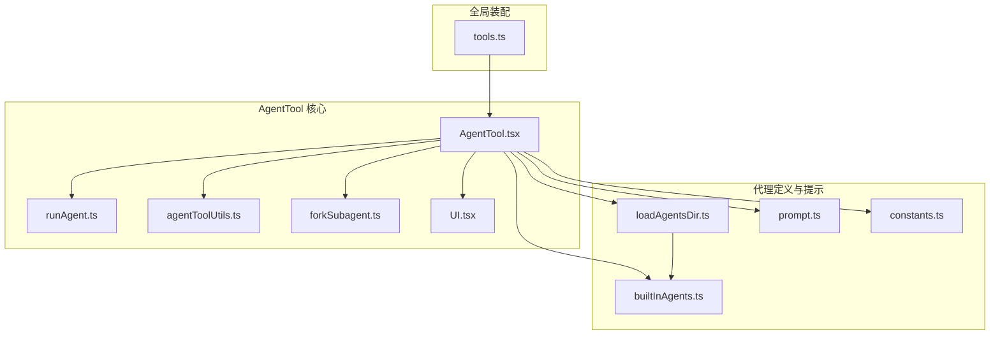
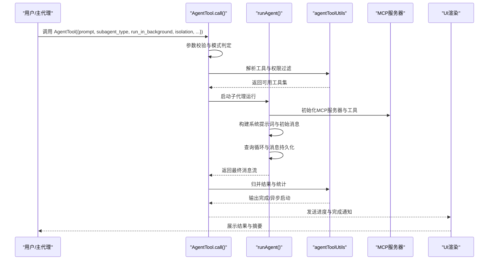
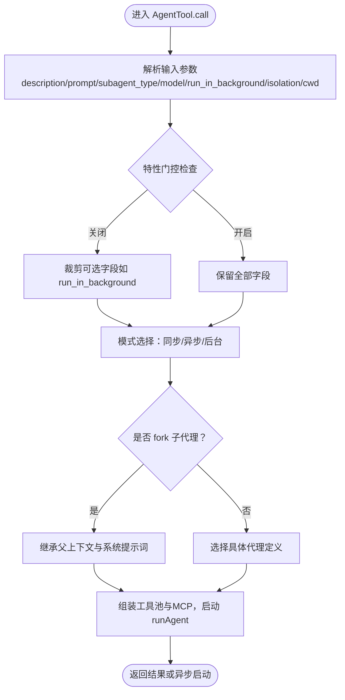
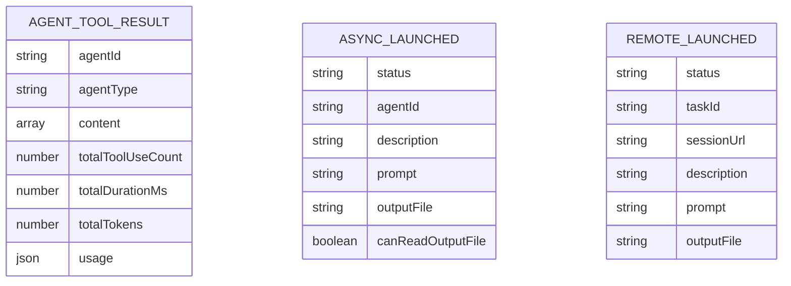
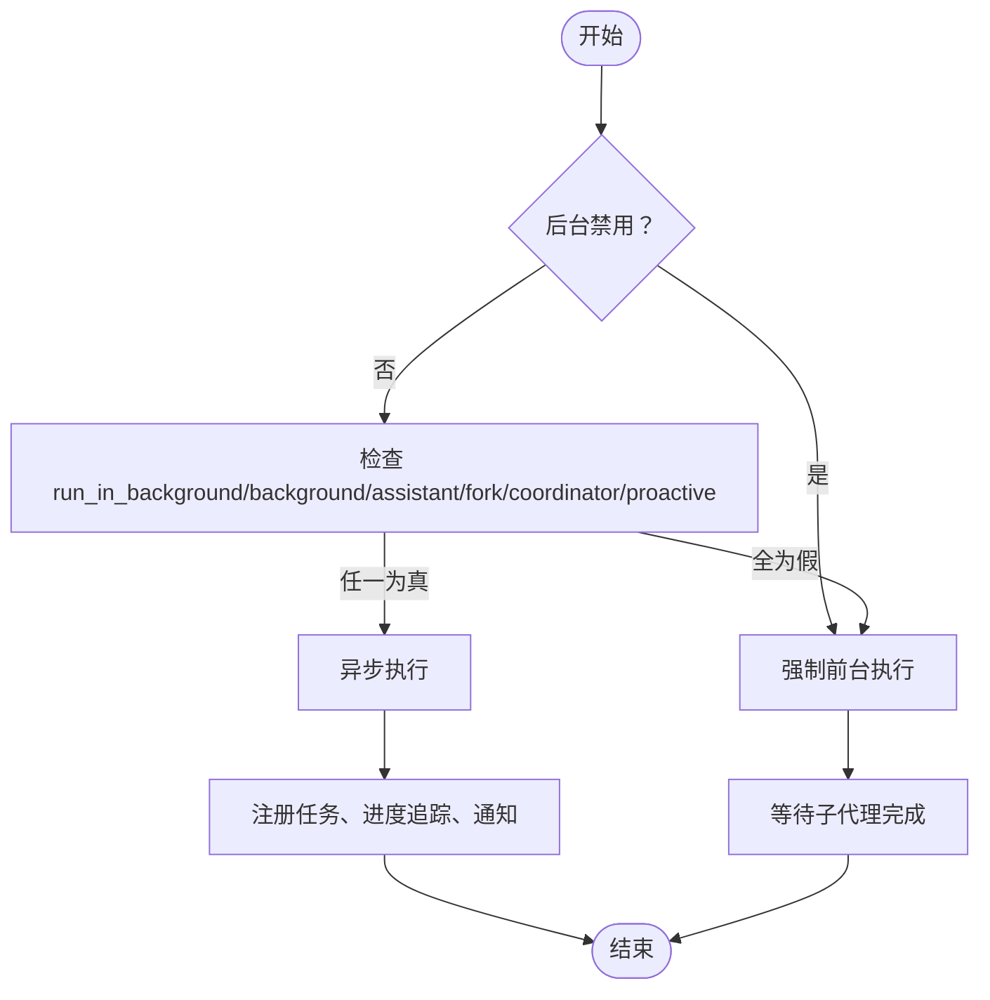
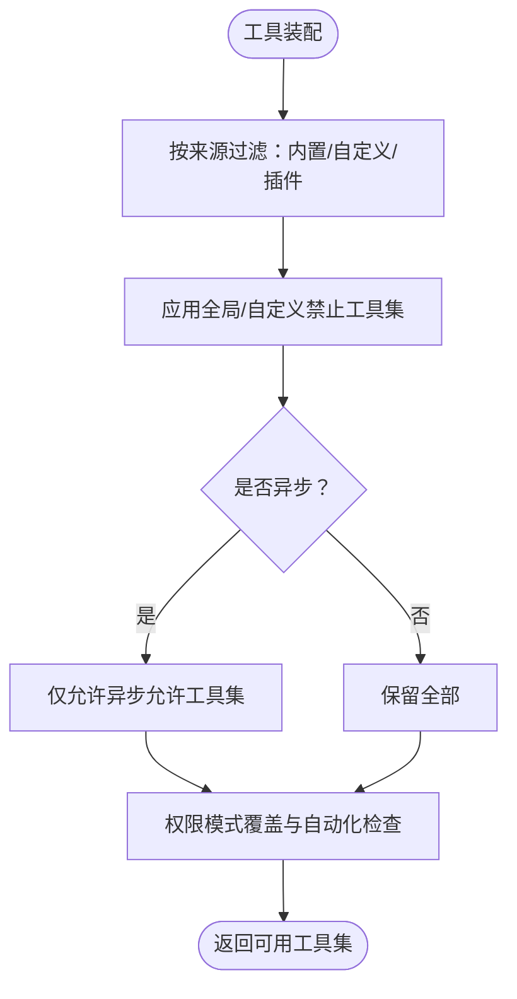
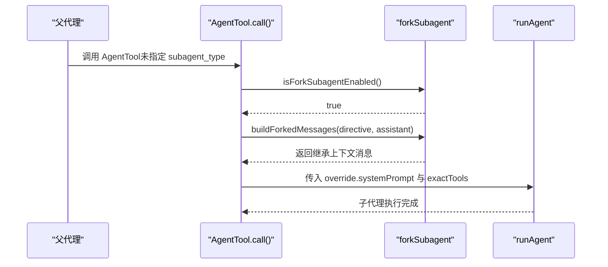
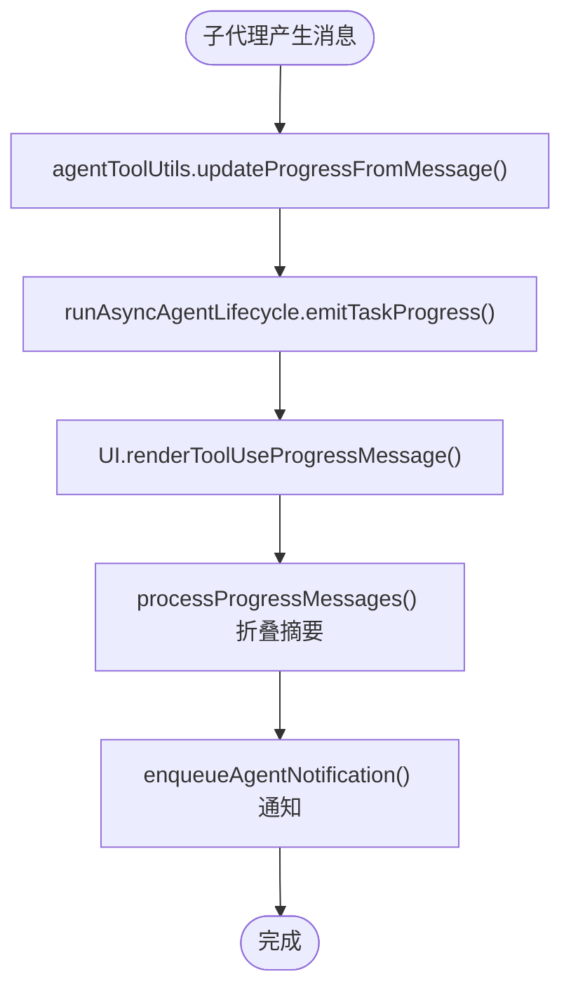
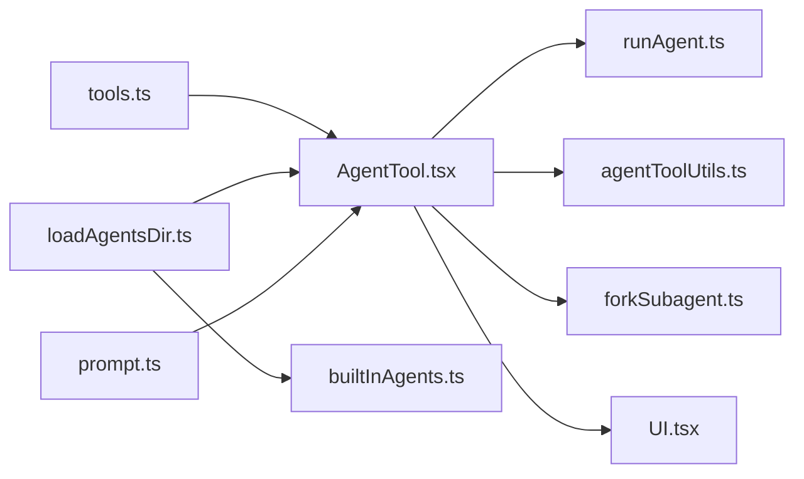

# AgentTool工具系统

<cite>
**本文档引用的文件**
- [AgentTool.tsx](file://src/tools/AgentTool/AgentTool.tsx)
- [runAgent.ts](file://src/tools/AgentTool/runAgent.ts)
- [forkSubagent.ts](file://src/tools/AgentTool/forkSubagent.ts)
- [agentToolUtils.ts](file://src/tools/AgentTool/agentToolUtils.ts)
- [UI.tsx](file://src/tools/AgentTool/UI.tsx)
- [loadAgentsDir.ts](file://src/tools/AgentTool/loadAgentsDir.ts)
- [prompt.ts](file://src/tools/AgentTool/prompt.ts)
- [constants.ts](file://src/tools/AgentTool/constants.ts)
- [builtInAgents.ts](file://src/tools/AgentTool/builtInAgents.ts)
- [tools.ts](file://src/tools.ts)
</cite>

## 目录
1. [简介](#简介)
2. [项目结构](#项目结构)
3. [核心组件](#核心组件)
4. [架构总览](#架构总览)
5. [详细组件分析](#详细组件分析)
6. [依赖关系分析](#依赖关系分析)
7. [性能考虑](#性能考虑)
8. [故障排除指南](#故障排除指南)
9. [结论](#结论)

## 简介
本文件为 Claude Code 的 AgentTool 工具系统提供深入技术文档。AgentTool 是一个强大的子代理（subagent）调度与执行引擎，支持同步、异步与后台三种执行模式，并提供工作树隔离、远程隔离、权限控制、工具池过滤、提示词构建、进度追踪与通知等完整能力。本文将从设计架构、实现机制、输入输出模式、权限控制、执行模式差异、使用示例与最佳实践、调试与故障排除等方面进行全面阐述。

## 项目结构
AgentTool 相关代码集中在 src/tools/AgentTool 目录中，采用模块化分层设计：
- AgentTool.tsx：工具定义、输入输出模式、调用流程与执行分支
- runAgent.ts：子代理运行器，负责系统提示词构建、工具解析、MCP 服务器初始化、查询循环与消息记录
- forkSubagent.ts：fork 子代理实验，支持上下文继承、缓存共享与统一交互模型
- agentToolUtils.ts：工具解析、权限过滤、异步生命周期管理、结果归并与分类器集成
- UI.tsx：工具使用与进度展示、消息折叠、摘要统计与交互提示
- loadAgentsDir.ts：自定义/插件/内置代理定义加载、校验与可用性过滤
- prompt.ts：工具描述生成、示例与使用说明、并发与隔离策略提示
- constants.ts：工具名称常量与一次性代理类型集合
- builtInAgents.ts：内置代理列表与条件启用逻辑
- tools.ts：全局工具装配与权限过滤入口

**图表来源**
- [AgentTool.tsx:1-800](file://src/tools/AgentTool/AgentTool.tsx#L1-L800)
- [runAgent.ts:1-974](file://src/tools/AgentTool/runAgent.ts#L1-L974)
- [agentToolUtils.ts:1-687](file://src/tools/AgentTool/agentToolUtils.ts#L1-L687)
- [forkSubagent.ts:1-211](file://src/tools/AgentTool/forkSubagent.ts#L1-L211)
- [UI.tsx:1-872](file://src/tools/AgentTool/UI.tsx#L1-L872)
- [loadAgentsDir.ts:1-756](file://src/tools/AgentTool/loadAgentsDir.ts#L1-L756)
- [prompt.ts:1-288](file://src/tools/AgentTool/prompt.ts#L1-L288)
- [builtInAgents.ts:1-73](file://src/tools/AgentTool/builtInAgents.ts#L1-L73)
- [constants.ts:1-13](file://src/tools/AgentTool/constants.ts#L1-L13)
- [tools.ts:1-390](file://src/tools.ts#L1-L390)

**章节来源**
- [AgentTool.tsx:1-800](file://src/tools/AgentTool/AgentTool.tsx#L1-L800)
- [runAgent.ts:1-974](file://src/tools/AgentTool/runAgent.ts#L1-L974)
- [agentToolUtils.ts:1-687](file://src/tools/AgentTool/agentToolUtils.ts#L1-L687)
- [forkSubagent.ts:1-211](file://src/tools/AgentTool/forkSubagent.ts#L1-L211)
- [UI.tsx:1-872](file://src/tools/AgentTool/UI.tsx#L1-L872)
- [loadAgentsDir.ts:1-756](file://src/tools/AgentTool/loadAgentsDir.ts#L1-L756)
- [prompt.ts:1-288](file://src/tools/AgentTool/prompt.ts#L1-L288)
- [builtInAgents.ts:1-73](file://src/tools/AgentTool/builtInAgents.ts#L1-L73)
- [constants.ts:1-13](file://src/tools/AgentTool/constants.ts#L1-L13)
- [tools.ts:1-390](file://src/tools.ts#L1-L390)

## 核心组件
- 工具定义与调用：AgentTool.tsx 中通过 buildTool 定义工具元数据、输入输出模式、权限规则与调用流程；根据 subagent_type、run_in_background、isolation 等参数选择执行路径。
- 子代理运行器：runAgent.ts 负责系统提示词构建、工具解析与过滤、MCP 服务器连接与工具注入、会话上下文与钩子注册、查询循环与消息持久化。
- fork 子代理：forkSubagent.ts 提供上下文继承、占位结果构建、指令式消息构造与递归 fork 防护。
- 工具解析与权限：agentToolUtils.ts 实现工具白名单/黑名单解析、异步工具限制、权限模式覆盖与自动检测、异步生命周期管理。
- UI 展示：UI.tsx 提供进度折叠、摘要统计、搜索/读取操作聚合、背景任务通知与快捷键提示。
- 代理定义：loadAgentsDir.ts 支持 JSON 与 Markdown 两种定义格式，校验字段、解析工具与技能、内存与隔离配置、MCP 服务器规范。
- 提示词生成：prompt.ts 动态生成工具描述、示例与使用建议，支持并发、隔离与 fork 场景。
- 内置代理：builtInAgents.ts 条件加载内置代理，避免循环依赖。
- 全局装配：tools.ts 组合并过滤工具池，结合权限规则与特性门控。

**章节来源**
- [AgentTool.tsx:196-390](file://src/tools/AgentTool/AgentTool.tsx#L196-L390)
- [runAgent.ts:248-800](file://src/tools/AgentTool/runAgent.ts#L248-L800)
- [agentToolUtils.ts:70-225](file://src/tools/AgentTool/agentToolUtils.ts#L70-L225)
- [UI.tsx:1-872](file://src/tools/AgentTool/UI.tsx#L1-L872)
- [loadAgentsDir.ts:70-133](file://src/tools/AgentTool/loadAgentsDir.ts#L70-L133)
- [prompt.ts:66-288](file://src/tools/AgentTool/prompt.ts#L66-L288)
- [builtInAgents.ts:22-73](file://src/tools/AgentTool/builtInAgents.ts#L22-L73)
- [tools.ts:345-390](file://src/tools.ts#L345-L390)

## 架构总览
AgentTool 的整体架构围绕“工具定义—参数解析—权限过滤—子代理运行—进度追踪—结果归并”展开。核心流程如下：

**图表来源**
- [AgentTool.tsx:239-800](file://src/tools/AgentTool/AgentTool.tsx#L239-L800)
- [runAgent.ts:248-800](file://src/tools/AgentTool/runAgent.ts#L248-L800)
- [agentToolUtils.ts:508-687](file://src/tools/AgentTool/agentToolUtils.ts#L508-L687)
- [UI.tsx:315-410](file://src/tools/AgentTool/UI.tsx#L315-L410)

## 详细组件分析

### 输入参数结构与作用
AgentTool 的输入参数通过 Zod 模式定义，支持基础参数与多代理扩展参数，并根据特性门控动态裁剪字段。关键参数说明如下：
- description：任务简短描述（3-5 个词），用于 UI 展示与通知
- prompt：子代理需要执行的具体任务内容
- subagent_type：指定专用子代理类型；未设置时在 fork 实验开启时触发隐式 fork
- model：可选模型覆盖，优先于代理定义中的 frontmatter 模型
- run_in_background：是否后台运行；在某些环境下可能被移除或强制启用
- name/team_name/mode：多代理场景下的命名、团队与权限模式
- isolation：隔离模式，worktree（工作树隔离）或 remote（远程隔离，ant 专属）
- cwd：显式工作目录，与 worktree 隔离互斥

**图表来源**
- [AgentTool.tsx:82-125](file://src/tools/AgentTool/AgentTool.tsx#L82-L125)
- [AgentTool.tsx:239-390](file://src/tools/AgentTool/AgentTool.tsx#L239-L390)
- [prompt.ts:251-288](file://src/tools/AgentTool/prompt.ts#L251-L288)

**章节来源**
- [AgentTool.tsx:82-125](file://src/tools/AgentTool/AgentTool.tsx#L82-L125)
- [AgentTool.tsx:239-390](file://src/tools/AgentTool/AgentTool.tsx#L239-L390)
- [prompt.ts:251-288](file://src/tools/AgentTool/prompt.ts#L251-L288)

### 输出结果数据结构
AgentTool 的输出通过 Zod 模式定义，分为两类：
- completed：同步完成时返回，包含 agentId、agentType、content 文本块数组、工具使用次数、耗时、Token 数与 usage 细项
- async_launched：异步启动时返回，包含 status、agentId、description、prompt、outputFile、canReadOutputFile 等字段

此外，内部还存在 teammate_spawned（多代理场景）与 remote_launched（ant 专属远程隔离）等非公开输出类型，UI 层通过判别字段进行渲染。

**图表来源**
- [agentToolUtils.ts:227-258](file://src/tools/AgentTool/agentToolUtils.ts#L227-L258)
- [AgentTool.tsx:140-155](file://src/tools/AgentTool/AgentTool.tsx#L140-L155)
- [UI.tsx:315-340](file://src/tools/AgentTool/UI.tsx#L315-L340)

**章节来源**
- [agentToolUtils.ts:227-258](file://src/tools/AgentTool/agentToolUtils.ts#L227-L258)
- [AgentTool.tsx:140-155](file://src/tools/AgentTool/AgentTool.tsx#L140-L155)
- [UI.tsx:315-340](file://src/tools/AgentTool/UI.tsx#L315-L340)

### 执行模式详解
AgentTool 支持三种执行模式，区别与适用场景如下：
- 同步执行（foreground）
  - 触发条件：run_in_background 显式 false 或 agent 定义 background=false，且非后台禁用环境变量
  - 特点：主回合同步等待子代理完成，适合需要立即获取结果再继续下一步的场景
  - 适用：研究型任务需要先看到发现再做决策
- 异步执行（async）
  - 触发条件：run_in_background 显式 true、agent 定义 background=true、助手模式强制、fork 实验开启、协作者模式、Proactive 激活或后台禁用关闭
  - 特点：子代理独立运行，UI 接收任务进度与完成通知；主回合同步推进
  - 适用：并行任务、长耗时任务、后台监控
- 后台执行（background）
  - 触发条件：后台任务禁用环境变量关闭，且满足异步条件之一
  - 特点：完全脱离主回合同步阻塞，适合无人值守长期运行
  - 适用：批处理、定时任务、远程隔离

**图表来源**
- [AgentTool.tsx:557-568](file://src/tools/AgentTool/AgentTool.tsx#L557-L568)
- [AgentTool.tsx:686-765](file://src/tools/AgentTool/AgentTool.tsx#L686-L765)

**章节来源**
- [AgentTool.tsx:557-568](file://src/tools/AgentTool/AgentTool.tsx#L557-L568)
- [AgentTool.tsx:686-765](file://src/tools/AgentTool/AgentTool.tsx#L686-L765)

### 权限控制与工具过滤
AgentTool 在工具装配阶段对工具进行严格过滤：
- 全局禁止工具集：所有子代理不可用的工具
- 自定义代理禁止工具集：仅对自定义代理生效
- 异步工具限制：异步模式下仅允许部分工具，保障后台稳定性
- 权限模式覆盖：子代理可覆盖父级权限模式，但不会覆盖 bypassPermissions/acceptEdits/auto
- 多代理场景：在进程内队友模式下允许 AgentTool 与特定任务工具用于协调

**图表来源**
- [agentToolUtils.ts:70-116](file://src/tools/AgentTool/agentToolUtils.ts#L70-L116)
- [agentToolUtils.ts:122-225](file://src/tools/AgentTool/agentToolUtils.ts#L122-L225)
- [runAgent.ts:412-498](file://src/tools/AgentTool/runAgent.ts#L412-L498)

**章节来源**
- [agentToolUtils.ts:70-116](file://src/tools/AgentTool/agentToolUtils.ts#L70-L116)
- [agentToolUtils.ts:122-225](file://src/tools/AgentTool/agentToolUtils.ts#L122-L225)
- [runAgent.ts:412-498](file://src/tools/AgentTool/runAgent.ts#L412-L498)

### fork 子代理机制
fork 子代理实验通过继承父上下文与系统提示词，最大化提示词缓存命中率：
- 上下文继承：克隆父助理消息（含所有 tool_use 块）、占位 tool_result、附加子指令文本
- 缓存一致性：所有 fork 子代理使用相同占位符，确保 API 请求前缀字节级一致
- 递归防护：检测 fork 标记防止递归 fork
- 工作树隔离提示：在 fork 子代理中注入路径翻译与文件重读提示

**图表来源**
- [forkSubagent.ts:32-89](file://src/tools/AgentTool/forkSubagent.ts#L32-L89)
- [forkSubagent.ts:107-169](file://src/tools/AgentTool/forkSubagent.ts#L107-L169)
- [AgentTool.tsx:495-541](file://src/tools/AgentTool/AgentTool.tsx#L495-L541)

**章节来源**
- [forkSubagent.ts:32-89](file://src/tools/AgentTool/forkSubagent.ts#L32-L89)
- [forkSubagent.ts:107-169](file://src/tools/AgentTool/forkSubagent.ts#L107-L169)
- [AgentTool.tsx:495-541](file://src/tools/AgentTool/AgentTool.tsx#L495-L541)

### 进度追踪与 UI 展示
AgentTool 将自身进度事件与子代理的 shell 进度事件转发给 SDK，UI 层提供：
- 进度消息折叠：将连续的搜索/读取/REPL 操作汇总为摘要
- 工具使用计数与 Token 统计：实时显示工具调用次数与消耗
- 背景任务通知：异步完成后弹出完成/失败/终止通知
- 快捷键提示：Ctrl+O 展开转录、方向键管理任务

**图表来源**
- [agentToolUtils.ts:508-687](file://src/tools/AgentTool/agentToolUtils.ts#L508-L687)
- [UI.tsx:445-570](file://src/tools/AgentTool/UI.tsx#L445-L570)

**章节来源**
- [agentToolUtils.ts:508-687](file://src/tools/AgentTool/agentToolUtils.ts#L508-L687)
- [UI.tsx:445-570](file://src/tools/AgentTool/UI.tsx#L445-L570)

### 使用示例与最佳实践
- 基本用法
  - 指定 subagent_type：适用于需要专用能力的任务，如代码审查、测试运行
  - 不指定 subagent_type：在 fork 实验开启时触发隐式 fork，继承上下文并行执行
- 并行执行
  - 单条消息中多次调用 AgentTool，最大化并发性能
- 隔离与安全
  - worktree 隔离：在临时工作树中执行，自动清理无变更工作树
  - remote 隔离（ant 专属）：在远程 CCR 环境执行，适合长时间任务
- 权限与模型
  - 使用 mode 参数控制权限模式（如 plan 审批）
  - 使用 model 覆盖子代理模型，注意 fork 时不建议覆盖以保持缓存一致性
- 错误处理与进度监控
  - 异步任务完成后自动通知，可通过 outputFile 读取进度
  - 被中断时保留部分结果，便于后续恢复

**章节来源**
- [prompt.ts:251-288](file://src/tools/AgentTool/prompt.ts#L251-L288)
- [AgentTool.tsx:686-765](file://src/tools/AgentTool/AgentTool.tsx#L686-L765)
- [agentToolUtils.ts:488-500](file://src/tools/AgentTool/agentToolUtils.ts#L488-L500)

## 依赖关系分析
AgentTool 的依赖关系主要体现在以下方面：
- 工具装配：tools.ts 作为全局入口，结合权限规则与特性门控装配工具池
- 代理定义：loadAgentsDir.ts 加载内置/插件/自定义代理，提供系统提示词与工具约束
- 子代理运行：runAgent.ts 串联系统提示词构建、工具解析、MCP 初始化、查询循环与持久化
- fork 实验：forkSubagent.ts 与 AgentTool.tsx 协同实现上下文继承与缓存一致性
- UI 渲染：UI.tsx 依赖工具与消息结构，提供进度折叠与通知

**图表来源**
- [tools.ts:345-390](file://src/tools.ts#L345-L390)
- [AgentTool.tsx:1-800](file://src/tools/AgentTool/AgentTool.tsx#L1-L800)
- [runAgent.ts:1-974](file://src/tools/AgentTool/runAgent.ts#L1-L974)
- [agentToolUtils.ts:1-687](file://src/tools/AgentTool/agentToolUtils.ts#L1-L687)
- [forkSubagent.ts:1-211](file://src/tools/AgentTool/forkSubagent.ts#L1-L211)
- [UI.tsx:1-872](file://src/tools/AgentTool/UI.tsx#L1-L872)
- [loadAgentsDir.ts:1-756](file://src/tools/AgentTool/loadAgentsDir.ts#L1-L756)
- [prompt.ts:1-288](file://src/tools/AgentTool/prompt.ts#L1-L288)
- [builtInAgents.ts:1-73](file://src/tools/AgentTool/builtInAgents.ts#L1-L73)

**章节来源**
- [tools.ts:345-390](file://src/tools.ts#L345-L390)
- [AgentTool.tsx:1-800](file://src/tools/AgentTool/AgentTool.tsx#L1-L800)
- [runAgent.ts:1-974](file://src/tools/AgentTool/runAgent.ts#L1-L974)
- [agentToolUtils.ts:1-687](file://src/tools/AgentTool/agentToolUtils.ts#L1-L687)
- [forkSubagent.ts:1-211](file://src/tools/AgentTool/forkSubagent.ts#L1-L211)
- [UI.tsx:1-872](file://src/tools/AgentTool/UI.tsx#L1-L872)
- [loadAgentsDir.ts:1-756](file://src/tools/AgentTool/loadAgentsDir.ts#L1-L756)
- [prompt.ts:1-288](file://src/tools/AgentTool/prompt.ts#L1-L288)
- [builtInAgents.ts:1-73](file://src/tools/AgentTool/builtInAgents.ts#L1-L73)

## 性能考虑
- 提示词缓存优化：fork 子代理通过继承父系统提示词与占位结果，最大化缓存命中，减少重复 Token 消耗
- 工具池去重：全局工具装配使用 uniqBy 保证工具名唯一，避免重复定义导致的缓存碎片
- 异步并行：异步模式下子代理独立运行，主回合同步推进，提升吞吐
- 文件状态缓存：子代理克隆父文件状态缓存，避免重复读取
- 传输压缩：子代理转录记录采用增量写入与 UUID 合并，保证顺序正确性

[本节为通用指导，无需特定文件引用]

## 故障排除指南
- 子代理无法启动
  - 检查 requiredMcpServers 是否满足，必要时等待 MCP 连接完成
  - 确认权限规则未拒绝该代理类型
- 异步任务无通知
  - 确认后台任务未被禁用
  - 检查 outputFile 可读性，必要时赋予 Read/Bash 工具
- fork 递归错误
  - 确保未在 fork 子代理中再次发起 fork
- 工具不可用
  - 检查异步模式下的工具限制
  - 确认 teammates 模式下不支持 run_in_background/name/team_name
- 结果不完整
  - 异步被中断时可提取部分结果
  - 检查子代理是否提前退出（maxTurns）

**章节来源**
- [AgentTool.tsx:369-410](file://src/tools/AgentTool/AgentTool.tsx#L369-L410)
- [AgentTool.tsx:262-280](file://src/tools/AgentTool/AgentTool.tsx#L262-L280)
- [agentToolUtils.ts:488-500](file://src/tools/AgentTool/agentToolUtils.ts#L488-L500)

## 结论
AgentTool 工具系统通过清晰的模块划分与严格的权限控制，实现了从工具装配、参数解析、子代理运行到进度追踪与结果归并的完整闭环。其 fork 子代理机制在保证缓存一致性的同时提供了强大的上下文继承能力；异步执行模式则满足了并行与后台任务需求。配合 UI 的进度折叠与通知机制，AgentTool 为复杂任务的自动化执行提供了可靠支撑。