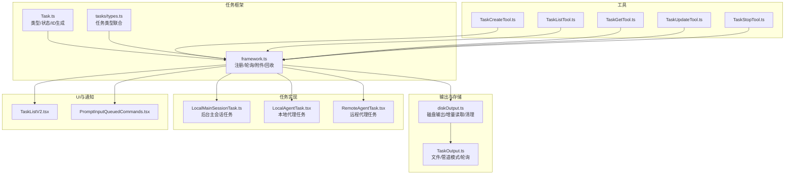
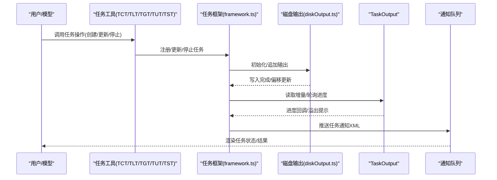
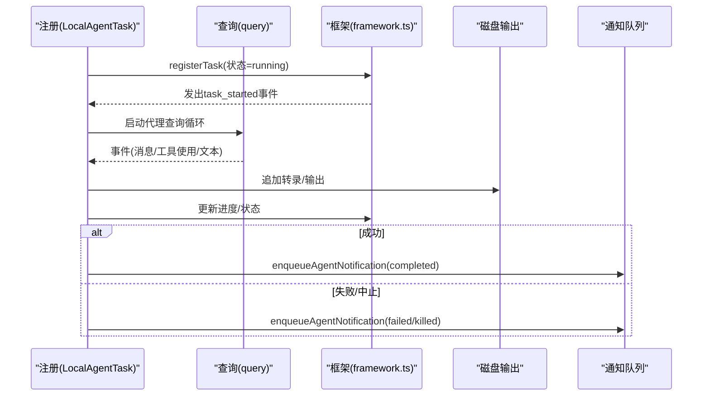
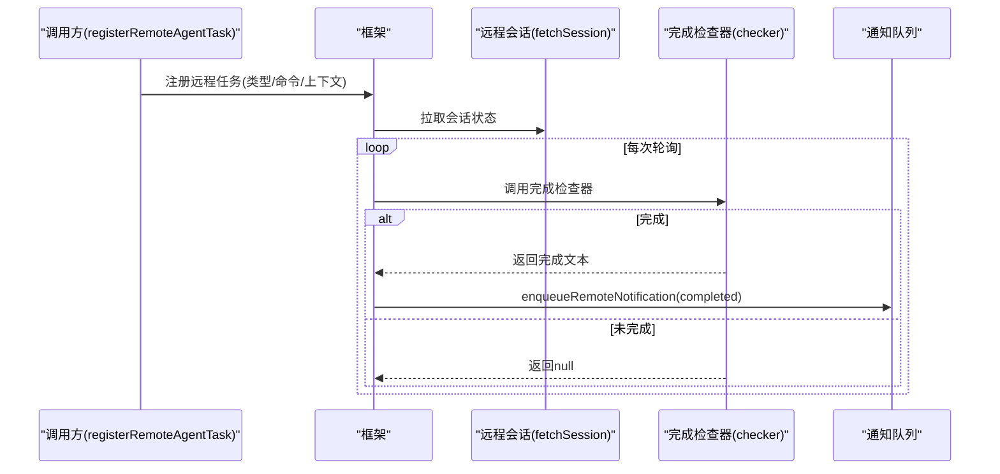
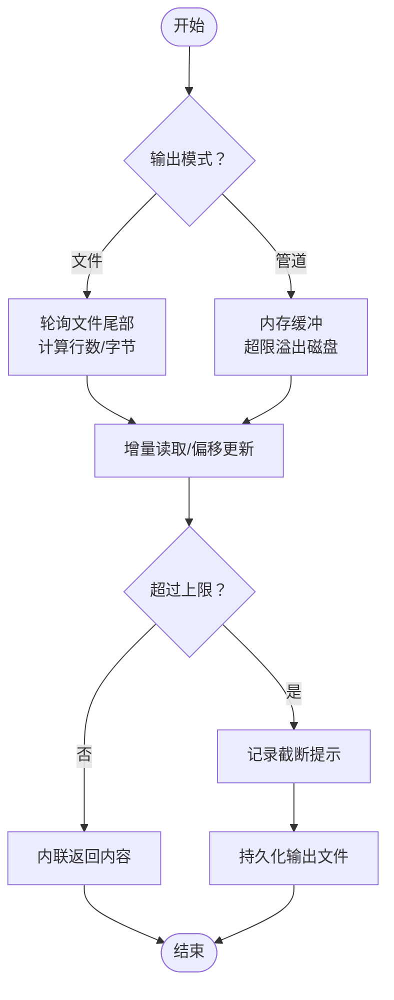
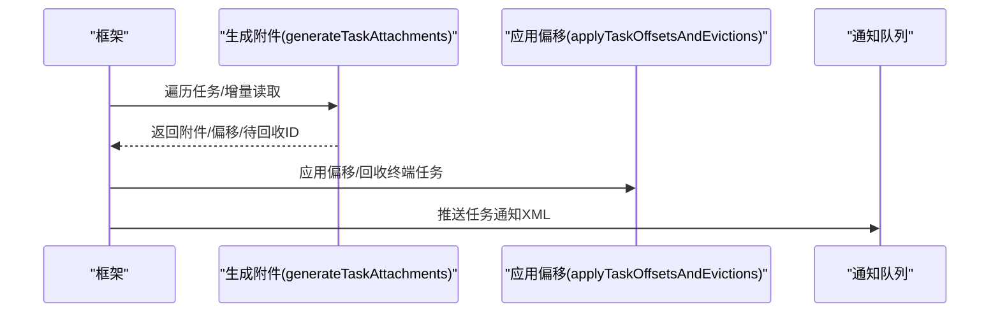
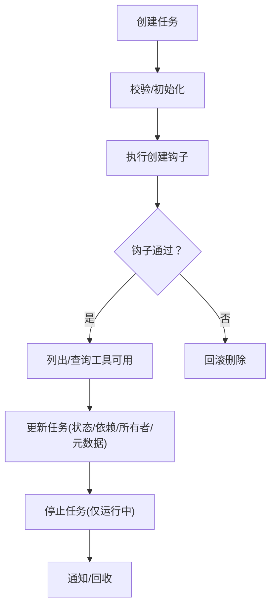
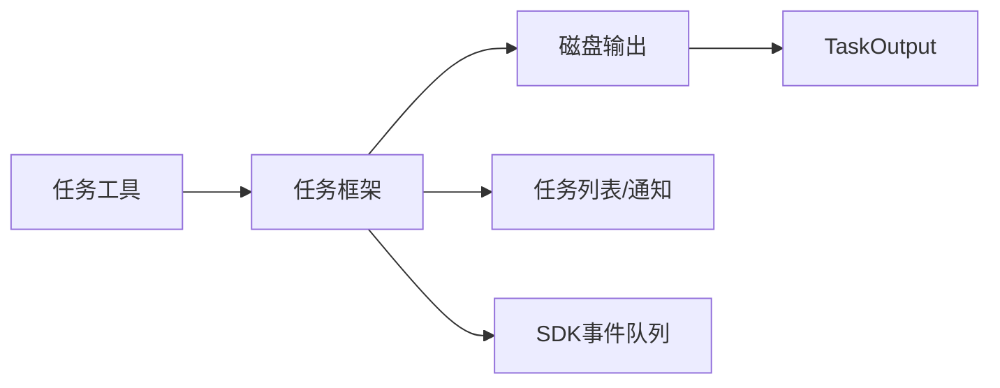

# 代理任务管理

<cite>
**本文引用的文件**
- [src/Task.ts](file://src/Task.ts)
- [src/tasks/types.ts](file://src/tasks/types.ts)
- [src/utils/task/framework.ts](file://src/utils/task/framework.ts)
- [src/utils/task/diskOutput.ts](file://src/utils/task/diskOutput.ts)
- [src/utils/task/TaskOutput.ts](file://src/utils/task/TaskOutput.ts)
- [src/tasks/LocalMainSessionTask.ts](file://src/tasks/LocalMainSessionTask.ts)
- [src/tasks/LocalAgentTask/LocalAgentTask.tsx](file://src/tasks/LocalAgentTask/LocalAgentTask.tsx)
- [src/tasks/RemoteAgentTask/RemoteAgentTask.tsx](file://src/tasks/RemoteAgentTask/RemoteAgentTask.tsx)
- [src/tools/TaskCreateTool/TaskCreateTool.ts](file://src/tools/TaskCreateTool/TaskCreateTool.ts)
- [src/tools/TaskListTool/TaskListTool.ts](file://src/tools/TaskListTool/TaskListTool.ts)
- [src/tools/TaskGetTool/TaskGetTool.ts](file://src/tools/TaskGetTool/TaskGetTool.ts)
- [src/tools/TaskUpdateTool/TaskUpdateTool.ts](file://src/tools/TaskUpdateTool/TaskUpdateTool.ts)
- [src/tools/TaskStopTool/TaskStopTool.ts](file://src/tools/TaskStopTool/TaskStopTool.ts)
- [src/hooks/useTaskListWatcher.ts](file://src/hooks/useTaskListWatcher.ts)
- [src/utils/tasks.ts](file://src/utils/tasks.ts)
- [src/utils/messages.ts](file://src/utils/messages.ts)
- [src/components/TaskListV2.tsx](file://src/components/TaskListV2.tsx)
- [src/components/PromptInput/PromptInputQueuedCommands.tsx](file://src/components/PromptInput/PromptInputQueuedCommands.tsx)
- [src/tasks/LocalShellTask/killShellTasks.ts](file://src/tasks/LocalShellTask/killShellTasks.ts)
</cite>

## 目录
1. [引言](#引言)
2. [项目结构](#项目结构)
3. [核心组件](#核心组件)
4. [架构总览](#架构总览)
5. [详细组件分析](#详细组件分析)
6. [依赖关系分析](#依赖关系分析)
7. [性能考量](#性能考量)
8. [故障排除指南](#故障排除指南)
9. [结论](#结论)
10. [附录](#附录)

## 引言
本文件系统性梳理 Claude Code 的代理任务管理系统，覆盖本地与远程两类代理任务的生命周期：从任务创建、执行监控、状态跟踪到结果处理；同时阐述输出格式化与存储、进度跟踪与通知机制，并给出最佳实践与调试排障建议。目标是帮助开发者与使用者在复杂任务场景中高效、稳定地使用任务系统。

## 项目结构
任务系统围绕统一的任务框架与工具集展开，核心由以下模块构成：
- 任务类型与基础定义：Task 类型、状态、ID 生成与基础字段
- 任务框架：注册、轮询、附件生成、偏移应用与回收
- 输出与存储：磁盘输出封装、增量读取、溢出与清理
- 任务实现：本地主会话任务、本地代理任务、远程代理任务
- 工具链：创建、列出、查询、更新、停止任务
- UI 与通知：任务列表展示、通知队列与可见性控制
- 辅助：任务调度器（可用性选择）、任务持久化与恢复

**图表来源**
- [src/utils/task/framework.ts:1-309](file://src/utils/task/framework.ts#L1-L309)
- [src/Task.ts:1-126](file://src/Task.ts#L1-L126)
- [src/tasks/types.ts:1-47](file://src/tasks/types.ts#L1-L47)
- [src/utils/task/diskOutput.ts:1-452](file://src/utils/task/diskOutput.ts#L1-L452)
- [src/utils/task/TaskOutput.ts:1-391](file://src/utils/task/TaskOutput.ts#L1-L391)
- [src/tasks/LocalMainSessionTask.ts:1-480](file://src/tasks/LocalMainSessionTask.ts#L1-L480)
- [src/tasks/LocalAgentTask/LocalAgentTask.tsx](file://src/tasks/LocalAgentTask/LocalAgentTask.tsx)
- [src/tasks/RemoteAgentTask/RemoteAgentTask.tsx:72-497](file://src/tasks/RemoteAgentTask/RemoteAgentTask.tsx#L72-L497)
- [src/tools/TaskCreateTool/TaskCreateTool.ts:1-139](file://src/tools/TaskCreateTool/TaskCreateTool.ts#L1-L139)
- [src/tools/TaskListTool/TaskListTool.ts:1-117](file://src/tools/TaskListTool/TaskListTool.ts#L1-L117)
- [src/tools/TaskGetTool/TaskGetTool.ts:109-128](file://src/tools/TaskGetTool/TaskGetTool.ts#L109-L128)
- [src/tools/TaskUpdateTool/TaskUpdateTool.ts:37-274](file://src/tools/TaskUpdateTool/TaskUpdateTool.ts#L37-L274)
- [src/tools/TaskStopTool/TaskStopTool.ts:1-132](file://src/tools/TaskStopTool/TaskStopTool.ts#L1-L132)
- [src/components/TaskListV2.tsx:190-250](file://src/components/TaskListV2.tsx#L190-L250)
- [src/components/PromptInput/PromptInputQueuedCommands.tsx:29-58](file://src/components/PromptInput/PromptInputQueuedCommands.tsx#L29-L58)

**章节来源**
- [src/Task.ts:1-126](file://src/Task.ts#L1-L126)
- [src/tasks/types.ts:1-47](file://src/tasks/types.ts#L1-L47)
- [src/utils/task/framework.ts:1-309](file://src/utils/task/framework.ts#L1-L309)
- [src/utils/task/diskOutput.ts:1-452](file://src/utils/task/diskOutput.ts#L1-L452)
- [src/utils/task/TaskOutput.ts:1-391](file://src/utils/task/TaskOutput.ts#L1-L391)

## 核心组件
- 统一任务接口与状态
  - 定义任务类型、状态与基础字段，提供 ID 生成与基础状态初始化
  - 终止态判定用于安全回收与消息注入保护
- 任务框架
  - 注册新任务、更新任务状态、轮询运行中任务、生成附件、应用偏移与回收终端任务
  - 通过消息队列推送“任务通知”XML，供 UI 与 SDK 消费
- 输出与存储
  - 磁盘输出类负责写入、排队、溢出与关闭，支持上限与重试
  - TaskOutput 支持文件模式（轮询）与管道模式（内存缓冲），自动溢出至磁盘
- 工具链
  - 创建、列出、查询、更新、停止任务，配合钩子与权限检查
- UI 与通知
  - 任务列表渲染、通知队列节流与可见性控制

**章节来源**
- [src/Task.ts:27-126](file://src/Task.ts#L27-L126)
- [src/utils/task/framework.ts:48-117](file://src/utils/task/framework.ts#L48-L117)
- [src/utils/task/diskOutput.ts:97-231](file://src/utils/task/diskOutput.ts#L97-L231)
- [src/utils/task/TaskOutput.ts:32-391](file://src/utils/task/TaskOutput.ts#L32-L391)
- [src/tools/TaskCreateTool/TaskCreateTool.ts:48-139](file://src/tools/TaskCreateTool/TaskCreateTool.ts#L48-L139)
- [src/tools/TaskListTool/TaskListTool.ts:33-117](file://src/tools/TaskListTool/TaskListTool.ts#L33-L117)
- [src/tools/TaskGetTool/TaskGetTool.ts:109-128](file://src/tools/TaskGetTool/TaskGetTool.ts#L109-L128)
- [src/tools/TaskUpdateTool/TaskUpdateTool.ts:37-274](file://src/tools/TaskUpdateTool/TaskUpdateTool.ts#L37-L274)
- [src/tools/TaskStopTool/TaskStopTool.ts:39-132](file://src/tools/TaskStopTool/TaskStopTool.ts#L39-L132)

## 架构总览
任务系统采用“工具驱动 + 框架轮询 + 输出持久化”的分层架构：
- 工具层：面向用户与模型的命令入口，负责参数校验、调用业务逻辑与返回结果
- 框架层：统一的任务生命周期编排，负责状态变更、附件生成与通知
- 存储层：按会话隔离的任务输出目录，支持增量读取与溢出策略
- UI 层：任务列表与通知队列，控制可见性与节流

**图表来源**
- [src/utils/task/framework.ts:255-290](file://src/utils/task/framework.ts#L255-L290)
- [src/utils/task/diskOutput.ts:304-330](file://src/utils/task/diskOutput.ts#L304-L330)
- [src/utils/task/TaskOutput.ts:109-164](file://src/utils/task/TaskOutput.ts#L109-L164)

## 详细组件分析

### 本地代理任务（LocalAgentTask）
- 生命周期
  - 注册：创建基础状态，设置运行态并发出 SDK 事件
  - 执行：在代理上下文中持续接收消息，增量记录转录，维护令牌与工具计数
  - 完成：根据成功/失败/中止状态发送通知，必要时触发 SDK 事件
- 通知机制
  - 使用原子性标记避免重复通知，确保 UI 与 SDK 不收到重复消息
- 与主会话任务的关系
  - 主会话任务复用本地代理任务的状态结构，但额外处理前台/后台切换与转录隔离

**图表来源**
- [src/tasks/LocalAgentTask/LocalAgentTask.tsx](file://src/tasks/LocalAgentTask/LocalAgentTask.tsx)
- [src/utils/task/framework.ts:77-117](file://src/utils/task/framework.ts#L77-L117)
- [src/utils/task/diskOutput.ts:304-330](file://src/utils/task/diskOutput.ts#L304-L330)

**章节来源**
- [src/tasks/LocalAgentTask/LocalAgentTask.tsx](file://src/tasks/LocalAgentTask/LocalAgentTask.tsx)
- [src/tasks/LocalMainSessionTask.ts:94-162](file://src/tasks/LocalMainSessionTask.ts#L94-L162)
- [src/tasks/LocalMainSessionTask.ts:168-219](file://src/tasks/LocalMainSessionTask.ts#L168-L219)
- [src/tasks/LocalMainSessionTask.ts:224-263](file://src/tasks/LocalMainSessionTask.ts#L224-L263)

### 远程代理任务（RemoteAgentTask）
- 任务注册与恢复
  - 注册：生成任务 ID，初始化输出，创建状态并加入框架；支持长任务与审查模式
  - 恢复：重启时扫描侧车元数据，拉取会话状态，重建状态并恢复轮询
- 完成检查器
  - 为不同远程任务类型注册轮询检查器，每次轮询调用以决定是否完成
- 通知与元数据
  - 完成/失败/中止时发送统一通知；侧车持久化元数据，便于恢复

**图表来源**
- [src/tasks/RemoteAgentTask/RemoteAgentTask.tsx:386-483](file://src/tasks/RemoteAgentTask/RemoteAgentTask.tsx#L386-L483)
- [src/tasks/RemoteAgentTask/RemoteAgentTask.tsx:72-111](file://src/tasks/RemoteAgentTask/RemoteAgentTask.tsx#L72-L111)
- [src/tasks/RemoteAgentTask/RemoteAgentTask.tsx:166-183](file://src/tasks/RemoteAgentTask/RemoteAgentTask.tsx#L166-L183)

**章节来源**
- [src/tasks/RemoteAgentTask/RemoteAgentTask.tsx:386-483](file://src/tasks/RemoteAgentTask/RemoteAgentTask.tsx#L386-L483)
- [src/tasks/RemoteAgentTask/RemoteAgentTask.tsx:72-111](file://src/tasks/RemoteAgentTask/RemoteAgentTask.tsx#L72-L111)
- [src/tasks/RemoteAgentTask/RemoteAgentTask.tsx:166-183](file://src/tasks/RemoteAgentTask/RemoteAgentTask.tsx#L166-L183)

### 任务输出格式化与存储
- 磁盘输出
  - 单任务单实例，队列化写入，上限截断并记录截断提示
  - 提供增量读取、尾部读取、大小统计与清理
- TaskOutput
  - 文件模式：共享轮询器，定时读取文件尾部，计算行数与字节数，支持进度回调
  - 管道模式：内存缓冲，超限溢出至磁盘，保证 UI 实时反馈
- 输出文件管理
  - 按会话隔离目录，支持符号链接（如主会话任务），支持删除与溢出冗余判断

**图表来源**
- [src/utils/task/TaskOutput.ts:109-164](file://src/utils/task/TaskOutput.ts#L109-L164)
- [src/utils/task/diskOutput.ts:304-330](file://src/utils/task/diskOutput.ts#L304-L330)
- [src/utils/task/diskOutput.ts:400-451](file://src/utils/task/diskOutput.ts#L400-L451)

**章节来源**
- [src/utils/task/diskOutput.ts:97-231](file://src/utils/task/diskOutput.ts#L97-L231)
- [src/utils/task/diskOutput.ts:304-357](file://src/utils/task/diskOutput.ts#L304-L357)
- [src/utils/task/TaskOutput.ts:282-326](file://src/utils/task/TaskOutput.ts#L282-L326)

### 任务进度跟踪与通知
- 轮询与附件
  - 框架每秒轮询运行中任务，生成增量附件并应用偏移，随后推送通知
- 通知格式
  - 统一的 XML 结构，包含任务 ID、类型、输出路径、状态与摘要
- UI 与节流
  - 任务通知在 UI 中进行可见性限制与溢出聚合，避免刷屏

**图表来源**
- [src/utils/task/framework.ts:158-206](file://src/utils/task/framework.ts#L158-L206)
- [src/utils/task/framework.ts:213-249](file://src/utils/task/framework.ts#L213-L249)
- [src/utils/task/framework.ts:274-290](file://src/utils/task/framework.ts#L274-L290)
- [src/components/PromptInput/PromptInputQueuedCommands.tsx:47-58](file://src/components/PromptInput/PromptInputQueuedCommands.tsx#L47-L58)

**章节来源**
- [src/utils/task/framework.ts:255-290](file://src/utils/task/framework.ts#L255-L290)
- [src/components/PromptInput/PromptInputQueuedCommands.tsx:29-58](file://src/components/PromptInput/PromptInputQueuedCommands.tsx#L29-L58)

### 任务工具链与调度
- 创建任务
  - 输入包含主题、描述、活动形式与元数据；创建后触发“已创建”钩子，必要时回滚
- 列出与查询
  - 列表过滤内部任务、屏蔽已完成依赖；查询返回简洁摘要
- 更新任务
  - 支持状态变更、依赖关系、所有者与元数据合并；完成时触发“已完成”钩子
- 停止任务
  - 校验运行中状态，调用停止逻辑并返回结果
- 可用性选择
  - 任务调度器基于可用任务筛选“可工作”任务，考虑阻塞关系与空闲拥有者

**图表来源**
- [src/tools/TaskCreateTool/TaskCreateTool.ts:80-129](file://src/tools/TaskCreateTool/TaskCreateTool.ts#L80-L129)
- [src/tools/TaskListTool/TaskListTool.ts:65-90](file://src/tools/TaskListTool/TaskListTool.ts#L65-L90)
- [src/tools/TaskGetTool/TaskGetTool.ts:109-128](file://src/tools/TaskGetTool/TaskGetTool.ts#L109-L128)
- [src/tools/TaskUpdateTool/TaskUpdateTool.ts:229-274](file://src/tools/TaskUpdateTool/TaskUpdateTool.ts#L229-L274)
- [src/tools/TaskStopTool/TaskStopTool.ts:107-130](file://src/tools/TaskStopTool/TaskStopTool.ts#L107-L130)
- [src/hooks/useTaskListWatcher.ts:191-221](file://src/hooks/useTaskListWatcher.ts#L191-L221)

**章节来源**
- [src/tools/TaskCreateTool/TaskCreateTool.ts:48-139](file://src/tools/TaskCreateTool/TaskCreateTool.ts#L48-L139)
- [src/tools/TaskListTool/TaskListTool.ts:33-117](file://src/tools/TaskListTool/TaskListTool.ts#L33-L117)
- [src/tools/TaskGetTool/TaskGetTool.ts:109-128](file://src/tools/TaskGetTool/TaskGetTool.ts#L109-L128)
- [src/tools/TaskUpdateTool/TaskUpdateTool.ts:37-274](file://src/tools/TaskUpdateTool/TaskUpdateTool.ts#L37-L274)
- [src/tools/TaskStopTool/TaskStopTool.ts:39-132](file://src/tools/TaskStopTool/TaskStopTool.ts#L39-L132)
- [src/hooks/useTaskListWatcher.ts:191-221](file://src/hooks/useTaskListWatcher.ts#L191-L221)

### 任务列表与 UI 展示
- 任务列表组件
  - 统计开放/进行中/完成数量，按状态图标与颜色区分
- 任务状态图标
  - 待定、进行中、完成对应不同图标与颜色
- 任务提醒
  - 若长时间未使用任务工具，系统会温和提醒并列出现有任务

**章节来源**
- [src/components/TaskListV2.tsx:190-250](file://src/components/TaskListV2.tsx#L190-L250)
- [src/utils/messages.ts:3688-3691](file://src/utils/messages.ts#L3688-L3691)

## 依赖关系分析
- 低耦合高内聚
  - 任务框架与具体任务实现解耦，通过统一状态接口交互
  - 输出模块独立于任务类型，既支持文件也支持管道模式
- 关键依赖链
  - 工具层依赖框架与存储；框架依赖存储与消息队列；UI 依赖框架与通知队列
- 循环依赖规避
  - 输出模块通过延迟导入避免与会话存储形成循环

**图表来源**
- [src/utils/task/framework.ts:1-309](file://src/utils/task/framework.ts#L1-L309)
- [src/utils/task/diskOutput.ts:1-452](file://src/utils/task/diskOutput.ts#L1-L452)
- [src/utils/task/TaskOutput.ts:1-391](file://src/utils/task/TaskOutput.ts#L1-L391)

**章节来源**
- [src/utils/task/framework.ts:1-309](file://src/utils/task/framework.ts#L1-L309)
- [src/utils/task/diskOutput.ts:1-452](file://src/utils/task/diskOutput.ts#L1-L452)
- [src/utils/task/TaskOutput.ts:1-391](file://src/utils/task/TaskOutput.ts#L1-L391)

## 性能考量
- 轮询与增量
  - 框架轮询间隔固定，结合增量读取与偏移更新，避免全量扫描
- 内存与磁盘平衡
  - TaskOutput 在管道模式下限制内存占用，超限时溢出至磁盘，减少峰值内存
- I/O 队列化
  - 磁盘输出采用队列与一次性缓冲拼接，降低 GC 压力与内存驻留
- 会话隔离
  - 输出目录按会话 ID 分离，避免并发会话互相影响

[本节为通用指导，无需特定文件引用]

## 故障排除指南
- 任务未显示或重复通知
  - 检查 notified 标志位与回收策略；确认终端任务已被回收
- 输出为空或不完整
  - 确认输出文件存在且未被跨进程清理；查看溢出冗余标志与截断提示
- 远程任务无法恢复
  - 检查侧车元数据与会话状态；确认网络与认证正常
- 任务停止无效
  - 确认任务处于运行态；检查代理上下文与中断信号
- 通知过多导致刷屏
  - 使用 UI 节流与溢出聚合；必要时调整可见性阈值

**章节来源**
- [src/utils/task/framework.ts:125-144](file://src/utils/task/framework.ts#L125-L144)
- [src/utils/task/TaskOutput.ts:312-326](file://src/utils/task/TaskOutput.ts#L312-L326)
- [src/tasks/RemoteAgentTask/RemoteAgentTask.tsx:477-483](file://src/tasks/RemoteAgentTask/RemoteAgentTask.tsx#L477-L483)
- [src/tasks/LocalShellTask/killShellTasks.ts:53-76](file://src/tasks/LocalShellTask/killShellTasks.ts#L53-L76)
- [src/components/PromptInput/PromptInputQueuedCommands.tsx:47-58](file://src/components/PromptInput/PromptInputQueuedCommands.tsx#L47-L58)

## 结论
该任务系统通过统一框架、灵活输出与完善的工具链，实现了本地与远程代理任务的全生命周期管理。其增量读取、溢出策略与通知机制兼顾了性能与可观测性；UI 层的节流与聚合进一步提升了用户体验。遵循本文最佳实践与排障建议，可在复杂场景中稳定运行任务系统。

[本节为总结，无需特定文件引用]

## 附录
- 最佳实践
  - 明确任务状态流转（待定→进行中→完成/失败/中止）
  - 合理设置 activeForm 与描述，提升可读性
  - 使用依赖关系（blocks/blockedBy）组织任务顺序
  - 对长任务启用轮询检查器与侧车元数据
  - 控制输出上限，避免磁盘压力
  - 使用 UI 节流与可见性控制，保持界面整洁
- 调试方法
  - 查看任务通知 XML 与输出文件路径
  - 使用增量读取定位最新变化
  - 检查钩子执行与回滚行为
  - 观察轮询日志与回收时机

[本节为通用指导，无需特定文件引用]