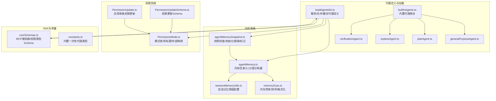
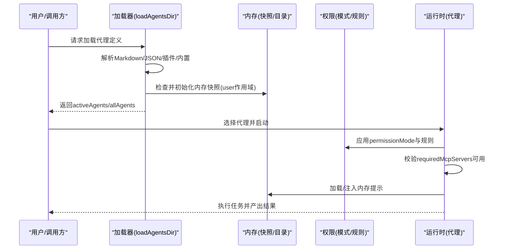
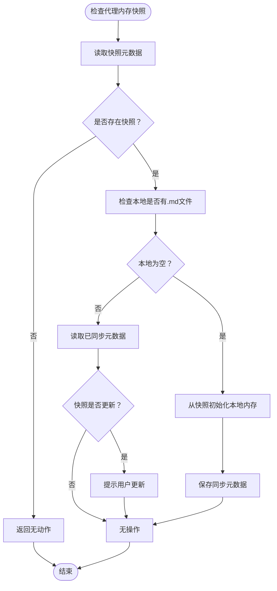
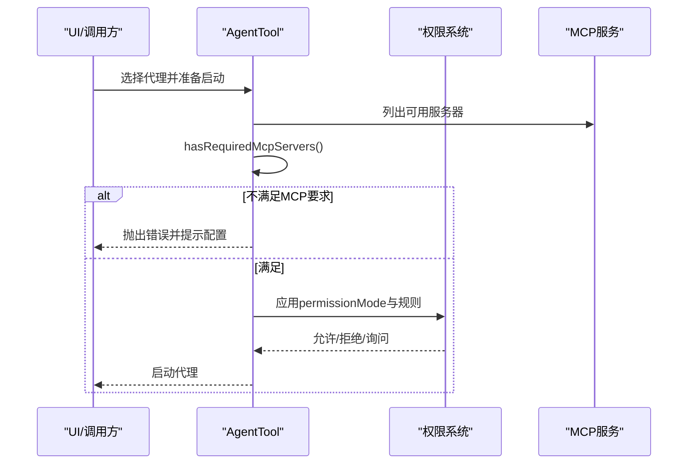
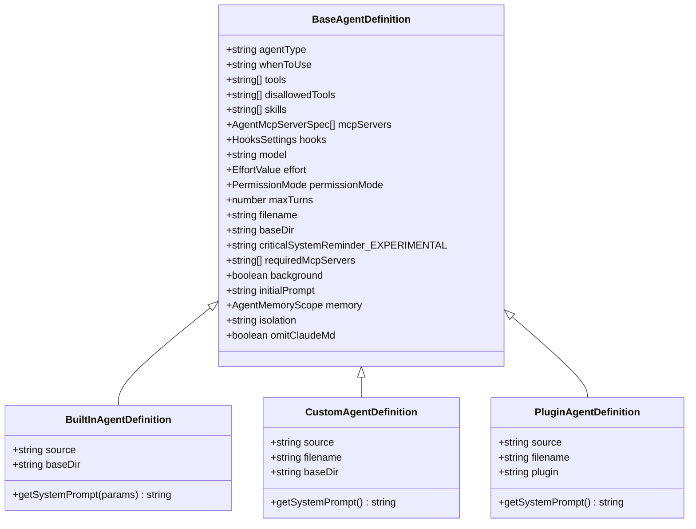

# 代理类型与定义

<cite>
**本文引用的文件**
- [src/tools/AgentTool/loadAgentsDir.ts](file://src/tools/AgentTool/loadAgentsDir.ts)
- [src/tools/AgentTool/built-in/generalPurposeAgent.ts](file://src/tools/AgentTool/built-in/generalPurposeAgent.ts)
- [src/tools/AgentTool/built-in/planAgent.ts](file://src/tools/AgentTool/built-in/planAgent.ts)
- [src/tools/AgentTool/built-in/exploreAgent.ts](file://src/tools/AgentTool/built-in/exploreAgent.ts)
- [src/tools/AgentTool/built-in/verificationAgent.ts](file://src/tools/AgentTool/built-in/verificationAgent.ts)
- [src/tools/AgentTool/agentMemory.ts](file://src/tools/AgentTool/agentMemory.ts)
- [src/tools/AgentTool/agentMemorySnapshot.ts](file://src/tools/AgentTool/agentMemorySnapshot.ts)
- [src/utils/permissions/PermissionMode.ts](file://src/utils/permissions/PermissionMode.ts)
- [src/tools/AgentTool/constants.ts](file://src/tools/AgentTool/constants.ts)
- [src/tools/AgentTool/builtInAgents.ts](file://src/tools/AgentTool/builtInAgents.ts)
- [src/entrypoints/sdk/coreSchemas.ts](file://src/entrypoints/sdk/coreSchemas.ts)
- [src/memdir/memoryScan.ts](file://src/memdir/memoryScan.ts)
- [src/services/SessionMemory/sessionMemoryUtils.ts](file://src/services/SessionMemory/sessionMemoryUtils.ts)
- [src/utils/permissions/PermissionUpdate.ts](file://src/utils/permissions/PermissionUpdate.ts)
- [src/utils/permissions/PermissionUpdateSchema.ts](file://src/utils/permissions/PermissionUpdateSchema.ts)
</cite>

## 目录
1. [简介](#简介)
2. [项目结构](#项目结构)
3. [核心组件](#核心组件)
4. [架构总览](#架构总览)
5. [详细组件分析](#详细组件分析)
6. [依赖关系分析](#依赖关系分析)
7. [性能考量](#性能考量)
8. [故障排除指南](#故障排除指南)
9. [结论](#结论)
10. [附录](#附录)

## 简介
本文件面向Claude Code的“代理类型与定义”系统，系统性梳理内置代理类型（generalPurposeAgent、planAgent、exploreAgent、verificationAgent）的设计理念与实现机制；详解代理定义的结构与配置项（agentType、description、model、permissionMode、background、requiredMcpServers等）；阐述代理内存系统（加载、存储、清理）的工作原理；解释权限控制机制（permissionMode）及规则应用；并提供自定义代理的开发指南与调试排障建议。

## 项目结构
与代理系统直接相关的核心目录与文件：
- 代理定义与加载：src/tools/AgentTool/loadAgentsDir.ts
- 内置代理定义：src/tools/AgentTool/built-in/*.ts
- 代理内存与快照：src/tools/AgentTool/agentMemory.ts、src/tools/AgentTool/agentMemorySnapshot.ts
- 权限模式与更新：src/utils/permissions/PermissionMode.ts、src/utils/permissions/PermissionUpdate.ts、src/utils/permissions/PermissionUpdateSchema.ts
- 内存扫描与会话记忆阈值：src/memdir/memoryScan.ts、src/services/SessionMemory/sessionMemoryUtils.ts
- SDK与Schema：src/entrypoints/sdk/coreSchemas.ts
- 常量与内置代理聚合：src/tools/AgentTool/constants.ts、src/tools/AgentTool/builtInAgents.ts

图表来源
- [src/tools/AgentTool/loadAgentsDir.ts:1-756](file://src/tools/AgentTool/loadAgentsDir.ts#L1-L756)
- [src/tools/AgentTool/builtInAgents.ts:1-30](file://src/tools/AgentTool/builtInAgents.ts#L1-L30)
- [src/tools/AgentTool/built-in/generalPurposeAgent.ts:1-35](file://src/tools/AgentTool/built-in/generalPurposeAgent.ts#L1-L35)
- [src/tools/AgentTool/built-in/planAgent.ts:1-93](file://src/tools/AgentTool/built-in/planAgent.ts#L1-L93)
- [src/tools/AgentTool/built-in/exploreAgent.ts:1-84](file://src/tools/AgentTool/built-in/exploreAgent.ts#L1-L84)
- [src/tools/AgentTool/built-in/verificationAgent.ts:1-153](file://src/tools/AgentTool/built-in/verificationAgent.ts#L1-L153)
- [src/tools/AgentTool/agentMemory.ts:1-178](file://src/tools/AgentTool/agentMemory.ts#L1-L178)
- [src/tools/AgentTool/agentMemorySnapshot.ts:1-198](file://src/tools/AgentTool/agentMemorySnapshot.ts#L1-L198)
- [src/memdir/memoryScan.ts:45-94](file://src/memdir/memoryScan.ts#L45-L94)
- [src/services/SessionMemory/sessionMemoryUtils.ts:1-36](file://src/services/SessionMemory/sessionMemoryUtils.ts#L1-L36)
- [src/utils/permissions/PermissionMode.ts:1-142](file://src/utils/permissions/PermissionMode.ts#L1-L142)
- [src/utils/permissions/PermissionUpdate.ts:45-83](file://src/utils/permissions/PermissionUpdate.ts#L45-L83)
- [src/utils/permissions/PermissionUpdateSchema.ts:42-78](file://src/utils/permissions/PermissionUpdateSchema.ts#L42-L78)
- [src/entrypoints/sdk/coreSchemas.ts:206-1108](file://src/entrypoints/sdk/coreSchemas.ts#L206-L1108)
- [src/tools/AgentTool/constants.ts:1-12](file://src/tools/AgentTool/constants.ts#L1-L12)

章节来源
- [src/tools/AgentTool/loadAgentsDir.ts:1-756](file://src/tools/AgentTool/loadAgentsDir.ts#L1-L756)
- [src/tools/AgentTool/builtInAgents.ts:1-30](file://src/tools/AgentTool/builtInAgents.ts#L1-L30)

## 核心组件
- 代理定义与加载
  - 统一的代理定义类型体系：BaseAgentDefinition、BuiltInAgentDefinition、CustomAgentDefinition、PluginAgentDefinition
  - 解析与校验：支持从Markdown与JSON两种来源解析代理定义，含工具集合、权限模式、MCP服务器、钩子、最大轮次、技能、初始提示、内存作用域、隔离模式等
  - 过滤与去重：按来源分组并以agentType去重，保留最新定义
  - 缓存与错误处理：对加载结果进行memoize，并在失败时回退到内置代理
- 内置代理
  - general-purpose：通用研究/搜索/多步任务代理，强调报告式输出
  - Explore：只读探索代理，专注文件/内容搜索与快速报告
  - Plan：只读规划代理，设计实现方案，禁止文件修改
  - verification：验证代理，对抗式测试与核查，禁止项目内修改
- 代理内存系统
  - 内存目录与入口：支持user/project/local三种作用域，路径安全规范化
  - 快照机制：项目级快照与本地同步元数据，首次初始化或新快照出现时提示更新
  - 清理与替换：删除旧文件后复制快照，避免孤儿文件
- 权限控制
  - 模式枚举与外部映射：default、plan、acceptEdits、bypassPermissions、dontAsk、auto（ant专属）
  - 权限更新：支持添加/替换/移除规则、设置模式、增删目录等
  - MCP服务器要求：代理可声明requiredMcpServers，启动前进行可用性校验

章节来源
- [src/tools/AgentTool/loadAgentsDir.ts:70-191](file://src/tools/AgentTool/loadAgentsDir.ts#L70-L191)
- [src/tools/AgentTool/built-in/generalPurposeAgent.ts:25-34](file://src/tools/AgentTool/built-in/generalPurposeAgent.ts#L25-L34)
- [src/tools/AgentTool/built-in/exploreAgent.ts:64-83](file://src/tools/AgentTool/built-in/exploreAgent.ts#L64-L83)
- [src/tools/AgentTool/built-in/planAgent.ts:73-92](file://src/tools/AgentTool/built-in/planAgent.ts#L73-L92)
- [src/tools/AgentTool/built-in/verificationAgent.ts:134-152](file://src/tools/AgentTool/built-in/verificationAgent.ts#L134-L152)
- [src/tools/AgentTool/agentMemory.ts:12-178](file://src/tools/AgentTool/agentMemory.ts#L12-L178)
- [src/tools/AgentTool/agentMemorySnapshot.ts:98-198](file://src/tools/AgentTool/agentMemorySnapshot.ts#L98-L198)
- [src/utils/permissions/PermissionMode.ts:42-142](file://src/utils/permissions/PermissionMode.ts#L42-L142)
- [src/utils/permissions/PermissionUpdate.ts:45-83](file://src/utils/permissions/PermissionUpdate.ts#L45-L83)

## 架构总览
代理系统围绕“定义—加载—运行—内存—权限—MCP”的闭环展开。定义层支持多种来源与格式；加载层统一解析与校验；运行层在启动前进行MCP可用性与权限规则过滤；内存层提供持久化与快照能力；权限层通过模式与规则约束工具使用。

图表来源
- [src/tools/AgentTool/loadAgentsDir.ts:296-393](file://src/tools/AgentTool/loadAgentsDir.ts#L296-L393)
- [src/tools/AgentTool/agentMemorySnapshot.ts:98-144](file://src/tools/AgentTool/agentMemorySnapshot.ts#L98-L144)
- [src/utils/permissions/PermissionMode.ts:42-91](file://src/utils/permissions/PermissionMode.ts#L42-L91)

## 详细组件分析

### 内置代理类型与特性
- general-purpose
  - 设计目标：通用型研究/搜索/多步任务代理，强调“完成即报告”
  - 工具集：通配符工具授权，适合复杂探索
  - 模型：未显式指定时使用默认子代理模型
- Explore
  - 设计目标：只读探索，快速定位文件与代码片段
  - 工具限制：禁用编辑/写入/笔记编辑/退出计划模式/代理自身
  - 模型策略：外部用户默认更快速模型，Ant用户可继承主代理模型
  - omitClaudeMd：减少上下文开销
- Plan
  - 设计目标：软件架构与实现规划，只读
  - 工具限制：同Explore，额外禁用代理与退出计划模式
  - 模型策略：继承主代理模型
  - omitClaudeMd：仅用于探索，规划阶段不需CLAUDE.md
- verification
  - 设计目标：对抗式验证，尝试破坏实现以发现缺陷
  - 工具限制：严格禁止项目内修改，允许临时目录测试脚本
  - 输出规范：强制要求“命令执行块+结果”，最终VERDICT
  - 颜色与背景：红色高亮，强调其验证职责

章节来源
- [src/tools/AgentTool/built-in/generalPurposeAgent.ts:18-34](file://src/tools/AgentTool/built-in/generalPurposeAgent.ts#L18-L34)
- [src/tools/AgentTool/built-in/exploreAgent.ts:13-83](file://src/tools/AgentTool/built-in/exploreAgent.ts#L13-L83)
- [src/tools/AgentTool/built-in/planAgent.ts:14-92](file://src/tools/AgentTool/built-in/planAgent.ts#L14-L92)
- [src/tools/AgentTool/built-in/verificationAgent.ts:10-152](file://src/tools/AgentTool/built-in/verificationAgent.ts#L10-L152)

### 代理定义结构与配置项
- 关键字段
  - agentType：代理标识，唯一键
  - whenToUse：用途说明，用于UI展示与选择
  - tools/disallowedTools：工具白名单/黑名单
  - model：模型名或“inherit”
  - permissionMode：权限模式
  - mcpServers：代理专属MCP服务器（名称引用或内联配置）
  - hooks：会话级钩子
  - maxTurns：最大对话轮次
  - skills：预加载技能
  - initialPrompt：首条用户消息前缀（支持斜杠命令）
  - memory：启用持久化内存作用域（user/project/local）
  - background：作为后台任务运行
  - isolation：隔离模式（worktree/remote，ant专属）
  - requiredMcpServers：可用MCP服务器名称匹配模式列表
  - omitClaudeMd：是否省略CLAUDE.md上下文
- 解析与校验
  - Markdown：从frontmatter解析上述字段，自动注入内存访问工具（当启用自动记忆）
  - JSON：通过Zod Schema严格校验，支持数组/枚举/正整数等
- 去重与来源
  - built-in/plugin/user/project/flag/managed按优先级去重，保留最新定义

章节来源
- [src/tools/AgentTool/loadAgentsDir.ts:70-191](file://src/tools/AgentTool/loadAgentsDir.ts#L70-L191)
- [src/tools/AgentTool/loadAgentsDir.ts:445-536](file://src/tools/AgentTool/loadAgentsDir.ts#L445-L536)
- [src/tools/AgentTool/loadAgentsDir.ts:541-755](file://src/tools/AgentTool/loadAgentsDir.ts#L541-L755)

### 代理内存系统工作原理
- 目录与入口
  - 支持三种作用域：user（~/.claude/agent-memory/）、project（.claude/agent-memory/）、local（.claude/agent-memory-local/）
  - 路径规范化与安全检查，防止路径穿越
- 快照机制
  - 项目根下存在快照元数据与内容；若本地无记忆则初始化；若快照较新则提示更新
  - 替换时先清空旧.md文件再复制，避免孤儿文件
  - 同步元数据记录上次同步时间戳
- 内存清单与格式化
  - 读取内存目录中的.md文件，提取frontmatter并按mtime排序
  - 格式化为清单文本，供召回与提取提示使用

图表来源
- [src/tools/AgentTool/agentMemorySnapshot.ts:98-144](file://src/tools/AgentTool/agentMemorySnapshot.ts#L98-L144)
- [src/tools/AgentTool/agentMemorySnapshot.ts:149-197](file://src/tools/AgentTool/agentMemorySnapshot.ts#L149-L197)
- [src/tools/AgentTool/agentMemory.ts:138-178](file://src/tools/AgentTool/agentMemory.ts#L138-L178)
- [src/memdir/memoryScan.ts:45-94](file://src/memdir/memoryScan.ts#L45-L94)

章节来源
- [src/tools/AgentTool/agentMemory.ts:12-178](file://src/tools/AgentTool/agentMemory.ts#L12-L178)
- [src/tools/AgentTool/agentMemorySnapshot.ts:1-198](file://src/tools/AgentTool/agentMemorySnapshot.ts#L1-L198)
- [src/memdir/memoryScan.ts:45-94](file://src/memdir/memoryScan.ts#L45-L94)

### 权限控制机制
- 模式与标题
  - 模式枚举：default、plan、acceptEdits、bypassPermissions、dontAsk、auto（ant专属）
  - 外部模式映射：部分模式在外部环境不可用（如auto），自动降级
- 规则应用
  - 单条更新：设置模式、添加/替换/移除规则、增删目录等
  - 行为分类：allow/deny/ask三类规则集合
- MCP服务器要求
  - 代理可声明requiredMcpServers，启动前通过名称包含匹配校验
  - 若缺失，抛出错误并提示使用/mcp配置

图表来源
- [src/tools/AgentTool/AgentTool.tsx:394-410](file://src/tools/AgentTool/AgentTool.tsx#L394-L410)
- [src/tools/AgentTool/loadAgentsDir.ts:229-242](file://src/tools/AgentTool/loadAgentsDir.ts#L229-L242)
- [src/utils/permissions/PermissionMode.ts:42-91](file://src/utils/permissions/PermissionMode.ts#L42-L91)
- [src/utils/permissions/PermissionUpdate.ts:45-83](file://src/utils/permissions/PermissionUpdate.ts#L45-L83)

章节来源
- [src/utils/permissions/PermissionMode.ts:1-142](file://src/utils/permissions/PermissionMode.ts#L1-L142)
- [src/utils/permissions/PermissionUpdate.ts:45-83](file://src/utils/permissions/PermissionUpdate.ts#L45-L83)
- [src/utils/permissions/PermissionUpdateSchema.ts:42-78](file://src/utils/permissions/PermissionUpdateSchema.ts#L42-L78)
- [src/tools/AgentTool/loadAgentsDir.ts:229-242](file://src/tools/AgentTool/loadAgentsDir.ts#L229-L242)

### 自定义代理开发指南
- 定义方式
  - Markdown：frontmatter中提供name/description等字段，正文为系统提示词
  - JSON：通过Zod Schema校验的JSON对象，支持tools/disallowedTools/model/permissionMode/mcpServers/hooks/maxTurns/skills/initialPrompt/memory/background/isolation等
- 配置管理
  - tools/disallowedTools：建议明确列出，避免过度授权
  - memory：启用时自动注入读写/编辑工具，便于与内存交互
  - permissionMode：根据任务敏感度选择合适模式
  - requiredMcpServers：若代理依赖特定MCP能力，务必声明
- 性能优化
  - Explore/Plan等一次性代理可利用omitClaudeMd减少上下文
  - 使用inherit模型或按环境选择更快模型
  - 控制maxTurns，避免长对话带来的token与延迟开销
- 开发建议
  - 在initialPrompt中给出清晰的上下文与期望输出格式
  - 对于需要浏览器自动化/Playwright等能力的代理，确保在MCP侧正确配置与认证

章节来源
- [src/tools/AgentTool/loadAgentsDir.ts:445-536](file://src/tools/AgentTool/loadAgentsDir.ts#L445-L536)
- [src/tools/AgentTool/loadAgentsDir.ts:541-755](file://src/tools/AgentTool/loadAgentsDir.ts#L541-L755)
- [src/tools/AgentTool/built-in/exploreAgent.ts:78-82](file://src/tools/AgentTool/built-in/exploreAgent.ts#L78-L82)
- [src/tools/AgentTool/built-in/planAgent.ts:87-91](file://src/tools/AgentTool/built-in/planAgent.ts#L87-L91)

## 依赖关系分析
- 类型与接口
  - AgentDefinition联合类型承载三种来源的代理定义
  - BaseAgentDefinition为公共字段基座
- 解析与校验
  - Zod Schema贯穿Markdown与JSON解析流程，保证输入一致性
- 内存与扫描
  - agentMemory.ts与agentMemorySnapshot.ts共同维护内存目录与快照同步
  - memoryScan.ts负责内存清单生成，供召回与提取提示使用
- 权限与MCP
  - PermissionMode.ts提供模式与外部映射
  - PermissionUpdate.ts/PermissionUpdateSchema.ts提供权限更新能力
  - coreSchemas.ts提供MCP服务器与权限类型Schema

图表来源
- [src/tools/AgentTool/loadAgentsDir.ts:105-166](file://src/tools/AgentTool/loadAgentsDir.ts#L105-L166)

章节来源
- [src/tools/AgentTool/loadAgentsDir.ts:105-166](file://src/tools/AgentTool/loadAgentsDir.ts#L105-L166)

## 性能考量
- 上下文窗口与token估算
  - 会话记忆阈值配置采用与自动压缩一致的token计数逻辑，确保行为一致性
- 一次性代理优化
  - Explore/Plan等一次性内置代理类型可省略尾部追踪信息，节省约135字符×每周数千万次调用的token消耗
- 内存与I/O
  - 快照初始化与替换采用批量文件复制，避免频繁小文件写入
  - 内存清单读取限制最大文件数量，防止大目录导致的性能问题

章节来源
- [src/services/SessionMemory/sessionMemoryUtils.ts:18-36](file://src/services/SessionMemory/sessionMemoryUtils.ts#L18-L36)
- [src/tools/AgentTool/constants.ts:9-12](file://src/tools/AgentTool/constants.ts#L9-L12)
- [src/tools/AgentTool/agentMemorySnapshot.ts:56-77](file://src/tools/AgentTool/agentMemorySnapshot.ts#L56-L77)

## 故障排除指南
- 代理无法启动（MCP服务器缺失）
  - 现象：启动时报错，提示缺少匹配的MCP服务器
  - 排查：确认代理的requiredMcpServers是否与当前可用服务器名称匹配；使用/mcp配置并认证所需服务器
- 权限被拒绝或反复询问
  - 现象：工具调用被拒绝或弹出询问
  - 排查：检查permissionMode与规则；必要时调整为acceptEdits或bypassPermissions；通过权限更新接口添加/替换规则
- 内存未生效或版本落后
  - 现象：本地内存为空或显示“有新快照可更新”
  - 排查：执行初始化或替换快照；确认快照元数据与同步元数据一致
- 路径异常或权限不足
  - 现象：内存目录创建失败或路径不生效
  - 排查：检查路径规范化与安全检查逻辑；确认进程权限与磁盘空间

章节来源
- [src/tools/AgentTool/AgentTool.tsx:394-410](file://src/tools/AgentTool/AgentTool.tsx#L394-L410)
- [src/utils/permissions/PermissionUpdate.ts:45-83](file://src/utils/permissions/PermissionUpdate.ts#L45-L83)
- [src/tools/AgentTool/agentMemorySnapshot.ts:98-144](file://src/tools/AgentTool/agentMemorySnapshot.ts#L98-L144)
- [src/tools/AgentTool/agentMemory.ts:67-104](file://src/tools/AgentTool/agentMemory.ts#L67-L104)

## 结论
该代理系统通过统一的定义与加载机制、灵活的内存与快照能力、严格的权限与MCP校验，实现了从内置代理到自定义代理的全链路支持。开发者可基于此框架快速扩展代理类型，同时通过配置项与模式策略保障安全性与性能。

## 附录
- 一次性内置代理类型清单（用于跳过尾部追踪）
  - Explore、Plan
- 内存作用域说明
  - user：跨项目通用，适合通用经验
  - project：团队共享，纳入版本控制
  - local：本地专用，不纳入版本控制

章节来源
- [src/tools/AgentTool/constants.ts:9-12](file://src/tools/AgentTool/constants.ts#L9-L12)
- [src/tools/AgentTool/agentMemory.ts:116-129](file://src/tools/AgentTool/agentMemory.ts#L116-L129)