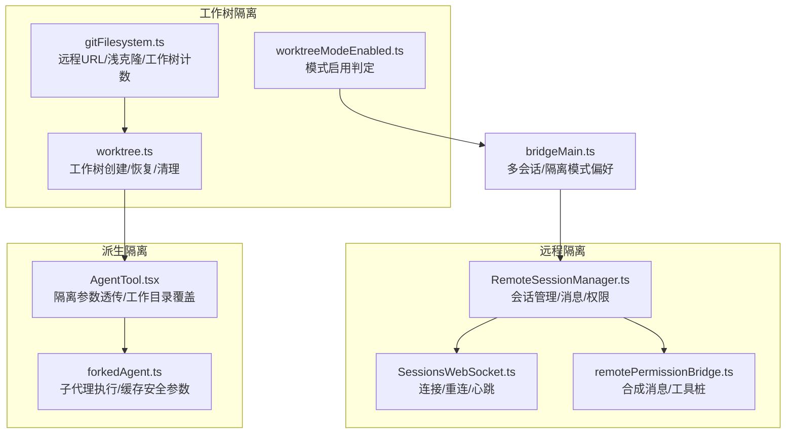
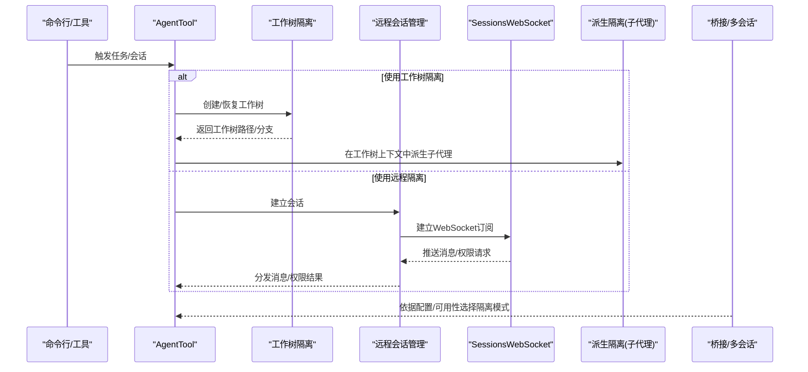
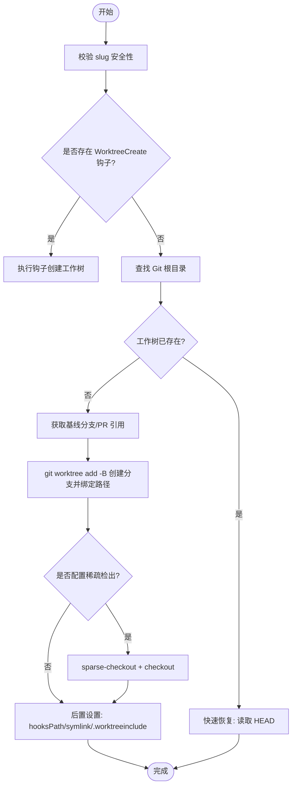
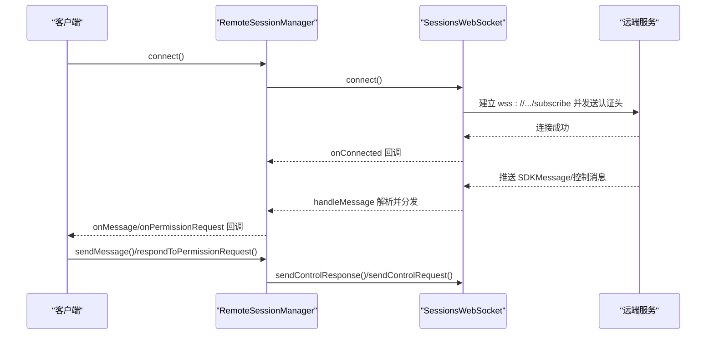
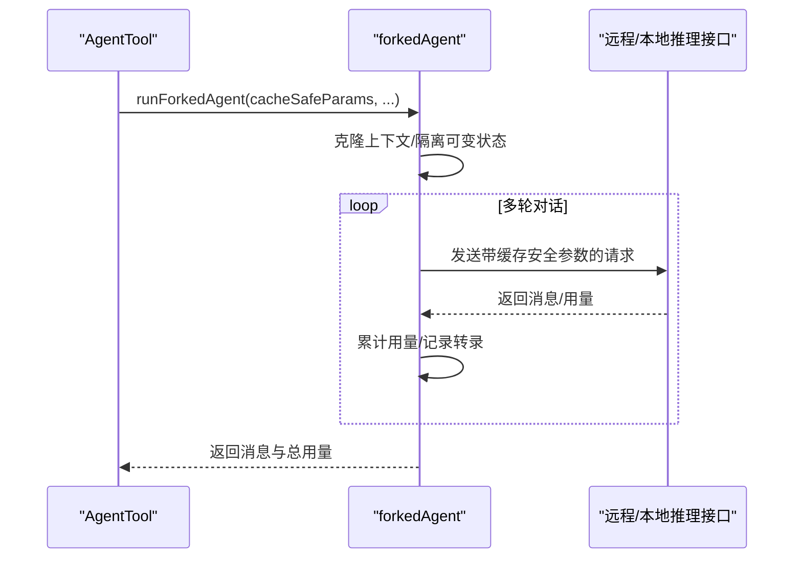
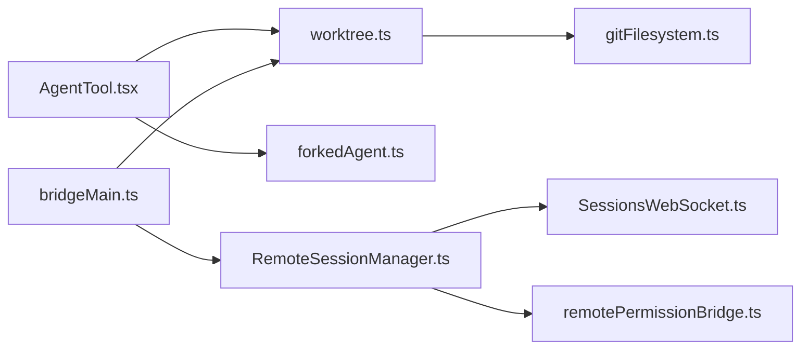

# 代理隔离模式

<cite>
**本文引用的文件**
- [src/utils/worktree.ts](file://src/utils/worktree.ts)
- [src/utils/worktreeModeEnabled.ts](file://src/utils/worktreeModeEnabled.ts)
- [src/remote/RemoteSessionManager.ts](file://src/remote/RemoteSessionManager.ts)
- [src/remote/SessionsWebSocket.ts](file://src/remote/SessionsWebSocket.ts)
- [src/remote/remotePermissionBridge.ts](file://src/remote/remotePermissionBridge.ts)
- [src/utils/forkedAgent.ts](file://src/utils/forkedAgent.ts)
- [src/tools/AgentTool/AgentTool.tsx](file://src/tools/AgentTool/AgentTool.tsx)
- [src/bridge/bridgeMain.ts](file://src/bridge/bridgeMain.ts)
- [src/utils/git/gitFilesystem.ts](file://src/utils/git/gitFilesystem.ts)
- [src/utils/debug.ts](file://src/utils/debug.ts)
- [src/utils/slowOperations.ts](file://src/utils/slowOperations.ts)
</cite>

## 目录
1. [简介](#简介)
2. [项目结构](#项目结构)
3. [核心组件](#核心组件)
4. [架构总览](#架构总览)
5. [详细组件分析](#详细组件分析)
6. [依赖关系分析](#依赖关系分析)
7. [性能考量](#性能考量)
8. [故障排查指南](#故障排查指南)
9. [结论](#结论)
10. [附录](#附录)

## 简介
本文件系统性阐述 Claude Code 的代理隔离模式，覆盖三种隔离路径：工作树隔离（worktree isolation）、远程隔离（remote isolation）与派生隔离（fork isolation）。文档从实现原理、工作机制、数据流与处理逻辑入手，结合关键源码路径，给出选择策略、配置指南、调试方法与性能优化建议，帮助读者在安全与性能之间做出合理权衡。

## 项目结构
围绕隔离模式的关键模块分布如下：
- 工作树隔离：工作树生命周期管理、钩子集成、稀疏检出、变更检测与自动清理
- 远程隔离：远程会话管理、WebSocket 订阅、权限请求桥接、HTTP 消息发送
- 派生隔离：子代理派生、上下文隔离、缓存安全参数共享、用量统计与转录记录
- 工具与入口：Agent 工具对隔离模式的调用封装、桥接层对多会话与隔离模式的决策

**图表来源**
- [src/utils/worktree.ts:702-778](file://src/utils/worktree.ts#L702-L778)
- [src/utils/worktreeModeEnabled.ts:9-11](file://src/utils/worktreeModeEnabled.ts#L9-L11)
- [src/utils/git/gitFilesystem.ts:642-699](file://src/utils/git/gitFilesystem.ts#L642-L699)
- [src/remote/RemoteSessionManager.ts:95-324](file://src/remote/RemoteSessionManager.ts#L95-L324)
- [src/remote/SessionsWebSocket.ts:82-404](file://src/remote/SessionsWebSocket.ts#L82-L404)
- [src/remote/remotePermissionBridge.ts:12-79](file://src/remote/remotePermissionBridge.ts#L12-L79)
- [src/utils/forkedAgent.ts:489-610](file://src/utils/forkedAgent.ts#L489-L610)
- [src/tools/AgentTool/AgentTool.tsx:619-641](file://src/tools/AgentTool/AgentTool.tsx#L619-L641)
- [src/bridge/bridgeMain.ts:2215-2235](file://src/bridge/bridgeMain.ts#L2215-L2235)

**章节来源**
- [src/utils/worktree.ts:702-778](file://src/utils/worktree.ts#L702-L778)
- [src/remote/RemoteSessionManager.ts:95-324](file://src/remote/RemoteSessionManager.ts#L95-L324)
- [src/utils/forkedAgent.ts:489-610](file://src/utils/forkedAgent.ts#L489-L610)
- [src/tools/AgentTool/AgentTool.tsx:619-641](file://src/tools/AgentTool/AgentTool.tsx#L619-L641)
- [src/bridge/bridgeMain.ts:2215-2235](file://src/bridge/bridgeMain.ts#L2215-L2235)

## 核心组件
- 工作树隔离（worktree isolation）
  - 路径与分支管理：命名工作树、扁平化 slug、分支名生成、快速恢复
  - 创建流程：钩子优先、回退到 git worktree；稀疏检出与 checkout；后置设置（hooksPath、symlink、.worktreeinclude）
  - 变更检测：工作区脏状态与新提交检测
  - 自动清理：会话结束或异常时删除临时分支与工作树
- 远程隔离（remote isolation）
  - 会话管理：WebSocket 订阅、HTTP 发送消息、权限请求/响应
  - 连接策略：指数回退、心跳保活、特定关闭码处理
  - 权限桥接：合成 assistant 消息、远程工具桩
- 派生隔离（fork isolation）
  - 子代理执行：缓存安全参数共享、用量累计、转录记录
  - 上下文隔离：克隆文件状态缓存、消息快照、隔离可变状态
  - 工具与工作目录：按需透传 worktreePath 或显式 cwd 覆盖

**章节来源**
- [src/utils/worktree.ts:235-375](file://src/utils/worktree.ts#L235-L375)
- [src/utils/worktree.ts:506-624](file://src/utils/worktree.ts#L506-L624)
- [src/utils/worktree.ts:1138-1173](file://src/utils/worktree.ts#L1138-L1173)
- [src/remote/RemoteSessionManager.ts:95-324](file://src/remote/RemoteSessionManager.ts#L95-L324)
- [src/remote/SessionsWebSocket.ts:82-404](file://src/remote/SessionsWebSocket.ts#L82-L404)
- [src/remote/remotePermissionBridge.ts:12-79](file://src/remote/remotePermissionBridge.ts#L12-L79)
- [src/utils/forkedAgent.ts:489-610](file://src/utils/forkedAgent.ts#L489-L610)

## 架构总览
下图展示三种隔离模式在系统中的交互关系与数据流：

**图表来源**
- [src/tools/AgentTool/AgentTool.tsx:619-641](file://src/tools/AgentTool/AgentTool.tsx#L619-L641)
- [src/utils/worktree.ts:702-778](file://src/utils/worktree.ts#L702-L778)
- [src/remote/RemoteSessionManager.ts:95-324](file://src/remote/RemoteSessionManager.ts#L95-L324)
- [src/remote/SessionsWebSocket.ts:82-404](file://src/remote/SessionsWebSocket.ts#L82-L404)
- [src/utils/forkedAgent.ts:489-610](file://src/utils/forkedAgent.ts#L489-L610)
- [src/bridge/bridgeMain.ts:2215-2235](file://src/bridge/bridgeMain.ts#L2215-L2235)

## 详细组件分析

### 工作树隔离（Worktree Isolation）
- 实现要点
  - 名称与路径安全：校验 slug，防止路径穿越；扁平化嵌套以避免 git 引用冲突
  - 快速恢复：直接读取 .git 指针文件判断是否已存在，避免重复 fetch
  - 钩子优先：支持 WorktreeCreate/WorktreeRemove 钩子，允许非 Git VCS 场景
  - 后置设置：统一 hooksPath、symlink 大目录、复制 .worktreeinclude 中的忽略文件
  - 稀疏检出：支持 settings.worktree.sparsePaths，失败时回滚并报错
  - 变更检测：通过 status 与 rev-list 判断是否有未提交更改或新提交
  - 自动清理：删除临时分支、移除工作树目录，并更新项目配置

**图表来源**
- [src/utils/worktree.ts:66-87](file://src/utils/worktree.ts#L66-L87)
- [src/utils/worktree.ts:235-375](file://src/utils/worktree.ts#L235-L375)
- [src/utils/worktree.ts:506-624](file://src/utils/worktree.ts#L506-L624)
- [src/utils/worktree.ts:321-366](file://src/utils/worktree.ts#L321-L366)

**章节来源**
- [src/utils/worktree.ts:66-87](file://src/utils/worktree.ts#L66-L87)
- [src/utils/worktree.ts:235-375](file://src/utils/worktree.ts#L235-L375)
- [src/utils/worktree.ts:506-624](file://src/utils/worktree.ts#L506-L624)
- [src/utils/worktree.ts:1138-1173](file://src/utils/worktree.ts#L1138-L1173)

### 远程隔离（Remote Isolation）
- 实现要点
  - 会话管理：RemoteSessionManager 统一处理 WebSocket 订阅、HTTP 发送消息、权限请求/响应
  - WebSocket 协议：基于 /v1/sessions/ws/{id}/subscribe，携带 OAuth Bearer 令牌
  - 权限桥接：remotePermissionBridge 提供合成 assistant 消息与远程工具桩，适配本地 UI 与权限系统
  - 连接策略：SessionsWebSocket 支持指数回退、心跳保活、特定关闭码处理（如 4001 有限重试）

**图表来源**
- [src/remote/RemoteSessionManager.ts:95-324](file://src/remote/RemoteSessionManager.ts#L95-L324)
- [src/remote/SessionsWebSocket.ts:82-404](file://src/remote/SessionsWebSocket.ts#L82-L404)
- [src/remote/remotePermissionBridge.ts:12-79](file://src/remote/remotePermissionBridge.ts#L12-L79)

**章节来源**
- [src/remote/RemoteSessionManager.ts:95-324](file://src/remote/RemoteSessionManager.ts#L95-L324)
- [src/remote/SessionsWebSocket.ts:82-404](file://src/remote/SessionsWebSocket.ts#L82-L404)
- [src/remote/remotePermissionBridge.ts:12-79](file://src/remote/remotePermissionBridge.ts#L12-L79)

### 派生隔离（Fork Isolation）
- 实现要点
  - 缓存安全参数：确保父子请求共享 prompt cache，关键参数包括 systemPrompt、userContext、systemContext、toolUseContext、forkContextMessages
  - 上下文隔离：克隆文件状态缓存、清理初始消息数组，避免父状态被污染
  - 用量统计与转录：累计 token 使用、记录 sidechain 转录，便于审计与复盘
  - 工具与工作目录：在 AgentTool 中根据 forkPath 透传 worktreePath 或显式 cwd 覆盖

**图表来源**
- [src/utils/forkedAgent.ts:489-610](file://src/utils/forkedAgent.ts#L489-L610)
- [src/tools/AgentTool/AgentTool.tsx:619-641](file://src/tools/AgentTool/AgentTool.tsx#L619-L641)

**章节来源**
- [src/utils/forkedAgent.ts:489-610](file://src/utils/forkedAgent.ts#L489-L610)
- [src/tools/AgentTool/AgentTool.tsx:619-641](file://src/tools/AgentTool/AgentTool.tsx#L619-L641)

## 依赖关系分析
- 工作树隔离依赖 Git 文件系统能力（远程 URL、浅克隆、工作树计数），用于环境探测与优化
- 远程隔离依赖 SessionsWebSocket 的连接与重连策略，以及权限桥接模块
- 派生隔离依赖 AgentTool 的参数透传与工作目录覆盖
- 桥接层根据多会话可用性与用户偏好选择隔离模式，并在不满足条件时回退

**图表来源**
- [src/tools/AgentTool/AgentTool.tsx:619-641](file://src/tools/AgentTool/AgentTool.tsx#L619-L641)
- [src/utils/worktree.ts:702-778](file://src/utils/worktree.ts#L702-L778)
- [src/utils/git/gitFilesystem.ts:642-699](file://src/utils/git/gitFilesystem.ts#L642-L699)
- [src/remote/RemoteSessionManager.ts:95-324](file://src/remote/RemoteSessionManager.ts#L95-L324)
- [src/remote/SessionsWebSocket.ts:82-404](file://src/remote/SessionsWebSocket.ts#L82-L404)
- [src/remote/remotePermissionBridge.ts:12-79](file://src/remote/remotePermissionBridge.ts#L12-L79)
- [src/bridge/bridgeMain.ts:2215-2235](file://src/bridge/bridgeMain.ts#L2215-L2235)

**章节来源**
- [src/bridge/bridgeMain.ts:2215-2235](file://src/bridge/bridgeMain.ts#L2215-L2235)
- [src/utils/git/gitFilesystem.ts:642-699](file://src/utils/git/gitFilesystem.ts#L642-L699)

## 性能考量
- 工作树隔离
  - 快速恢复：直接读取 HEAD 指针，避免每次启动都执行 fetch，显著降低冷启动延迟
  - 稀疏检出：仅检出必要路径，减少磁盘占用与 IO 开销
  - 后置设置：一次性配置 hooksPath 与 symlink，避免后续重复开销
- 远程隔离
  - 心跳保活与指数回退：维持稳定连接，减少频繁断连带来的重连成本
  - 权限请求异步化：通过桥接模块合成消息，避免阻塞主消息流
- 派生隔离
  - 缓存安全参数共享：避免重复计算，提升 prompt cache 命中率
  - 上下文隔离与清理：及时释放缓存与消息快照，避免内存膨胀

[本节为通用性能讨论，无需具体文件分析]

## 故障排查指南
- 工作树隔离
  - 症状：无法创建/恢复工作树
  - 排查：确认当前目录是否为 Git 仓库；若无钩子，检查 Git 可用性；查看日志中“Failed to create worktree”“Failed to configure sparse-checkout”等错误
  - 关键路径参考
    - [src/utils/worktree.ts:235-375](file://src/utils/worktree.ts#L235-L375)
    - [src/utils/worktree.ts:321-366](file://src/utils/worktree.ts#L321-L366)
    - [src/utils/worktree.ts:506-624](file://src/utils/worktree.ts#L506-L624)
- 远程隔离
  - 症状：连接中断/权限请求超时
  - 排查：检查 WebSocket 连接回调与重连逻辑；关注 4001（会话不存在）的有限重试；核对权限响应是否正确下发
  - 关键路径参考
    - [src/remote/SessionsWebSocket.ts:234-288](file://src/remote/SessionsWebSocket.ts#L234-L288)
    - [src/remote/RemoteSessionManager.ts:146-214](file://src/remote/RemoteSessionManager.ts#L146-L214)
- 派生隔离
  - 症状：子代理执行异常或缓存未命中
  - 排查：确认 cacheSafeParams 是否与父请求一致；检查上下文隔离与清理是否生效
  - 关键路径参考
    - [src/utils/forkedAgent.ts:489-610](file://src/utils/forkedAgent.ts#L489-L610)
- 调试输出
  - 日志写入与缓冲：在调试模式下同步写入，非调试模式下缓冲刷新；注意慢操作阈值与递归保护
  - 关键路径参考
    - [src/utils/debug.ts:155-196](file://src/utils/debug.ts#L155-L196)
    - [src/utils/slowOperations.ts:49-67](file://src/utils/slowOperations.ts#L49-L67)

**章节来源**
- [src/utils/worktree.ts:235-375](file://src/utils/worktree.ts#L235-L375)
- [src/utils/worktree.ts:506-624](file://src/utils/worktree.ts#L506-L624)
- [src/remote/SessionsWebSocket.ts:234-288](file://src/remote/SessionsWebSocket.ts#L234-L288)
- [src/remote/RemoteSessionManager.ts:146-214](file://src/remote/RemoteSessionManager.ts#L146-L214)
- [src/utils/forkedAgent.ts:489-610](file://src/utils/forkedAgent.ts#L489-L610)
- [src/utils/debug.ts:155-196](file://src/utils/debug.ts#L155-L196)
- [src/utils/slowOperations.ts:49-67](file://src/utils/slowOperations.ts#L49-L67)

## 结论
- 工作树隔离适合需要本地文件级隔离与快速切换的场景，具备快速恢复与稀疏检出等性能优化
- 远程隔离适合跨设备/容器/网络受限环境，具备稳定的连接与权限管理能力
- 派生隔离适合需要 prompt cache 共享与上下文隔离的子任务执行
- 最佳实践建议：优先启用工作树隔离；在远程环境或受限网络下采用远程隔离；对高频子任务使用派生隔离并严格保持缓存安全参数一致

[本节为总结性内容，无需具体文件分析]

## 附录

### 隔离模式选择策略与适用场景
- 安全性
  - 工作树隔离：文件级隔离，变更可控，支持清理
  - 远程隔离：运行在远端容器，本地仅传输消息与权限决策
  - 派生隔离：上下文隔离，避免父状态污染
- 性能影响
  - 工作树隔离：冷启动可通过快速恢复优化；稀疏检出降低 IO
  - 远程隔离：网络抖动影响体验，但具备心跳与回退
  - 派生隔离：prompt cache 共享提升吞吐
- 资源消耗
  - 工作树隔离：磁盘占用与 symlink 策略需平衡
  - 远程隔离：CPU/内存由远端承担
  - 派生隔离：注意上下文隔离与缓存清理

[本节为概念性说明，无需具体文件分析]

### 配置指南与使用建议
- 工作树隔离
  - 启用：工作树模式已全局启用
    - [src/utils/worktreeModeEnabled.ts:9-11](file://src/utils/worktreeModeEnabled.ts#L9-L11)
  - 钩子：配置 WorktreeCreate/WorktreeRemove 钩子以支持非 Git VCS
    - [src/utils/worktree.ts:714-728](file://src/utils/worktree.ts#L714-L728)
  - 稀疏检出：通过 settings.worktree.sparsePaths 控制
    - [src/utils/worktree.ts:321-366](file://src/utils/worktree.ts#L321-L366)
  - 后置设置：hooksPath、symlinkDirectories、.worktreeinclude
    - [src/utils/worktree.ts:506-624](file://src/utils/worktree.ts#L506-L624)
- 远程隔离
  - 会话偏好：多会话可用时保存 spawn mode；不满足条件自动回退
    - [src/bridge/bridgeMain.ts:2215-2235](file://src/bridge/bridgeMain.ts#L2215-L2235)
  - 权限桥接：合成 assistant 消息与工具桩
    - [src/remote/remotePermissionBridge.ts:12-79](file://src/remote/remotePermissionBridge.ts#L12-L79)
- 派生隔离
  - 参数一致性：确保 systemPrompt、userContext、systemContext、toolUseContext、forkContextMessages 与父请求一致
    - [src/utils/forkedAgent.ts:47-81](file://src/utils/forkedAgent.ts#L47-L81)
  - 工作目录：优先使用 worktreePath，否则显式 cwd 覆盖
    - [src/tools/AgentTool/AgentTool.tsx:619-641](file://src/tools/AgentTool/AgentTool.tsx#L619-L641)

**章节来源**
- [src/utils/worktreeModeEnabled.ts:9-11](file://src/utils/worktreeModeEnabled.ts#L9-L11)
- [src/utils/worktree.ts:714-728](file://src/utils/worktree.ts#L714-L728)
- [src/utils/worktree.ts:321-366](file://src/utils/worktree.ts#L321-L366)
- [src/utils/worktree.ts:506-624](file://src/utils/worktree.ts#L506-L624)
- [src/bridge/bridgeMain.ts:2215-2235](file://src/bridge/bridgeMain.ts#L2215-L2235)
- [src/remote/remotePermissionBridge.ts:12-79](file://src/remote/remotePermissionBridge.ts#L12-L79)
- [src/utils/forkedAgent.ts:47-81](file://src/utils/forkedAgent.ts#L47-L81)
- [src/tools/AgentTool/AgentTool.tsx:619-641](file://src/tools/AgentTool/AgentTool.tsx#L619-L641)