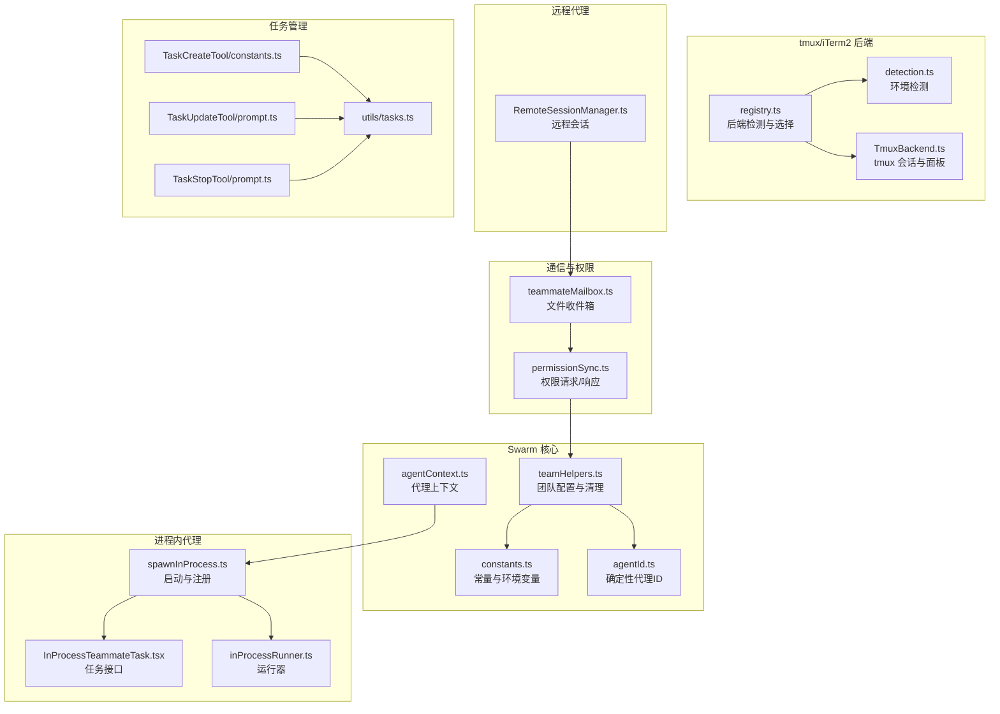
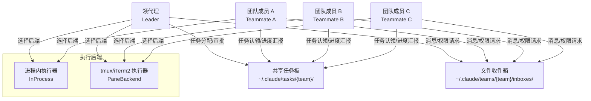
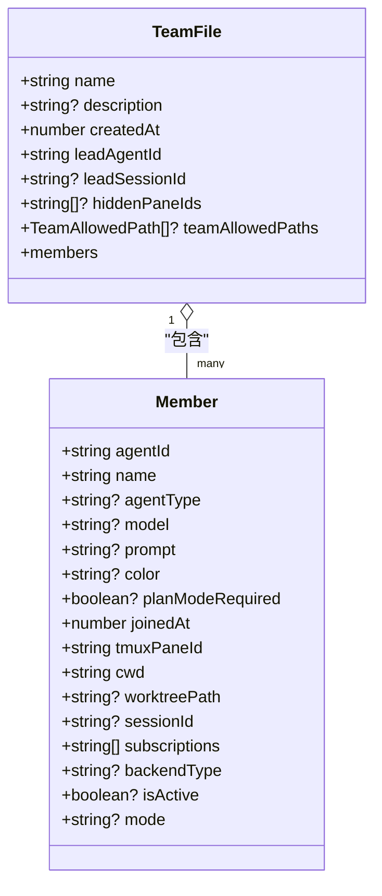
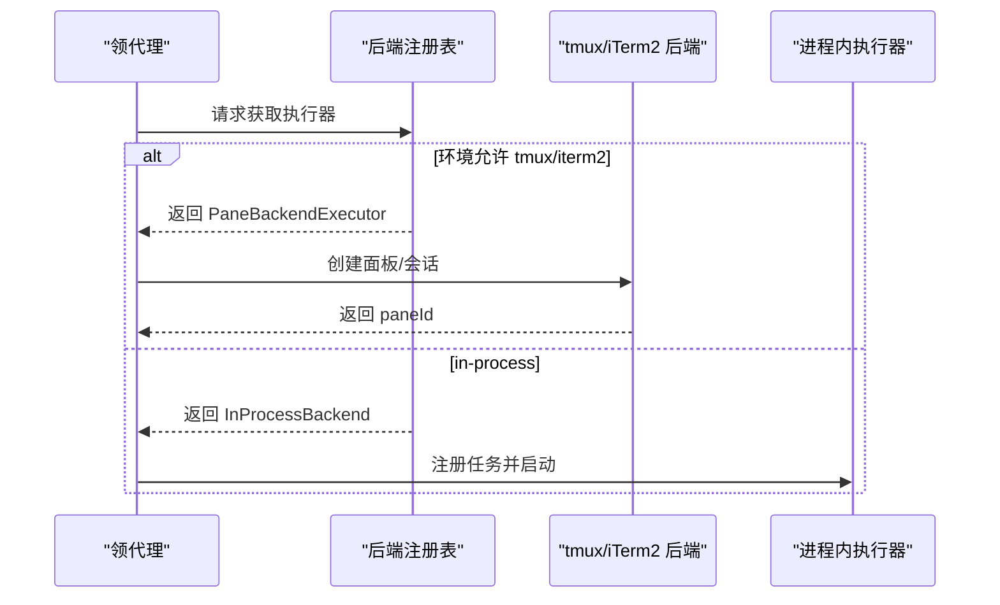
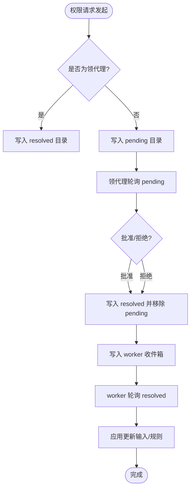
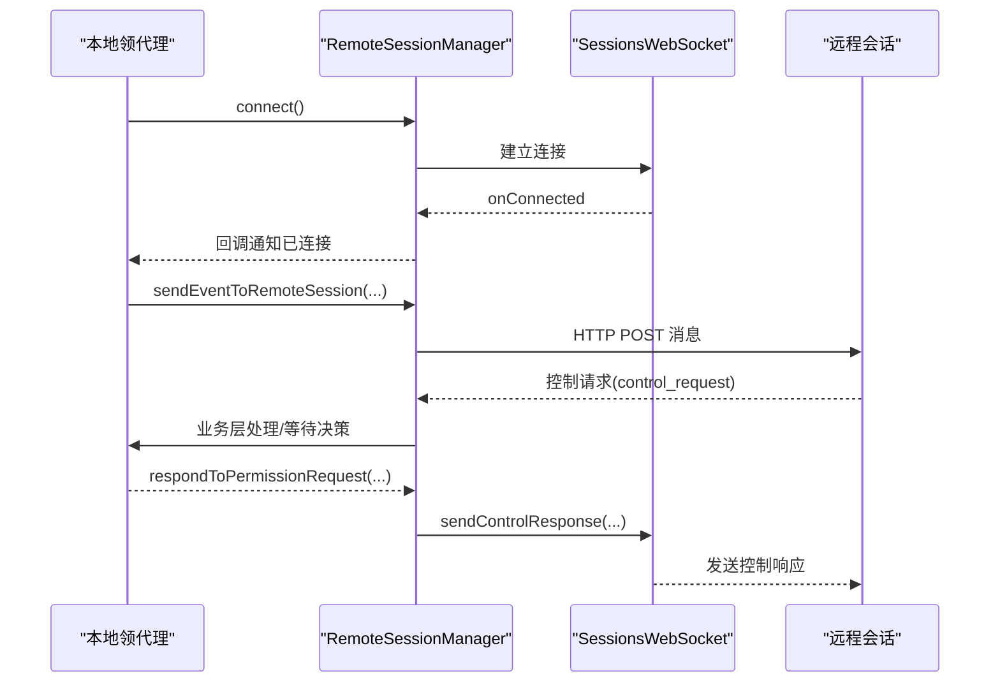
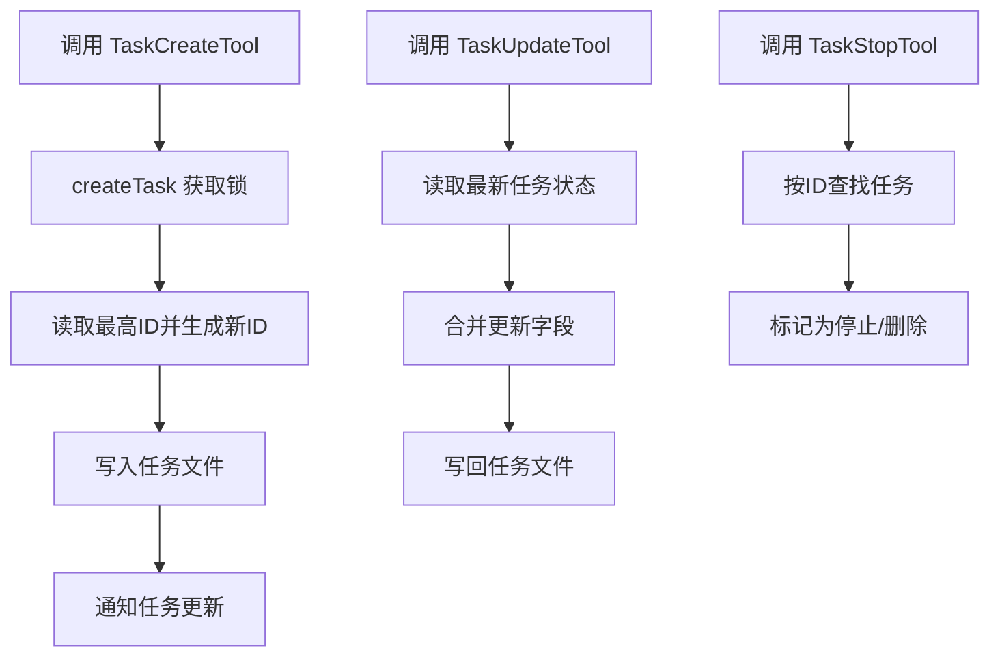
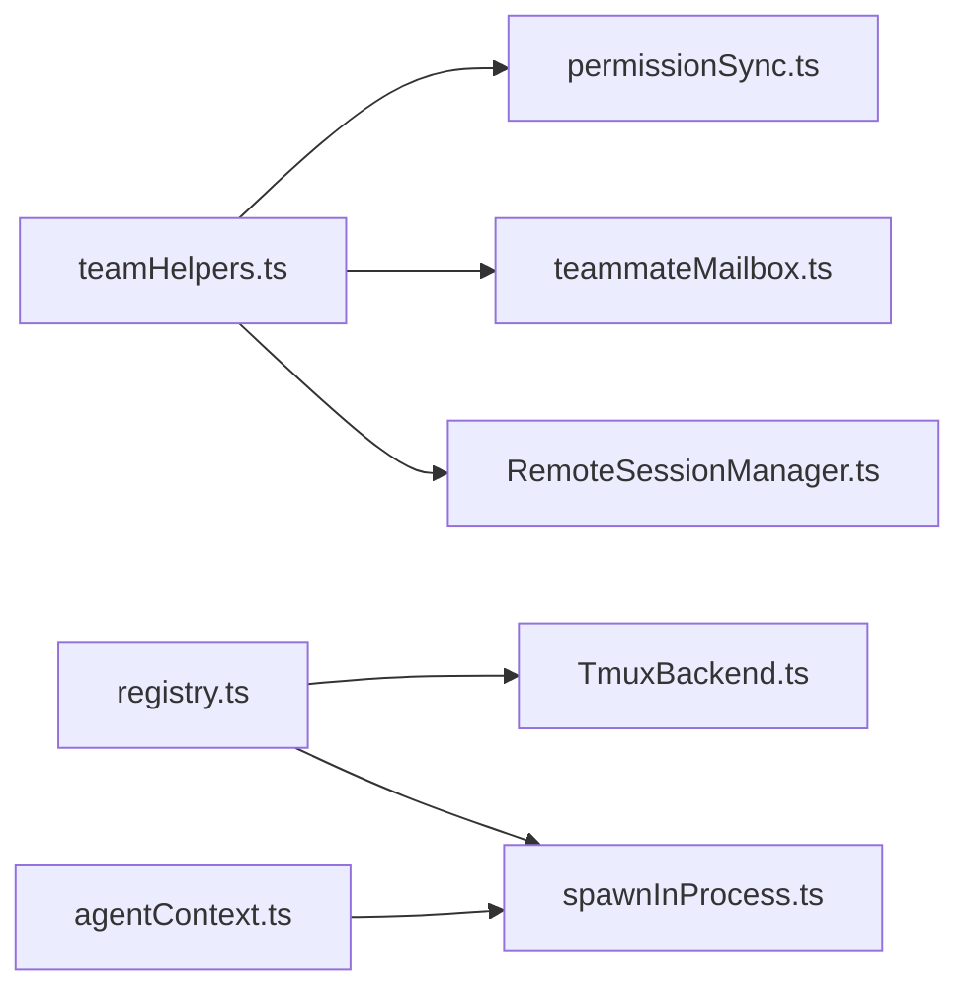

# 多代理协调机制

<cite>
**本文档引用的文件**
- [src/utils/swarm/teamHelpers.ts](file://src/utils/swarm/teamHelpers.ts)
- [src/utils/swarm/constants.ts](file://src/utils/swarm/constants.ts)
- [src/utils/swarm/spawnInProcess.ts](file://src/utils/swarm/spawnInProcess.ts)
- [src/utils/swarm/permissionSync.ts](file://src/utils/swarm/permissionSync.ts)
- [src/utils/teammateMailbox.ts](file://src/utils/teammateMailbox.ts)
- [src/utils/swarm/backends/registry.ts](file://src/utils/swarm/backends/registry.ts)
- [src/utils/swarm/backends/detection.ts](file://src/utils/swarm/backends/detection.ts)
- [src/utils/swarm/backends/TmuxBackend.ts](file://src/utils/swarm/backends/TmuxBackend.ts)
- [src/utils/swarm/inProcessRunner.ts](file://src/utils/swarm/inProcessRunner.ts)
- [src/utils/agentContext.ts](file://src/utils/agentContext.ts)
- [src/utils/agentId.ts](file://src/utils/agentId.ts)
- [src/tasks/InProcessTeammateTask/InProcessTeammateTask.tsx](file://src/tasks/InProcessTeammateTask/InProcessTeammateTask.tsx)
- [src/hooks/useInboxPoller.ts](file://src/hooks/useInboxPoller.ts)
- [src/remote/RemoteSessionManager.ts](file://src/remote/RemoteSessionManager.ts)
- [src/tools/TaskCreateTool/constants.ts](file://src/tools/TaskCreateTool/constants.ts)
- [src/tools/TaskUpdateTool/prompt.ts](file://src/tools/TaskUpdateTool/prompt.ts)
- [src/tools/TaskStopTool/prompt.ts](file://src/tools/TaskStopTool/prompt.ts)
- [src/utils/tasks.ts](file://src/utils/tasks.ts)
- [README.md](file://README.md)
</cite>

## 目录
1. [简介](#简介)
2. [项目结构](#项目结构)
3. [核心组件](#核心组件)
4. [架构总览](#架构总览)
5. [详细组件分析](#详细组件分析)
6. [依赖关系分析](#依赖关系分析)
7. [性能考量](#性能考量)
8. [故障排除指南](#故障排除指南)
9. [结论](#结论)
10. [附录](#附录)

## 简介
本文件系统性阐述 Claude Code 的多代理协调机制，重点围绕“Swarm 模式”的实现原理与工作机制，涵盖以下关键主题：
- 领代理（Leader）、团队成员（Teammate）的角色分工与协作
- 任务板（Task Board）与共享状态（共享任务、消息收件箱）
- 进程内代理（In-Process）与 tmux/iTerm2 代理的协作模式（进程间通信、状态同步、资源管理）
- 远程代理的协调机制（远程会话管理、数据同步、容错处理）
- 任务创建与管理流程（TaskCreate/Update/Stop 工具的使用与协调）
- 最佳实践：代理选择策略、负载均衡、性能优化
- 调试方法与故障排除技巧

## 项目结构
多代理协调相关的核心代码分布在如下模块：
- Swarm 团队管理与配置：teamHelpers.ts
- 常量与环境变量：constants.ts
- 进程内代理启动与生命周期：spawnInProcess.ts、InProcessTeammateTask.tsx、inProcessRunner.ts
- 代理间通信与权限同步：teammateMailbox.ts、permissionSync.ts
- 后端执行器与检测：backends/registry.ts、backends/detection.ts、backends/TmuxBackend.ts
- 远程会话管理：RemoteSessionManager.ts
- 任务工具与任务存储：tools/Task*、utils/tasks.ts
- 全局上下文与标识：agentContext.ts、agentId.ts
- UI 钩子与轮询：hooks/useInboxPoller.ts

图表来源
- [src/utils/swarm/teamHelpers.ts:1-684](file://src/utils/swarm/teamHelpers.ts#L1-L684)
- [src/utils/swarm/constants.ts:1-34](file://src/utils/swarm/constants.ts#L1-L34)
- [src/utils/swarm/spawnInProcess.ts:1-329](file://src/utils/swarm/spawnInProcess.ts#L1-L329)
- [src/tasks/InProcessTeammateTask/InProcessTeammateTask.tsx:1-30](file://src/tasks/InProcessTeammateTask/InProcessTeammateTask.tsx#L1-L30)
- [src/utils/swarm/inProcessRunner.ts:504-563](file://src/utils/swarm/inProcessRunner.ts#L504-L563)
- [src/utils/swarm/backends/registry.ts:1-465](file://src/utils/swarm/backends/registry.ts#L1-L465)
- [src/utils/swarm/backends/detection.ts:1-129](file://src/utils/swarm/backends/detection.ts#L1-L129)
- [src/utils/swarm/backends/TmuxBackend.ts:125-672](file://src/utils/swarm/backends/TmuxBackend.ts#L125-L672)
- [src/utils/teammateMailbox.ts:1-800](file://src/utils/teammateMailbox.ts#L1-L800)
- [src/utils/swarm/permissionSync.ts:1-929](file://src/utils/swarm/permissionSync.ts#L1-L929)
- [src/remote/RemoteSessionManager.ts:1-289](file://src/remote/RemoteSessionManager.ts#L1-L289)
- [src/tools/TaskCreateTool/constants.ts:1-1](file://src/tools/TaskCreateTool/constants.ts#L1-L1)
- [src/tools/TaskUpdateTool/prompt.ts:26-77](file://src/tools/TaskUpdateTool/prompt.ts#L26-L77)
- [src/tools/TaskStopTool/prompt.ts:1-8](file://src/tools/TaskStopTool/prompt.ts#L1-L8)
- [src/utils/tasks.ts:279-317](file://src/utils/tasks.ts#L279-L317)

章节来源
- [README.md: 609-646:609-646](file://README.md#L609-L646)

## 核心组件
- 团队配置与成员管理：teamHelpers.ts 提供团队文件读写、成员增删、工作树清理、会话清理等功能，是 Swarm 生命周期管理的基础。
- 确定性代理 ID：agentId.ts 定义 agentName@teamName 的格式，支持可重现的代理身份与重启后的重连。
- 代理上下文：agentContext.ts 定义 in-process teammate 的上下文结构，用于 AsyncLocalStorage 隔离。
- 进程内代理：spawnInProcess.ts 负责在同进程内创建代理任务，注册到 AppState；InProcessTeammateTask.tsx 实现任务接口；inProcessRunner.ts 提供运行时消息与状态交互。
- 后端执行器：registry.ts 统一检测与选择 tmux/iterm2 或 in-process 执行器；detection.ts 提供环境检测；TmuxBackend.ts 管理 tmux 会话与面板布局。
- 通信与权限：teammateMailbox.ts 提供基于文件的收件箱系统；permissionSync.ts 提供权限请求/响应与沙箱网络访问请求的统一处理。
- 远程代理：RemoteSessionManager.ts 管理远程会话的 WebSocket 连接、消息发送与权限响应。
- 任务管理：TaskCreate/Update/Stop 工具与 utils/tasks.ts 提供任务的创建、更新、删除与依赖管理。

章节来源
- [src/utils/swarm/teamHelpers.ts: 64-90:64-90](file://src/utils/swarm/teamHelpers.ts#L64-L90)
- [src/utils/agentId.ts: 1-L40:1-40](file://src/utils/agentId.ts#L1-L40)
- [src/utils/agentContext.ts: 56-L92:56-92](file://src/utils/agentContext.ts#L56-L92)
- [src/utils/swarm/spawnInProcess.ts: 104-L216:104-216](file://src/utils/swarm/spawnInProcess.ts#L104-L216)
- [src/tasks/InProcessTeammateTask/InProcessTeammateTask.tsx: 24-L30:24-30](file://src/tasks/InProcessTeammateTask/InProcessTeammateTask.tsx#L24-L30)
- [src/utils/swarm/inProcessRunner.ts: 504-L563:504-563](file://src/utils/swarm/inProcessRunner.ts#L504-L563)
- [src/utils/swarm/backends/registry.ts: 136-L254:136-254](file://src/utils/swarm/backends/registry.ts#L136-L254)
- [src/utils/swarm/backends/detection.ts: 36-L104:36-104](file://src/utils/swarm/backends/detection.ts#L36-L104)
- [src/utils/swarm/backends/TmuxBackend.ts: 125-L146:125-146](file://src/utils/swarm/backends/TmuxBackend.ts#L125-L146)
- [src/utils/teammateMailbox.ts: 56-L66:56-66](file://src/utils/teammateMailbox.ts#L56-L66)
- [src/utils/swarm/permissionSync.ts: 167-L207:167-207](file://src/utils/swarm/permissionSync.ts#L167-L207)
- [src/remote/RemoteSessionManager.ts: 95-L131:95-131](file://src/remote/RemoteSessionManager.ts#L95-L131)
- [src/utils/tasks.ts: 284-L317:284-317](file://src/utils/tasks.ts#L284-L317)

## 架构总览
下图展示了 Swarm 模式的整体架构：领代理与团队成员通过共享任务板与文件收件箱进行协作；执行后端根据环境自动选择 tmux/iterm2 或 in-process；远程代理通过 WebSocket 与本地主进程协同。

图表来源
- [src/utils/swarm/teamHelpers.ts:115-124](file://src/utils/swarm/teamHelpers.ts#L115-L124)
- [src/utils/teammateMailbox.ts:56-66](file://src/utils/teammateMailbox.ts#L56-L66)
- [src/utils/swarm/backends/registry.ts:425-436](file://src/utils/swarm/backends/registry.ts#L425-L436)
- [src/utils/swarm/backends/TmuxBackend.ts:125-146](file://src/utils/swarm/backends/TmuxBackend.ts#L125-L146)

## 详细组件分析

### 领代理与团队成员
- 角色定义：TEAM_LEAD_NAME 作为默认领代理标识；团队成员通过 agentId（agentName@teamName）唯一标识。
- 团队配置：teamHelpers.ts 维护 TeamFile，记录成员列表、工作树路径、会话 ID、权限模式等；支持按 agentId 或 paneId 移除成员。
- 会话清理：cleanupSessionTeams 在非正常退出时清理孤儿面板与目录，避免资源泄露。

图表来源
- [src/utils/swarm/teamHelpers.ts: 64-L90:64-90](file://src/utils/swarm/teamHelpers.ts#L64-L90)

章节来源
- [src/utils/swarm/constants.ts: 1-L34:1-34](file://src/utils/swarm/constants.ts#L1-L34)
- [src/utils/swarm/teamHelpers.ts: 188-L227:188-227](file://src/utils/swarm/teamHelpers.ts#L188-L227)
- [src/utils/swarm/teamHelpers.ts: 576-L590:576-590](file://src/utils/swarm/teamHelpers.ts#L576-L590)

### 进程内代理（In-Process）与 tmux/iTerm2 协作
- 进程内代理：spawnInProcess.ts 创建 TeammateContext 并注册 InProcessTeammateTaskState 到 AppState；通过 AbortController 支持独立中断；支持 Perfetto 跟踪注册。
- tmux/iTerm2 后端：registry.ts 自动检测环境并选择 tmux/iterm2 或 in-process；TmuxBackend.ts 管理面板创建、边框颜色、标题与布局重平衡；支持外部会话与内部会话两种模式。
- 运行时交互：inProcessRunner.ts 提供消息发送至领代理的收件箱能力，保持与 tmux 同构的一致性。

图表来源
- [src/utils/swarm/backends/registry.ts: 425-L436:425-436](file://src/utils/swarm/backends/registry.ts#L425-L436)
- [src/utils/swarm/backends/TmuxBackend.ts: 125-L146:125-146](file://src/utils/swarm/backends/TmuxBackend.ts#L125-L146)
- [src/utils/swarm/spawnInProcess.ts: 104-L216:104-216](file://src/utils/swarm/spawnInProcess.ts#L104-L216)

章节来源
- [src/utils/swarm/spawnInProcess.ts: 104-L216:104-216](file://src/utils/swarm/spawnInProcess.ts#L104-L216)
- [src/tasks/InProcessTeammateTask/InProcessTeammateTask.tsx: 24-L30:24-30](file://src/tasks/InProcessTeammateTask/InProcessTeammateTask.tsx#L24-L30)
- [src/utils/swarm/inProcessRunner.ts: 547-L563:547-563](file://src/utils/swarm/inProcessRunner.ts#L547-L563)
- [src/utils/swarm/backends/TmuxBackend.ts: 551-L630:551-630](file://src/utils/swarm/backends/TmuxBackend.ts#L551-L630)

### 通信与权限同步（文件收件箱与权限请求）
- 文件收件箱：teammateMailbox.ts 提供 per-agent 的 JSON 收件箱，支持并发写入的文件锁；消息结构包含发件人、文本、时间戳、颜色与摘要。
- 权限请求/响应：permissionSync.ts 定义请求/响应结构，支持普通工具权限与沙箱网络访问；通过收件箱或文件 pending/resolved 目录实现跨代理同步。
- UI 轮询：hooks/useInboxPoller.ts 从收件箱读取未读消息，识别权限请求/响应、计划审批、关机请求等，并触发相应处理。

图表来源
- [src/utils/swarm/permissionSync.ts: 215-L250:215-250](file://src/utils/swarm/permissionSync.ts#L215-L250)
- [src/utils/swarm/permissionSync.ts: 360-L443:360-443](file://src/utils/swarm/permissionSync.ts#L360-L443)
- [src/utils/teammateMailbox.ts: 134-L192:134-192](file://src/utils/teammateMailbox.ts#L134-L192)
- [src/hooks/useInboxPoller.ts: 31-L72:31-72](file://src/hooks/useInboxPoller.ts#L31-L72)

章节来源
- [src/utils/teammateMailbox.ts: 84-L125:84-125](file://src/utils/teammateMailbox.ts#L84-L125)
- [src/utils/swarm/permissionSync.ts: 49-L86:49-86](file://src/utils/swarm/permissionSync.ts#L49-L86)
- [src/utils/swarm/permissionSync.ts: 256-L312:256-312](file://src/utils/swarm/permissionSync.ts#L256-L312)
- [src/hooks/useInboxPoller.ts: 31-L72:31-72](file://src/hooks/useInboxPoller.ts#L31-L72)

### 远程代理协调机制
- 连接管理：RemoteSessionManager.ts 通过 WebSocket 订阅远程会话事件，支持连接、断开、重连与错误回调；通过 HTTP POST 发送用户消息。
- 权限响应：收到控制请求后，构造 SDKControlResponse 并通过 WebSocket 发送，实现远程权限决策闭环。
- 数据同步：通过 teammateMailbox 与 permissionSync 的消息桥接，远程代理可与本地 Swarm 协同。

图表来源
- [src/remote/RemoteSessionManager.ts: 108-L131:108-131](file://src/remote/RemoteSessionManager.ts#L108-L131)
- [src/remote/RemoteSessionManager.ts: 227-L242:227-242](file://src/remote/RemoteSessionManager.ts#L227-L242)
- [src/remote/RemoteSessionManager.ts: 247-L282:247-282](file://src/remote/RemoteSessionManager.ts#L247-L282)

章节来源
- [src/remote/RemoteSessionManager.ts: 95-L131:95-131](file://src/remote/RemoteSessionManager.ts#L95-L131)
- [src/remote/RemoteSessionManager.ts: 227-L242:227-242](file://src/remote/RemoteSessionManager.ts#L227-L242)
- [src/remote/RemoteSessionManager.ts: 247-L282:247-282](file://src/remote/RemoteSessionManager.ts#L247-L282)

### 任务创建与管理流程
- 任务创建：createTask 使用文件锁确保并发安全，生成递增 ID 并写入磁盘；任务列表目录位于 ~/.claude/tasks/{team}/。
- 任务更新：TaskUpdateTool 支持状态推进（pending → in_progress → completed）、设置 owner、建立依赖（addBlockedBy/addBlocks）等。
- 任务停止：TaskStopTool 通过任务 ID 停止后台运行的任务。
- 依赖与状态：teamHelpers.ts 的 TeamFile 成员字段包含 isActive、mode 等，便于状态同步与 UI 展示。

图表来源
- [src/utils/tasks.ts: 284-L308:284-308](file://src/utils/tasks.ts#L284-L308)
- [src/utils/tasks.ts: 310-L317:310-317](file://src/utils/tasks.ts#L310-L317)
- [src/tools/TaskUpdateTool/prompt.ts: 26-L77:26-77](file://src/tools/TaskUpdateTool/prompt.ts#L26-L77)
- [src/tools/TaskStopTool/prompt.ts: 1-L8:1-8](file://src/tools/TaskStopTool/prompt.ts#L1-L8)

章节来源
- [src/utils/tasks.ts: 284-L317:284-317](file://src/utils/tasks.ts#L284-L317)
- [src/tools/TaskCreateTool/constants.ts: 1-L1:1-1](file://src/tools/TaskCreateTool/constants.ts#L1-L1)
- [src/tools/TaskUpdateTool/prompt.ts: 26-L77:26-77](file://src/tools/TaskUpdateTool/prompt.ts#L26-L77)
- [src/tools/TaskStopTool/prompt.ts: 1-L8:1-8](file://src/tools/TaskStopTool/prompt.ts#L1-L8)

### 代理选择策略与最佳实践
- 自动选择：registry.ts 在 auto 模式下优先 tmux/iterm2（若可用），否则回退到 in-process；非交互模式强制 in-process。
- 资源管理：TmuxBackend.ts 支持面板边框状态显示、标题设置与布局重平衡；cleanupSessionTeams 在异常退出时清理面板与目录。
- 性能优化：in-process 适合轻量任务与快速迭代；tmux/iterm2 适合需要隔离终端会话与工作树的任务；合理设置 planModeRequired 以减少高风险操作。
- 负载均衡：通过任务板与成员活跃状态（isActive）实现自然的负载分担；必要时结合 addBlockedBy/addBlocks 建立依赖链。

章节来源
- [src/utils/swarm/backends/registry.ts: 351-L389:351-389](file://src/utils/swarm/backends/registry.ts#L351-L389)
- [src/utils/swarm/backends/TmuxBackend.ts: 169-L173:169-173](file://src/utils/swarm/backends/TmuxBackend.ts#L169-L173)
- [src/utils/swarm/teamHelpers.ts: 454-L485:454-485](file://src/utils/swarm/teamHelpers.ts#L454-L485)

## 依赖关系分析
- 组件耦合：teamHelpers.ts 是 Swarm 的基础设施，被 permissionSync.ts、teammateMailbox.ts、RemoteSessionManager.ts 等广泛依赖。
- 后端解耦：registry.ts 将执行器抽象为 TeammateExecutor，屏蔽 tmux/iterm2/in-process 的差异。
- 上下文解耦：agentContext.ts 通过 AsyncLocalStorage 隔离 in-process teammate 的执行上下文。

图表来源
- [src/utils/swarm/teamHelpers.ts:1-684](file://src/utils/swarm/teamHelpers.ts#L1-L684)
- [src/utils/swarm/permissionSync.ts:1-929](file://src/utils/swarm/permissionSync.ts#L1-L929)
- [src/utils/teammateMailbox.ts:1-800](file://src/utils/teammateMailbox.ts#L1-L800)
- [src/remote/RemoteSessionManager.ts:1-289](file://src/remote/RemoteSessionManager.ts#L1-L289)
- [src/utils/swarm/backends/registry.ts:1-465](file://src/utils/swarm/backends/registry.ts#L1-L465)
- [src/utils/swarm/backends/TmuxBackend.ts:125-672](file://src/utils/swarm/backends/TmuxBackend.ts#L125-L672)
- [src/utils/swarm/spawnInProcess.ts:1-329](file://src/utils/swarm/spawnInProcess.ts#L1-L329)
- [src/utils/agentContext.ts:56-92](file://src/utils/agentContext.ts#L56-L92)

章节来源
- [src/utils/swarm/backends/registry.ts: 1-L465:1-465](file://src/utils/swarm/backends/registry.ts#L1-L465)
- [src/utils/swarm/teamHelpers.ts: 1-L684:1-684](file://src/utils/swarm/teamHelpers.ts#L1-L684)

## 性能考量
- 并发安全：文件锁（lockfile）保障收件箱与任务文件的原子写入，避免竞态条件。
- I/O 优化：批量清理旧权限解析文件（cleanupOldResolutions），降低磁盘膨胀。
- 执行器选择：在 tmux/iterm2 可用时优先使用原生面板，提升交互体验；非交互场景使用 in-process 降低资源占用。
- 资源回收：异常退出时通过 cleanupSessionTeams 清理面板与工作树，防止僵尸进程与磁盘占用。

## 故障排除指南
- 后端不可用：当检测到 no pane backend available，registry.ts 会抛出安装指引；可通过安装 tmux 或配置 it2 解决。
- 收件箱读写失败：teammateMailbox.ts 对 ENOENT 做了容错处理；检查 ~/.claude/teams/{team}/inboxes/ 是否存在且可写。
- 权限请求未响应：确认 permissionSync.ts 的 pending/resolved 目录存在且未被意外删除；检查 UI 轮询逻辑是否正确识别消息类型。
- 远程会话断开：RemoteSessionManager.ts 提供 onDisconnected/onReconnecting 回调，检查网络与 WebSocket 地址配置。
- 任务创建冲突：createTask 使用文件锁；若出现死锁，检查锁文件是否残留并手动清理。

章节来源
- [src/utils/swarm/backends/registry.ts: 251-L285:251-285](file://src/utils/swarm/backends/registry.ts#L251-L285)
- [src/utils/teammateMailbox.ts: 98-L108:98-108](file://src/utils/teammateMailbox.ts#L98-L108)
- [src/utils/swarm/permissionSync.ts: 452-L517:452-517](file://src/utils/swarm/permissionSync.ts#L452-L517)
- [src/remote/RemoteSessionManager.ts: 113-L131:113-131](file://src/remote/RemoteSessionManager.ts#L113-L131)
- [src/utils/tasks.ts: 284-L308:284-308](file://src/utils/tasks.ts#L284-L308)

## 结论
Claude Code 的多代理协调机制通过“确定性代理 ID + 文件收件箱 + 任务板 + 执行器抽象”实现了跨进程、跨终端、跨远程的统一协作框架。在不同环境下自动选择最优执行后端，结合权限与计划审批流程，既保证了安全性，又提供了良好的开发体验。建议在生产环境中结合依赖管理与资源回收策略，持续优化任务分配与执行效率。

## 附录
- 术语说明
  - 领代理：团队的协调者与权限审批者
  - 团队成员：执行具体任务的代理实例
  - 收件箱：基于文件的消息传递通道
  - 任务板：共享的任务状态与依赖视图
  - 执行器：tmux/iterm2 或 in-process 的抽象封装