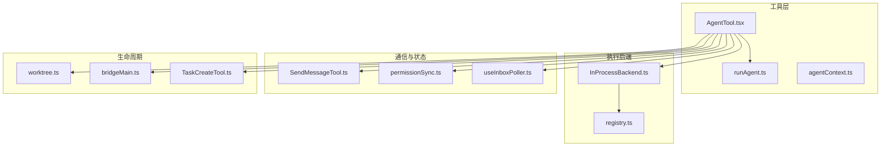
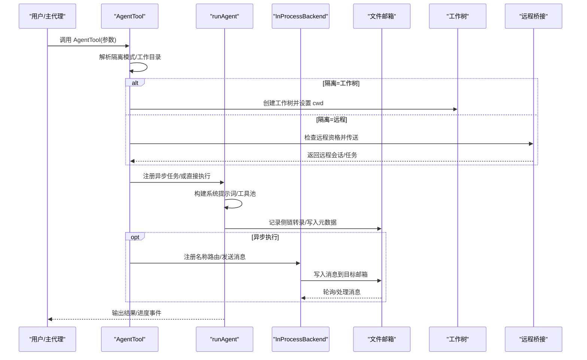
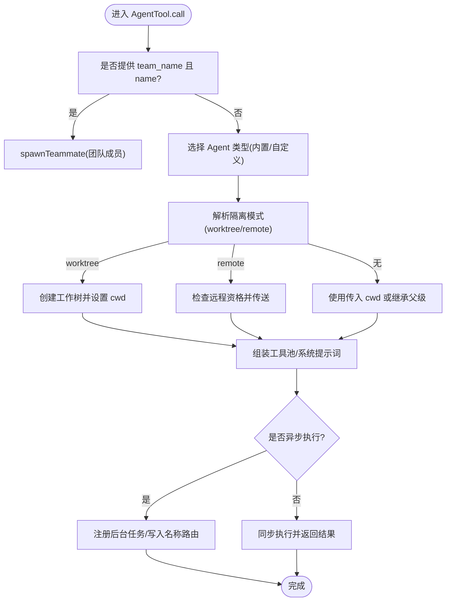
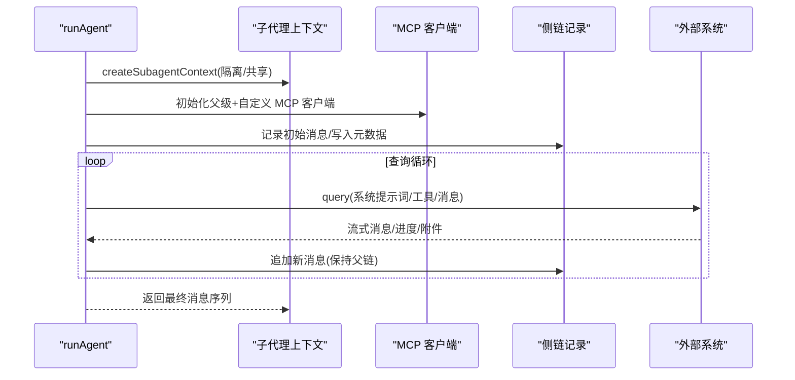
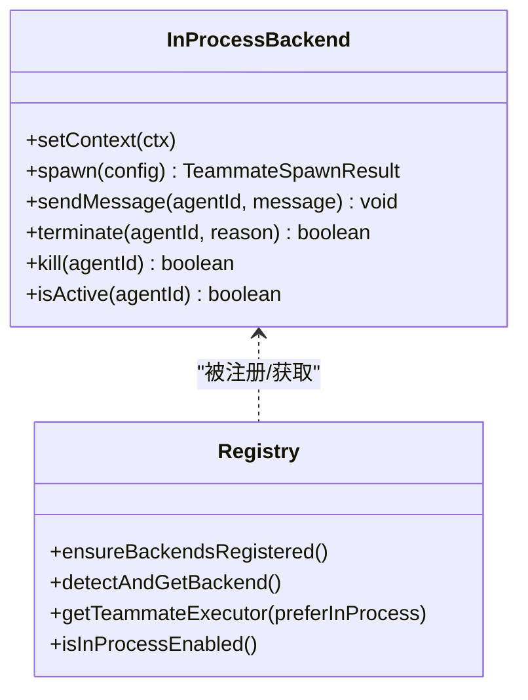
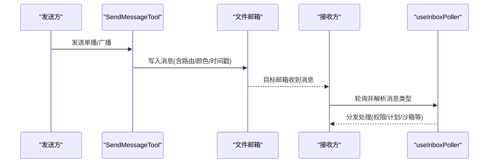
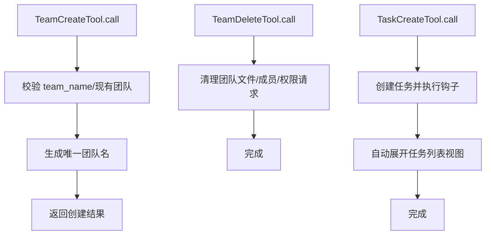
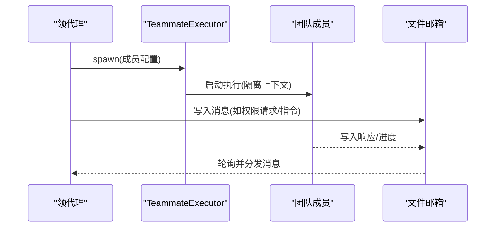
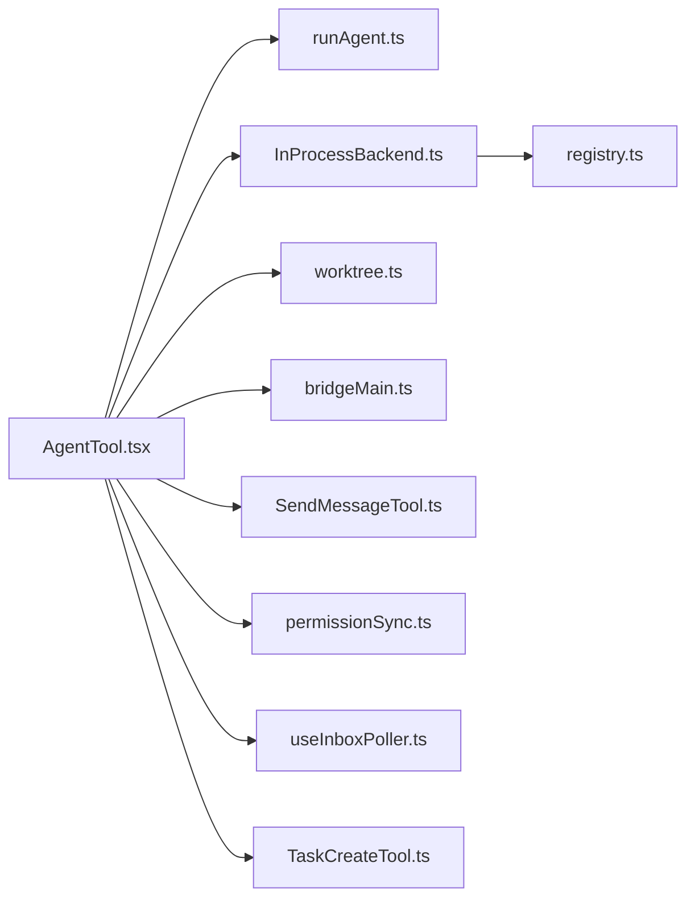

# 子代理架构

<cite>
**本文引用的文件**
- [src/tools/AgentTool/AgentTool.tsx](file://src/tools/AgentTool/AgentTool.tsx)
- [src/tools/AgentTool/runAgent.ts](file://src/tools/AgentTool/runAgent.ts)
- [src/utils/agentContext.ts](file://src/utils/agentContext.ts)
- [src/utils/swarm/backends/InProcessBackend.ts](file://src/utils/swarm/backends/InProcessBackend.ts)
- [src/utils/swarm/backends/registry.ts](file://src/utils/swarm/backends/registry.ts)
- [src/tools/SendMessageTool/SendMessageTool.ts](file://src/tools/SendMessageTool/SendMessageTool.ts)
- [src/tools/TaskCreateTool/TaskCreateTool.ts](file://src/tools/TaskCreateTool/TaskCreateTool.ts)
- [src/utils/worktree.ts](file://src/utils/worktree.ts)
- [src/bridge/bridgeMain.ts](file://src/bridge/bridgeMain.ts)
- [src/hooks/useInboxPoller.ts](file://src/hooks/useInboxPoller.ts)
- [src/utils/swarm/permissionSync.ts](file://src/utils/swarm/permissionSync.ts)
- [src/hooks/useSwarmPermissionPoller.ts](file://src/hooks/useSwarmPermissionPoller.ts)
- [src/tools/TeamCreateTool/TeamCreateTool.ts](file://src/tools/TeamCreateTool/TeamCreateTool.ts)
</cite>

## 目录
1. [引言](#引言)
2. [项目结构](#项目结构)
3. [核心组件](#核心组件)
4. [架构总览](#架构总览)
5. [详细组件分析](#详细组件分析)
6. [依赖关系分析](#依赖关系分析)
7. [性能考量](#性能考量)
8. [故障排除指南](#故障排除指南)
9. [结论](#结论)
10. [附录](#附录)

## 引言
本文件系统性梳理 Claude Code 的子代理架构，围绕 AgentTool 的设计理念与实现机制展开，覆盖子代理创建、消息传递、状态管理、多代理协作模式（进程内、派生、工作树、远程），以及 Swarm 模式下的领代理、团队成员、任务分配与共享状态等多代理协调机制。同时提供子代理开发指南、调试与故障排除建议，帮助开发者在不牺牲性能的前提下构建稳定可靠的多代理系统。

## 项目结构
子代理能力由“工具层 + 执行后端 + 通信与状态 + 生命周期管理”四部分协同实现：
- 工具层：AgentTool 负责参数解析、隔离策略选择、异步/同步执行路径、工作树隔离、远程隔离等。
- 执行后端：InProcessBackend、PaneBackendExecutor 等负责实际的进程/终端会话管理与消息投递。
- 通信与状态：基于文件邮箱（mailbox）的消息路由、权限请求/响应、任务板共享等。
- 生命周期管理：工作树清理、远程会话管理、后台任务注册与进度追踪。

**图表来源**
- [src/tools/AgentTool/AgentTool.tsx:196-800](file://src/tools/AgentTool/AgentTool.tsx#L196-L800)
- [src/tools/AgentTool/runAgent.ts:248-800](file://src/tools/AgentTool/runAgent.ts#L248-L800)
- [src/utils/agentContext.ts:28-54](file://src/utils/agentContext.ts#L28-L54)
- [src/utils/swarm/backends/InProcessBackend.ts:38-340](file://src/utils/swarm/backends/InProcessBackend.ts#L38-L340)
- [src/utils/swarm/backends/registry.ts:425-436](file://src/utils/swarm/backends/registry.ts#L425-L436)
- [src/tools/SendMessageTool/SendMessageTool.ts:149-266](file://src/tools/SendMessageTool/SendMessageTool.ts#L149-L266)
- [src/utils/swarm/permissionSync.ts:183-709](file://src/utils/swarm/permissionSync.ts#L183-L709)
- [src/hooks/useInboxPoller.ts:31-72](file://src/hooks/useInboxPoller.ts#L31-L72)
- [src/utils/worktree.ts:860-993](file://src/utils/worktree.ts#L860-L993)
- [src/bridge/bridgeMain.ts:535-551](file://src/bridge/bridgeMain.ts#L535-L551)
- [src/tools/TaskCreateTool/TaskCreateTool.ts:80-139](file://src/tools/TaskCreateTool/TaskCreateTool.ts#L80-L139)

**章节来源**
- [src/tools/AgentTool/AgentTool.tsx:196-800](file://src/tools/AgentTool/AgentTool.tsx#L196-L800)
- [src/utils/swarm/backends/registry.ts:136-254](file://src/utils/swarm/backends/registry.ts#L136-L254)

## 核心组件
- AgentTool：统一入口，负责参数校验、隔离模式选择、工作树/远程隔离、异步生命周期注册、名称路由表维护、上下文注入与工具池装配。
- runAgent：子代理执行器，负责系统提示词构建、MCP 服务器初始化、工具过滤与去重、消息记录与侧链转录、AbortController 隔离、前台/后台上下文包装。
- InProcessBackend：进程内团队成员执行后端，通过文件邮箱进行消息投递，支持优雅终止与强制杀死，具备活跃态检测。
- Swarm 通信与权限：基于文件邮箱的 sendMessage、权限请求/响应、权限轮询钩子；团队生命周期管理（TeamCreate/TeamDelete）。
- 工作树隔离：轻量工作树创建/删除、变更检测、会话清理。
- 远程隔离：远程环境检查、会话传送、远程任务注册与输出文件路径管理。

**章节来源**
- [src/tools/AgentTool/AgentTool.tsx:239-800](file://src/tools/AgentTool/AgentTool.tsx#L239-L800)
- [src/tools/AgentTool/runAgent.ts:248-800](file://src/tools/AgentTool/runAgent.ts#L248-L800)
- [src/utils/swarm/backends/InProcessBackend.ts:38-340](file://src/utils/swarm/backends/InProcessBackend.ts#L38-L340)
- [src/utils/swarm/permissionSync.ts:183-709](file://src/utils/swarm/permissionSync.ts#L183-L709)
- [src/utils/worktree.ts:860-993](file://src/utils/worktree.ts#L860-L993)

## 架构总览
下图展示从调用 AgentTool 到子代理执行、消息传递与状态更新的关键流程。

**图表来源**
- [src/tools/AgentTool/AgentTool.tsx:579-765](file://src/tools/AgentTool/AgentTool.tsx#L579-L765)
- [src/tools/AgentTool/runAgent.ts:748-800](file://src/tools/AgentTool/runAgent.ts#L748-L800)
- [src/utils/swarm/backends/InProcessBackend.ts:150-180](file://src/utils/swarm/backends/InProcessBackend.ts#L150-L180)
- [src/utils/worktree.ts:860-993](file://src/utils/worktree.ts#L860-L993)
- [src/bridge/bridgeMain.ts:535-551](file://src/bridge/bridgeMain.ts#L535-L551)

## 详细组件分析

### AgentTool 设计与实现
- 参数与模式
  - 支持 name、team_name、mode、isolation、cwd 等参数，用于命名路由、团队协作、权限模式、隔离与工作目录覆盖。
  - 当 team_name 与 name 同时出现时，走“团队成员”路径；否则按“子代理”路径执行。
- 隔离模式
  - worktree：为子代理创建临时工作树，结束后根据变更决定保留或删除，并清理元数据。
  - remote（仅限特定构建）：检查远程资格、传送至远端、注册远程任务并返回会话链接。
- 异步/同步执行
  - fork 路径与助手模式强制异步；普通子代理根据 run_in_background 或 agent 定义背景标志决定。
  - 异步子代理注册到后台任务系统，支持进度追踪、摘要生成与输出文件监控。
- 名称路由
  - 在注册异步子代理后，将 name → agentId 写入全局状态，便于 SendMessageTool 路由。

**图表来源**
- [src/tools/AgentTool/AgentTool.tsx:284-765](file://src/tools/AgentTool/AgentTool.tsx#L284-L765)
- [src/utils/worktree.ts:860-993](file://src/utils/worktree.ts#L860-L993)
- [src/bridge/bridgeMain.ts:535-551](file://src/bridge/bridgeMain.ts#L535-L551)

**章节来源**
- [src/tools/AgentTool/AgentTool.tsx:239-800](file://src/tools/AgentTool/AgentTool.tsx#L239-L800)

### runAgent 执行器
- 上下文与工具
  - 基于 createSubagentContext 构造子代理上下文，支持共享/隔离两种模式；异步子代理独立 AbortController。
  - 工具池去重与精确匹配（fork 子代理使用 exact tools 以复用父请求前缀）。
- 提示词与 MCP
  - 动态合并父级 MCP 客户端与子代理自定义 MCP 服务器，连接失败时清理资源。
  - 可选 omitClaudeMd/gitStatus 以减少只读子代理的上下文开销。
- 消息记录与侧链
  - 使用 recordSidechainTranscript 记录可记录消息，维持父子链连续性；写入 agent 元数据（类型、工作树路径、描述）。
- 权限与提示
  - 根据 agent 定义覆盖权限模式；异步子代理自动避免权限提示对话框，必要时等待自动化检查。

**图表来源**
- [src/tools/AgentTool/runAgent.ts:697-800](file://src/tools/AgentTool/runAgent.ts#L697-L800)

**章节来源**
- [src/tools/AgentTool/runAgent.ts:248-800](file://src/tools/AgentTool/runAgent.ts#L248-L800)

### 多代理协作模式
- 进程内代理（in-process）
  - 同一 Node 进程内运行，通过 AsyncLocalStorage 隔离上下文；使用文件邮箱进行消息投递；支持优雅终止与强制杀死；活跃态检测。
- 派生代理（fork）
  - 子代理继承父系统提示词与工具数组，确保缓存命中一致性；适用于助手模式与“一次性”快速执行。
- 工作树代理（worktree）
  - 为子代理创建 Git 工作树隔离，结束后根据 HEAD 变更决定保留或删除；清理会话工作树并在桥接层移除。
- 远程代理（remote）
  - ant 专属隔离：检查远程资格、传送至远端、注册远程任务并返回会话链接与输出路径。

**图表来源**
- [src/utils/swarm/backends/InProcessBackend.ts:38-340](file://src/utils/swarm/backends/InProcessBackend.ts#L38-L340)
- [src/utils/swarm/backends/registry.ts:425-436](file://src/utils/swarm/backends/registry.ts#L425-L436)

**章节来源**
- [src/utils/swarm/backends/InProcessBackend.ts:38-340](file://src/utils/swarm/backends/InProcessBackend.ts#L38-L340)
- [src/utils/swarm/backends/registry.ts:136-254](file://src/utils/swarm/backends/registry.ts#L136-L254)
- [src/utils/worktree.ts:860-993](file://src/utils/worktree.ts#L860-L993)
- [src/bridge/bridgeMain.ts:535-551](file://src/bridge/bridgeMain.ts#L535-L551)

### 代理间通信机制
- SendMessageTool
  - 单播：向指定成员发送消息；广播：向除自己外所有成员发送；均通过文件邮箱写入并返回路由信息。
  - 校验团队上下文与发送者名称，确保在团队环境中使用。
- 文件邮箱与轮询
  - useInboxPoller 轮询邮箱，识别权限请求/响应、计划审批、沙箱权限等消息类型并分发处理。
  - useSwarmPermissionPoller 在工作者模式下轮询权限响应并触发回调。
- 权限同步
  - sendPermissionRequestViaMailbox 将权限请求封装为消息写入领导者的邮箱；支持文件锁保证原子写入。

**图表来源**
- [src/tools/SendMessageTool/SendMessageTool.ts:149-266](file://src/tools/SendMessageTool/SendMessageTool.ts#L149-L266)
- [src/hooks/useInboxPoller.ts:31-72](file://src/hooks/useInboxPoller.ts#L31-L72)
- [src/utils/swarm/permissionSync.ts:676-709](file://src/utils/swarm/permissionSync.ts#L676-L709)

**章节来源**
- [src/tools/SendMessageTool/SendMessageTool.ts:149-266](file://src/tools/SendMessageTool/SendMessageTool.ts#L149-L266)
- [src/hooks/useInboxPoller.ts:31-72](file://src/hooks/useInboxPoller.ts#L31-L72)
- [src/utils/swarm/permissionSync.ts:183-709](file://src/utils/swarm/permissionSync.ts#L183-L709)
- [src/hooks/useSwarmPermissionPoller.ts:268-303](file://src/hooks/useSwarmPermissionPoller.ts#L268-L303)

### 团队生命周期管理
- TeamCreateTool
  - 校验 team_name，限制每位领代理仅管理一个团队；生成唯一团队名；返回团队创建结果。
- TeamDeleteTool
  - 删除团队文件与成员，释放资源；与权限同步配合清理挂起请求。
- 任务板共享
  - TaskCreateTool 提供任务创建与钩子执行，自动展开任务列表视图，便于团队成员可见与协作。

**图表来源**
- [src/tools/TeamCreateTool/TeamCreateTool.ts:128-143](file://src/tools/TeamCreateTool/TeamCreateTool.ts#L128-L143)
- [src/tools/TaskCreateTool/TaskCreateTool.ts:80-139](file://src/tools/TaskCreateTool/TaskCreateTool.ts#L80-L139)

**章节来源**
- [src/tools/TeamCreateTool/TeamCreateTool.ts:88-143](file://src/tools/TeamCreateTool/TeamCreateTool.ts#L88-L143)
- [src/tools/TaskCreateTool/TaskCreateTool.ts:48-139](file://src/tools/TaskCreateTool/TaskCreateTool.ts#L48-L139)

### Swarm 模式详解
- 领代理与团队成员
  - InProcessBackend 作为团队成员执行后端，通过 setContext 提供 AppState 访问；spawn/terminate/kill/isActive 统一接口。
- 任务分配与共享状态
  - 通过文件邮箱实现跨成员消息传递；权限请求/响应通过专用消息类型与轮询钩子处理；任务板通过 TaskCreateTool 共享。
- 路由与名称注册
  - AgentTool 在注册异步子代理后，将 name → agentId 写入全局状态，供 SendMessageTool 路由使用。

**图表来源**
- [src/utils/swarm/backends/InProcessBackend.ts:72-143](file://src/utils/swarm/backends/InProcessBackend.ts#L72-L143)
- [src/tools/SendMessageTool/SendMessageTool.ts:149-266](file://src/tools/SendMessageTool/SendMessageTool.ts#L149-L266)
- [src/utils/swarm/permissionSync.ts:676-709](file://src/utils/swarm/permissionSync.ts#L676-L709)

**章节来源**
- [src/utils/swarm/backends/InProcessBackend.ts:38-340](file://src/utils/swarm/backends/InProcessBackend.ts#L38-L340)
- [src/tools/SendMessageTool/SendMessageTool.ts:149-266](file://src/tools/SendMessageTool/SendMessageTool.ts#L149-L266)
- [src/utils/swarm/permissionSync.ts:183-709](file://src/utils/swarm/permissionSync.ts#L183-L709)

### 子代理开发指南
- 代理创建
  - 使用 AgentTool 输入参数控制子代理行为；合理设置 isolation 与 cwd；为需要地址可达的子代理提供 name。
- 配置管理
  - 通过 agent 定义 frontmatter 控制权限模式、MCP 服务器、技能预加载、最大轮次等；注意插件/管理员信任源对 MCP 的限制。
- 性能优化
  - 只读子代理可 omitClaudeMd/gitStatus 减少上下文；fork 子代理使用 exact tools 以提升缓存命中；异步子代理避免阻塞主回合并启用摘要生成。
- 工作树隔离
  - 使用 createAgentWorktree 为子代理创建隔离工作区；结束后根据变更决定保留或删除；在桥接层清理会话工作树。

**章节来源**
- [src/tools/AgentTool/AgentTool.tsx:579-765](file://src/tools/AgentTool/AgentTool.tsx#L579-L765)
- [src/tools/AgentTool/runAgent.ts:390-410](file://src/tools/AgentTool/runAgent.ts#L390-L410)
- [src/utils/worktree.ts:860-993](file://src/utils/worktree.ts#L860-L993)

## 依赖关系分析
- 组件耦合
  - AgentTool 与 runAgent 强耦合：前者负责生命周期与隔离，后者负责执行细节；二者通过上下文与工具池解耦。
  - InProcessBackend 与 registry：通过统一的 TeammateExecutor 接口屏蔽具体后端差异。
  - 通信与状态：SendMessageTool 与 permissionSync 共同依赖文件邮箱；useInboxPoller 与 useSwarmPermissionPoller 负责轮询与回调。
- 外部依赖
  - Git 工作树：用于工作树隔离与清理。
  - 远程桥接：用于远程隔离场景的任务注册与会话管理。

**图表来源**
- [src/tools/AgentTool/AgentTool.tsx:196-800](file://src/tools/AgentTool/AgentTool.tsx#L196-L800)
- [src/utils/swarm/backends/InProcessBackend.ts:38-340](file://src/utils/swarm/backends/InProcessBackend.ts#L38-L340)
- [src/utils/swarm/backends/registry.ts:425-436](file://src/utils/swarm/backends/registry.ts#L425-L436)
- [src/utils/worktree.ts:860-993](file://src/utils/worktree.ts#L860-L993)
- [src/bridge/bridgeMain.ts:535-551](file://src/bridge/bridgeMain.ts#L535-L551)
- [src/tools/SendMessageTool/SendMessageTool.ts:149-266](file://src/tools/SendMessageTool/SendMessageTool.ts#L149-L266)
- [src/utils/swarm/permissionSync.ts:183-709](file://src/utils/swarm/permissionSync.ts#L183-L709)
- [src/hooks/useInboxPoller.ts:31-72](file://src/hooks/useInboxPoller.ts#L31-L72)
- [src/tools/TaskCreateTool/TaskCreateTool.ts:80-139](file://src/tools/TaskCreateTool/TaskCreateTool.ts#L80-L139)

**章节来源**
- [src/utils/swarm/backends/registry.ts:425-436](file://src/utils/swarm/backends/registry.ts#L425-L436)

## 性能考量
- 缓存与提示词
  - fork 子代理使用父系统提示词与工具数组，确保 API 请求前缀一致，提升提示词缓存命中率。
- 工具池与上下文
  - 子代理独立工具池，避免父级工具限制影响；只读子代理剔除冗余上下文，降低 token 开销。
- 异步执行
  - 异步子代理独立 AbortController，避免中断主回路；支持摘要生成与输出文件监控，减少轮询成本。
- 工作树变更检测
  - 仅在未发生变更时删除工作树，避免不必要的磁盘操作。

[本节为通用指导，无需列出具体文件来源]

## 故障排除指南
- 无法启动团队成员
  - 检查终端后端可用性（tmux/it2/iTerm2）；若均不可用，系统会回退到 in-process 模式。
- 消息未送达
  - 确认目标成员名称正确、团队存在；检查文件邮箱写入与轮询逻辑。
- 权限请求未响应
  - 确认权限轮询钩子已注册；检查挂起请求目录与文件锁；确认领导者邮箱中存在对应请求。
- 工作树未清理
  - 确认子代理结束时的工作树变更检测逻辑；检查桥接层的会话工作树清理。
- 远程隔离失败
  - 检查远程资格条件与错误提示；确认传送成功与任务注册。

**章节来源**
- [src/utils/swarm/backends/registry.ts:136-254](file://src/utils/swarm/backends/registry.ts#L136-L254)
- [src/hooks/useInboxPoller.ts:31-72](file://src/hooks/useInboxPoller.ts#L31-L72)
- [src/utils/swarm/permissionSync.ts:215-230](file://src/utils/swarm/permissionSync.ts#L215-L230)
- [src/utils/worktree.ts:860-993](file://src/utils/worktree.ts#L860-L993)
- [src/bridge/bridgeMain.ts:535-551](file://src/bridge/bridgeMain.ts#L535-L551)

## 结论
Claude Code 的子代理架构通过 AgentTool 与 runAgent 的清晰分工、InProcessBackend 的统一抽象、文件邮箱驱动的通信与权限同步，以及工作树/远程隔离策略，实现了高扩展、低耦合、可观察的多代理系统。开发者可在保证性能与安全的前提下，灵活地创建与编排子代理，构建复杂协作场景。

## 附录
- 关键概念
  - 子代理：由 AgentTool 创建的独立执行单元，可同步或异步运行。
  - 团队成员：在团队上下文中运行的子代理，通过文件邮箱与领代理通信。
  - 工作树隔离：为子代理创建 Git 工作树副本，确保文件系统操作隔离。
  - 远程隔离：在远端环境中运行子代理，适合资源受限或需要专用环境的场景。
- 最佳实践
  - 合理选择隔离模式：本地开发优先使用工作树；需要专用环境使用远程。
  - 使用异步执行：避免阻塞主回路，启用摘要与进度监控。
  - 明确权限边界：通过 agent 定义与权限模式控制工具访问范围。

[本节为总结性内容，无需列出具体文件来源]