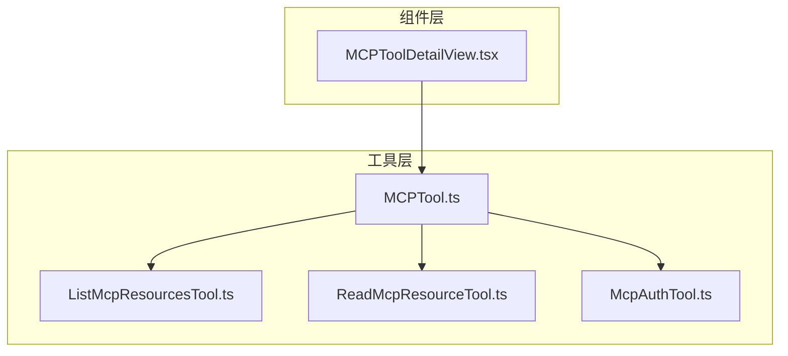
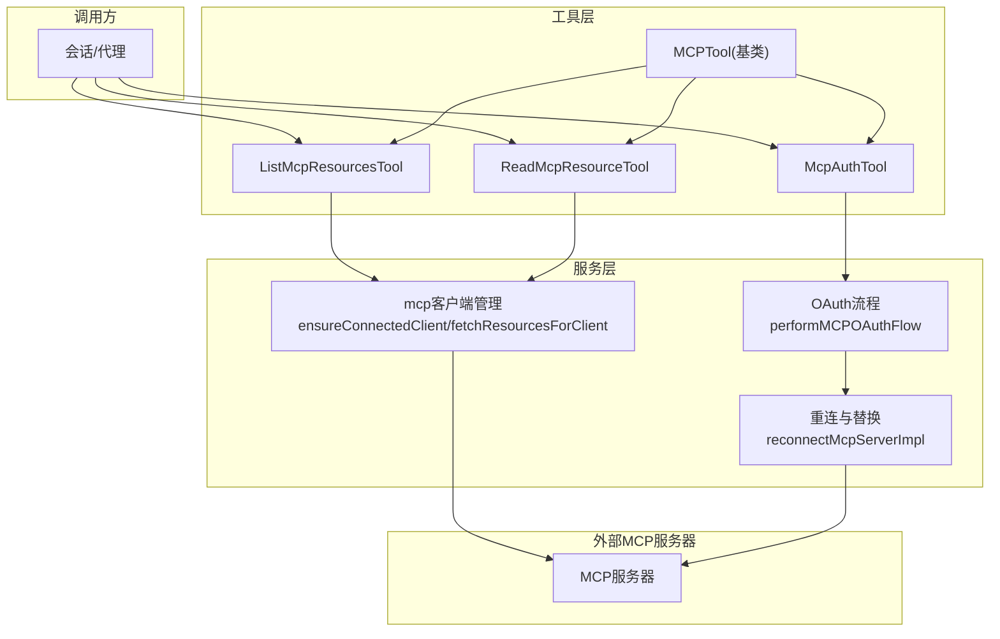
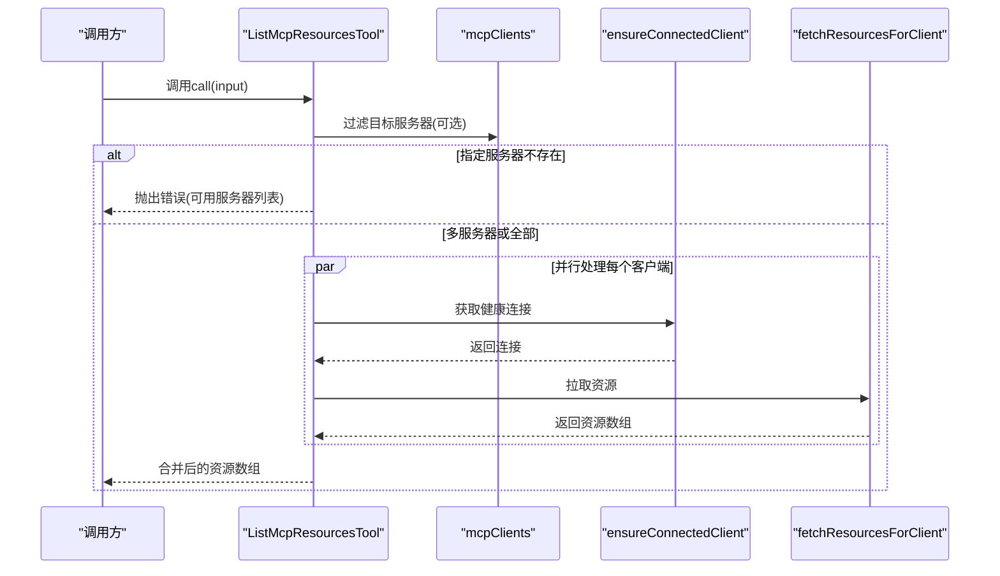
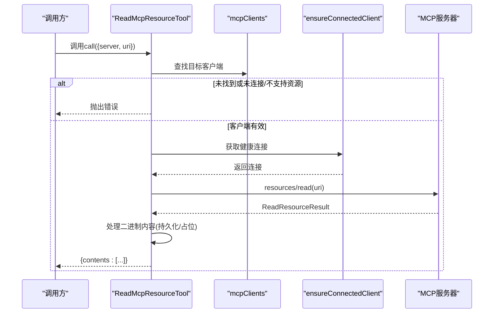
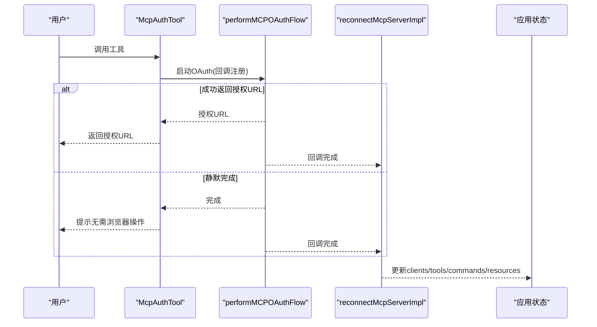
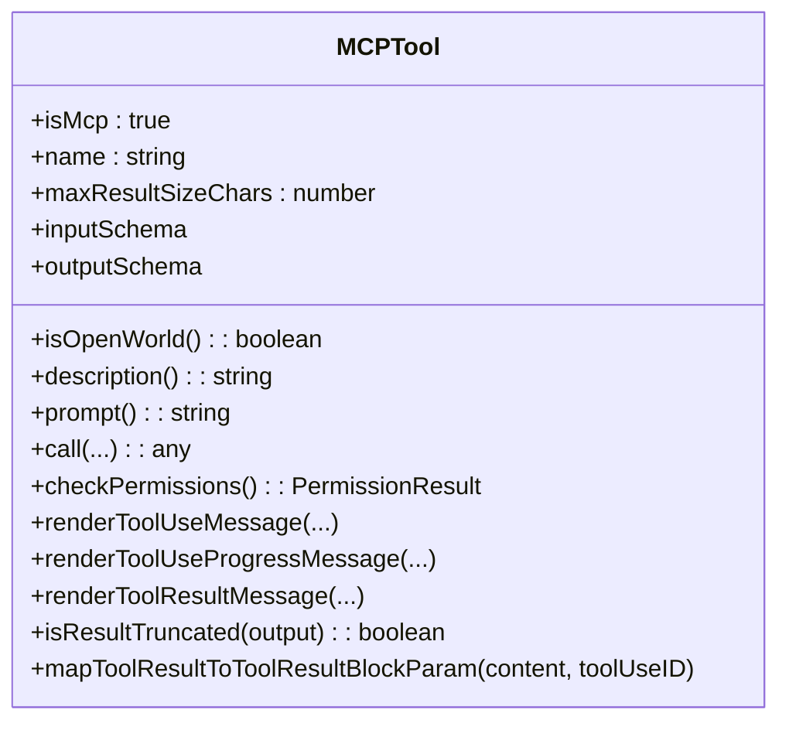
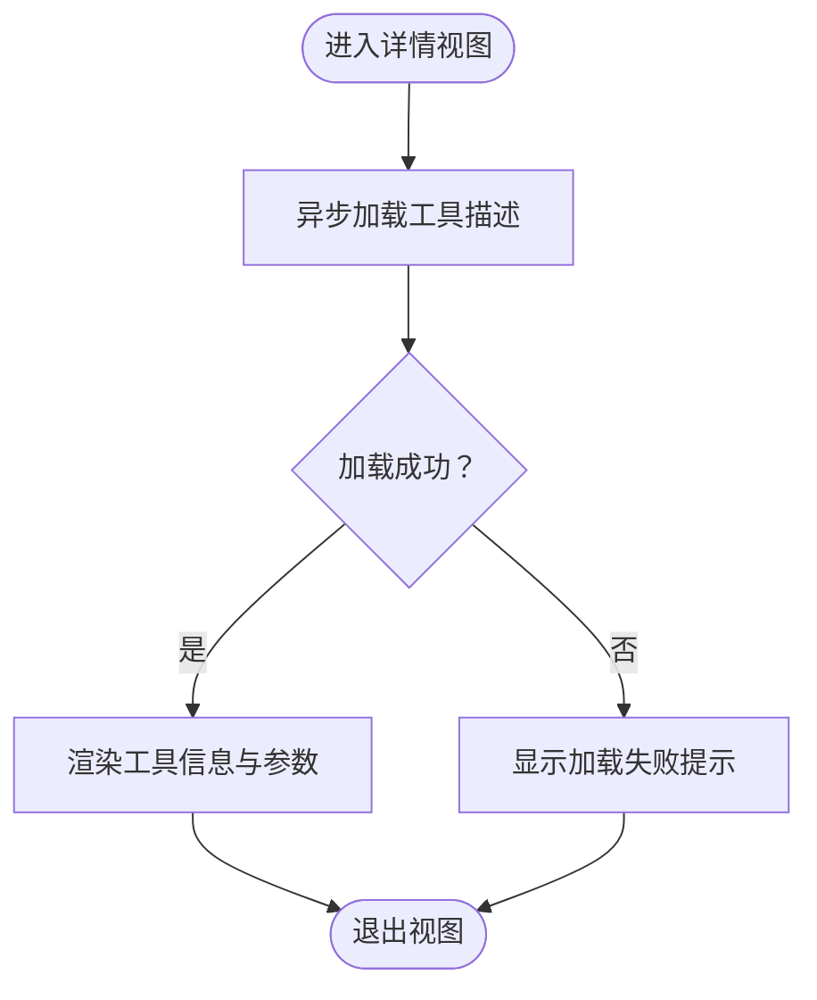
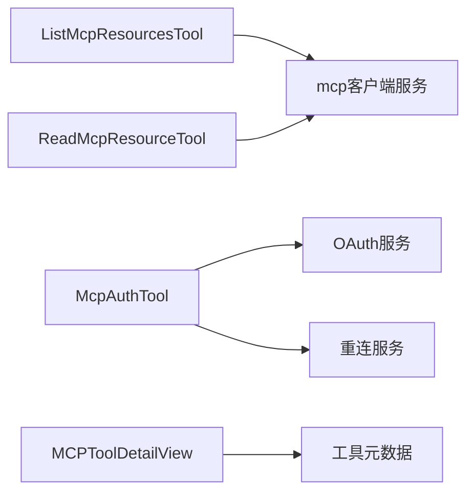

# MCP集成工具

<cite>
**本文档引用的文件**
- [src/tools/MCPTool/MCPTool.ts](file://src/tools/MCPTool/MCPTool.ts)
- [src/tools/ListMcpResourcesTool/ListMcpResourcesTool.ts](file://src/tools/ListMcpResourcesTool/ListMcpResourcesTool.ts)
- [src/tools/ReadMcpResourceTool/ReadMcpResourceTool.ts](file://src/tools/ReadMcpResourceTool/ReadMcpResourceTool.ts)
- [src/tools/McpAuthTool/McpAuthTool.ts](file://src/tools/McpAuthTool/McpAuthTool.ts)
- [src/components/mcp/MCPToolDetailView.tsx](file://src/components/mcp/MCPToolDetailView.tsx)
</cite>

## 目录
1. [简介](#简介)
2. [项目结构](#项目结构)
3. [核心组件](#核心组件)
4. [架构总览](#架构总览)
5. [详细组件分析](#详细组件分析)
6. [依赖关系分析](#依赖关系分析)
7. [性能考虑](#性能考虑)
8. [故障排除指南](#故障排除指南)
9. [结论](#结论)
10. [附录](#附录)

## 简介
本文件面向Claude Code系统中的MCP（Model Context Protocol）集成工具，系统性梳理MCP服务器连接、资源访问、权限验证与错误处理等能力，并深入解析以下核心工具的实现与交互：
- ListMcpResourcesTool：列举已连接MCP服务器提供的资源清单
- ReadMcpResourceTool：按URI读取指定资源内容，支持文本与二进制内容处理
- McpAuthTool：封装MCP服务器的认证流程，支持OAuth授权与工具替换
- MCPTool：MCP工具的通用基类定义与渲染接口

同时，文档阐述MCP工具与Claude Code系统的集成方式、通信协议要点以及开发与使用最佳实践。

## 项目结构
MCP相关代码主要分布在以下位置：
- 工具层：src/tools 下的各MCP工具实现
- 组件层：src/components/mcp 下的UI展示组件
- 服务层：src/services/mcp 下的客户端与认证逻辑（在工具中通过导入使用）

**图表来源**
- [src/tools/MCPTool/MCPTool.ts:1-78](file://src/tools/MCPTool/MCPTool.ts#L1-L78)
- [src/tools/ListMcpResourcesTool/ListMcpResourcesTool.ts:1-124](file://src/tools/ListMcpResourcesTool/ListMcpResourcesTool.ts#L1-L124)
- [src/tools/ReadMcpResourceTool/ReadMcpResourceTool.ts:1-159](file://src/tools/ReadMcpResourceTool/ReadMcpResourceTool.ts#L1-L159)
- [src/tools/McpAuthTool/McpAuthTool.ts:1-216](file://src/tools/McpAuthTool/McpAuthTool.ts#L1-L216)
- [src/components/mcp/MCPToolDetailView.tsx:1-212](file://src/components/mcp/MCPToolDetailView.tsx#L1-L212)

**章节来源**
- [src/tools/MCPTool/MCPTool.ts:1-78](file://src/tools/MCPTool/MCPTool.ts#L1-L78)
- [src/tools/ListMcpResourcesTool/ListMcpResourcesTool.ts:1-124](file://src/tools/ListMcpResourcesTool/ListMcpResourcesTool.ts#L1-L124)
- [src/tools/ReadMcpResourceTool/ReadMcpResourceTool.ts:1-159](file://src/tools/ReadMcpResourceTool/ReadMcpResourceTool.ts#L1-L159)
- [src/tools/McpAuthTool/McpAuthTool.ts:1-216](file://src/tools/McpAuthTool/McpAuthTool.ts#L1-L216)
- [src/components/mcp/MCPToolDetailView.tsx:1-212](file://src/components/mcp/MCPToolDetailView.tsx#L1-L212)

## 核心组件
本节概述MCP工具的核心职责与通用能力：
- 通用基类MCPTool：定义MCP工具的输入输出模式、权限检查、渲染接口与结果截断判定
- 资源枚举工具ListMcpResourcesTool：对已连接的MCP客户端进行并行资源拉取，具备LRU缓存与健康检查
- 资源读取工具ReadMcpResourceTool：按URI请求资源，处理文本与二进制内容，支持持久化与占位提示
- 认证工具McpAuthTool：针对未认证的MCP服务器生成伪工具，触发OAuth流程并在完成后自动替换真实工具

**章节来源**
- [src/tools/MCPTool/MCPTool.ts:27-77](file://src/tools/MCPTool/MCPTool.ts#L27-L77)
- [src/tools/ListMcpResourcesTool/ListMcpResourcesTool.ts:40-123](file://src/tools/ListMcpResourcesTool/ListMcpResourcesTool.ts#L40-L123)
- [src/tools/ReadMcpResourceTool/ReadMcpResourceTool.ts:49-158](file://src/tools/ReadMcpResourceTool/ReadMcpResourceTool.ts#L49-L158)
- [src/tools/McpAuthTool/McpAuthTool.ts:49-215](file://src/tools/McpAuthTool/McpAuthTool.ts#L49-L215)

## 架构总览
MCP工具在Claude Code中的运行时架构如下：
- 工具调用入口：工具通过统一的buildTool构建，遵循ToolDef接口
- 客户端管理：工具从上下文获取mcpClients，按服务器名称筛选或全量处理
- 连接与缓存：ensureConnectedClient负责健康检查与重连；fetchResourcesForClient提供LRU缓存
- 资源读取：ReadMcpResourceTool直接向MCP服务器发起resources/read请求
- 认证流程：McpAuthTool触发performMCPOAuthFlow，完成后通过状态更新替换工具集

**图表来源**
- [src/tools/ListMcpResourcesTool/ListMcpResourcesTool.ts:66-101](file://src/tools/ListMcpResourcesTool/ListMcpResourcesTool.ts#L66-L101)
- [src/tools/ReadMcpResourceTool/ReadMcpResourceTool.ts:75-101](file://src/tools/ReadMcpResourceTool/ReadMcpResourceTool.ts#L75-L101)
- [src/tools/McpAuthTool/McpAuthTool.ts:126-172](file://src/tools/McpAuthTool/McpAuthTool.ts#L126-L172)

## 详细组件分析

### ListMcpResourcesTool 实现分析
该工具用于列举MCP服务器资源，具备以下特性：
- 输入参数：可选server过滤器，仅对指定服务器执行
- 输出结构：包含uri、name、mimeType、description、server等字段
- 并发策略：对多个客户端并行执行，使用Promise.all
- 健康与缓存：ensureConnectedClient在健康时复用连接，失败时重建；fetchResourcesForClient带LRU缓存，基于服务器名缓存，关闭或资源变更通知时失效
- 错误处理：单个服务器异常不影响整体结果，记录日志并返回空数组

**图表来源**
- [src/tools/ListMcpResourcesTool/ListMcpResourcesTool.ts:66-101](file://src/tools/ListMcpResourcesTool/ListMcpResourcesTool.ts#L66-L101)

**章节来源**
- [src/tools/ListMcpResourcesTool/ListMcpResourcesTool.ts:15-38](file://src/tools/ListMcpResourcesTool/ListMcpResourcesTool.ts#L15-L38)
- [src/tools/ListMcpResourcesTool/ListMcpResourcesTool.ts:66-101](file://src/tools/ListMcpResourcesTool/ListMcpResourcesTool.ts#L66-L101)

### ReadMcpResourceTool 实现分析
该工具用于读取指定URI的资源内容，支持文本与二进制：
- 输入参数：server（服务器名称）、uri（资源URI）
- 连接校验：确保客户端已连接且具备resources能力
- 请求协议：直接调用MCP的resources/read方法
- 内容处理：对二进制内容进行base64解码，写入磁盘并返回保存路径；文本内容直接返回
- 输出结构：包含uri、mimeType、text或blobSavedTo字段

**图表来源**
- [src/tools/ReadMcpResourceTool/ReadMcpResourceTool.ts:75-144](file://src/tools/ReadMcpResourceTool/ReadMcpResourceTool.ts#L75-L144)

**章节来源**
- [src/tools/ReadMcpResourceTool/ReadMcpResourceTool.ts:22-47](file://src/tools/ReadMcpResourceTool/ReadMcpResourceTool.ts#L22-L47)
- [src/tools/ReadMcpResourceTool/ReadMcpResourceTool.ts:75-144](file://src/tools/ReadMcpResourceTool/ReadMcpResourceTool.ts#L75-L144)

### McpAuthTool 认证流程与安全机制
该工具用于为未认证的MCP服务器启动OAuth流程：
- 触发条件：当服务器安装但需要认证时，系统生成伪工具替代真实工具
- 支持传输：仅对sse/http类型服务器支持OAuth触发
- 流程控制：通过performMCPOAuthFlow启动OAuth，捕获授权URL或静默完成
- 自动替换：OAuth完成后清理认证缓存、重新连接并替换工具集，移除伪工具
- 错误处理：记录失败原因并提示用户手动认证

**图表来源**
- [src/tools/McpAuthTool/McpAuthTool.ts:126-172](file://src/tools/McpAuthTool/McpAuthTool.ts#L126-L172)
- [src/tools/McpAuthTool/McpAuthTool.ts:138-172](file://src/tools/McpAuthTool/McpAuthTool.ts#L138-L172)

**章节来源**
- [src/tools/McpAuthTool/McpAuthTool.ts:32-56](file://src/tools/McpAuthTool/McpAuthTool.ts#L32-L56)
- [src/tools/McpAuthTool/McpAuthTool.ts:82-108](file://src/tools/McpAuthTool/McpAuthTool.ts#L82-L108)
- [src/tools/McpAuthTool/McpAuthTool.ts:126-172](file://src/tools/McpAuthTool/McpAuthTool.ts#L126-L172)

### MCPTool 通用基类与UI渲染
MCPTool作为通用基类，提供：
- 输入/输出模式：使用lazySchema定义宽松输入与字符串输出
- 权限检查：默认采用“透传”策略，具体权限由上层决定
- 渲染接口：提供工具使用消息、进度消息与结果消息的渲染函数
- 结果截断：根据终端截断规则判断输出是否截断
- 工具结果映射：将工具输出映射为消息块参数

**图表来源**
- [src/tools/MCPTool/MCPTool.ts:27-77](file://src/tools/MCPTool/MCPTool.ts#L27-L77)

**章节来源**
- [src/tools/MCPTool/MCPTool.ts:13-25](file://src/tools/MCPTool/MCPTool.ts#L13-L25)
- [src/tools/MCPTool/MCPTool.ts:56-77](file://src/tools/MCPTool/MCPTool.ts#L56-L77)

### MCP工具UI详情视图
MCPToolDetailView用于展示工具的详细信息，包括：
- 显示名称与分类标签（只读/破坏性/开放世界）
- 工具描述加载与显示
- 参数Schema展示（含必填标记与描述）

**图表来源**
- [src/components/mcp/MCPToolDetailView.tsx:68-97](file://src/components/mcp/MCPToolDetailView.tsx#L68-L97)

**章节来源**
- [src/components/mcp/MCPToolDetailView.tsx:14-97](file://src/components/mcp/MCPToolDetailView.tsx#L14-L97)

## 依赖关系分析
- 工具到服务层：ListMcpResourcesTool与ReadMcpResourceTool均依赖mcp客户端管理模块（ensureConnectedClient、fetchResourcesForClient），体现“连接-缓存-请求”的分层
- 工具到认证服务：McpAuthTool依赖OAuth流程与重连逻辑，完成认证后替换工具集合
- 工具到UI：MCPToolDetailView依赖工具元数据与渲染接口，用于展示工具属性与参数

**图表来源**
- [src/tools/ListMcpResourcesTool/ListMcpResourcesTool.ts:3-5](file://src/tools/ListMcpResourcesTool/ListMcpResourcesTool.ts#L3-L5)
- [src/tools/ReadMcpResourceTool/ReadMcpResourceTool.ts:6-7](file://src/tools/ReadMcpResourceTool/ReadMcpResourceTool.ts#L6-L7)
- [src/tools/McpAuthTool/McpAuthTool.ts:3-7](file://src/tools/McpAuthTool/McpAuthTool.ts#L3-L7)

**章节来源**
- [src/tools/ListMcpResourcesTool/ListMcpResourcesTool.ts:3-5](file://src/tools/ListMcpResourcesTool/ListMcpResourcesTool.ts#L3-L5)
- [src/tools/ReadMcpResourceTool/ReadMcpResourceTool.ts:6-7](file://src/tools/ReadMcpResourceTool/ReadMcpResourceTool.ts#L6-L7)
- [src/tools/McpAuthTool/McpAuthTool.ts:3-7](file://src/tools/McpAuthTool/McpAuthTool.ts#L3-L7)

## 性能考虑
- 并发与缓存：ListMcpResourcesTool对多服务器并行处理，结合LRU缓存减少重复请求，提升响应速度
- 健康检查：ensureConnectedClient在健康状态下复用连接，避免频繁重建
- 输出截断：通过终端截断规则判断输出长度，防止超大结果影响会话性能
- 二进制处理：ReadMcpResourceTool对二进制内容进行持久化存储，避免将大体积base64字符串写入上下文

[本节为通用性能建议，不直接分析具体文件]

## 故障排除指南
- 服务器未找到或未连接：检查mcpClients配置与连接状态，确认server名称正确
- 服务器不支持资源能力：确认目标服务器capabilities包含resources
- OAuth流程失败：查看日志中的错误信息，确认传输类型为sse/http，必要时引导用户手动认证
- 缓存失效：当服务器关闭或资源变更时，缓存会自动失效，工具会重新拉取最新资源

**章节来源**
- [src/tools/ListMcpResourcesTool/ListMcpResourcesTool.ts:73-77](file://src/tools/ListMcpResourcesTool/ListMcpResourcesTool.ts#L73-L77)
- [src/tools/ReadMcpResourceTool/ReadMcpResourceTool.ts:80-92](file://src/tools/ReadMcpResourceTool/ReadMcpResourceTool.ts#L80-L92)
- [src/tools/McpAuthTool/McpAuthTool.ts:167-172](file://src/tools/McpAuthTool/McpAuthTool.ts#L167-L172)

## 结论
MCP集成工具在Claude Code中提供了完整的资源枚举、内容读取与认证能力。通过并行处理、LRU缓存与健康检查，工具在保证稳定性的同时提升了性能。McpAuthTool实现了从伪工具到真实工具的无缝替换，优化了用户体验。UI组件则帮助用户理解工具属性与参数，增强可发现性与可操作性。

[本节为总结性内容，不直接分析具体文件]

## 附录
- 开发最佳实践
  - 在工具中优先使用ensureConnectedClient与LRU缓存，避免重复连接与请求
  - 对二进制内容进行持久化存储，减少上下文体积
  - 使用统一的错误处理与日志记录，便于问题定位
  - 在UI中清晰展示工具属性与参数，提升可发现性
- 使用最佳实践
  - 先使用ListMcpResourcesTool枚举资源，再用ReadMcpResourceTool读取具体内容
  - 对于未认证服务器，优先通过McpAuthTool触发OAuth流程
  - 注意工具的并发安全与只读属性，合理选择工具调用策略

[本节为通用指导，不直接分析具体文件]