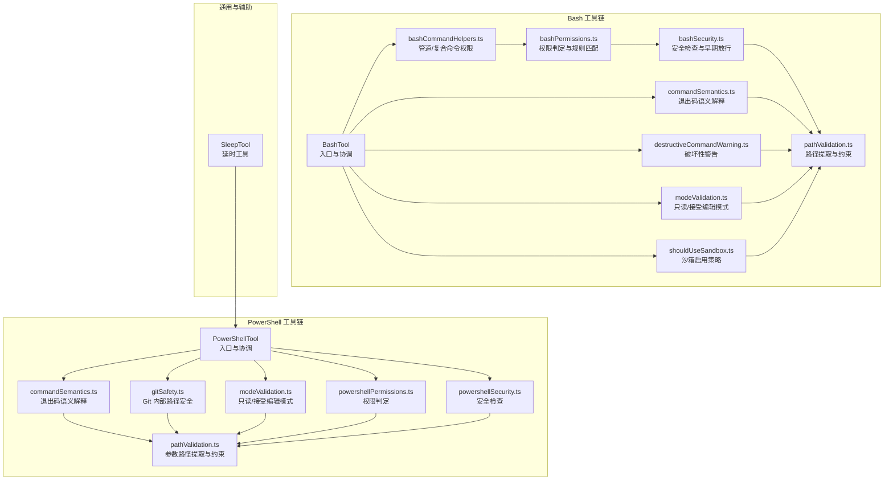
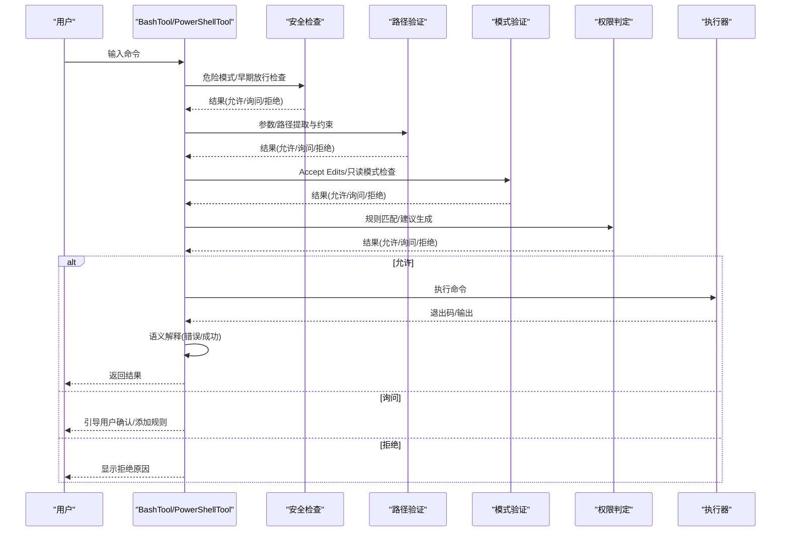
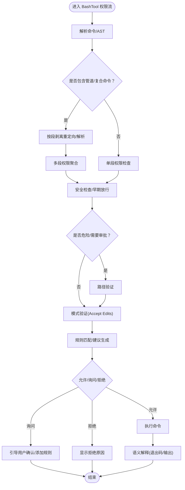
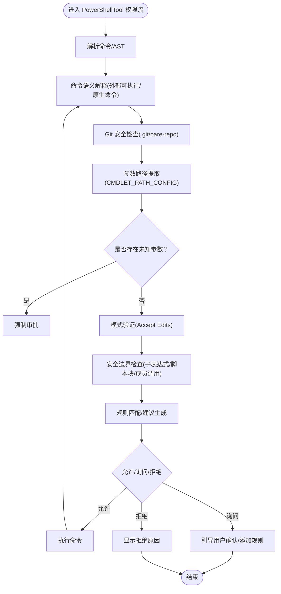
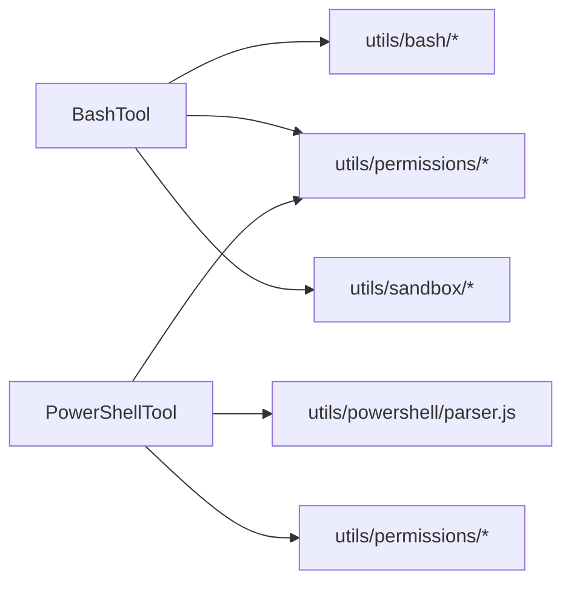

# Shell执行工具

<cite>
**本文档引用的文件**
- [bashCommandHelpers.ts](file://src/tools/BashTool/bashCommandHelpers.ts)
- [bashPermissions.ts](file://src/tools/BashTool/bashPermissions.ts)
- [bashSecurity.ts](file://src/tools/BashTool/bashSecurity.ts)
- [commandSemantics.ts](file://src/tools/BashTool/commandSemantics.ts)
- [destructiveCommandWarning.ts](file://src/tools/BashTool/destructiveCommandWarning.ts)
- [modeValidation.ts](file://src/tools/BashTool/modeValidation.ts)
- [pathValidation.ts](file://src/tools/BashTool/pathValidation.ts)
- [sedEditParser.ts](file://src/tools/BashTool/sedEditParser.ts)
- [sedValidation.ts](file://src/tools/BashTool/sedValidation.ts)
- [shouldUseSandbox.ts](file://src/tools/BashTool/shouldUseSandbox.ts)
- [prompt.ts](file://src/tools/BashTool/prompt.ts)
- [toolName.ts](file://src/tools/BashTool/toolName.ts)
- [utils.ts](file://src/tools/BashTool/utils.ts)
- [commentLabel.ts](file://src/tools/BashTool/commentLabel.ts)
- [clmTypes.ts](file://src/tools/PowerShellTool/clmTypes.ts)
- [commandSemantics.ts](file://src/tools/PowerShellTool/commandSemantics.ts)
- [destructiveCommandWarning.ts](file://src/tools/PowerShellTool/destructiveCommandWarning.ts)
- [gitSafety.ts](file://src/tools/PowerShellTool/gitSafety.ts)
- [modeValidation.ts](file://src/tools/PowerShellTool/modeValidation.ts)
- [pathValidation.ts](file://src/tools/PowerShellTool/pathValidation.ts)
- [commonParameters.ts](file://src/tools/PowerShellTool/commonParameters.ts)
- [powershellPermissions.ts](file://src/tools/PowerShellTool/powershellPermissions.ts)
- [powershellSecurity.ts](file://src/tools/PowerShellTool/powershellSecurity.ts)
- [prompt.ts](file://src/tools/PowerShellTool/prompt.ts)
- [toolName.ts](file://src/tools/PowerShellTool/toolName.ts)
- [prompt.ts](file://src/tools/SleepTool/prompt.ts)
</cite>

## 目录
1. [简介](#简介)
2. [项目结构](#项目结构)
3. [核心组件](#核心组件)
4. [架构总览](#架构总览)
5. [详细组件分析](#详细组件分析)
6. [依赖关系分析](#依赖关系分析)
7. [性能考虑](#性能考虑)
8. [故障排除指南](#故障排除指南)
9. [结论](#结论)
10. [附录](#附录)

## 简介
本文件系统性梳理 Claude Code 的 Shell 执行工具，重点覆盖 BashTool 与 PowerShellTool 的实现细节与安全机制，并补充 SleepTool 的实现说明。内容涵盖命令解析、参数验证、破坏性操作警告、只读模式限制、沙箱机制、命令语义分析、Git 安全检查、危险命令防护、权限验证、输出处理、错误捕获、超时控制等通用能力，以及安全最佳实践与权限控制策略。

## 项目结构
- BashTool：面向 Bash 的命令执行与安全校验，包含命令解析、权限判定、路径约束、破坏性警告、只读模式、沙箱策略等模块化文件。
- PowerShellTool：面向 PowerShell 的命令执行与安全校验，包含命令语义、Git 安全、路径验证、只读模式、危险命令防护等模块化文件。
- SleepTool：轻量级工具，用于延时等待，便于流程编排与调试。

图表来源
- [bashCommandHelpers.ts:1-266](file://src/tools/BashTool/bashCommandHelpers.ts#L1-L266)
- [bashPermissions.ts:1-2622](file://src/tools/BashTool/bashPermissions.ts#L1-L2622)
- [bashSecurity.ts:1-2593](file://src/tools/BashTool/bashSecurity.ts#L1-L2593)
- [commandSemantics.ts:1-141](file://src/tools/BashTool/commandSemantics.ts#L1-L141)
- [destructiveCommandWarning.ts:1-103](file://src/tools/BashTool/destructiveCommandWarning.ts#L1-L103)
- [modeValidation.ts:1-116](file://src/tools/BashTool/modeValidation.ts#L1-L116)
- [pathValidation.ts:1-1304](file://src/tools/BashTool/pathValidation.ts#L1-L1304)
- [shouldUseSandbox.ts](file://src/tools/BashTool/shouldUseSandbox.ts)
- [commandSemantics.ts:1-143](file://src/tools/PowerShellTool/commandSemantics.ts#L1-L143)
- [gitSafety.ts:1-177](file://src/tools/PowerShellTool/gitSafety.ts#L1-L177)
- [modeValidation.ts:1-405](file://src/tools/PowerShellTool/modeValidation.ts#L1-L405)
- [pathValidation.ts:1-2050](file://src/tools/PowerShellTool/pathValidation.ts#L1-L2050)
- [powershellPermissions.ts](file://src/tools/PowerShellTool/powershellPermissions.ts)
- [powershellSecurity.ts](file://src/tools/PowerShellTool/powershellSecurity.ts)
- [prompt.ts](file://src/tools/SleepTool/prompt.ts)

章节来源
- [bashCommandHelpers.ts:1-266](file://src/tools/BashTool/bashCommandHelpers.ts#L1-L266)
- [bashPermissions.ts:1-2622](file://src/tools/BashTool/bashPermissions.ts#L1-L2622)
- [bashSecurity.ts:1-2593](file://src/tools/BashTool/bashSecurity.ts#L1-L2593)
- [commandSemantics.ts:1-141](file://src/tools/BashTool/commandSemantics.ts#L1-L141)
- [destructiveCommandWarning.ts:1-103](file://src/tools/BashTool/destructiveCommandWarning.ts#L1-L103)
- [modeValidation.ts:1-116](file://src/tools/BashTool/modeValidation.ts#L1-L116)
- [pathValidation.ts:1-1304](file://src/tools/BashTool/pathValidation.ts#L1-L1304)
- [shouldUseSandbox.ts](file://src/tools/BashTool/shouldUseSandbox.ts)
- [commandSemantics.ts:1-143](file://src/tools/PowerShellTool/commandSemantics.ts#L1-L143)
- [gitSafety.ts:1-177](file://src/tools/PowerShellTool/gitSafety.ts#L1-L177)
- [modeValidation.ts:1-405](file://src/tools/PowerShellTool/modeValidation.ts#L1-L405)
- [pathValidation.ts:1-2050](file://src/tools/PowerShellTool/pathValidation.ts#L1-L2050)
- [powershellPermissions.ts](file://src/tools/PowerShellTool/powershellPermissions.ts)
- [powershellSecurity.ts](file://src/tools/PowerShellTool/powershellSecurity.ts)
- [prompt.ts](file://src/tools/SleepTool/prompt.ts)

## 核心组件
- BashTool
  - 命令解析与权限：支持管道/复合命令拆分、段落权限聚合、重定向剥离、AST 预解析优化。
  - 安全检查：早期放行（安全 heredoc 替换）、危险模式检测、Zsh 特殊命令阻断、Git 提交消息校验等。
  - 路径验证：针对 rm/rmdir 的危险路径阻断、POSIX 双破折号处理、多命令路径提取与操作类型映射。
  - 模式验证：Accept Edits 模式下自动允许部分文件系统写入命令。
  - 破坏性警告：对 git/reset/push/clean 等高危命令给出提示。
  - 沙箱策略：根据命令特征与上下文决定是否启用沙箱。
- PowerShellTool
  - 命令语义：针对外部可执行（如 grep/robocopy）与 PowerShell 原生命令区分退出码语义。
  - Git 安全：规范化路径、识别 .git/ 与 bare-repo 风险、解决相对路径逃逸与驱动器前缀问题。
  - 路径验证：基于 AST 的参数路径提取、已知参数白名单、未知参数强制审批、写入/读取操作类型判定。
  - 模式验证：Accept Edits 模式下的安全边界检查（子表达式、脚本块、成员调用、变量参数等）。
  - 权限与安全：结合权限规则与安全检查，阻断危险参数组合与表达式注入。
- SleepTool
  - 提供延时等待能力，便于任务编排与调试。

章节来源
- [bashCommandHelpers.ts:1-266](file://src/tools/BashTool/bashCommandHelpers.ts#L1-L266)
- [bashPermissions.ts:1-2622](file://src/tools/BashTool/bashPermissions.ts#L1-L2622)
- [bashSecurity.ts:1-2593](file://src/tools/BashTool/bashSecurity.ts#L1-L2593)
- [pathValidation.ts:1-1304](file://src/tools/BashTool/pathValidation.ts#L1-L1304)
- [modeValidation.ts:1-116](file://src/tools/BashTool/modeValidation.ts#L1-L116)
- [destructiveCommandWarning.ts:1-103](file://src/tools/BashTool/destructiveCommandWarning.ts#L1-L103)
- [shouldUseSandbox.ts](file://src/tools/BashTool/shouldUseSandbox.ts)
- [commandSemantics.ts:1-143](file://src/tools/PowerShellTool/commandSemantics.ts#L1-L143)
- [gitSafety.ts:1-177](file://src/tools/PowerShellTool/gitSafety.ts#L1-L177)
- [pathValidation.ts:1-2050](file://src/tools/PowerShellTool/pathValidation.ts#L1-L2050)
- [modeValidation.ts:1-405](file://src/tools/PowerShellTool/modeValidation.ts#L1-L405)
- [powershellPermissions.ts](file://src/tools/PowerShellTool/powershellPermissions.ts)
- [powershellSecurity.ts](file://src/tools/PowerShellTool/powershellSecurity.ts)
- [prompt.ts](file://src/tools/SleepTool/prompt.ts)

## 架构总览
BashTool 与 PowerShellTool 共享统一的权限框架与安全检查流程，分别在各自语言生态内进行 AST 解析、参数提取与路径验证。两者均支持：
- 命令语义解释：根据退出码与标准输出/错误输出判断“是否错误”。
- 破坏性警告：对高风险命令给出提示信息。
- 模式验证：在特定模式下放宽或收紧策略。
- 路径验证：确保文件操作仅作用于允许的工作目录范围内。
- 沙箱策略：在必要时启用隔离执行环境。

图表来源
- [bashSecurity.ts:1-2593](file://src/tools/BashTool/bashSecurity.ts#L1-L2593)
- [pathValidation.ts:1-1304](file://src/tools/BashTool/pathValidation.ts#L1-L1304)
- [modeValidation.ts:1-116](file://src/tools/BashTool/modeValidation.ts#L1-L116)
- [bashPermissions.ts:1-2622](file://src/tools/BashTool/bashPermissions.ts#L1-L2622)
- [commandSemantics.ts:1-141](file://src/tools/BashTool/commandSemantics.ts#L1-L141)
- [gitSafety.ts:1-177](file://src/tools/PowerShellTool/gitSafety.ts#L1-L177)
- [pathValidation.ts:1-2050](file://src/tools/PowerShellTool/pathValidation.ts#L1-L2050)
- [modeValidation.ts:1-405](file://src/tools/PowerShellTool/modeValidation.ts#L1-L405)
- [commandSemantics.ts:1-143](file://src/tools/PowerShellTool/commandSemantics.ts#L1-L143)

## 详细组件分析

### BashTool 组件分析
- 命令解析与权限聚合
  - 支持管道/复合命令拆分，逐段进行权限检查；对输出重定向进行剥离以避免误判命令名。
  - 对跨段的 cd+git 组合进行特殊检测，防止裸仓库攻击绕过。
- 安全检查
  - heredoc 替换早期放行：严格匹配 cat <<'DELIM'...DELIM) 形态，剥离后二次验证。
  - Git 提交消息校验：阻断含命令替换的提交信息，检查剩余片段中的操作符与重定向。
  - Zsh 特殊命令阻断：zmodload、emulate 等高危命令直接拦截。
- 路径验证
  - rm/rmdir 危险路径阻断：对 /、/etc、/usr 等关键系统目录的递归删除进行强制审批。
  - POSIX 双破折号处理：正确解析 -- 之后的参数，避免路径提取被绕过。
  - 多命令路径提取：针对 find、grep、rg、sed、jq 等命令的参数位置进行精确提取。
- 模式验证
  - Accept Edits 模式：自动允许 mkdir/touch/rm/rmdir/mv/cp/sed 等文件系统命令。
- 破坏性警告
  - 针对 git reset --hard、git push --force、rm -rf 等高危命令给出提示。
- 沙箱策略
  - 根据命令特征与上下文决定是否启用沙箱，降低潜在破坏面。

图表来源
- [bashCommandHelpers.ts:1-266](file://src/tools/BashTool/bashCommandHelpers.ts#L1-L266)
- [bashSecurity.ts:1-2593](file://src/tools/BashTool/bashSecurity.ts#L1-L2593)
- [pathValidation.ts:1-1304](file://src/tools/BashTool/pathValidation.ts#L1-L1304)
- [modeValidation.ts:1-116](file://src/tools/BashTool/modeValidation.ts#L1-L116)
- [bashPermissions.ts:1-2622](file://src/tools/BashTool/bashPermissions.ts#L1-L2622)

章节来源
- [bashCommandHelpers.ts:1-266](file://src/tools/BashTool/bashCommandHelpers.ts#L1-L266)
- [bashSecurity.ts:1-2593](file://src/tools/BashTool/bashSecurity.ts#L1-L2593)
- [pathValidation.ts:1-1304](file://src/tools/BashTool/pathValidation.ts#L1-L1304)
- [modeValidation.ts:1-116](file://src/tools/BashTool/modeValidation.ts#L1-L116)
- [destructiveCommandWarning.ts:1-103](file://src/tools/BashTool/destructiveCommandWarning.ts#L1-L103)
- [shouldUseSandbox.ts](file://src/tools/BashTool/shouldUseSandbox.ts)

### PowerShellTool 组件分析
- 命令语义解释
  - 区分 PowerShell 原生命令与外部可执行：原生命令通过终止错误而非退出码表达失败；外部可执行（如 grep/robocopy）使用非零退出码传达信息。
- Git 安全
  - 规范化参数文本，识别 .git/ 与 bare-repo 风险路径，处理相对路径逃逸与驱动器前缀。
- 路径验证
  - 基于 AST 的参数路径提取，维护 cmdlet 参数配置表，严格区分 pathParams/knownSwitches/knownValueParams。
  - 未知参数强制审批，避免表达式注入与路径泄漏。
- 模式验证
  - Accept Edits 模式下，仅允许简单写入 cmdlet（如 Set-Content/Add-Content/Remove-Item/Clear-Content），并进行子表达式、脚本块、成员调用、变量参数等安全边界检查。
- 权限与安全
  - 结合权限规则与安全检查，阻断危险参数组合与表达式注入。

图表来源
- [commandSemantics.ts:1-143](file://src/tools/PowerShellTool/commandSemantics.ts#L1-L143)
- [gitSafety.ts:1-177](file://src/tools/PowerShellTool/gitSafety.ts#L1-L177)
- [pathValidation.ts:1-2050](file://src/tools/PowerShellTool/pathValidation.ts#L1-L2050)
- [modeValidation.ts:1-405](file://src/tools/PowerShellTool/modeValidation.ts#L1-L405)
- [powershellPermissions.ts](file://src/tools/PowerShellTool/powershellPermissions.ts)
- [powershellSecurity.ts](file://src/tools/PowerShellTool/powershellSecurity.ts)

章节来源
- [commandSemantics.ts:1-143](file://src/tools/PowerShellTool/commandSemantics.ts#L1-L143)
- [gitSafety.ts:1-177](file://src/tools/PowerShellTool/gitSafety.ts#L1-L177)
- [pathValidation.ts:1-2050](file://src/tools/PowerShellTool/pathValidation.ts#L1-L2050)
- [modeValidation.ts:1-405](file://src/tools/PowerShellTool/modeValidation.ts#L1-L405)
- [destructiveCommandWarning.ts:1-110](file://src/tools/PowerShellTool/destructiveCommandWarning.ts#L1-L110)
- [powershellPermissions.ts](file://src/tools/PowerShellTool/powershellPermissions.ts)
- [powershellSecurity.ts](file://src/tools/PowerShellTool/powershellSecurity.ts)

### 通用特性与工具
- 命令执行与输出处理
  - 通过语义解释模块将退出码与标准输出/错误输出转化为“是否错误”的结论，便于上层展示与后续处理。
- 错误捕获与超时控制
  - 在工具层提供统一的错误封装与超时控制接口，确保长时间运行命令不会阻塞系统。
- SleepTool
  - 提供延时等待能力，适用于流程编排与调试场景。

章节来源
- [commandSemantics.ts:1-141](file://src/tools/BashTool/commandSemantics.ts#L1-L141)
- [commandSemantics.ts:1-143](file://src/tools/PowerShellTool/commandSemantics.ts#L1-L143)
- [prompt.ts](file://src/tools/SleepTool/prompt.ts)

## 依赖关系分析
- BashTool 依赖
  - 命令解析与 AST：来自 utils/bash/*，支持树形结构分析与安全检查。
  - 权限规则：来自 utils/permissions/*，支持规则匹配、建议生成与决策理由。
  - 路径验证：来自 utils/permissions/pathValidation.js 与 filesystem.js，确保路径在允许范围内。
  - 沙箱：来自 utils/sandbox/*，在必要时启用隔离执行。
- PowerShellTool 依赖
  - AST 解析：来自 utils/powershell/parser.js，支持参数路径提取与安全边界检查。
  - 权限规则：同 BashTool。
  - 路径验证：来自 utils/permissions/*，结合 cmdlet 参数配置表进行参数级路径提取。

图表来源
- [bashPermissions.ts:1-2622](file://src/tools/BashTool/bashPermissions.ts#L1-L2622)
- [pathValidation.ts:1-1304](file://src/tools/BashTool/pathValidation.ts#L1-L1304)
- [modeValidation.ts:1-116](file://src/tools/BashTool/modeValidation.ts#L1-L116)
- [commandSemantics.ts:1-141](file://src/tools/BashTool/commandSemantics.ts#L1-L141)
- [gitSafety.ts:1-177](file://src/tools/PowerShellTool/gitSafety.ts#L1-L177)
- [pathValidation.ts:1-2050](file://src/tools/PowerShellTool/pathValidation.ts#L1-L2050)
- [modeValidation.ts:1-405](file://src/tools/PowerShellTool/modeValidation.ts#L1-L405)
- [commandSemantics.ts:1-143](file://src/tools/PowerShellTool/commandSemantics.ts#L1-L143)

章节来源
- [bashPermissions.ts:1-2622](file://src/tools/BashTool/bashPermissions.ts#L1-L2622)
- [pathValidation.ts:1-1304](file://src/tools/BashTool/pathValidation.ts#L1-L1304)
- [gitSafety.ts:1-177](file://src/tools/PowerShellTool/gitSafety.ts#L1-L177)
- [pathValidation.ts:1-2050](file://src/tools/PowerShellTool/pathValidation.ts#L1-L2050)

## 性能考虑
- 复合命令拆分上限：为避免 ReDoS 与事件循环饥饿，对复合命令拆分数量设置上限，超过阈值回退为“询问”。
- AST 预解析缓存：优先使用预解析 AST，减少重复解析成本。
- 分段权限聚合：对管道命令按段检查，避免一次性处理过多子命令导致的性能问题。
- 路径提取优化：针对常见命令（find/grep/rg/sed/jq）采用精确参数提取策略，减少无效路径扫描。

## 故障排除指南
- 命令被拒绝
  - 检查是否命中危险路径（如 rm -rf /），需手动审批。
  - 检查是否包含未知参数或表达式注入，需简化参数或改用安全形式。
  - 检查是否处于 Accept Edits 模式且涉及复杂写入命令，可能因安全边界未满足而被拒绝。
- 命令被要求审批
  - 查看“破坏性警告”提示，确认是否为预期行为。
  - 使用“添加规则”建议，将允许范围固化到会话或全局规则中。
- 语义解释异常
  - BashTool：默认仅 0 为成功，其他退出码视为错误。
  - PowerShellTool：区分原生命令与外部可执行，外部可执行（如 grep/robocopy）使用非零退出码传达信息，需参考对应语义解释模块。

章节来源
- [pathValidation.ts:1-1304](file://src/tools/BashTool/pathValidation.ts#L1-L1304)
- [destructiveCommandWarning.ts:1-103](file://src/tools/BashTool/destructiveCommandWarning.ts#L1-L103)
- [commandSemantics.ts:1-141](file://src/tools/BashTool/commandSemantics.ts#L1-L141)
- [pathValidation.ts:1-2050](file://src/tools/PowerShellTool/pathValidation.ts#L1-L2050)
- [commandSemantics.ts:1-143](file://src/tools/PowerShellTool/commandSemantics.ts#L1-L143)

## 结论
BashTool 与 PowerShellTool 在各自的 Shell 生态中实现了完善的命令解析、权限判定、路径验证与安全检查体系。通过模式验证、破坏性警告、沙箱策略与语义解释，系统在保证安全性的同时提供了灵活的用户体验。建议在生产环境中结合会话规则与模式策略，持续完善权限规则与安全检查，以应对不断演进的威胁面。

## 附录
- 安全最佳实践
  - 优先使用只读模式或 Accept Edits 模式进行受限操作，避免在默认模式下执行高风险命令。
  - 对包含管道、复合命令、heredoc、重定向的命令保持谨慎，必要时拆分为多个简单命令。
  - 启用并维护权限规则，将常用命令的允许范围固化，减少频繁审批。
  - 关注破坏性警告，对 git/reset/push/clean 等命令进行审慎评估。
- 权限控制策略
  - 使用“添加目录”与“读取规则”建议，将工作目录纳入允许范围。
  - 在沙箱启用策略允许的情况下，优先启用沙箱以降低破坏面。
  - 对 PowerShell 的未知参数与表达式注入保持高压态势，一律要求审批。