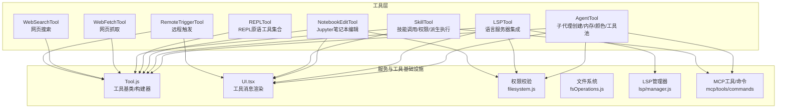
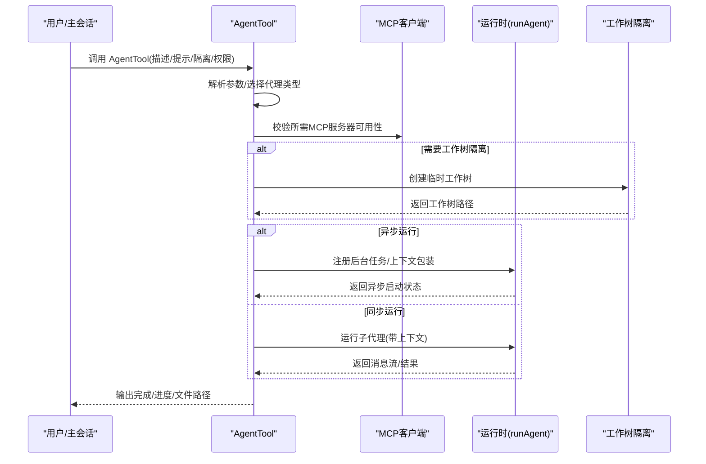
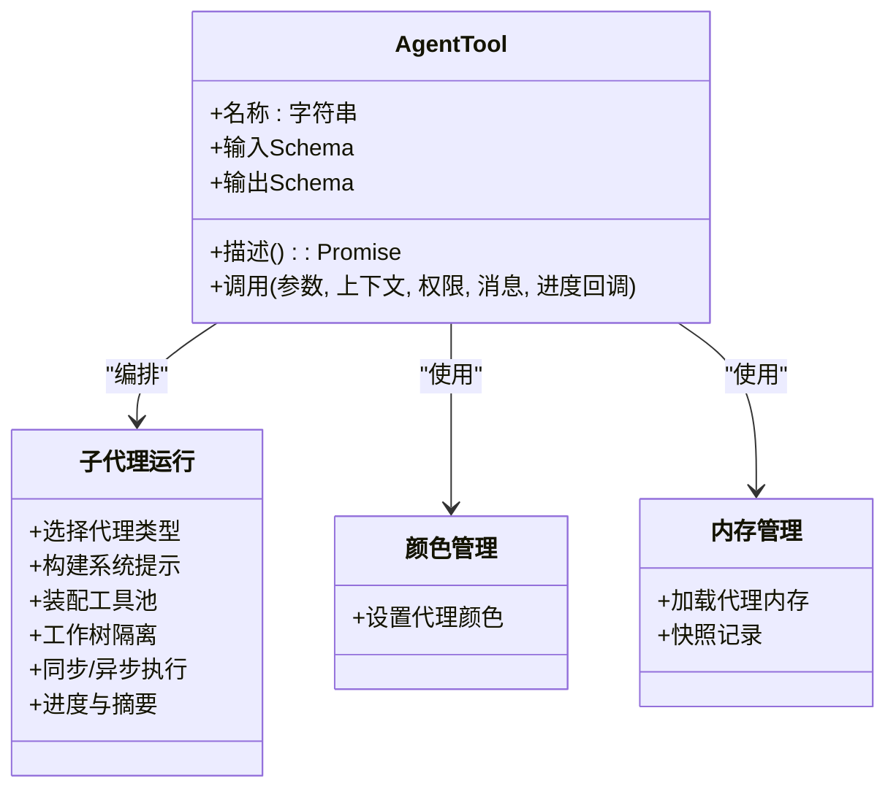
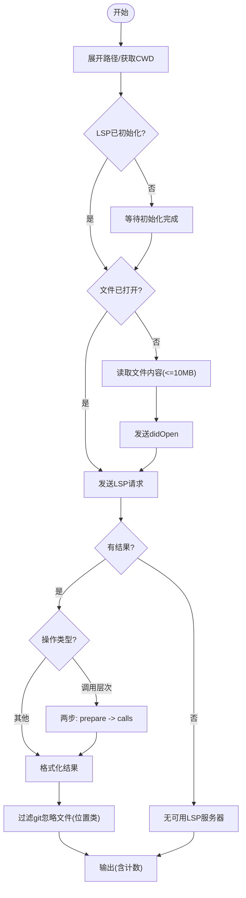
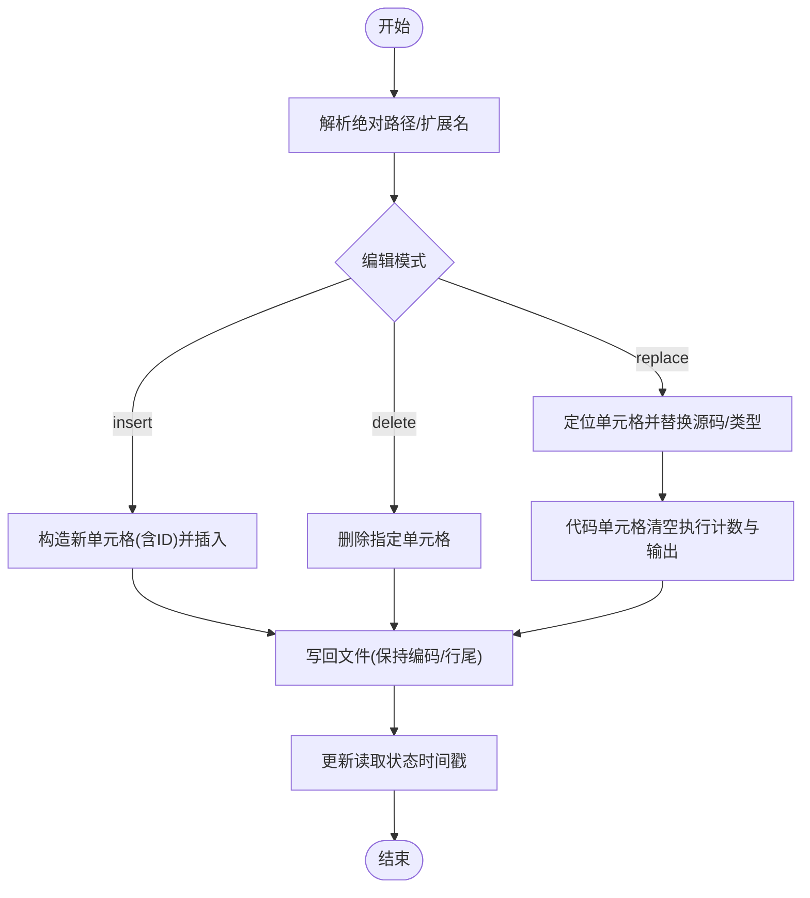
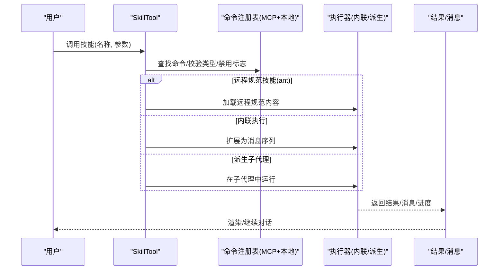
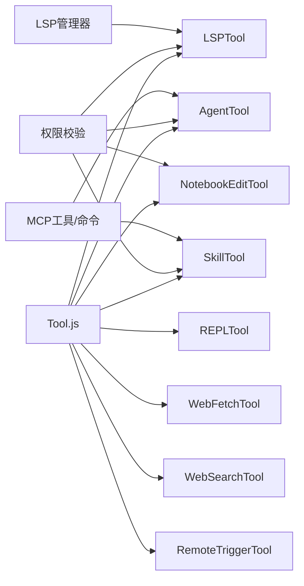

# 专用工具

<cite>
**本文引用的文件**
- [AgentTool.tsx](file://src/tools/AgentTool/AgentTool.tsx)
- [agentColorManager.ts](file://src/tools/AgentTool/agentColorManager.ts)
- [agentDisplay.ts](file://src/tools/AgentTool/agentDisplay.ts)
- [agentMemory.ts](file://src/tools/AgentTool/agentMemory.ts)
- [agentMemorySnapshot.ts](file://src/tools/AgentTool/agentMemorySnapshot.ts)
- [agentToolUtils.ts](file://src/tools/AgentTool/agentToolUtils.ts)
- [builtInAgents.ts](file://src/tools/AgentTool/builtInAgents.ts)
- [constants.ts](file://src/tools/AgentTool/constants.ts)
- [forkSubagent.ts](file://src/tools/AgentTool/forkSubagent.ts)
- [loadAgentsDir.ts](file://src/tools/AgentTool/loadAgentsDir.ts)
- [prompt.ts](file://src/tools/AgentTool/prompt.ts)
- [resumeAgent.ts](file://src/tools/AgentTool/resumeAgent.ts)
- [runAgent.ts](file://src/tools/AgentTool/runAgent.ts)
- [UI.tsx](file://src/tools/AgentTool/UI.tsx)
- [LSPTool.ts](file://src/tools/LSPTool/LSPTool.ts)
- [formatters.ts](file://src/tools/LSPTool/formatters.ts)
- [schemas.ts](file://src/tools/LSPTool/schemas.ts)
- [symbolContext.ts](file://src/tools/LSPTool/symbolContext.ts)
- [NotebookEditTool.ts](file://src/tools/NotebookEditTool/NotebookEditTool.ts)
- [constants.ts](file://src/tools/NotebookEditTool/constants.ts)
- [prompt.ts](file://src/tools/NotebookEditTool/prompt.ts)
- [UI.tsx](file://src/tools/NotebookEditTool/UI.tsx)
- [primitiveTools.ts](file://src/tools/REPLTool/primitiveTools.ts)
- [SkillTool.ts](file://src/tools/SkillTool/SkillTool.ts)
- [constants.ts](file://src/tools/SkillTool/constants.ts)
- [prompt.ts](file://src/tools/SkillTool/prompt.ts)
- [UI.tsx](file://src/tools/SkillTool/UI.tsx)
- [RemoteTriggerTool.ts](file://src/tools/RemoteTriggerTool/RemoteTriggerTool.ts)
- [UI.tsx](file://src/tools/RemoteTriggerTool/UI.tsx)
- [WebFetchTool.ts](file://src/tools/WebFetchTool/WebFetchTool.ts)
- [WebSearchTool.ts](file://src/tools/WebSearchTool/WebSearchTool.ts)
</cite>

## 目录
1. [简介](#简介)
2. [项目结构](#项目结构)
3. [核心组件](#核心组件)
4. [架构总览](#架构总览)
5. [详细组件分析](#详细组件分析)
6. [依赖关系分析](#依赖关系分析)
7. [性能考量](#性能考量)
8. [故障排查指南](#故障排查指南)
9. [结论](#结论)
10. [附录](#附录)

## 简介
本文件面向Claude Code的“专用工具”模块，系统性梳理并解释以下工具链路与能力：
- AgentTool：子代理架构（创建、内存管理、颜色标识、工具调用、工作树隔离、后台运行等）
- LSPTool：语言服务器协议集成（符号查找、跳转、悬停、文档/工作区符号、调用层次等）
- NotebookEditTool：Jupyter笔记本编辑（插入/替换/删除单元格、类型转换、执行计数清理）
- REPLTool：REPL交互式编程环境（内置原语工具集合）
- SkillTool：技能调用机制（本地/远程技能、权限规则、派生子代理执行）
- WebFetchTool/WebSearchTool：网络抓取与搜索
- RemoteTriggerTool：远程触发机制

目标是帮助开发者与使用者理解各工具的职责边界、数据流、错误处理与最佳实践。

## 项目结构
专用工具集中于 src/tools 下，按功能域分目录组织，每个工具均遵循统一的工具定义规范（buildTool），并提供输入/输出Schema、权限校验、UI渲染与结果映射等通用能力。

图表来源
- [AgentTool.tsx:196-238](file://src/tools/AgentTool/AgentTool.tsx#L196-L238)
- [LSPTool.ts:127-151](file://src/tools/LSPTool/LSPTool.ts#L127-L151)
- [NotebookEditTool.ts:90-132](file://src/tools/NotebookEditTool/NotebookEditTool.ts#L90-L132)
- [SkillTool.ts:331-340](file://src/tools/SkillTool/SkillTool.ts#L331-L340)
- [primitiveTools.ts:28-39](file://src/tools/REPLTool/primitiveTools.ts#L28-L39)

章节来源
- [AgentTool.tsx:196-238](file://src/tools/AgentTool/AgentTool.tsx#L196-L238)
- [LSPTool.ts:127-151](file://src/tools/LSPTool/LSPTool.ts#L127-L151)
- [NotebookEditTool.ts:90-132](file://src/tools/NotebookEditTool/NotebookEditTool.ts#L90-L132)
- [SkillTool.ts:331-340](file://src/tools/SkillTool/SkillTool.ts#L331-L340)
- [primitiveTools.ts:28-39](file://src/tools/REPLTool/primitiveTools.ts#L28-L39)

## 核心组件
- 工具基类与构建器：所有工具通过 buildTool 定义名称、描述、输入/输出Schema、权限检查、UI渲染与调用逻辑，确保一致的生命周期与可观测性。
- 权限与安全：工具在调用前进行权限校验（只读/可写、路径合法性、UNC路径防护、读写一致性检查等）。
- 结果映射与UI：工具将内部结果映射为消息块或UI提示，支持进度事件、拒绝/错误消息渲染。
- 并发与只读：部分工具声明并发安全或只读特性，便于调度与缓存策略优化。

章节来源
- [AgentTool.tsx:196-238](file://src/tools/AgentTool/AgentTool.tsx#L196-L238)
- [LSPTool.ts:127-151](file://src/tools/LSPTool/LSPTool.ts#L127-L151)
- [NotebookEditTool.ts:90-132](file://src/tools/NotebookEditTool/NotebookEditTool.ts#L90-L132)
- [SkillTool.ts:331-340](file://src/tools/SkillTool/SkillTool.ts#L331-L340)

## 架构总览
下图展示AgentTool作为“子代理编排器”的核心流程：从参数解析、权限与MCP校验、工作树隔离、到同步/异步执行与进度上报。

图表来源
- [AgentTool.tsx:239-567](file://src/tools/AgentTool/AgentTool.tsx#L239-L567)
- [AgentTool.tsx:568-800](file://src/tools/AgentTool/AgentTool.tsx#L568-L800)

章节来源
- [AgentTool.tsx:239-800](file://src/tools/AgentTool/AgentTool.tsx#L239-L800)

## 详细组件分析

### AgentTool：子代理架构
- 代理选择与过滤：根据MCP需求、权限规则与用户输入选择代理；支持内置代理与外部定义；对被拒绝的代理类型给出明确错误信息。
- 颜色标识：为代理类型设置颜色，用于UI分组显示与区分。
- 内存与快照：支持代理内存加载与快照，记录加载事件以供分析。
- 工作树隔离：可创建临时Git工作树，避免污染主仓库；完成后检测变更并决定保留或清理。
- 后台运行：支持后台任务注册、进度追踪、摘要生成与输出文件路径查询；同步/异步路径分别处理。
- 远程隔离：在特定构建中可委托远程环境运行，前置条件校验与会话注册。
- 工具池装配：子代理独立装配工具池，不受父级权限限制，保证执行一致性。

图表来源
- [AgentTool.tsx:196-238](file://src/tools/AgentTool/AgentTool.tsx#L196-L238)
- [agentColorManager.ts](file://src/tools/AgentTool/agentColorManager.ts)
- [agentMemory.ts](file://src/tools/AgentTool/agentMemory.ts)
- [agentMemorySnapshot.ts](file://src/tools/AgentTool/agentMemorySnapshot.ts)
- [runAgent.ts](file://src/tools/AgentTool/runAgent.ts)

章节来源
- [AgentTool.tsx:196-800](file://src/tools/AgentTool/AgentTool.tsx#L196-L800)
- [agentColorManager.ts](file://src/tools/AgentTool/agentColorManager.ts)
- [agentMemory.ts](file://src/tools/AgentTool/agentMemory.ts)
- [agentMemorySnapshot.ts](file://src/tools/AgentTool/agentMemorySnapshot.ts)
- [runAgent.ts](file://src/tools/AgentTool/runAgent.ts)

### LSPTool：语言服务器协议集成
- 支持操作：跳转定义、引用查找、悬停信息、文档符号、工作区符号、实现跳转、调用层次准备/入边/出边。
- 文件与位置：输入包含文件路径与1基坐标，内部转换为0基LSP位置；对UNC路径进行安全短路。
- 初始化等待：若LSP尚未初始化完成，先等待再请求，避免“无服务器可用”误报。
- 打开文件：仅在未打开时读取内容并open，避免重复I/O；超过大小阈值直接返回提示。
- Git忽略过滤：对位置型结果（定义/引用/实现/工作区符号）过滤git忽略的文件，提升相关性。
- 结果格式化：按操作类型格式化输出，统计结果数量与文件数量，便于UI呈现。

图表来源
- [LSPTool.ts:224-414](file://src/tools/LSPTool/LSPTool.ts#L224-L414)
- [LSPTool.ts:424-513](file://src/tools/LSPTool/LSPTool.ts#L424-L513)
- [LSPTool.ts:556-611](file://src/tools/LSPTool/LSPTool.ts#L556-L611)

章节来源
- [LSPTool.ts:127-422](file://src/tools/LSPTool/LSPTool.ts#L127-L422)
- [LSPTool.ts:424-800](file://src/tools/LSPTool/LSPTool.ts#L424-L800)

### NotebookEditTool：笔记本编辑
- 输入约束：仅支持.ipynb；编辑模式replace/insert/delete；insert时必须指定cell_type；需要先读取后编辑，防止覆盖外部修改。
- 单元格定位：支持按ID或cell-N索引定位；insert默认在指定ID之后，越界自动转为insert并在开头插入。
- 类型与执行：代码单元格修改后重置execution_count与outputs；新插入单元格自动生成ID（nbformat>=4.5）。
- 写回与一致性：写回时保持编码与行尾风格；更新读取状态时间戳，确保后续读取不误判为未变更。
- 错误处理：JSON解析失败、未知错误等均返回结构化错误字段，便于UI与上层处理。

图表来源
- [NotebookEditTool.ts:295-489](file://src/tools/NotebookEditTool/NotebookEditTool.ts#L295-L489)

章节来源
- [NotebookEditTool.ts:90-491](file://src/tools/NotebookEditTool/NotebookEditTool.ts#L90-L491)

### REPLTool：交互式编程环境
- 原语工具集合：在REPL模式下隐藏部分工具给模型使用，但这些“原语”仍可在REPL虚拟机上下文中访问，便于内部渲染与分类。
- 工具清单：包含文件读写/编辑、Glob/Grep、Bash、NotebookEdit、AgentTool等，形成REPL基础能力集。

章节来源
- [primitiveTools.ts:28-39](file://src/tools/REPLTool/primitiveTools.ts#L28-L39)

### SkillTool：技能调用机制
- 技能发现：聚合本地与MCP技能，去重合并；支持远程“规范技能”（ant实验特性）。
- 权限规则：基于规则匹配（精确/前缀:*）进行允许/拒绝决策；对仅使用“安全属性”的技能自动放行；否则弹窗询问。
- 执行路径：
  - 内联执行：将技能扩展为消息序列，注入工具使用ID与上下文，返回新消息与上下文修饰。
  - 派生子代理：fork子代理执行，继承token预算与努力度，支持进度事件上报与结果提取。
- 远程技能：在ant实验构建中，可直接加载远程规范技能内容，无需本地命令扩展。
- 记忆与追踪：记录技能使用、清理已调用技能状态、记录插件市场信息与遥测字段。

图表来源
- [SkillTool.ts:580-800](file://src/tools/SkillTool/SkillTool.ts#L580-L800)
- [SkillTool.ts:119-289](file://src/tools/SkillTool/SkillTool.ts#L119-L289)

章节来源
- [SkillTool.ts:331-800](file://src/tools/SkillTool/SkillTool.ts#L331-L800)

### WebFetchTool 与 WebSearchTool：网络爬取与搜索
- WebFetchTool：抓取单个网页内容，结合权限与安全校验（UNC路径短路、大小限制、编码处理等），返回结构化结果。
- WebSearchTool：执行搜索引擎查询，返回链接列表与摘要，支持后续抓取或进一步分析。
- 共同点：均遵循工具基类的输入/输出Schema、权限检查、UI渲染与结果映射；在大规模抓取时注意速率与合规性。

章节来源
- [WebFetchTool.ts](file://src/tools/WebFetchTool/WebFetchTool.ts)
- [WebSearchTool.ts](file://src/tools/WebSearchTool/WebSearchTool.ts)

### RemoteTriggerTool：远程触发机制
- 触发入口：提供远程触发能力，结合UI与工具定义，支持在远程环境中启动任务或会话。
- 使用场景：与AgentTool远程隔离配合，实现跨环境协作与触发。

章节来源
- [RemoteTriggerTool.ts](file://src/tools/RemoteTriggerTool/RemoteTriggerTool.ts)
- [UI.tsx](file://src/tools/RemoteTriggerTool/UI.tsx)

## 依赖关系分析
- 工具依赖工具基类与UI渲染；AgentTool额外依赖MCP工具池与运行时；LSPTool依赖LSP管理器；NotebookEditTool依赖文件系统与JSON解析；SkillTool依赖命令注册表与权限规则；Web工具依赖网络与搜索引擎；RemoteTriggerTool依赖远程会话与UI。
- 权限与安全贯穿所有工具：文件系统权限、UNC路径防护、读写一致性检查、只读工具声明等。

图表来源
- [AgentTool.tsx:196-238](file://src/tools/AgentTool/AgentTool.tsx#L196-L238)
- [LSPTool.ts:127-151](file://src/tools/LSPTool/LSPTool.ts#L127-L151)
- [NotebookEditTool.ts:90-132](file://src/tools/NotebookEditTool/NotebookEditTool.ts#L90-L132)
- [SkillTool.ts:331-340](file://src/tools/SkillTool/SkillTool.ts#L331-L340)

章节来源
- [AgentTool.tsx:196-238](file://src/tools/AgentTool/AgentTool.tsx#L196-L238)
- [LSPTool.ts:127-151](file://src/tools/LSPTool/LSPTool.ts#L127-L151)
- [NotebookEditTool.ts:90-132](file://src/tools/NotebookEditTool/NotebookEditTool.ts#L90-L132)
- [SkillTool.ts:331-340](file://src/tools/SkillTool/SkillTool.ts#L331-L340)

## 性能考量
- LSPTool：延迟打开文件、批量过滤git忽略文件、限制最大文件大小，减少不必要的I/O与网络请求。
- AgentTool：后台任务与工作树隔离需权衡资源占用；fork路径与工具池重建可能带来额外开销，建议在必要时启用。
- NotebookEditTool：写回时保持编码与行尾风格，避免二次格式化；读写一致性检查减少竞态。
- SkillTool：内联执行避免子代理开销；派生子代理适合复杂任务与独立预算；合理使用进度事件降低UI压力。
- Web工具：注意速率限制与缓存策略，避免频繁抓取同一资源。

## 故障排查指南
- LSPTool
  - “无可用LSP服务器”：确认LSP初始化状态；检查文件是否过大；验证文件类型是否有对应服务器。
  - 结果为空：检查位置是否有效；确认git忽略过滤是否移除了全部结果。
- AgentTool
  - MCP服务器未就绪：等待连接/认证完成；核对所需服务器与工具列表。
  - 工作树异常：检查变更检测与清理逻辑；必要时手动清理残留工作树。
- NotebookEditTool
  - 无法写入：确认已先读取且未被外部修改；检查JSON有效性；确保insert时提供cell_type。
- SkillTool
  - 权限被拒：检查规则匹配（精确/前缀:*）；对仅安全属性的技能可自动放行。
  - 远程技能不可用：确认会话中已发现该技能；检查实验特性开关。
- Web工具
  - 抓取失败：检查网络连通性与目标站点；遵守robots.txt与速率限制。

章节来源
- [LSPTool.ts:224-414](file://src/tools/LSPTool/LSPTool.ts#L224-L414)
- [AgentTool.tsx:369-410](file://src/tools/AgentTool/AgentTool.tsx#L369-L410)
- [NotebookEditTool.ts:176-294](file://src/tools/NotebookEditTool/NotebookEditTool.ts#L176-L294)
- [SkillTool.ts:354-430](file://src/tools/SkillTool/SkillTool.ts#L354-L430)
- [SkillTool.ts:580-632](file://src/tools/SkillTool/SkillTool.ts#L580-L632)

## 结论
专用工具体系以统一的工具基类为核心，围绕“权限—安全—结果—UI”的闭环设计，实现了从子代理编排、语言智能、笔记本编辑、技能执行到网络抓取与远程触发的完整能力谱系。通过工作树隔离、只读工具声明、权限规则与进度事件等机制，既保障了安全性与可观测性，也为复杂任务提供了可扩展的执行模型。

## 附录
- 使用建议
  - 优先使用只读工具进行探索（如LSPTool），再通过AgentTool派生子代理执行高风险操作。
  - NotebookEditTool务必先读取再写入，避免覆盖外部修改。
  - SkillTool在需要独立预算与工具集时采用派生子代理执行。
  - Web工具注意合规与速率控制，结合缓存与增量更新。
- 开发建议
  - 新增工具应复用工具基类与权限校验框架，确保一致的错误码与UI体验。
  - 对大文件/长耗时操作提供进度事件与可中断能力。
  - 对外部系统（MCP/LSP/网络）增加超时与重试策略，并记录可观测性指标。