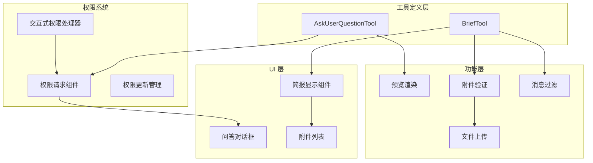
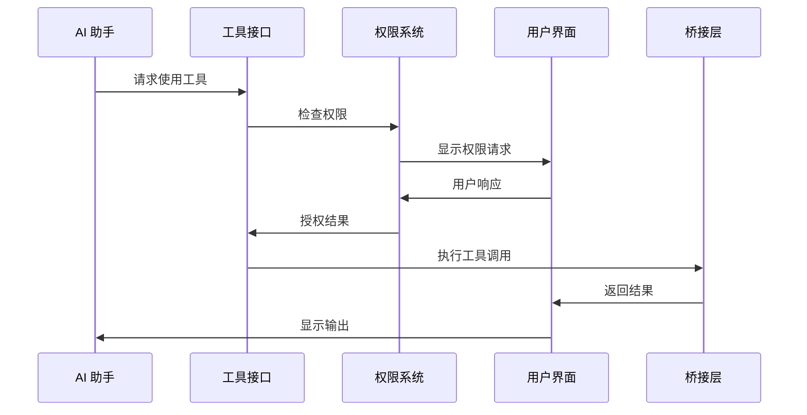
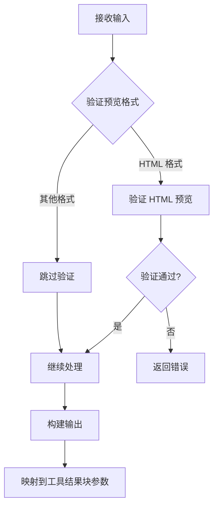
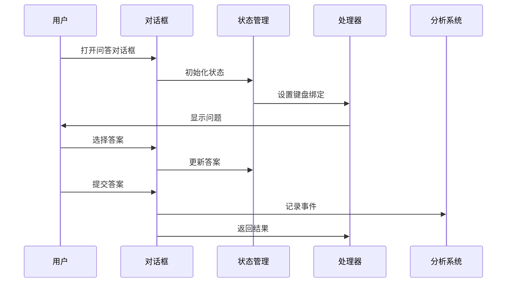
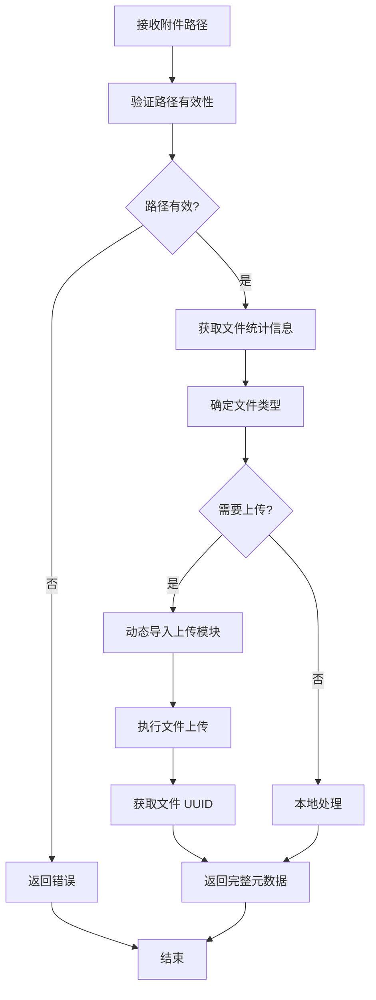
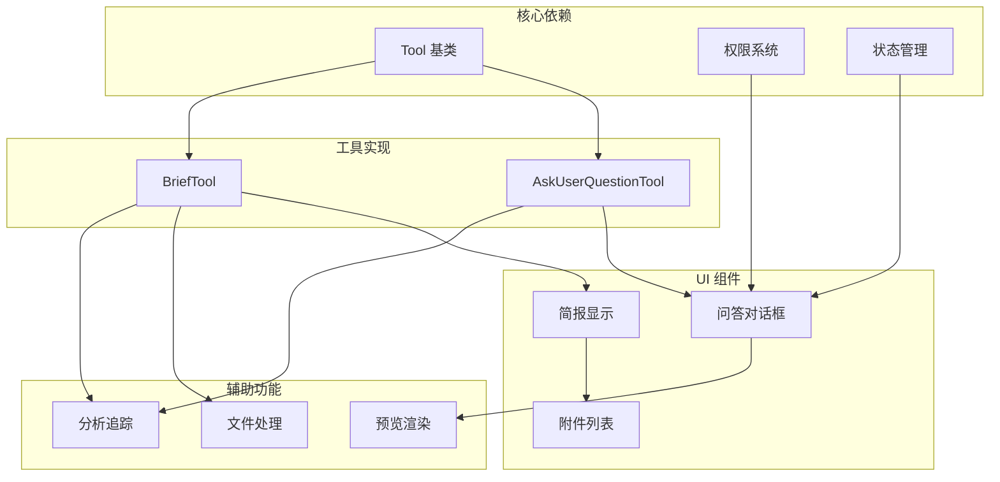

# 交互工具

<cite>
**本文档引用的文件**
- [AskUserQuestionTool.tsx](file://src/tools/AskUserQuestionTool/AskUserQuestionTool.tsx)
- [AskUserQuestionTool 提示词](file://src/tools/AskUserQuestionTool/prompt.ts)
- [AskUserQuestion 权限请求组件](file://src/components/permissions/AskUserQuestionPermissionRequest/AskUserQuestionPermissionRequest.tsx)
- [BriefTool.ts](file://src/tools/BriefTool/BriefTool.ts)
- [BriefTool UI](file://src/tools/BriefTool/UI.tsx)
- [BriefTool 附件处理](file://src/tools/BriefTool/attachments.ts)
- [BriefTool 上传](file://src/tools/BriefTool/upload.ts)
- [简报命令](file://src/commands/brief.ts)
- [消息过滤器](file://src/components/Messages.tsx)
- [交互式权限处理器](file://src/hooks/toolPermission/handlers/interactiveHandler.ts)
</cite>

## 目录
1. [简介](#简介)
2. [项目结构](#项目结构)
3. [核心组件](#核心组件)
4. [架构概览](#架构概览)
5. [详细组件分析](#详细组件分析)
6. [依赖关系分析](#依赖关系分析)
7. [性能考虑](#性能考虑)
8. [故障排除指南](#故障排除指南)
9. [结论](#结论)

## 简介

本文档深入分析 Claude Code 的交互工具系统，重点介绍两个关键工具：AskUserQuestionTool（用户问答工具）和 BriefTool（简报工具）。这两个工具构成了 Claude Code 与用户交互的核心基础设施，提供了丰富的用户体验和强大的功能特性。

AskUserQuestionTool 允许 AI 助手向用户提出多选题，收集信息、澄清歧义、了解偏好或做出决策。它支持预览功能，允许在选项中展示可视化内容，并提供完整的权限控制系统。

BriefTool 是主要的用户输出通道，负责将消息发送给用户。它支持附件处理、状态标签（正常/主动）、以及多种显示模式。

## 项目结构

交互工具系统采用模块化架构，每个工具都有独立的实现文件和相关组件：

**图表来源**
- [AskUserQuestionTool.tsx:109-245](file://src/tools/AskUserQuestionTool/AskUserQuestionTool.tsx#L109-L245)
- [BriefTool.ts:136-204](file://src/tools/BriefTool/BriefTool.ts#L136-L204)

**章节来源**
- [AskUserQuestionTool.tsx:1-266](file://src/tools/AskUserQuestionTool/AskUserQuestionTool.tsx#L1-L266)
- [BriefTool.ts:1-205](file://src/tools/BriefTool/BriefTool.ts#L1-L205)

## 核心组件

### AskUserQuestionTool（用户问答工具）

AskUserQuestionTool 是一个功能完整的交互工具，支持多选题、预览功能和权限控制：

**主要特性：**
- 多选题支持（单选和多选）
- 可选预览内容（HTML 或 Markdown）
- 权限请求机制
- 用户注释收集
- 计划模式集成

**数据结构：**
- 问题对象包含问题文本、标签、选项数组
- 选项支持标签、描述和可选预览
- 注解系统支持用户笔记和预览选择

**章节来源**
- [AskUserQuestionTool.tsx:14-82](file://src/tools/AskUserQuestionTool/AskUserQuestionTool.tsx#L14-L82)
- [AskUserQuestionTool 提示词:10-30](file://src/tools/AskUserQuestionTool/prompt.ts#L10-L30)

### BriefTool（简报工具）

BriefTool 是 Claude Code 的主要用户输出通道，提供灵活的消息传递能力：

**主要特性：**
- 支持 Markdown 格式
- 附件处理和上传
- 状态标签（正常/主动）
- 多种显示模式
- 消息过滤和路由

**功能特性：**
- 附件验证和解析
- 文件上传到私有 API
- 跨平台兼容性
- 性能优化的渲染

**章节来源**
- [BriefTool.ts:20-65](file://src/tools/BriefTool/BriefTool.ts#L20-L65)
- [BriefTool UI:12-68](file://src/tools/BriefTool/UI.tsx#L12-L68)

## 架构概览

交互工具系统采用分层架构，确保了模块间的清晰分离和高内聚低耦合：

**图表来源**
- [交互式权限处理器:57-68](file://src/hooks/toolPermission/handlers/interactiveHandler.ts#L57-L68)
- [AskUserQuestionTool.tsx:182-188](file://src/tools/AskUserQuestionTool/AskUserQuestionTool.tsx#L182-L188)

系统架构的关键特点：

1. **权限分离**：工具调用前必须通过权限检查
2. **异步处理**：权限检查和工具执行并行进行
3. **桥接抽象**：统一的桥接层处理不同环境差异
4. **状态管理**：完整的状态跟踪和恢复机制

## 详细组件分析

### AskUserQuestionTool 实现分析

#### 数据验证和输入处理

AskUserQuestionTool 实现了严格的数据验证机制：

**图表来源**
- [AskUserQuestionTool.tsx:158-181](file://src/tools/AskUserQuestionTool/AskUserQuestionTool.tsx#L158-L181)
- [AskUserQuestionTool.tsx:224-244](file://src/tools/AskUserQuestionTool/AskUserQuestionTool.tsx#L224-L244)

#### 权限请求机制

权限请求系统提供了完整的用户交互流程：

**图表来源**
- [AskUserQuestion 权限请求组件:30-611](file://src/components/permissions/AskUserQuestionPermissionRequest/AskUserQuestionPermissionRequest.tsx#L30-L611)

**章节来源**
- [AskUserQuestionTool.tsx:109-245](file://src/tools/AskUserQuestionTool/AskUserQuestionTool.tsx#L109-L245)
- [AskUserQuestion 权限请求组件:75-611](file://src/components/permissions/AskUserQuestionPermissionRequest/AskUserQuestionPermissionRequest.tsx#L75-L611)

### BriefTool 功能分析

#### 附件处理和上传流程

BriefTool 的附件处理系统具有高度的健壮性和灵活性：

**图表来源**
- [BriefTool 附件处理:26-111](file://src/tools/BriefTool/attachments.ts#L26-L111)
- [BriefTool 上传:92-175](file://src/tools/BriefTool/upload.ts#L92-L175)

#### 状态管理和显示逻辑

BriefTool 实现了复杂的状态管理系统：

**状态类型：**
- 正常状态：响应用户的直接询问
- 主动状态：主动向用户报告重要信息

**显示模式：**
- 默认视图：标准消息显示
- 简报模式：聊天视图专用
- 转录模式：完整历史记录

**章节来源**
- [BriefTool.ts:31-35](file://src/tools/BriefTool/BriefTool.ts#L31-L35)
- [BriefTool UI:12-68](file://src/tools/BriefTool/UI.tsx#L12-L68)

### 用户体验设计

#### 提示信息和确认流程

交互工具系统提供了丰富的用户体验设计：

**提示信息层次：**
- 工具描述：简要说明工具用途
- 使用说明：详细的使用指南
- 预览功能说明：针对 AskUserQuestionTool
- 错误处理：清晰的错误信息

**确认流程：**
- 权限检查：自动和手动权限验证
- 用户确认：明确的同意/拒绝选项
- 取消机制：安全的取消和回滚
- 反馈机制：操作结果的及时反馈

**章节来源**
- [AskUserQuestionTool 提示词:32-44](file://src/tools/AskUserQuestionTool/prompt.ts#L32-L44)
- [BriefTool.ts:169-174](file://src/tools/BriefTool/BriefTool.ts#L169-L174)

## 依赖关系分析

交互工具系统的依赖关系体现了良好的模块化设计：

**图表来源**
- [AskUserQuestionTool.tsx:1-15](file://src/tools/AskUserQuestionTool/AskUserQuestionTool.tsx#L1-L15)
- [BriefTool.ts:1-18](file://src/tools/BriefTool/BriefTool.ts#L1-L18)

**章节来源**
- [AskUserQuestionTool.tsx:1-15](file://src/tools/AskUserQuestionTool/AskUserQuestionTool.tsx#L1-L15)
- [BriefTool.ts:1-18](file://src/tools/BriefTool/BriefTool.ts#L1-L18)

## 性能考虑

### 优化策略

交互工具系统采用了多项性能优化措施：

**内存管理：**
- React.memo 缓存机制
- 惰性求值和延迟加载
- 内存泄漏防护

**网络优化：**
- 并行文件上传
- 连接复用
- 超时和重试机制

**渲染优化：**
- 虚拟滚动
- 按需渲染
- 无阻塞更新

**章节来源**
- [BriefTool 附件处理:67-109](file://src/tools/BriefTool/attachments.ts#L67-L109)
- [BriefTool 上传:98-108](file://src/tools/BriefTool/upload.ts#L98-L108)

## 故障排除指南

### 常见问题和解决方案

**权限相关问题：**
- 权限被拒绝：检查权限规则配置
- 权限循环：检查权限更新逻辑
- 权限缓存：清理权限缓存重新尝试

**工具调用问题：**
- 输入验证失败：检查输入格式和约束
- 工具不可用：检查工具启用状态
- 结果格式错误：验证输出映射

**UI 渲染问题：**
- 组件不更新：检查状态更新逻辑
- 内存泄漏：检查清理函数
- 性能问题：分析渲染路径

**章节来源**
- [交互式权限处理器:57-68](file://src/hooks/toolPermission/handlers/interactiveHandler.ts#L57-L68)
- [AskUserQuestion 权限请求组件:267-289](file://src/components/permissions/AskUserQuestionPermissionRequest/AskUserQuestionPermissionRequest.tsx#L267-L289)

## 结论

Claude Code 的交互工具系统展现了现代 AI 应用程序的最佳实践。AskUserQuestionTool 和 BriefTool 不仅功能强大，而且在用户体验、性能优化和安全性方面都达到了很高水准。

**关键优势：**
- 完整的权限控制系统
- 灵活的用户交互模式
- 高度模块化的架构设计
- 优秀的性能表现
- 丰富的用户体验

**未来发展建议：**
- 扩展更多交互模式
- 增强个性化定制能力
- 优化移动端体验
- 加强多语言支持

这个系统为开发者提供了坚实的基础，可以在此基础上构建更复杂的交互功能和更丰富的用户体验。