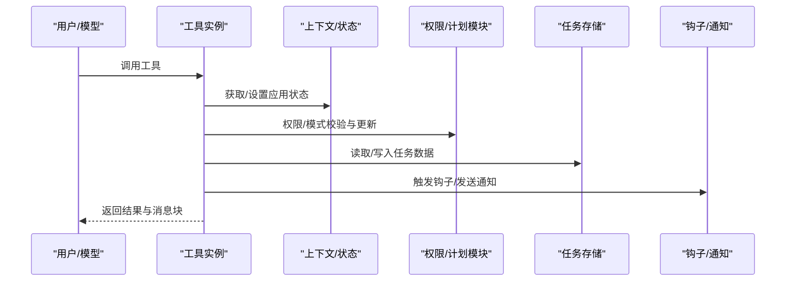
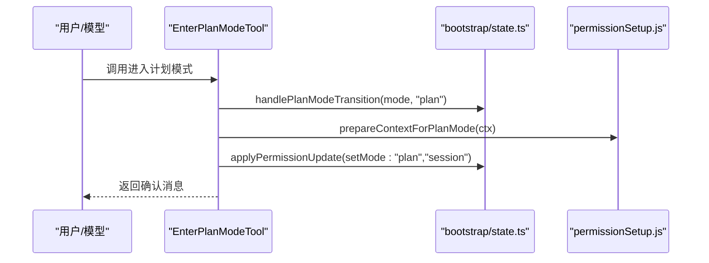
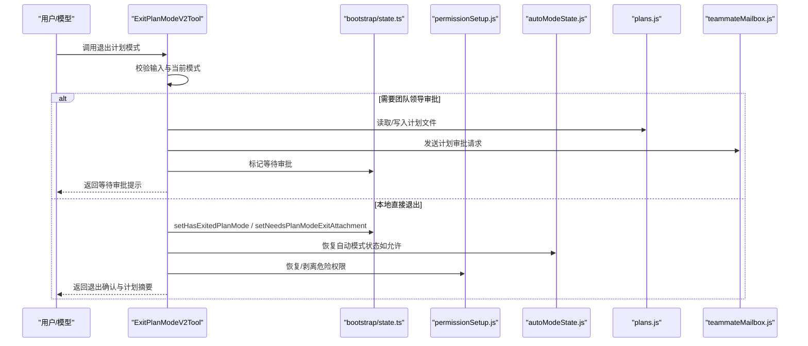
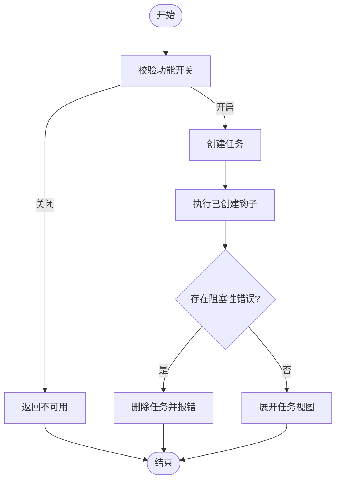
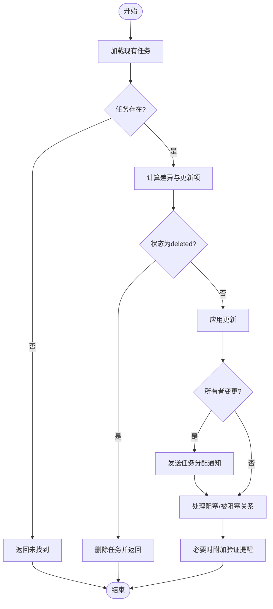
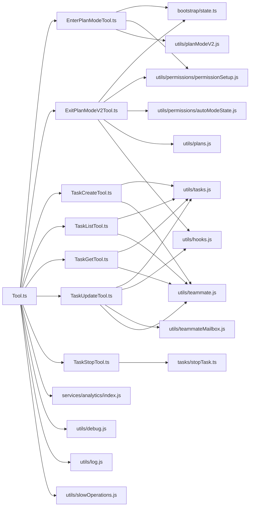

# 工作流和计划工具

<cite>
**本文引用的文件**
- [src/tools/EnterPlanModeTool/EnterPlanModeTool.ts](file://src/tools/EnterPlanModeTool/EnterPlanModeTool.ts)
- [src/tools/EnterPlanModeTool/constants.ts](file://src/tools/EnterPlanModeTool/constants.ts)
- [src/tools/ExitPlanModeTool/ExitPlanModeV2Tool.ts](file://src/tools/ExitPlanModeTool/ExitPlanModeV2Tool.ts)
- [src/tools/ExitPlanModeTool/constants.ts](file://src/tools/ExitPlanModeTool/constants.ts)
- [src/tools/TaskCreateTool/TaskCreateTool.ts](file://src/tools/TaskCreateTool/TaskCreateTool.ts)
- [src/tools/TaskCreateTool/constants.ts](file://src/tools/TaskCreateTool/constants.ts)
- [src/tools/TaskListTool/TaskListTool.ts](file://src/tools/TaskListTool/TaskListTool.ts)
- [src/tools/TaskListTool/constants.ts](file://src/tools/TaskListTool/constants.ts)
- [src/tools/TaskGetTool/TaskGetTool.ts](file://src/tools/TaskGetTool/TaskGetTool.ts)
- [src/tools/TaskUpdateTool/TaskUpdateTool.ts](file://src/tools/TaskUpdateTool/TaskUpdateTool.ts)
- [src/tools/TaskStopTool/TaskStopTool.ts](file://src/tools/TaskStopTool/TaskStopTool.ts)
- [src/Tool.ts](file://src/Tool.ts)
- [src/utils/tasks.js](file://src/utils/tasks.js)
- [src/utils/teammate.js](file://src/utils/teammate.js)
- [src/utils/hooks.js](file://src/utils/hooks.js)
- [src/utils/agentSwarmsEnabled.js](file://src/utils/agentSwarmsEnabled.js)
- [src/utils/teammateMailbox.js](file://src/utils/teammateMailbox.js)
- [src/bootstrap/state.ts](file://src/bootstrap/state.ts)
- [src/utils/permissions/permissionSetup.js](file://src/utils/permissions/permissionSetup.js)
- [src/utils/permissions/autoModeState.js](file://src/utils/permissions/autoModeState.js)
- [src/utils/planModeV2.js](file://src/utils/planModeV2.js)
- [src/utils/plans.js](file://src/utils/plans.js)
- [src/services/analytics/index.js](file://src/services/analytics/index.js)
- [src/utils/agentId.js](file://src/utils/agentId.js)
- [src/utils/inProcessTeammateHelpers.js](file://src/utils/inProcessTeammateHelpers.js)
- [src/utils/debug.js](file://src/utils/debug.js)
- [src/utils/log.js](file://src/utils/log.js)
- [src/utils/slowOperations.js](file://src/utils/slowOperations.js)
- [src/tasks/stopTask.ts](file://src/tasks/stopTask.ts)
</cite>

## 目录
1. [简介](#简介)
2. [项目结构](#项目结构)
3. [核心组件](#核心组件)
4. [架构总览](#架构总览)
5. [详细组件分析](#详细组件分析)
6. [依赖关系分析](#依赖关系分析)
7. [性能考量](#性能考量)
8. [故障排查指南](#故障排查指南)
9. [结论](#结论)
10. [附录](#附录)

## 简介
本文件面向Claude Code的工作流与计划工具，系统性梳理“计划模式”工具（进入/退出）与“任务管理”工具（创建、列表、获取、更新、停止）的设计与实现要点，覆盖权限验证、并发安全、状态同步、跨模块协作与错误处理等维度，并提供最佳实践与使用指南，帮助开发者与使用者高效、安全地组织与执行任务。

## 项目结构
围绕工作流与计划工具的关键代码分布在以下位置：
- 计划模式工具：src/tools/EnterPlanModeTool、src/tools/ExitPlanModeTool
- 任务管理工具：src/tools/TaskCreateTool、TaskListTool、TaskGetTool、TaskUpdateTool、TaskStopTool
- 工具框架与类型：src/Tool.ts
- 任务持久化与状态：src/utils/tasks.js、src/tasks/stopTask.ts
- 团队与权限：src/utils/teammate.js、src/utils/agentSwarmsEnabled.js、src/utils/teammateMailbox.js、src/utils/permissions/*
- 状态与计划：src/bootstrap/state.ts、src/utils/plans.js、src/utils/planModeV2.js
- 分析与日志：src/services/analytics/index.js、src/utils/debug.js、src/utils/log.js、src/utils/slowOperations.js

```mermaid
graph TB
subgraph "工具层"
EPM["EnterPlanModeTool.ts"]
XPM["ExitPlanModeV2Tool.ts"]
TCT["TaskCreateTool.ts"]
TLT["TaskListTool.ts"]
TGT["TaskGetTool.ts"]
TUT["TaskUpdateTool.ts"]
TST["TaskStopTool.ts"]
end
subgraph "通用能力"
ToolBase["Tool.ts"]
TasksJS["utils/tasks.js"]
StopTaskTS["tasks/stopTask.ts"]
TeamJS["utils/teammate.js"]
Swarms["utils/agentSwarmsEnabled.js"]
Mailbox["utils/teammateMailbox.js"]
PermSetup["utils/permissions/permissionSetup.js"]
AutoState["utils/permissions/autoModeState.js"]
StateBoot["bootstrap/state.ts"]
Plans["utils/plans.js"]
PlanV2["utils/planModeV2.js"]
Hooks["utils/hooks.js"]
Debug["utils/debug.js"]
Log["utils/log.js"]
SlowOps["utils/slowOperations.js"]
Analytics["services/analytics/index.js"]
end
EPM --> StateBoot
EPM --> PermSetup
EPM --> PlanV2
XPM --> StateBoot
XPM --> PermSetup
XPM --> AutoState
XPM --> Plans
XPM --> Mailbox
XPM --> Hooks
TCT --> TasksJS
TLT --> TasksJS
TGT --> TasksJS
TUT --> TasksJS
TUT --> Hooks
TUT --> Mailbox
TST --> StopTaskTS
TCT --> Hooks
TCT --> TeamJS
TUT --> TeamJS
TLT --> TeamJS
TGT --> TeamJS
ToolBase --> EPM
ToolBase --> XPM
ToolBase --> TCT
ToolBase --> TLT
ToolBase --> TGT
ToolBase --> TUT
ToolBase --> TST
```

图表来源
- [src/tools/EnterPlanModeTool/EnterPlanModeTool.ts:1-127](file://src/tools/EnterPlanModeTool/EnterPlanModeTool.ts#L1-L127)
- [src/tools/ExitPlanModeTool/ExitPlanModeV2Tool.ts:1-494](file://src/tools/ExitPlanModeTool/ExitPlanModeV2Tool.ts#L1-L494)
- [src/tools/TaskCreateTool/TaskCreateTool.ts:1-139](file://src/tools/TaskCreateTool/TaskCreateTool.ts#L1-L139)
- [src/tools/TaskListTool/TaskListTool.ts:1-117](file://src/tools/TaskListTool/TaskListTool.ts#L1-L117)
- [src/tools/TaskGetTool/TaskGetTool.ts:1-129](file://src/tools/TaskGetTool/TaskGetTool.ts#L1-L129)
- [src/tools/TaskUpdateTool/TaskUpdateTool.ts:1-407](file://src/tools/TaskUpdateTool/TaskUpdateTool.ts#L1-L407)
- [src/tools/TaskStopTool/TaskStopTool.ts:1-132](file://src/tools/TaskStopTool/TaskStopTool.ts#L1-L132)
- [src/Tool.ts](file://src/Tool.ts)

章节来源
- [src/tools/EnterPlanModeTool/EnterPlanModeTool.ts:1-127](file://src/tools/EnterPlanModeTool/EnterPlanModeTool.ts#L1-L127)
- [src/tools/ExitPlanModeTool/ExitPlanModeV2Tool.ts:1-494](file://src/tools/ExitPlanModeTool/ExitPlanModeV2Tool.ts#L1-L494)
- [src/tools/TaskCreateTool/TaskCreateTool.ts:1-139](file://src/tools/TaskCreateTool/TaskCreateTool.ts#L1-L139)
- [src/tools/TaskListTool/TaskListTool.ts:1-117](file://src/tools/TaskListTool/TaskListTool.ts#L1-L117)
- [src/tools/TaskGetTool/TaskGetTool.ts:1-129](file://src/tools/TaskGetTool/TaskGetTool.ts#L1-L129)
- [src/tools/TaskUpdateTool/TaskUpdateTool.ts:1-407](file://src/tools/TaskUpdateTool/TaskUpdateTool.ts#L1-L407)
- [src/tools/TaskStopTool/TaskStopTool.ts:1-132](file://src/tools/TaskStopTool/TaskStopTool.ts#L1-L132)

## 核心组件
- 计划模式工具
  - EnterPlanModeTool：将当前会话切换到“计划模式”，准备探索与设计，不写入磁盘，只更新权限上下文与提示信息。
  - ExitPlanModeV2Tool：结束计划模式，保存/提交计划，处理权限请求与团队审批流程，支持本地或通过邮箱发送给团队领导。
- 任务管理工具
  - TaskCreateTool：在任务列表中创建新任务，触发“已创建”钩子，必要时自动展开任务视图。
  - TaskListTool：列出可公开任务，过滤已完成任务的反向阻塞，仅读。
  - TaskGetTool：按ID获取任务详情，仅读。
  - TaskUpdateTool：更新任务字段、状态、阻塞关系，支持删除、所有权变更通知、完成钩子、验证提醒。
  - TaskStopTool：停止运行中的后台任务，兼容旧参数名，进行输入校验与状态检查。

章节来源
- [src/tools/EnterPlanModeTool/EnterPlanModeTool.ts:36-126](file://src/tools/EnterPlanModeTool/EnterPlanModeTool.ts#L36-L126)
- [src/tools/ExitPlanModeTool/ExitPlanModeV2Tool.ts:147-493](file://src/tools/ExitPlanModeTool/ExitPlanModeV2Tool.ts#L147-L493)
- [src/tools/TaskCreateTool/TaskCreateTool.ts:48-138](file://src/tools/TaskCreateTool/TaskCreateTool.ts#L48-L138)
- [src/tools/TaskListTool/TaskListTool.ts:33-116](file://src/tools/TaskListTool/TaskListTool.ts#L33-L116)
- [src/tools/TaskGetTool/TaskGetTool.ts:38-128](file://src/tools/TaskGetTool/TaskGetTool.ts#L38-L128)
- [src/tools/TaskUpdateTool/TaskUpdateTool.ts:88-406](file://src/tools/TaskUpdateTool/TaskUpdateTool.ts#L88-L406)
- [src/tools/TaskStopTool/TaskStopTool.ts:39-131](file://src/tools/TaskStopTool/TaskStopTool.ts#L39-L131)

## 架构总览
工作流与计划工具遵循统一的工具框架，具备输入/输出模式、延迟执行、并发安全、权限校验、用户交互提示等通用能力；同时与任务持久化、团队协作、权限系统、计划文件、分析与调试模块深度集成。

图表来源
- [src/Tool.ts](file://src/Tool.ts)
- [src/tools/TaskCreateTool/TaskCreateTool.ts:80-113](file://src/tools/TaskCreateTool/TaskCreateTool.ts#L80-L113)
- [src/tools/TaskUpdateTool/TaskUpdateTool.ts:232-264](file://src/tools/TaskUpdateTool/TaskUpdateTool.ts#L232-L264)
- [src/utils/hooks.js](file://src/utils/hooks.js)
- [src/utils/teammateMailbox.js](file://src/utils/teammateMailbox.js)

## 详细组件分析

### 计划模式工具

#### EnterPlanModeTool
- 功能要点
  - 将工具权限模式切换至“计划模式”，准备探索与设计。
  - 在特定通道限制下禁用以避免无法退出。
  - 更新权限上下文，准备计划模式的分类器激活副作用。
  - 不写入磁盘，仅返回确认消息。
- 关键流程
  - 模式切换：调用状态模块的转换函数。
  - 权限更新：基于当前上下文应用更新，设置目标为“会话”。
  - 提示生成：根据是否启用面试阶段，动态生成不同指令。
- 并发与只读
  - 并发安全：标记为并发安全。
  - 只读：标记为只读，不修改任何外部资源。

图表来源
- [src/tools/EnterPlanModeTool/EnterPlanModeTool.ts:77-102](file://src/tools/EnterPlanModeTool/EnterPlanModeTool.ts#L77-L102)
- [src/bootstrap/state.ts](file://src/bootstrap/state.ts)
- [src/utils/permissions/permissionSetup.js](file://src/utils/permissions/permissionSetup.js)
- [src/utils/planModeV2.js](file://src/utils/planModeV2.js)

章节来源
- [src/tools/EnterPlanModeTool/EnterPlanModeTool.ts:36-126](file://src/tools/EnterPlanModeTool/EnterPlanModeTool.ts#L36-L126)
- [src/tools/EnterPlanModeTool/constants.ts:1-1](file://src/tools/EnterPlanModeTool/constants.ts#L1-L1)

#### ExitPlanModeV2Tool
- 功能要点
  - 结束计划模式，保存/提交计划，处理权限请求与团队审批。
  - 支持非团队成员需要用户确认，团队成员在需要时自动提交给领导。
  - 写入磁盘并同步远端快照，确保后续验证可见。
  - 恢复前一模式（默认/自动），必要时回退并发出通知。
  - 根据是否编辑过计划决定是否回显内容。
- 关键流程
  - 输入校验：确保当前处于计划模式。
  - 权限策略：团队成员绕过UI，非团队成员弹出确认。
  - 计划提交：若需要，写入邮箱盒并设置等待审批状态。
  - 模式恢复：更新状态，恢复前一模式，处理自动模式门禁回退。
  - 结果映射：根据场景返回不同提示文本。
- 并发与只读
  - 并发安全：标记为并发安全。
  - 非只读：会写入磁盘与状态。

图表来源
- [src/tools/ExitPlanModeTool/ExitPlanModeV2Tool.ts:195-418](file://src/tools/ExitPlanModeTool/ExitPlanModeV2Tool.ts#L195-L418)
- [src/bootstrap/state.ts](file://src/bootstrap/state.ts)
- [src/utils/permissions/permissionSetup.js](file://src/utils/permissions/permissionSetup.js)
- [src/utils/permissions/autoModeState.js](file://src/utils/permissions/autoModeState.js)
- [src/utils/plans.js](file://src/utils/plans.js)
- [src/utils/teammateMailbox.js](file://src/utils/teammateMailbox.js)

章节来源
- [src/tools/ExitPlanModeTool/ExitPlanModeV2Tool.ts:147-493](file://src/tools/ExitPlanModeTool/ExitPlanModeV2Tool.ts#L147-L493)
- [src/tools/ExitPlanModeTool/constants.ts:1-2](file://src/tools/ExitPlanModeTool/constants.ts#L1-L2)

### 任务管理工具

#### TaskCreateTool
- 功能要点
  - 创建任务并填充基础字段（标题、描述、活动形态、元数据）。
  - 执行“任务已创建”钩子，遇到阻塞性错误则回滚删除任务。
  - 自动展开任务视图以便立即查看。
- 并发与只读
  - 并发安全：标记为并发安全。
  - 非只读：写入任务存储。

图表来源
- [src/tools/TaskCreateTool/TaskCreateTool.ts:68-113](file://src/tools/TaskCreateTool/TaskCreateTool.ts#L68-L113)
- [src/utils/tasks.js](file://src/utils/tasks.js)
- [src/utils/hooks.js](file://src/utils/hooks.js)

章节来源
- [src/tools/TaskCreateTool/TaskCreateTool.ts:48-138](file://src/tools/TaskCreateTool/TaskCreateTool.ts#L48-L138)
- [src/tools/TaskCreateTool/constants.ts:1-1](file://src/tools/TaskCreateTool/constants.ts#L1-L1)

#### TaskListTool
- 功能要点
  - 列出所有非内部任务，过滤已完成任务对其他任务的阻塞。
  - 输出简洁的任务清单，包含状态、拥有者与阻塞关系。
- 并发与只读
  - 并发安全：标记为并发安全。
  - 只读：仅读取任务存储。

章节来源
- [src/tools/TaskListTool/TaskListTool.ts:33-116](file://src/tools/TaskListTool/TaskListTool.ts#L33-L116)
- [src/tools/TaskListTool/constants.ts:1-1](file://src/tools/TaskListTool/constants.ts#L1-L1)

#### TaskGetTool
- 功能要点
  - 按ID获取任务详情，返回空表示未找到。
  - 输出包含状态、描述及阻塞/被阻塞关系。
- 并发与只读
  - 并发安全：标记为并发安全。
  - 只读：仅读取任务存储。

章节来源
- [src/tools/TaskGetTool/TaskGetTool.ts:38-128](file://src/tools/TaskGetTool/TaskGetTool.ts#L38-L128)

#### TaskUpdateTool
- 功能要点
  - 支持更新主题、描述、活动形态、所有者、元数据与状态。
  - 支持“删除”状态直接删除任务文件。
  - 完成状态时执行“任务完成”钩子，遇阻塞性错误则拒绝更新。
  - 所有者变更时通过邮箱通知新拥有者。
  - 添加阻塞/被阻塞关系，去重后逐一建立。
  - 在满足条件时附加“验证提醒”提示。
- 并发与只读
  - 并发安全：标记为并发安全。
  - 非只读：写入任务存储与邮箱通知。

图表来源
- [src/tools/TaskUpdateTool/TaskUpdateTool.ts:123-362](file://src/tools/TaskUpdateTool/TaskUpdateTool.ts#L123-L362)
- [src/utils/tasks.js](file://src/utils/tasks.js)
- [src/utils/hooks.js](file://src/utils/hooks.js)
- [src/utils/teammateMailbox.js](file://src/utils/teammateMailbox.js)

章节来源
- [src/tools/TaskUpdateTool/TaskUpdateTool.ts:88-406](file://src/tools/TaskUpdateTool/TaskUpdateTool.ts#L88-L406)

#### TaskStopTool
- 功能要点
  - 停止指定ID的运行中后台任务，兼容旧参数名。
  - 输入校验：必须提供任务ID且任务处于运行中。
  - 调用统一停止逻辑，返回停止结果与命令描述。
- 并发与只读
  - 并发安全：标记为并发安全。
  - 非只读：影响任务状态。

章节来源
- [src/tools/TaskStopTool/TaskStopTool.ts:39-131](file://src/tools/TaskStopTool/TaskStopTool.ts#L39-L131)
- [src/tasks/stopTask.ts](file://src/tasks/stopTask.ts)

## 依赖关系分析
- 工具框架
  - 所有工具均通过统一的构建函数注册，具备输入/输出模式、延迟执行、并发安全、只读标记、权限校验与渲染消息等能力。
- 任务持久化
  - 任务的创建、查询、更新、删除与阻塞关系均由任务工具与底层任务模块协作完成。
- 团队与权限
  - 退出计划模式与任务更新涉及团队协作、邮箱通知、权限剥离/恢复、自动模式状态管理。
- 计划与状态
  - 进入/退出计划模式与应用状态、权限设置、计划文件读写紧密耦合。
- 分析与调试
  - 工具调用记录事件、错误日志、慢操作序列化与调试输出贯穿工具生命周期。

图表来源
- [src/Tool.ts](file://src/Tool.ts)
- [src/tools/EnterPlanModeTool/EnterPlanModeTool.ts:1-127](file://src/tools/EnterPlanModeTool/EnterPlanModeTool.ts#L1-L127)
- [src/tools/ExitPlanModeTool/ExitPlanModeV2Tool.ts:1-494](file://src/tools/ExitPlanModeTool/ExitPlanModeV2Tool.ts#L1-L494)
- [src/tools/TaskCreateTool/TaskCreateTool.ts:1-139](file://src/tools/TaskCreateTool/TaskCreateTool.ts#L1-L139)
- [src/tools/TaskListTool/TaskListTool.ts:1-117](file://src/tools/TaskListTool/TaskListTool.ts#L1-L117)
- [src/tools/TaskGetTool/TaskGetTool.ts:1-129](file://src/tools/TaskGetTool/TaskGetTool.ts#L1-L129)
- [src/tools/TaskUpdateTool/TaskUpdateTool.ts:1-407](file://src/tools/TaskUpdateTool/TaskUpdateTool.ts#L1-L407)
- [src/tools/TaskStopTool/TaskStopTool.ts:1-132](file://src/tools/TaskStopTool/TaskStopTool.ts#L1-L132)
- [src/utils/tasks.js](file://src/utils/tasks.js)
- [src/tasks/stopTask.ts](file://src/tasks/stopTask.ts)
- [src/bootstrap/state.ts](file://src/bootstrap/state.ts)
- [src/utils/permissions/permissionSetup.js](file://src/utils/permissions/permissionSetup.js)
- [src/utils/permissions/autoModeState.js](file://src/utils/permissions/autoModeState.js)
- [src/utils/plans.js](file://src/utils/plans.js)
- [src/utils/hooks.js](file://src/utils/hooks.js)
- [src/utils/teammateMailbox.js](file://src/utils/teammateMailbox.js)
- [src/utils/planModeV2.js](file://src/utils/planModeV2.js)
- [src/utils/teammate.js](file://src/utils/teammate.js)
- [src/services/analytics/index.js](file://src/services/analytics/index.js)
- [src/utils/debug.js](file://src/utils/debug.js)
- [src/utils/log.js](file://src/utils/log.js)
- [src/utils/slowOperations.js](file://src/utils/slowOperations.js)

章节来源
- [src/Tool.ts](file://src/Tool.ts)
- [src/utils/tasks.js](file://src/utils/tasks.js)
- [src/tasks/stopTask.ts](file://src/tasks/stopTask.ts)
- [src/utils/teammate.js](file://src/utils/teammate.js)
- [src/utils/agentSwarmsEnabled.js](file://src/utils/agentSwarmsEnabled.js)
- [src/utils/teammateMailbox.js](file://src/utils/teammateMailbox.js)
- [src/utils/permissions/permissionSetup.js](file://src/utils/permissions/permissionSetup.js)
- [src/utils/permissions/autoModeState.js](file://src/utils/permissions/autoModeState.js)
- [src/bootstrap/state.ts](file://src/bootstrap/state.ts)
- [src/utils/plans.js](file://src/utils/plans.js)
- [src/utils/planModeV2.js](file://src/utils/planModeV2.js)
- [src/utils/hooks.js](file://src/utils/hooks.js)
- [src/services/analytics/index.js](file://src/services/analytics/index.js)
- [src/utils/debug.js](file://src/utils/debug.js)
- [src/utils/log.js](file://src/utils/log.js)
- [src/utils/slowOperations.js](file://src/utils/slowOperations.js)

## 性能考量
- 延迟执行与并发安全
  - 工具普遍标记为并发安全，适合多工具并行使用；部分工具（如计划模式）采用延迟执行以减少不必要的开销。
- I/O与磁盘同步
  - 退出计划模式会写入计划文件并同步远端快照，注意I/O成本；建议在批量操作时合并写入。
- 钩子与通知
  - 钩子可能产生异步副作用，应避免在高频路径中密集触发；必要时在工具调用后统一处理。
- 状态更新
  - 多处状态更新（任务、权限、计划）建议在单次调用内聚合，减少重复渲染与刷新。

## 故障排查指南
- 退出计划模式不在计划模式
  - 现象：工具返回“不在计划模式”的错误。
  - 排查：确认当前模式为计划模式后再调用；检查通道限制导致的禁用。
  - 相关代码：[src/tools/ExitPlanModeTool/ExitPlanModeV2Tool.ts:204-218](file://src/tools/ExitPlanModeTool/ExitPlanModeV2Tool.ts#L204-L218)
- 任务停止失败
  - 现象：缺少任务ID或任务非运行中状态。
  - 排查：核对任务ID是否存在且状态为运行中；兼容旧参数名shell_id。
  - 相关代码：[src/tools/TaskStopTool/TaskStopTool.ts:60-91](file://src/tools/TaskStopTool/TaskStopTool.ts#L60-L91)
- 任务更新阻塞性错误
  - 现象：标记完成时报错但未更新。
  - 排查：检查完成钩子的阻塞性错误；修复后重试。
  - 相关代码：[src/tools/TaskUpdateTool/TaskUpdateTool.ts:232-264](file://src/tools/TaskUpdateTool/TaskUpdateTool.ts#L232-L264)
- 计划模式通道限制
  - 现象：进入/退出计划模式被禁用。
  - 排查：检查通道配置；在受限通道上避免计划模式陷阱。
  - 相关代码：[src/tools/EnterPlanModeTool/EnterPlanModeTool.ts:56-66](file://src/tools/EnterPlanModeTool/EnterPlanModeTool.ts#L56-L66)、[src/tools/ExitPlanModeTool/ExitPlanModeV2Tool.ts:167-177](file://src/tools/ExitPlanModeTool/ExitPlanModeV2Tool.ts#L167-L177)
- 自动模式门禁回退
  - 现象：退出计划模式后自动模式不可用，提示回退。
  - 排查：检查自动模式门禁状态与可用原因；根据提示调整设置。
  - 相关代码：[src/tools/ExitPlanModeTool/ExitPlanModeV2Tool.ts:327-355](file://src/tools/ExitPlanModeTool/ExitPlanModeV2Tool.ts#L327-L355)

章节来源
- [src/tools/ExitPlanModeTool/ExitPlanModeV2Tool.ts:204-218](file://src/tools/ExitPlanModeTool/ExitPlanModeV2Tool.ts#L204-L218)
- [src/tools/TaskStopTool/TaskStopTool.ts:60-91](file://src/tools/TaskStopTool/TaskStopTool.ts#L60-L91)
- [src/tools/TaskUpdateTool/TaskUpdateTool.ts:232-264](file://src/tools/TaskUpdateTool/TaskUpdateTool.ts#L232-L264)
- [src/tools/EnterPlanModeTool/EnterPlanModeTool.ts:56-66](file://src/tools/EnterPlanModeTool/EnterPlanModeTool.ts#L56-L66)
- [src/tools/ExitPlanModeTool/ExitPlanModeV2Tool.ts:327-355](file://src/tools/ExitPlanModeTool/ExitPlanModeV2Tool.ts#L327-L355)

## 结论
工作流与计划工具通过统一的工具框架与完善的权限、状态、任务与团队协作机制，实现了从“计划—审批—执行—验证”的闭环。计划模式工具保障探索与设计的安全边界，任务管理工具提供细粒度的进度与协作控制。遵循并发安全、只读与延迟执行的原则，结合钩子与通知机制，可在保证稳定性的同时提升开发效率。

## 附录
- 最佳实践
  - 使用EnterPlanModeTool进行复杂任务的探索与设计，避免在非计划模式下提前写入文件。
  - 退出计划模式前确保计划完整并符合要求，必要时通过团队领导审批。
  - 使用TaskCreateTool创建任务后及时展开视图，便于跟踪。
  - 使用TaskUpdateTool更新状态时优先完成钩子，确保流程合规。
  - 使用TaskStopTool停止长时间无响应的后台任务，避免资源占用。
- 使用指南
  - 计划模式：在需要深入探索与设计时进入计划模式，完成后退出并提交计划。
  - 任务管理：以任务为中心组织工作，明确阻塞关系与负责人，定期清理已完成任务。
  - 权限与协作：在团队环境中遵循审批流程，利用邮箱通知与团队工具协同。