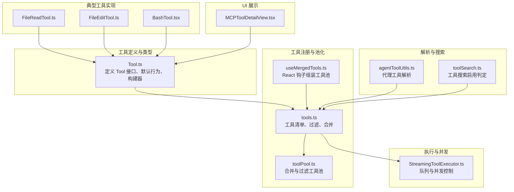
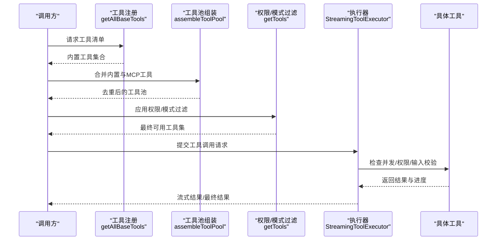
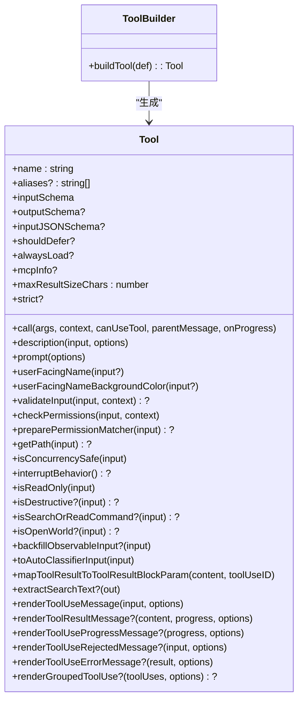
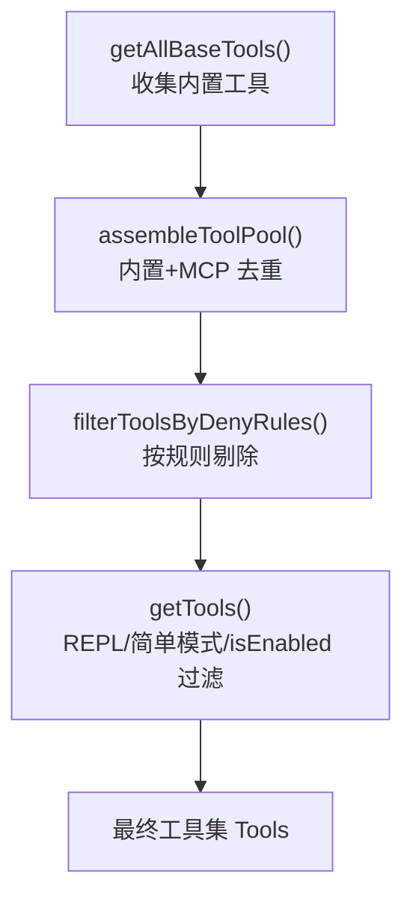
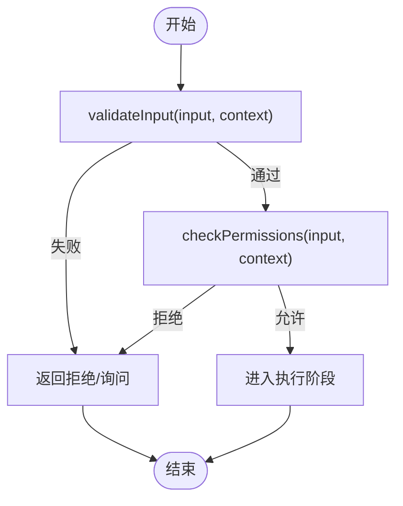
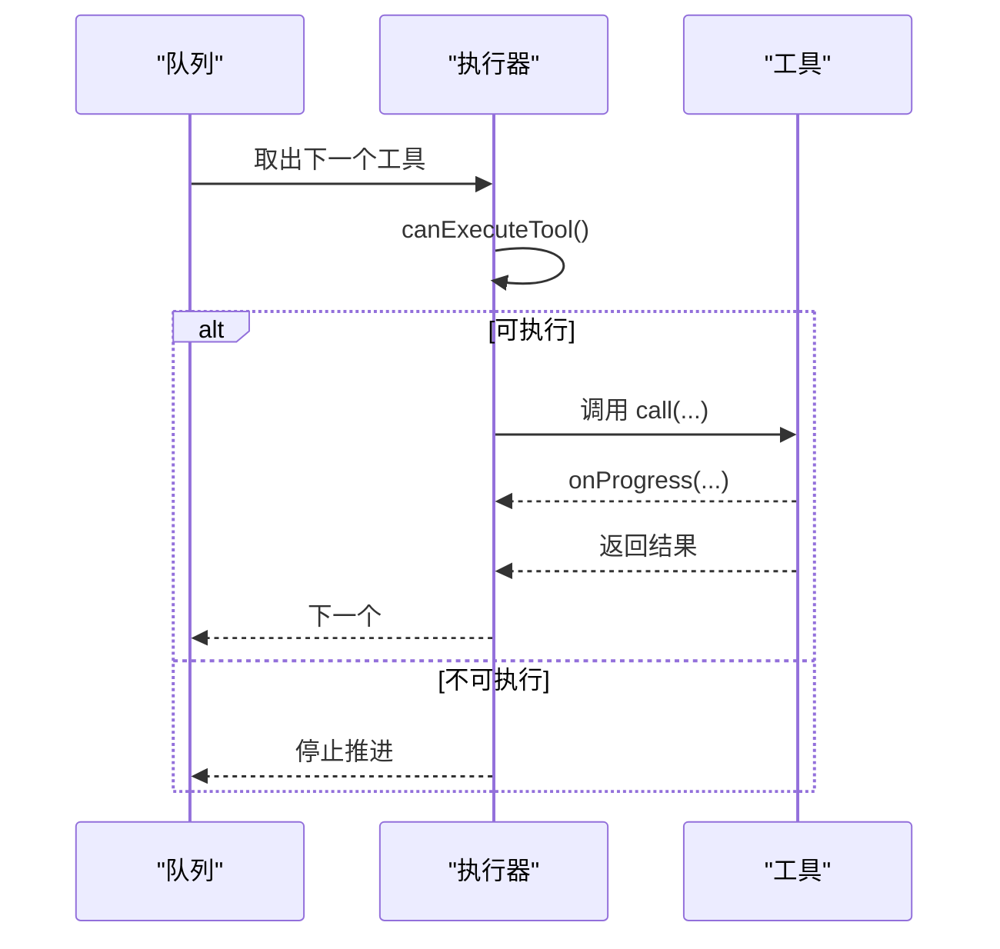
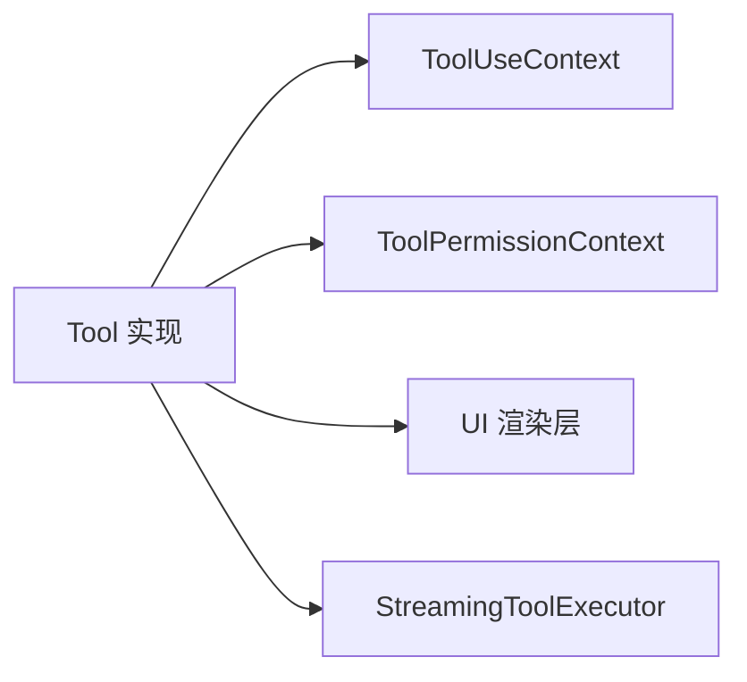

# 工具接口设计

<cite>
**本文引用的文件**
- [Tool.ts](file://src/Tool.ts)
- [tools.ts](file://src/tools.ts)
- [useMergedTools.ts](file://src/hooks/useMergedTools.ts)
- [toolPool.ts](file://src/utils/toolPool.ts)
- [StreamingToolExecutor.ts](file://src/services/tools/StreamingToolExecutor.ts)
- [agentToolUtils.ts](file://src/tools/AgentTool/agentToolUtils.ts)
- [toolSearch.ts](file://src/utils/toolSearch.ts)
- [FileReadTool.ts](file://src/tools/FileReadTool/FileReadTool.ts)
- [FileEditTool.ts](file://src/tools/FileEditTool/FileEditTool.ts)
- [BashTool.tsx](file://src/tools/BashTool/BashTool.tsx)
- [MCPToolDetailView.tsx](file://src/components/mcp/MCPToolDetailView.tsx)
</cite>

## 目录
1. [引言](#引言)
2. [项目结构](#项目结构)
3. [核心组件](#核心组件)
4. [架构总览](#架构总览)
5. [详细组件分析](#详细组件分析)
6. [依赖关系分析](#依赖关系分析)
7. [性能考量](#性能考量)
8. [故障排查指南](#故障排查指南)
9. [结论](#结论)
10. [附录](#附录)

## 引言
本文件系统性阐述 Claude Code 的工具接口设计，围绕 Tool 基类的接口规范、生命周期管理、参数验证机制、工具注册与池化、权限与验证流程展开，并给出工具开发最佳实践与扩展示例路径。目标是帮助开发者在不深入源码的前提下，快速理解并正确扩展工具体系。

## 项目结构
与工具接口设计直接相关的核心模块如下：
- 工具基类与类型：src/Tool.ts
- 工具注册与池化：src/tools.ts、src/utils/toolPool.ts、src/hooks/useMergedTools.ts
- 工具执行与并发：src/services/tools/StreamingToolExecutor.ts
- 工具解析与搜索：src/tools/AgentTool/agentToolUtils.ts、src/utils/toolSearch.ts
- 典型工具实现：src/tools/FileReadTool/FileReadTool.ts、src/tools/FileEditTool/FileEditTool.ts、src/tools/BashTool/BashTool.tsx
- 工具 UI 展示：src/components/mcp/MCPToolDetailView.tsx

图表来源
- [Tool.ts:1-793](file://src/Tool.ts#L1-L793)
- [tools.ts:1-390](file://src/tools.ts#L1-L390)
- [toolPool.ts:43-79](file://src/utils/toolPool.ts#L43-L79)
- [useMergedTools.ts:1-44](file://src/hooks/useMergedTools.ts#L1-L44)
- [StreamingToolExecutor.ts:123-151](file://src/services/tools/StreamingToolExecutor.ts#L123-L151)
- [agentToolUtils.ts:118-188](file://src/tools/AgentTool/agentToolUtils.ts#L118-L188)
- [toolSearch.ts:364-392](file://src/utils/toolSearch.ts#L364-L392)
- [FileReadTool.ts:1-200](file://src/tools/FileReadTool/FileReadTool.ts#L1-L200)
- [FileEditTool.ts:1-200](file://src/tools/FileEditTool/FileEditTool.ts#L1-L200)
- [BashTool.tsx:1-200](file://src/tools/BashTool/BashTool.tsx#L1-L200)
- [MCPToolDetailView.tsx:46-178](file://src/components/mcp/MCPToolDetailView.tsx#L46-L178)

章节来源
- [Tool.ts:1-793](file://src/Tool.ts#L1-L793)
- [tools.ts:1-390](file://src/tools.ts#L1-L390)

## 核心组件
- Tool 接口与默认行为
  - Tool 定义了工具的输入/输出模式、调用协议、UI 渲染、权限检查、并发安全、是否只读/破坏性操作、是否延迟加载等能力契约。
  - 提供 buildTool 构建器，自动填充常用默认行为（如 isEnabled/isConcurrencySafe/isReadOnly/isDestructive/checkPermissions 等），确保工具实现最小化样板代码。
- 工具集合 Tools
  - Tools 是只读工具数组的类型别名，用于在全链路传递工具集，便于追踪来源与过滤。
- 工具上下文 ToolUseContext
  - 封装工具运行所需的环境信息（命令列表、调试开关、思考配置、MCP 客户端/资源、会话状态、文件读取限制、消息与结果存储等），贯穿工具生命周期。
- 工具权限上下文 ToolPermissionContext
  - 描述权限模式、规则集合、附加工作目录、是否允许绕过权限等，驱动工具权限决策与 UI 行为。

章节来源
- [Tool.ts:362-695](file://src/Tool.ts#L362-L695)
- [Tool.ts:783-792](file://src/Tool.ts#L783-L792)

## 架构总览
工具从“注册—合并—筛选—执行—渲染”完整闭环：
- 注册：getAllBaseTools 汇总内置工具；结合条件特性与环境变量动态加入或剔除工具。
- 合并：assembleToolPool 将内置工具与 MCP 工具合并，按名称去重，内置工具优先。
- 筛选：getTools 进一步应用权限规则、REPL 模式、简单模式等过滤；filterToolsByDenyRules 基于 deny 规则剔除工具。
- 执行：StreamingToolExecutor 负责排队与并发控制，保证非并发安全工具串行执行。
- 渲染：工具各自实现 UI 渲染方法，统一由 UI 组件消费。

图表来源
- [tools.ts:193-251](file://src/tools.ts#L193-L251)
- [tools.ts:345-367](file://src/tools.ts#L345-L367)
- [tools.ts:271-327](file://src/tools.ts#L271-L327)
- [StreamingToolExecutor.ts:123-151](file://src/services/tools/StreamingToolExecutor.ts#L123-L151)

## 详细组件分析

### Tool 基类与接口规范
- 关键字段与方法
  - 名称与别名：name、aliases
  - 输入/输出模式：inputSchema、outputSchema、inputJSONSchema
  - 生命周期：call、description、prompt、userFacingName、userFacingNameBackgroundColor
  - UI 渲染：renderToolUseMessage、renderToolResultMessage、renderToolUseProgressMessage、renderToolUseRejectedMessage、renderToolUseErrorMessage、renderGroupedToolUse
  - 权限与验证：validateInput、checkPermissions、preparePermissionMatcher、getPath
  - 并发与安全：isConcurrencySafe、interruptBehavior、isReadOnly、isDestructive
  - 搜索/折叠：isSearchOrReadCommand、isOpenWorld、shouldDefer、alwaysLoad
  - 结果与展示：maxResultSizeChars、strict、mapToolResultToToolResultBlockParam、extractSearchText、getActivityDescription、getToolUseSummary、toAutoClassifierInput
- 默认行为与构建器
  - buildTool 自动注入默认实现，避免每个工具重复实现常见逻辑。
  - 默认值策略：启用、并发安全、只读、破坏性、权限、分类器输入、用户可见名等均提供安全默认。

图表来源
- [Tool.ts:362-695](file://src/Tool.ts#L362-L695)
- [Tool.ts:783-792](file://src/Tool.ts#L783-L792)

章节来源
- [Tool.ts:362-695](file://src/Tool.ts#L362-L695)
- [Tool.ts:783-792](file://src/Tool.ts#L783-L792)

### 工具注册机制与工具池管理
- 工具清单来源
  - getAllBaseTools：集中声明所有内置工具，结合特性开关与环境变量动态装配。
  - 条件工具：如 REPLTool、SleepTool、Cron 系列、RemoteTriggerTool、MonitorTool、PushNotificationTool、SubscribePRTool、WebBrowserTool、PowerShellTool 等，按特性/环境变量启用。
- 工具池组装
  - assembleToolPool：内置工具 + MCP 工具，按名称去重，保持内置工具连续前缀以稳定提示缓存。
  - getTools：应用权限规则、REPL 模式、简单模式、isEnabled 过滤。
  - filterToolsByDenyRules：基于 deny 规则剔除工具。
- React 集成
  - useMergedTools：在 REPL 中组合初始工具与已组装工具池，支持协调者模式过滤。

图表来源
- [tools.ts:193-251](file://src/tools.ts#L193-L251)
- [tools.ts:345-367](file://src/tools.ts#L345-L367)
- [tools.ts:271-327](file://src/tools.ts#L271-L327)

章节来源
- [tools.ts:193-251](file://src/tools.ts#L193-L251)
- [tools.ts:345-367](file://src/tools.ts#L345-L367)
- [tools.ts:271-327](file://src/tools.ts#L271-L327)
- [useMergedTools.ts:20-44](file://src/hooks/useMergedTools.ts#L20-L44)
- [toolPool.ts:55-79](file://src/utils/toolPool.ts#L55-L79)

### 工具验证流程与权限系统
- 输入验证
  - validateInput：对单次调用输入进行业务规则校验，返回 ValidationResult，可携带行为建议（如 ask）。
- 权限检查
  - checkPermissions：在通过 validateInput 后执行，结合 ToolPermissionContext 决策（允许/拒绝/询问）。
  - getDenyRuleForTool：匹配 deny 规则，决定是否从工具池中剔除。
- 代理工具解析
  - resolveAgentTools：解析代理工具白名单/通配符/禁用列表，统一校验与展开。

图表来源
- [FileEditTool.ts:137-200](file://src/tools/FileEditTool/FileEditTool.ts#L137-L200)
- [tools.ts:262-269](file://src/tools.ts#L262-L269)
- [agentToolUtils.ts:118-188](file://src/tools/AgentTool/agentToolUtils.ts#L118-L188)

章节来源
- [FileEditTool.ts:137-200](file://src/tools/FileEditTool/FileEditTool.ts#L137-L200)
- [tools.ts:262-269](file://src/tools.ts#L262-L269)
- [agentToolUtils.ts:118-188](file://src/tools/AgentTool/agentToolUtils.ts#L118-L188)

### 工具生命周期与并发控制
- 生命周期
  - 调用前：validateInput → checkPermissions → 可能的用户交互（询问）→ call
  - 调用中：onProgress 回调推进进度 UI
  - 调用后：渲染结果/错误/拒绝 UI
- 并发控制
  - StreamingToolExecutor 维护执行队列，仅当当前无执行中的非并发安全工具，或全部执行中的工具均为并发安全时，才启动下一个工具，保证顺序与一致性。

图表来源
- [StreamingToolExecutor.ts:123-151](file://src/services/tools/StreamingToolExecutor.ts#L123-L151)

章节来源
- [StreamingToolExecutor.ts:123-151](file://src/services/tools/StreamingToolExecutor.ts#L123-L151)

### 工具 UI 与展示
- 工具 UI 渲染
  - renderToolUseMessage：即时显示工具使用消息（可能参数尚未完全到达）
  - renderToolResultMessage：渲染结果消息（可选择主题/简洁模式）
  - renderToolUseProgressMessage：渲染进度消息
  - renderToolUseRejectedMessage/renderToolUseErrorMessage：自定义拒绝/错误 UI
  - renderGroupedToolUse：批量工具使用分组渲染
- MCP 工具详情展示
  - MCPToolDetailView：展示工具名称、描述、参数（来自 inputJSONSchema）、只读/破坏性/开放世界标记等。

章节来源
- [Tool.ts:605-695](file://src/Tool.ts#L605-L695)
- [MCPToolDetailView.tsx:46-178](file://src/components/mcp/MCPToolDetailView.tsx#L46-L178)

### 典型工具实现示例

#### 文件读取工具（FileReadTool）
- 能力要点
  - 输入模式：路径、偏移/长度、范围等
  - 输出模式：文本/图片/PDF/笔记本等多格式
  - 安全与限制：设备路径阻断、大小限制、二进制检测、权限检查
  - UI：工具使用消息、结果消息、错误消息、标签、摘要
- 关键实现点
  - validateInput：路径规范化、大小检查、UNC 路径处理、权限匹配
  - checkPermissions：文件系统写入权限检查
  - renderToolUseMessage/renderToolResultMessage：结果预览与截断

章节来源
- [FileReadTool.ts:1-200](file://src/tools/FileReadTool/FileReadTool.ts#L1-L200)

#### 文件编辑工具（FileEditTool）
- 能力要点
  - 输入模式：旧字符串/新字符串、替换策略、路径
  - 输出模式：差异/变更摘要
  - 安全与限制：超大文件保护、团队内存敏感内容防护、UNC 路径跳过文件系统检查
  - UI：拒绝/错误消息、使用消息、结果消息
- 关键实现点
  - validateInput：相同内容检测、路径规范化、大小检查、权限匹配
  - checkPermissions：文件系统写入权限检查
  - backfillObservableInput：绝对路径展开，防止规则绕过
  - preparePermissionMatcher：通配符匹配文件路径

章节来源
- [FileEditTool.ts:1-200](file://src/tools/FileEditTool/FileEditTool.ts#L1-L200)

#### Bash 工具（BashTool）
- 能力要点
  - 输入模式：命令字符串
  - 输出模式：标准输出/错误、图像输出、任务输出
  - UI：搜索/读取/列表命令折叠、静默命令识别、进度与排队消息
  - 安全：只读约束、沙箱策略、命令语义解析
- 关键实现点
  - isSearchOrReadCommand：管道中所有部分均为搜索/读取命令才折叠
  - isSilentBashCommand：成功时无输出的命令显示“完成”
  - 权限：bash 权限匹配、只读约束检查

章节来源
- [BashTool.tsx:1-200](file://src/tools/BashTool/BashTool.tsx#L1-L200)

## 依赖关系分析
- 工具到上下文
  - 工具通过 ToolUseContext 获取命令、MCP 客户端、文件状态缓存、应用状态、通知与消息等。
- 工具到权限
  - 工具通过 ToolPermissionContext 与权限系统交互，遵循全局规则与本地规则。
- 工具到 UI
  - 工具通过渲染函数向 UI 层暴露结果与进度，UI 层负责主题、样式与交互。
- 工具到执行器
  - 执行器负责并发与队列，工具只需关注自身业务逻辑。

图表来源
- [Tool.ts:158-300](file://src/Tool.ts#L158-L300)
- [tools.ts:271-327](file://src/tools.ts#L271-L327)
- [StreamingToolExecutor.ts:123-151](file://src/services/tools/StreamingToolExecutor.ts#L123-L151)

章节来源
- [Tool.ts:158-300](file://src/Tool.ts#L158-L300)
- [tools.ts:271-327](file://src/tools.ts#L271-L327)
- [StreamingToolExecutor.ts:123-151](file://src/services/tools/StreamingToolExecutor.ts#L123-L151)

## 性能考量
- 工具池排序与缓存
  - assembleToolPool 与 mergeAndFilterTools 对工具按名称排序，保持内置工具连续前缀，避免服务器端系统提示缓存失效。
- 并发与串行
  - StreamingToolExecutor 在非并发安全工具之间维持串行，避免竞态与资源冲突。
- 结果持久化阈值
  - maxResultSizeChars 控制工具结果大小，超过阈值写入磁盘并返回预览，减少内存占用与传输成本。
- 搜索与折叠
  - isSearchOrReadCommand 与 UI 折叠策略降低长输出的渲染与索引开销。

章节来源
- [tools.ts:345-367](file://src/tools.ts#L345-L367)
- [toolPool.ts:55-79](file://src/utils/toolPool.ts#L55-L79)
- [StreamingToolExecutor.ts:123-151](file://src/services/tools/StreamingToolExecutor.ts#L123-L151)
- [Tool.ts:466](file://src/Tool.ts#L466)

## 故障排查指南
- 工具未出现在工具池
  - 检查特性开关与环境变量是否启用；确认 getTools 的 isEnabled 返回值；确认 deny 规则是否剔除了该工具。
- 工具被拒绝
  - 查看 validateInput 是否返回失败；检查 checkPermissions 的行为（允许/拒绝/询问）；核对权限规则与通配符匹配。
- 并发执行异常
  - 确认 isConcurrencySafe 实现是否正确；查看 StreamingToolExecutor 的 canExecuteTool 判定。
- UI 显示异常
  - 检查 renderToolUseMessage/renderToolResultMessage 的参数与选项；确认主题与简洁模式设置。
- MCP 工具不可见
  - 确认 MCP 工具是否被 deny 规则剔除；确认 MCP 工具名称与 server 前缀是否正确。

章节来源
- [tools.ts:271-327](file://src/tools.ts#L271-L327)
- [tools.ts:262-269](file://src/tools.ts#L262-L269)
- [StreamingToolExecutor.ts:123-151](file://src/services/tools/StreamingToolExecutor.ts#L123-L151)
- [MCPToolDetailView.tsx:46-178](file://src/components/mcp/MCPToolDetailView.tsx#L46-L178)

## 结论
Tool 基类提供了完备的工具接口规范与默认行为，配合工具注册、池化、权限与并发控制机制，形成从“定义—装配—执行—渲染”的完整闭环。通过 buildTool 统一默认实现，开发者可以专注于业务逻辑与 UI 渲染，同时遵循一致的安全与性能约束。

## 附录

### 工具开发最佳实践
- 使用 buildTool 定义工具，仅覆盖必要方法与字段，其余采用默认行为。
- 明确定义 inputSchema 或 inputJSONSchema，确保参数验证与 UI 展示一致。
- 实现 validateInput 与 checkPermissions，提前拦截无效/危险输入。
- 正确实现 isConcurrencySafe、interruptBehavior、isReadOnly/isDestructive，提升安全性与用户体验。
- 提供清晰的 UI 渲染方法，支持简洁/详细两种模式与进度展示。
- 合理设置 maxResultSizeChars，避免大结果造成内存与网络压力。
- 如需延迟加载，设置 shouldDefer/alwaysLoad 并配合工具搜索启用判定。

### 工具接口使用示例（路径指引）
- 定义工具：参考 [FileEditTool.ts:86-137](file://src/tools/FileEditTool/FileEditTool.ts#L86-L137)
- 输入/输出模式：参考 [FileReadTool.ts:78-94](file://src/tools/FileReadTool/FileReadTool.ts#L78-L94)
- 权限与验证：参考 [FileEditTool.ts:125-132](file://src/tools/FileEditTool/FileEditTool.ts#L125-L132)、[FileEditTool.ts:137-200](file://src/tools/FileEditTool/FileEditTool.ts#L137-L200)
- UI 渲染：参考 [FileEditTool.ts:133-136](file://src/tools/FileEditTool/FileEditTool.ts#L133-L136)
- 并发控制：参考 [StreamingToolExecutor.ts:123-151](file://src/services/tools/StreamingToolExecutor.ts#L123-L151)
- 工具池组装：参考 [tools.ts:345-367](file://src/tools.ts#L345-L367)、[toolPool.ts:55-79](file://src/utils/toolPool.ts#L55-L79)
- 工具搜索启用：参考 [toolSearch.ts:385-392](file://src/utils/toolSearch.ts#L385-L392)