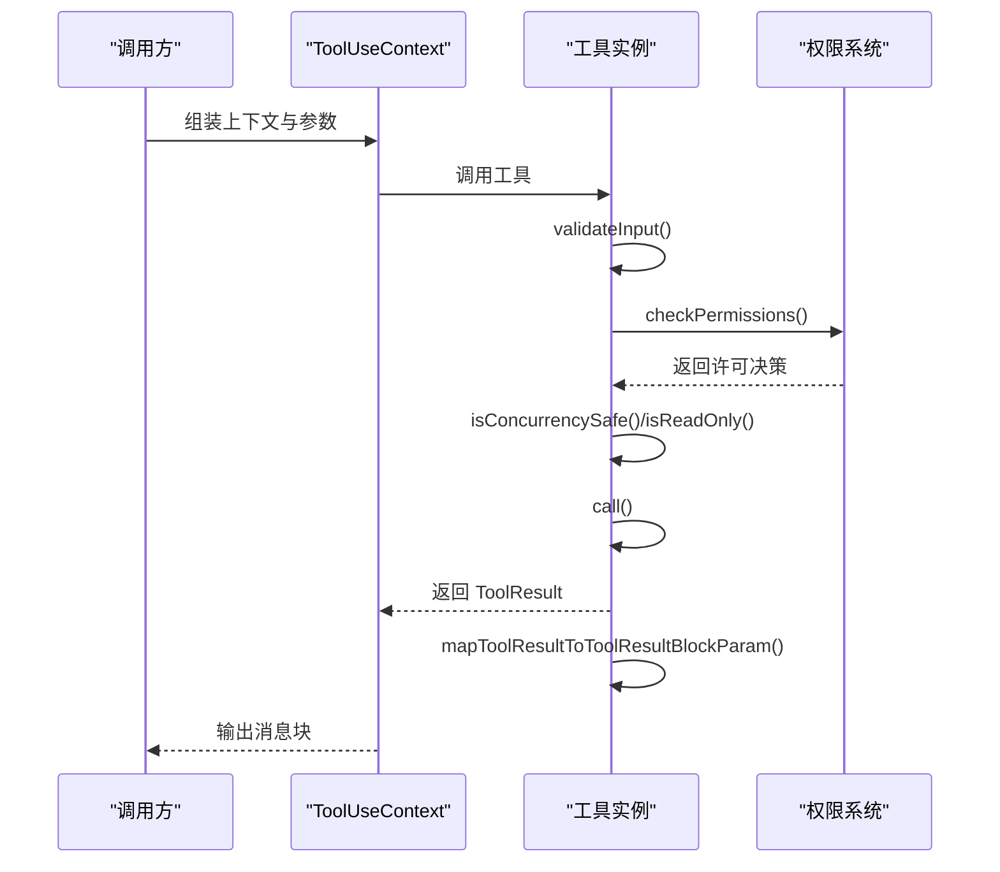
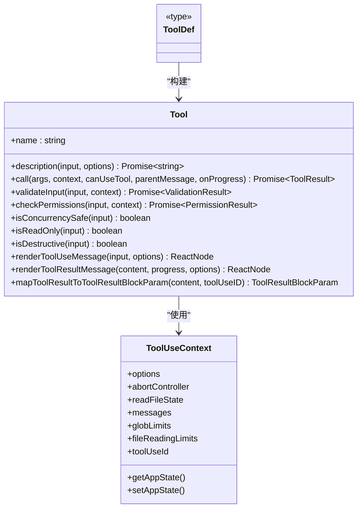
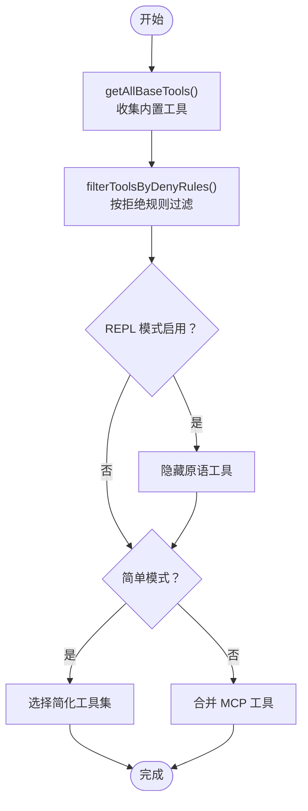
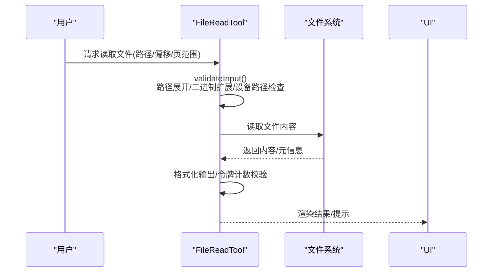
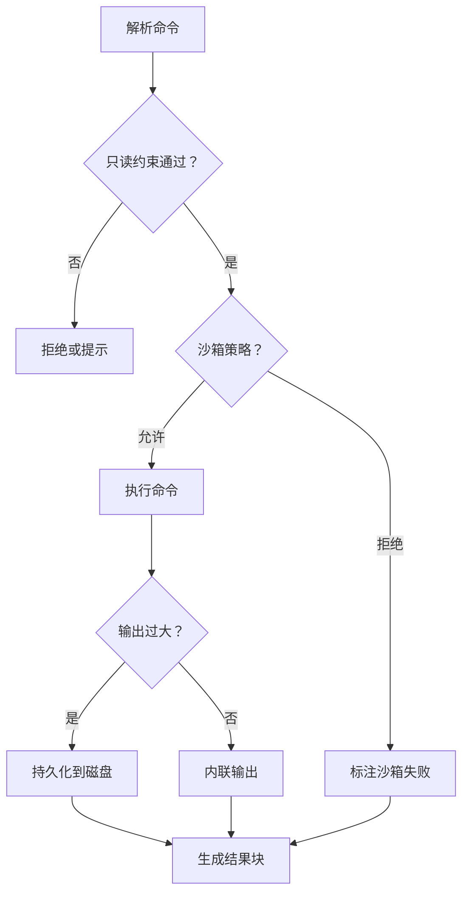
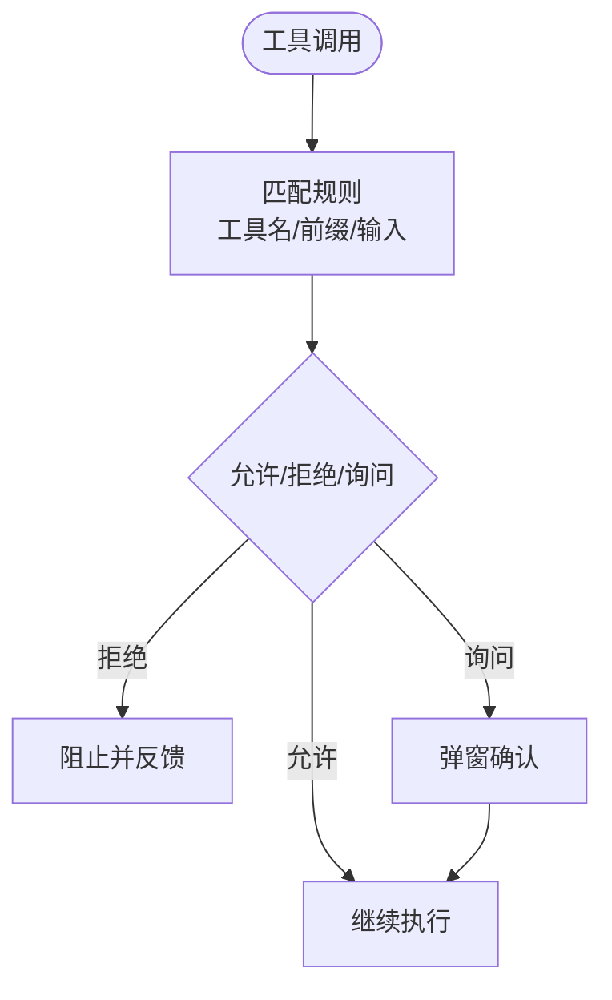
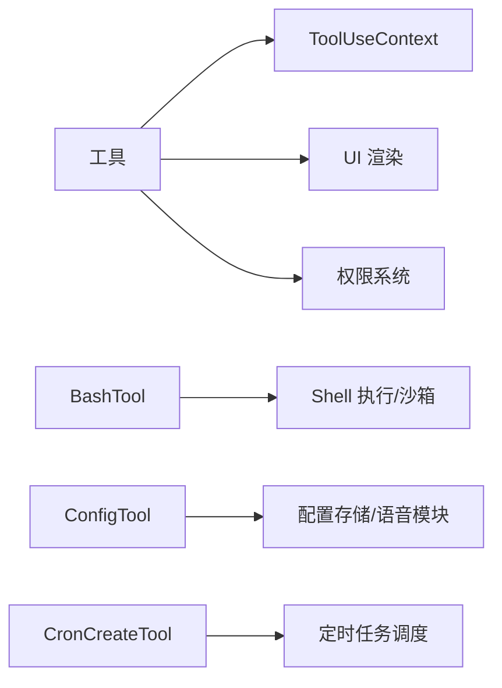

# 工具系统

<cite>
**本文档引用的文件**
- [src/Tool.ts](file://src/Tool.ts)
- [src/tools.ts](file://src/tools.ts)
- [src/tools/FileReadTool/FileReadTool.ts](file://src/tools/FileReadTool/FileReadTool.ts)
- [src/tools/FileEditTool/FileEditTool.ts](file://src/tools/FileEditTool/FileEditTool.ts)
- [src/tools/BashTool/BashTool.tsx](file://src/tools/BashTool/BashTool.tsx)
- [src/tools/AskUserQuestionTool/AskUserQuestionTool.tsx](file://src/tools/AskUserQuestionTool/AskUserQuestionTool.tsx)
- [src/tools/EnterPlanModeTool/EnterPlanModeTool.ts](file://src/tools/EnterPlanModeTool/EnterPlanModeTool.ts)
- [src/tools/ConfigTool/ConfigTool.ts](file://src/tools/ConfigTool/ConfigTool.ts)
- [src/tools/TaskCreateTool/TaskCreateTool.ts](file://src/tools/TaskCreateTool/TaskCreateTool.ts)
- [src/tools/ScheduleCronTool/CronCreateTool.ts](file://src/tools/ScheduleCronTool/CronCreateTool.ts)
- [src/utils/permissions/permissions.ts](file://src/utils/permissions/permissions.ts)
</cite>

## 目录
1. [简介](#简介)
2. [项目结构](#项目结构)
3. [核心组件](#核心组件)
4. [架构总览](#架构总览)
5. [详细组件分析](#详细组件分析)
6. [依赖关系分析](#依赖关系分析)
7. [性能考虑](#性能考虑)
8. [故障排除指南](#故障排除指南)
9. [结论](#结论)
10. [附录](#附录)

## 简介
本文件为 Claude Code 的工具系统提供全面技术文档。内容涵盖工具接口规范、工具生命周期管理、工具注册机制、权限控制、并发安全、只读与破坏性操作标记等核心概念，并对 40+ 种内置工具进行分类说明与实现要点解析。同时提供工具开发指南，包括自定义工具创建、工具验证、权限检查、结果格式化等实现细节与最佳实践。

## 项目结构
工具系统围绕统一的 Tool 接口与 buildTool 构建器展开，所有内置工具位于 src/tools 下，工具聚合与过滤逻辑集中在 src/tools.ts 中。权限规则与匹配在 src/utils/permissions 中实现。

```mermaid
graph TB
ToolInterface["Tool 接口<br/>src/Tool.ts"] --> BuildTool["buildTool 构建器<br/>src/Tool.ts"]
ToolsTS["工具聚合器<br/>src/tools.ts"] --> ToolInterface
FileRead["FileReadTool<br/>src/tools/FileReadTool/FileReadTool.ts"] --> ToolInterface
FileEdit["FileEditTool<br/>src/tools/FileEditTool/FileEditTool.ts"] --> ToolInterface
BashTool["BashTool<br/>src/tools/BashTool/BashTool.tsx"] --> ToolInterface
AskUser["AskUserQuestionTool<br/>src/tools/AskUserQuestionTool/AskUserQuestionTool.tsx"] --> ToolInterface
PlanMode["EnterPlanModeTool<br/>src/tools/EnterPlanModeTool/EnterPlanModeTool.ts"] --> ToolInterface
ConfigTool["ConfigTool<br/>src/tools/ConfigTool/ConfigTool.ts"] --> ToolInterface
TaskCreate["TaskCreateTool<br/>src/tools/TaskCreateTool/TaskCreateTool.ts"] --> ToolInterface
CronCreate["CronCreateTool<br/>src/tools/ScheduleCronTool/CronCreateTool.ts"] --> ToolInterface
Permissions["权限系统<br/>src/utils/permissions/permissions.ts"] --> ToolInterface
```

**图表来源**
- [src/Tool.ts:362-792](file://src/Tool.ts#L362-L792)
- [src/tools.ts:190-390](file://src/tools.ts#L190-L390)
- [src/tools/FileReadTool/FileReadTool.ts:337-718](file://src/tools/FileReadTool/FileReadTool.ts#L337-L718)
- [src/tools/FileEditTool/FileEditTool.ts:86-595](file://src/tools/FileEditTool/FileEditTool.ts#L86-L595)
- [src/tools/BashTool/BashTool.tsx:420-800](file://src/tools/BashTool/BashTool.tsx#L420-L800)
- [src/tools/AskUserQuestionTool/AskUserQuestionTool.tsx:109-245](file://src/tools/AskUserQuestionTool/AskUserQuestionTool.tsx#L109-L245)
- [src/tools/EnterPlanModeTool/EnterPlanModeTool.ts:36-126](file://src/tools/EnterPlanModeTool/EnterPlanModeTool.ts#L36-L126)
- [src/tools/ConfigTool/ConfigTool.ts:67-434](file://src/tools/ConfigTool/ConfigTool.ts#L67-L434)
- [src/tools/TaskCreateTool/TaskCreateTool.ts:48-138](file://src/tools/TaskCreateTool/TaskCreateTool.ts#L48-L138)
- [src/tools/ScheduleCronTool/CronCreateTool.ts:56-157](file://src/tools/ScheduleCronTool/CronCreateTool.ts#L56-L157)
- [src/utils/permissions/permissions.ts:213-390](file://src/utils/permissions/permissions.ts#L213-L390)

**章节来源**
- [src/Tool.ts:1-793](file://src/Tool.ts#L1-L793)
- [src/tools.ts:1-390](file://src/tools.ts#L1-L390)

## 核心组件
- Tool 接口：定义工具的输入输出、描述、权限检查、并发安全、只读/破坏性标记、UI 渲染、进度消息、结果映射等能力。
- buildTool：统一构建工具实例，填充默认方法与行为，确保一致性与安全性。
- 工具聚合器：根据权限上下文与环境特征组装工具集合，支持内置工具与 MCP 工具合并。
- 权限系统：基于规则的允许/拒绝/询问策略，支持通配符与前缀匹配，贯穿工具调用链。

**章节来源**
- [src/Tool.ts:362-792](file://src/Tool.ts#L362-L792)
- [src/tools.ts:271-390](file://src/tools.ts#L271-L390)
- [src/utils/permissions/permissions.ts:213-390](file://src/utils/permissions/permissions.ts#L213-L390)

## 架构总览
工具系统采用“接口 + 构建器 + 聚合器 + 权限”的分层架构。调用流程从 ToolUseContext 出发，经过 validateInput/checkPermissions/isConcurrencySafe 等步骤，最终由工具 call 执行并返回 ToolResult，再通过 mapToolResultToToolResultBlockParam 映射为消息块参数。

**图表来源**
- [src/Tool.ts:379-560](file://src/Tool.ts#L379-L560)
- [src/utils/permissions/permissions.ts:238-390](file://src/utils/permissions/permissions.ts#L238-L390)

## 详细组件分析

### Tool 接口与 buildTool
- 接口职责：统一声明工具名称、描述、输入输出模式、并发安全、只读/破坏性、权限检查、UI 渲染、进度与结果映射等。
- 默认行为：未显式实现的方法使用 TOOL_DEFAULTS 提供的安全默认值（如非并发安全、写操作、需要权限确认等）。
- 构建器：buildTool 将传入定义与默认值合并，保证所有工具具备一致的最小可用能力集。

**图表来源**
- [src/Tool.ts:362-695](file://src/Tool.ts#L362-L695)

**章节来源**
- [src/Tool.ts:362-792](file://src/Tool.ts#L362-L792)

### 工具聚合与注册机制
- getAllBaseTools：汇总所有内置工具，按环境特性动态启用/禁用（如 PowerShell、Web 浏览器、工作树模式、任务系统等）。
- getTools：根据权限上下文过滤工具，支持 REPL 模式下的工具隐藏与简单模式切换。
- assembleToolPool/getMergedTools：合并内置工具与 MCP 工具，去重并保持排序稳定，确保提示缓存命中率。

**图表来源**
- [src/tools.ts:190-390](file://src/tools.ts#L190-L390)

**章节来源**
- [src/tools.ts:190-390](file://src/tools.ts#L190-L390)

### 文件操作工具
- FileReadTool：安全读取文本/图片/PDF/笔记本文件，支持偏移与页范围读取；内置二进制扩展检测、设备路径阻断、重复读取去重、会话文件新鲜度提示与令牌计数限制。
- FileEditTool：基于已读状态的原子写入，防止并发覆盖；支持多处替换、引号风格保留、LSP/VsCode 同步通知、文件历史备份与 Git Diff 计算。

**图表来源**
- [src/tools/FileReadTool/FileReadTool.ts:418-651](file://src/tools/FileReadTool/FileReadTool.ts#L418-L651)

**章节来源**
- [src/tools/FileReadTool/FileReadTool.ts:337-718](file://src/tools/FileReadTool/FileReadTool.ts#L337-L718)
- [src/tools/FileEditTool/FileEditTool.ts:86-595](file://src/tools/FileEditTool/FileEditTool.ts#L86-L595)

### 搜索发现工具
- GlobTool/GrepTool：在无嵌入搜索工具时启用，提供文件匹配与内容搜索能力。
- ToolSearchTool：当工具搜索阈值开启时，延迟加载工具并在首次请求时决定是否推迟加载。

**章节来源**
- [src/tools.ts:190-251](file://src/tools.ts#L190-L251)

### 执行工具
- BashTool：支持只读约束、沙箱检测、后台运行、大输出持久化、图像输出压缩、命令语义解释与 Git 操作追踪；自动背景化策略与阻塞命令检测。
- PowerShellTool：与 BashTool 类似的权限与安全策略，针对 Windows PowerShell 的特殊处理。

**图表来源**
- [src/tools/BashTool/BashTool.tsx:624-800](file://src/tools/BashTool/BashTool.tsx#L624-L800)

**章节来源**
- [src/tools/BashTool/BashTool.tsx:420-800](file://src/tools/BashTool/BashTool.tsx#L420-L800)

### 交互工具
- AskUserQuestionTool：多选问题收集，支持预览格式校验、渠道限制、用户答案与注释记录，结果映射为简洁文本。

**章节来源**
- [src/tools/AskUserQuestionTool/AskUserQuestionTool.tsx:109-245](file://src/tools/AskUserQuestionTool/AskUserQuestionTool.tsx#L109-L245)

### 计划工作流工具
- EnterPlanModeTool：进入计划模式，更新权限上下文与 UI 展开状态，支持面试阶段的严格只读约束。
- TaskCreateTool：创建任务并执行创建钩子，支持元数据附加与自动展开任务列表。

**章节来源**
- [src/tools/EnterPlanModeTool/EnterPlanModeTool.ts:36-126](file://src/tools/EnterPlanModeTool/EnterPlanModeTool.ts#L36-L126)
- [src/tools/TaskCreateTool/TaskCreateTool.ts:48-138](file://src/tools/TaskCreateTool/TaskCreateTool.ts#L48-L138)

### 系统工具
- ConfigTool：读取/设置全局与用户配置，支持选项校验、异步验证、语音模式前置检查与即时 AppState 同步。
- ScheduleCronTool：创建定时任务，支持一次性/周期性、内存/持久化两种模式，限制最大任务数量与同伴代理场景约束。

**章节来源**
- [src/tools/ConfigTool/ConfigTool.ts:67-434](file://src/tools/ConfigTool/ConfigTool.ts#L67-L434)
- [src/tools/ScheduleCronTool/CronCreateTool.ts:56-157](file://src/tools/ScheduleCronTool/CronCreateTool.ts#L56-L157)

### 权限控制机制
- 规则来源：alwaysAllowRules/alwaysDenyRules/alwaysAskRules，支持通配符与前缀匹配。
- 匹配策略：工具级全名匹配、MCP 服务器前缀匹配、输入级通配符匹配（preparePermissionMatcher）。
- 决策流程：先按规则匹配，再执行工具特定 checkPermissions，最后由 UI 弹窗确认或自动批准。

**图表来源**
- [src/utils/permissions/permissions.ts:238-390](file://src/utils/permissions/permissions.ts#L238-L390)

**章节来源**
- [src/utils/permissions/permissions.ts:213-390](file://src/utils/permissions/permissions.ts#L213-L390)

## 依赖关系分析
- 工具到上下文：工具通过 ToolUseContext 获取 AppState、文件状态缓存、消息与权限上下文。
- 工具到权限：工具可自定义 checkPermissions，也可依赖通用规则匹配。
- 工具到 UI：工具提供渲染函数用于消息、进度、拒绝/错误 UI。
- 工具到外部：BashTool 依赖 Shell 执行与沙箱适配；ConfigTool 依赖配置存储与语音模块；CronCreateTool 依赖定时任务调度。

**图表来源**
- [src/Tool.ts:158-300](file://src/Tool.ts#L158-L300)
- [src/tools/BashTool/BashTool.tsx:31-51](file://src/tools/BashTool/BashTool.tsx#L31-L51)
- [src/tools/ConfigTool/ConfigTool.ts:11-34](file://src/tools/ConfigTool/ConfigTool.ts#L11-L34)
- [src/tools/ScheduleCronTool/CronCreateTool.ts:1-23](file://src/tools/ScheduleCronTool/CronCreateTool.ts#L1-L23)

**章节来源**
- [src/Tool.ts:158-300](file://src/Tool.ts#L158-L300)

## 性能考虑
- 并发安全：isConcurrencySafe 控制工具并发执行策略；非并发安全工具需串行化。
- 只读优先：isReadOnly 与只读约束检查减少副作用风险，提升交互体验。
- 大输出处理：BashTool 对超长输出进行持久化与预览，避免内存与传输压力。
- 重复读取去重：FileReadTool 基于 readFileState 缓存与时间戳判断，避免重复发送相同内容。
- 结果大小限制：工具 maxResultSizeChars 限制内联结果大小，超过阈值自动落盘。

[本节为通用指导，无需列出具体文件来源]

## 故障排除指南
- 文件读取错误：路径不存在时尝试替代 macOS 截图空格变体、相似文件建议与 CWD 提示。
- 文件编辑冲突：若文件在读取后被修改，拒绝写入以避免覆盖；空字符串写入仅允许新建空文件。
- BashTool 阻塞命令：长时间阻塞命令会被拦截并建议使用后台运行或 Monitor 工具。
- 权限拒绝：检查 alwaysDenyRules/alwaysAskRules 与工具级 checkPermissions 返回值。
- 定时任务：检查 cron 表达式合法性、最大任务数量限制与同伴代理持久化约束。

**章节来源**
- [src/tools/FileReadTool/FileReadTool.ts:609-650](file://src/tools/FileReadTool/FileReadTool.ts#L609-L650)
- [src/tools/FileEditTool/FileEditTool.ts:275-311](file://src/tools/FileEditTool/FileEditTool.ts#L275-L311)
- [src/tools/BashTool/BashTool.tsx:524-538](file://src/tools/BashTool/BashTool.tsx#L524-L538)
- [src/utils/permissions/permissions.ts:238-390](file://src/utils/permissions/permissions.ts#L238-L390)
- [src/tools/ScheduleCronTool/CronCreateTool.ts:82-116](file://src/tools/ScheduleCronTool/CronCreateTool.ts#L82-L116)

## 结论
Claude Code 的工具系统通过统一的 Tool 接口与 buildTool 构建器，结合严格的权限控制与并发安全策略，实现了高可扩展、可审计、可交互的工具生态。内置工具覆盖文件操作、搜索发现、执行、交互、计划工作流与系统配置等多个领域，并通过聚合器与 MCP 工具无缝集成。开发者可遵循本文档的接口规范与最佳实践，快速创建符合安全与用户体验要求的自定义工具。

[本节为总结性内容，无需列出具体文件来源]

## 附录

### 工具开发指南
- 创建工具：使用 buildTool 定义工具，至少实现 name、description、prompt、inputSchema、outputSchema、call 与必要的 UI 渲染函数。
- 输入验证：在 validateInput 中进行参数合法性与环境限制检查，尽早失败。
- 权限检查：在 checkPermissions 中实现工具特定规则，必要时使用 preparePermissionMatcher 进行复杂匹配。
- 并发与只读：明确 isConcurrencySafe 与 isReadOnly，避免竞态与副作用。
- 结果映射：实现 mapToolResultToToolResultBlockParam，确保消息块参数与 UI 渲染一致。
- 最佳实践：合理设置 maxResultSizeChars，对大输出进行持久化；提供清晰的 userFacingName 与 getToolUseSummary；在 renderToolUseMessage/renderToolResultMessage 中保持一致的用户体验。

[本节为通用指导，无需列出具体文件来源]