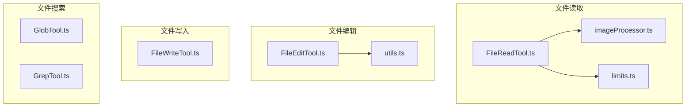
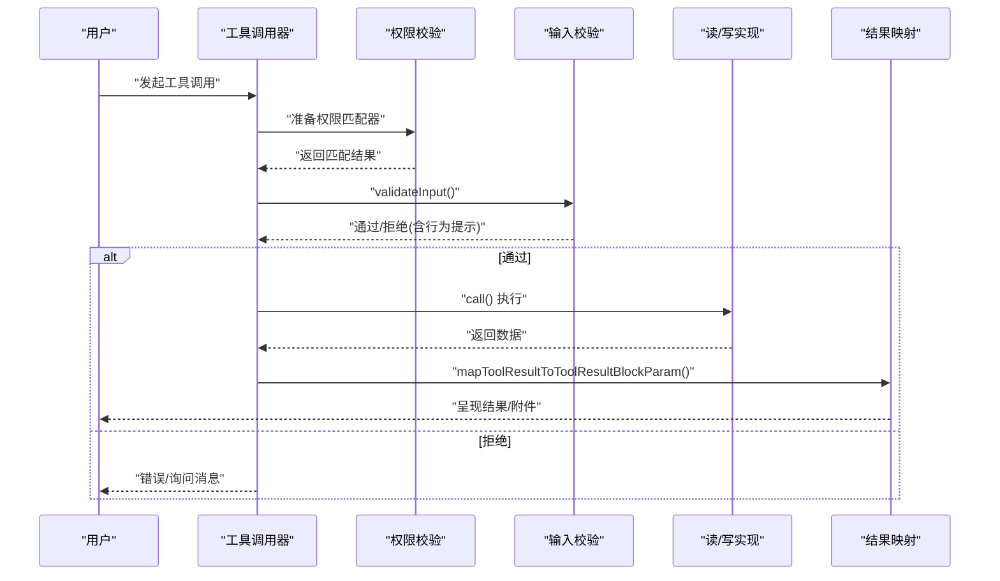
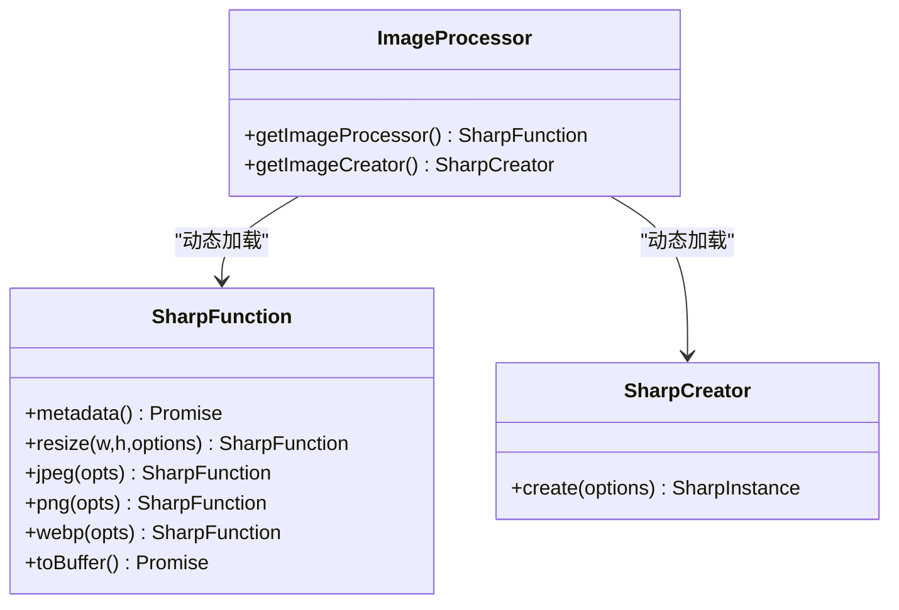
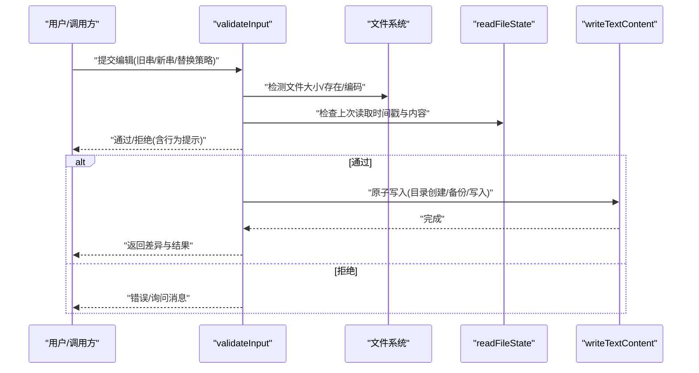
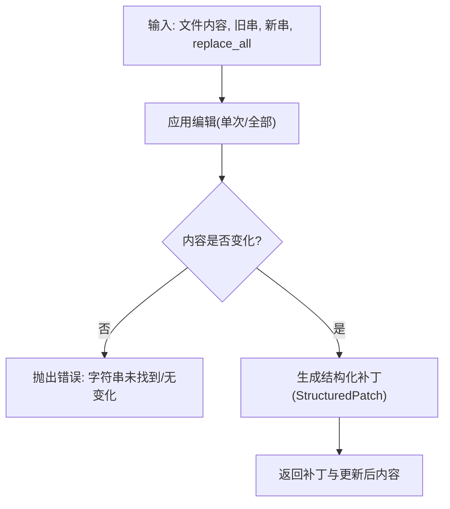
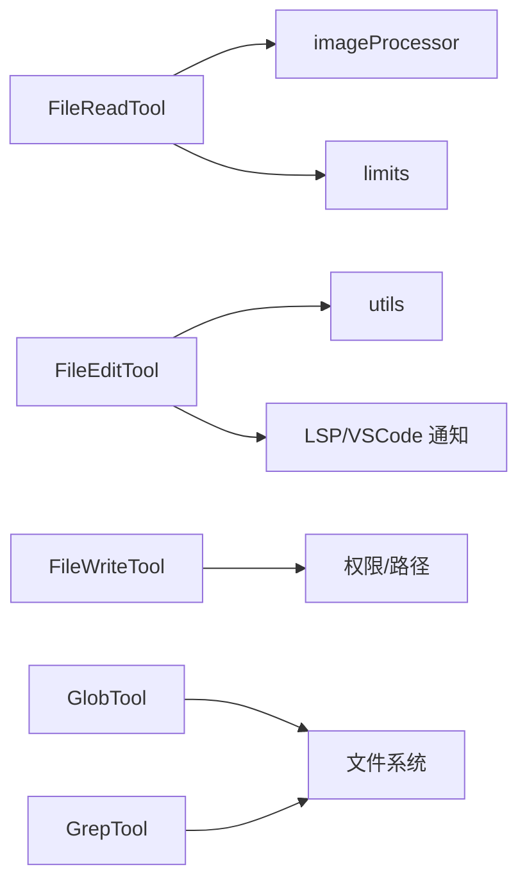

# 文件操作工具

<cite>
**本文引用的文件**
- [src/tools/FileReadTool/FileReadTool.ts](file://src/tools/FileReadTool/FileReadTool.ts)
- [src/tools/FileReadTool/imageProcessor.ts](file://src/tools/FileReadTool/imageProcessor.ts)
- [src/tools/FileReadTool/limits.ts](file://src/tools/FileReadTool/limits.ts)
- [src/tools/FileEditTool/FileEditTool.ts](file://src/tools/FileEditTool/FileEditTool.ts)
- [src/tools/FileEditTool/utils.ts](file://src/tools/FileEditTool/utils.ts)
- [src/tools/FileWriteTool/FileWriteTool.ts](file://src/tools/FileWriteTool/FileWriteTool.ts)
- [src/tools/GlobTool/GlobTool.ts](file://src/tools/GlobTool/GlobTool.ts)
- [src/tools/GrepTool/GrepTool.ts](file://src/tools/GrepTool/GrepTool.ts)
</cite>

## 目录
1. [简介](#简介)
2. [项目结构](#项目结构)
3. [核心组件](#核心组件)
4. [架构总览](#架构总览)
5. [详细组件分析](#详细组件分析)
6. [依赖关系分析](#依赖关系分析)
7. [性能考量](#性能考量)
8. [故障排查指南](#故障排查指南)
9. [结论](#结论)
10. [附录](#附录)

## 简介
本文件面向 Claude Code 的文件操作工具集，系统性梳理以下工具的能力边界与实现要点：
- 文件读取工具（FileReadTool）：文本、图像、PDF、Jupyter Notebook 的读取与展示；大小与令牌数限制；编码与设备文件安全防护；macOS 截图路径兼容；重复读取去重。
- 文件编辑工具（FileEditTool）：原地修改、差异生成与展示、权限与安全校验、编码与换行保持、笔记文件拦截、原子写入与 LSP 通知。
- 文件写入工具（FileWriteTool）：基于权限与输入校验的写入流程，结合安全与合规策略。
- 文件搜索工具（GlobTool、GrepTool）：通配符匹配与正则检索、性能优化策略。

同时给出最佳实践与安全注意事项，帮助在保证安全的前提下高效使用文件工具链。

## 项目结构
文件操作工具位于 src/tools 下，按功能分目录组织，每个工具均遵循统一的 ToolDef 构建模式，具备输入/输出 Schema、权限校验、UI 渲染与结果映射等能力。

图表来源
- [src/tools/FileReadTool/FileReadTool.ts:1-120](file://src/tools/FileReadTool/FileReadTool.ts#L1-L120)
- [src/tools/FileReadTool/imageProcessor.ts:1-95](file://src/tools/FileReadTool/imageProcessor.ts#L1-L95)
- [src/tools/FileReadTool/limits.ts:1-93](file://src/tools/FileReadTool/limits.ts#L1-L93)
- [src/tools/FileEditTool/FileEditTool.ts:1-120](file://src/tools/FileEditTool/FileEditTool.ts#L1-L120)
- [src/tools/FileEditTool/utils.ts:1-120](file://src/tools/FileEditTool/utils.ts#L1-L120)
- [src/tools/FileWriteTool/FileWriteTool.ts:1-120](file://src/tools/FileWriteTool/FileWriteTool.ts#L1-L120)
- [src/tools/GlobTool/GlobTool.ts:1-120](file://src/tools/GlobTool/GlobTool.ts#L1-L120)
- [src/tools/GrepTool/GrepTool.ts:1-120](file://src/tools/GrepTool/GrepTool.ts#L1-L120)

章节来源
- [src/tools/FileReadTool/FileReadTool.ts:1-120](file://src/tools/FileReadTool/FileReadTool.ts#L1-L120)
- [src/tools/FileEditTool/FileEditTool.ts:1-120](file://src/tools/FileEditTool/FileEditTool.ts#L1-L120)
- [src/tools/FileWriteTool/FileWriteTool.ts:1-120](file://src/tools/FileWriteTool/FileWriteTool.ts#L1-L120)
- [src/tools/GlobTool/GlobTool.ts:1-120](file://src/tools/GlobTool/GlobTool.ts#L1-L120)
- [src/tools/GrepTool/GrepTool.ts:1-120](file://src/tools/GrepTool/GrepTool.ts#L1-L120)

## 核心组件
- FileReadTool：读取文本、图像、PDF、Notebook，支持偏移范围读取与页面范围读取（PDF），内置大小与令牌上限，设备文件阻断，macOS 截图路径兼容，重复读取去重。
- FileEditTool：在读取后进行原子写入，生成结构化差异，保持编码与换行风格，拦截笔记文件，通知 LSP 与 VSCode，支持多处替换与单次替换。
- FileWriteTool：基于权限与输入校验执行写入，结合安全与合规策略。
- GlobTool：基于通配符的路径匹配，支持忽略规则与大小写敏感选项。
- GrepTool：基于正则表达式的文本检索，支持多文件、上下文行、超时与性能优化。

章节来源
- [src/tools/FileReadTool/FileReadTool.ts:337-718](file://src/tools/FileReadTool/FileReadTool.ts#L337-L718)
- [src/tools/FileEditTool/FileEditTool.ts:86-595](file://src/tools/FileEditTool/FileEditTool.ts#L86-L595)
- [src/tools/FileWriteTool/FileWriteTool.ts:1-200](file://src/tools/FileWriteTool/FileWriteTool.ts#L1-L200)
- [src/tools/GlobTool/GlobTool.ts:1-200](file://src/tools/GlobTool/GlobTool.ts#L1-L200)
- [src/tools/GrepTool/GrepTool.ts:1-200](file://src/tools/GrepTool/GrepTool.ts#L1-L200)

## 架构总览
文件工具链围绕 ToolDef 模式构建，统一的输入/输出 Schema、权限校验、UI 渲染与结果映射，确保跨工具的一致体验与安全基线。

图表来源
- [src/tools/FileReadTool/FileReadTool.ts:398-495](file://src/tools/FileReadTool/FileReadTool.ts#L398-L495)
- [src/tools/FileEditTool/FileEditTool.ts:125-132](file://src/tools/FileEditTool/FileEditTool.ts#L125-L132)
- [src/tools/FileWriteTool/FileWriteTool.ts:1-200](file://src/tools/FileWriteTool/FileWriteTool.ts#L1-L200)

## 详细组件分析

### 文件读取工具（FileReadTool）
- 功能特性
  - 文本读取：支持偏移与行数限制，避免一次性读取超大文件导致内存与令牌溢出。
  - 图像处理：动态加载图像处理器（原生或 sharp），支持尺寸与格式转换，返回 Base64 与维度信息。
  - PDF 支持：解析页码范围、提取页数、返回 PDF 元数据与可选拆分图片。
  - Notebook 解析：读取 Jupyter Notebook 单元格并映射为工具结果。
  - 安全与合规：阻断设备文件（如 /dev/zero）、UNC 路径安全处理、二进制扩展名白名单（排除纯二进制）、会话文件类型检测与风险提醒。
  - 编码与大小限制：默认最大输出令牌数与字节数限制，支持环境变量覆盖；令牌计数采用预估与实际 API 计数双重策略。
  - macOS 截图兼容：自动尝试薄空格与常规空格变体路径。
  - 去重优化：对同一文件同范围读取且未变更的场景返回“文件未变化”占位，减少缓存开销。

- 关键流程（令牌与大小限制）

图表来源
- [src/tools/FileReadTool/FileReadTool.ts:508-507](file://src/tools/FileReadTool/FileReadTool.ts#L508-L507)
- [src/tools/FileReadTool/limits.ts:53-92](file://src/tools/FileReadTool/limits.ts#L53-L92)
- [src/tools/FileReadTool/FileReadTool.ts:755-772](file://src/tools/FileReadTool/FileReadTool.ts#L755-L772)

- 图像处理模块

图表来源
- [src/tools/FileReadTool/imageProcessor.ts:1-95](file://src/tools/FileReadTool/imageProcessor.ts#L1-L95)

- 重复读取去重

```mermaid
sequenceDiagram
participant C as "调用方"
participant R as "FileReadTool.call"
participant S as "readFileState"
participant FS as "文件系统"
C->>R : "请求读取(文件, offset, limit)"
R->>S : "查询上次读取状态"
alt 存在且非部分视图且范围一致
R->>FS : "stat 获取 mtime"
FS-->>R : "mtime"
alt mtime 未变化
R-->>C : "返回 file_unchanged 占位"
else 变化
R->>R : "继续完整读取"
end
else 不满足去重条件
R->>R : "继续完整读取"
end
```

图表来源
- [src/tools/FileReadTool/FileReadTool.ts:523-573](file://src/tools/FileReadTool/FileReadTool.ts#L523-L573)

章节来源
- [src/tools/FileReadTool/FileReadTool.ts:337-718](file://src/tools/FileReadTool/FileReadTool.ts#L337-L718)
- [src/tools/FileReadTool/imageProcessor.ts:1-95](file://src/tools/FileReadTool/imageProcessor.ts#L1-L95)
- [src/tools/FileReadTool/limits.ts:1-93](file://src/tools/FileReadTool/limits.ts#L1-L93)

### 文件编辑工具（FileEditTool）
- 功能特性
  - 权限与安全：拒绝写入团队内存密钥、拒绝过大文件（>1GiB）、UNC 路径不触发文件系统操作以避免凭据泄露。
  - 一致性校验：要求先读取再写入，若自上次读取以来文件被外部修改且内容不一致则拒绝。
  - 编码与换行：读取时探测 UTF-16 LE（BOM）并统一换行符，写回时保持原编码与换行风格。
  - 差异生成：使用结构化补丁生成差异，支持单次替换与全部替换，提供上下文片段与行号。
  - 笔记本拦截：禁止对 .ipynb 使用文本替换工具，引导使用专用笔记本编辑工具。
  - 原子写入：确保目录存在、备份（可选）、写入与 LSP/VSCode 通知的原子性与一致性。
  - 输入归一化：处理引号风格、去除尾随空白（除 Markdown 外）、反净化匹配字符串，提升命中率。

- 关键流程（编辑校验与写入）

图表来源
- [src/tools/FileEditTool/FileEditTool.ts:137-362](file://src/tools/FileEditTool/FileEditTool.ts#L137-L362)
- [src/tools/FileEditTool/FileEditTool.ts:387-574](file://src/tools/FileEditTool/FileEditTool.ts#L387-L574)
- [src/tools/FileEditTool/utils.ts:234-350](file://src/tools/FileEditTool/utils.ts#L234-L350)

- 工具方法与差异生成

图表来源
- [src/tools/FileEditTool/utils.ts:234-350](file://src/tools/FileEditTool/utils.ts#L234-L350)
- [src/tools/FileEditTool/utils.ts:417-457](file://src/tools/FileEditTool/utils.ts#L417-L457)

章节来源
- [src/tools/FileEditTool/FileEditTool.ts:86-595](file://src/tools/FileEditTool/FileEditTool.ts#L86-L595)
- [src/tools/FileEditTool/utils.ts:1-776](file://src/tools/FileEditTool/utils.ts#L1-L776)

### 文件写入工具（FileWriteTool）
- 功能特性
  - 基于权限与输入校验的写入流程，结合安全与合规策略，确保仅在允许范围内写入。
  - 与 FileEditTool 类似的路径规范化与权限匹配器准备，保障跨工具一致性。
  - 结合 UI 渲染与结果映射，向用户反馈写入状态与可能的差异摘要。

章节来源
- [src/tools/FileWriteTool/FileWriteTool.ts:1-200](file://src/tools/FileWriteTool/FileWriteTool.ts#L1-L200)

### 文件搜索工具（GlobTool、GrepTool）
- GlobTool
  - 通配符匹配：支持多模式组合、忽略规则、大小写敏感选项。
  - 性能优化：基于工作树扫描与缓存策略，避免重复计算。
- GrepTool
  - 正则检索：支持多文件、上下文行、超时控制，避免长时间阻塞。
  - 性能优化：分块读取、超时中断、结果截断与上下文片段生成。

章节来源
- [src/tools/GlobTool/GlobTool.ts:1-200](file://src/tools/GlobTool/GlobTool.ts#L1-L200)
- [src/tools/GrepTool/GrepTool.ts:1-200](file://src/tools/GrepTool/GrepTool.ts#L1-L200)

## 依赖关系分析
- FileReadTool 依赖
  - 图像处理：imageProcessor.ts 提供动态加载 sharp 或原生模块。
  - 限额配置：limits.ts 提供默认与可覆盖的读取限额。
  - 权限与路径：权限匹配、UNC 安全、路径展开与二进制扩展名判断。
- FileEditTool 依赖
  - 差异工具：utils.ts 提供补丁生成、片段截取、输入归一化。
  - LSP/VSCode：编辑后通知与保存事件，触发诊断与差异视图。
  - 团队内存密钥保护：防止将敏感信息写入团队记忆文件。
- FileWriteTool 与搜索工具
  - 统一的权限与路径处理，结合 UI 与结果映射。

图表来源
- [src/tools/FileReadTool/FileReadTool.ts:1-120](file://src/tools/FileReadTool/FileReadTool.ts#L1-L120)
- [src/tools/FileReadTool/imageProcessor.ts:1-95](file://src/tools/FileReadTool/imageProcessor.ts#L1-L95)
- [src/tools/FileReadTool/limits.ts:1-93](file://src/tools/FileReadTool/limits.ts#L1-L93)
- [src/tools/FileEditTool/FileEditTool.ts:1-120](file://src/tools/FileEditTool/FileEditTool.ts#L1-L120)
- [src/tools/FileEditTool/utils.ts:1-120](file://src/tools/FileEditTool/utils.ts#L1-L120)
- [src/tools/GlobTool/GlobTool.ts:1-120](file://src/tools/GlobTool/GlobTool.ts#L1-L120)
- [src/tools/GrepTool/GrepTool.ts:1-120](file://src/tools/GrepTool/GrepTool.ts#L1-L120)

## 性能考量
- 读取侧
  - 令牌与字节双限：先按字节阈值快速失败，再按令牌阈值精确计数，避免大文件带来的内存与 API 成本。
  - 去重：对未变更的完整读取进行占位返回，显著降低重复读取成本。
  - 图像处理：优先使用原生模块，降级到 sharp，并在需要时进行尺寸与质量调整。
- 编辑侧
  - 结构化补丁：直接比较旧/新内容生成补丁，避免二次全量替换，降低大文件处理开销。
  - 上下文片段：限定差异片段长度，平衡可观测性与传输成本。
- 搜索侧
  - Glob：基于工作树与缓存，避免重复扫描。
  - Grep：分块读取、超时控制、上下文截断，避免长时间阻塞。

## 故障排查指南
- 文件不存在
  - FileReadTool：尝试 macOS 截图薄空格路径变体，随后提供相似文件与当前工作目录建议。
  - FileEditTool：若目标文件不存在且旧串为空，视为新建文件；否则提示不存在并建议相似文件或当前工作目录路径。
- 字符串未找到
  - FileEditTool：当旧串在文件中找不到时，提示并返回元信息（绝对路径标识、实际旧串等），便于进一步定位。
- 文件已被外部修改
  - FileEditTool：若自上次读取以来文件被修改且内容不一致，则拒绝写入，提示先重新读取。
- 过大文件
  - FileEditTool：超过 1GiB 的文件拒绝编辑；FileReadTool：超过 maxSizeBytes 抛出预读错误。
- UNC 路径
  - FileReadTool/FileEditTool：Windows UNC 路径不触发文件系统操作，避免凭据泄露风险。
- 团队内存密钥
  - FileEditTool：检测到将敏感信息写入团队记忆文件时拒绝编辑。
- PDF/图像读取
  - FileReadTool：PDF 支持页范围与拆分；图像支持尺寸与格式转换；注意令牌上限与尺寸控制。

章节来源
- [src/tools/FileReadTool/FileReadTool.ts:609-650](file://src/tools/FileReadTool/FileReadTool.ts#L609-L650)
- [src/tools/FileEditTool/FileEditTool.ts:176-200](file://src/tools/FileEditTool/FileEditTool.ts#L176-L200)
- [src/tools/FileEditTool/FileEditTool.ts:275-311](file://src/tools/FileEditTool/FileEditTool.ts#L275-L311)
- [src/tools/FileEditTool/FileEditTool.ts:345-359](file://src/tools/FileEditTool/FileEditTool.ts#L345-L359)

## 结论
文件操作工具链在安全、性能与可用性之间取得平衡：通过严格的权限与输入校验、令牌与字节双限、结构化差异与上下文片段、以及原生图像处理与去重优化，既满足日常开发需求，又有效规避风险与资源浪费。建议在使用中遵循最佳实践，优先采用范围读取与差异展示，谨慎处理大文件与敏感内容。

## 附录
- 最佳实践
  - 优先使用偏移与行数参数读取大文件，避免一次性读取整文件。
  - 对 PDF 使用页范围参数，避免一次性提取过多页面。
  - 先读取再编辑，确保文件未被外部修改；必要时重新读取。
  - 使用 replace_all 时明确意图，避免误替换；单次替换更安全。
  - 注意编码与换行风格，避免引入不可预期的差异。
  - 对图像与 PDF 控制尺寸与质量，避免超出令牌上限。
- 安全注意事项
  - 避免读取设备文件与特殊路径，防止阻塞或无限输出。
  - 不要将敏感信息写入团队记忆文件。
  - UNC 路径不进行文件系统操作，避免凭据泄露。
  - 对二进制文件使用专用工具，避免误读取造成资源浪费。