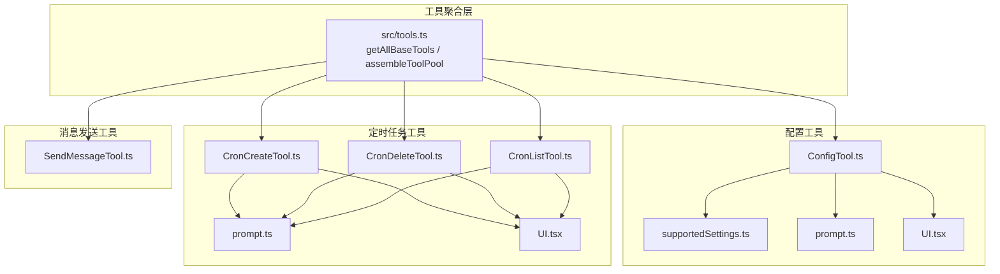
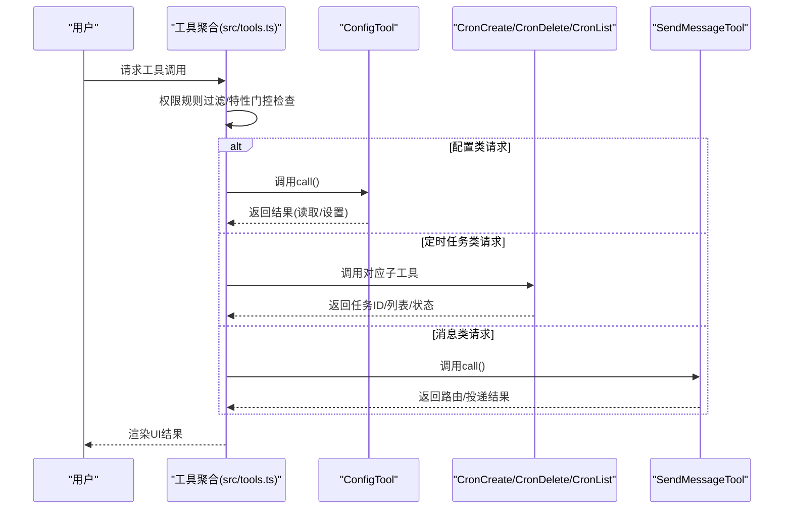
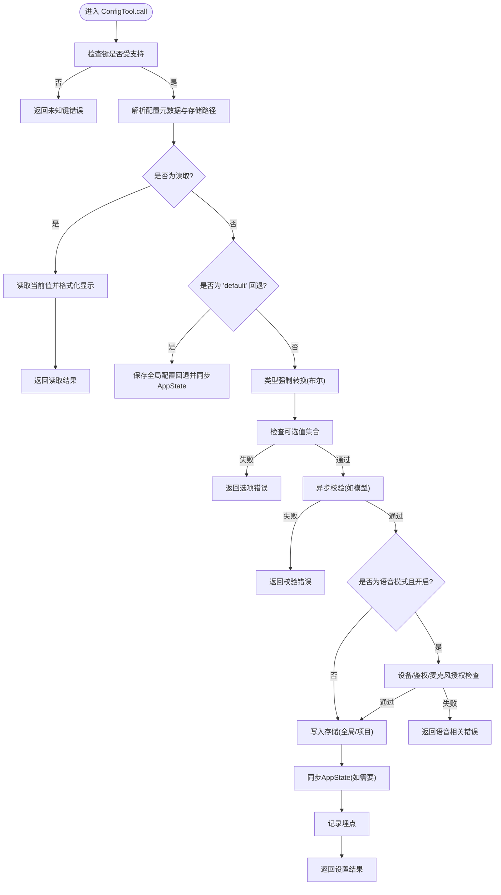
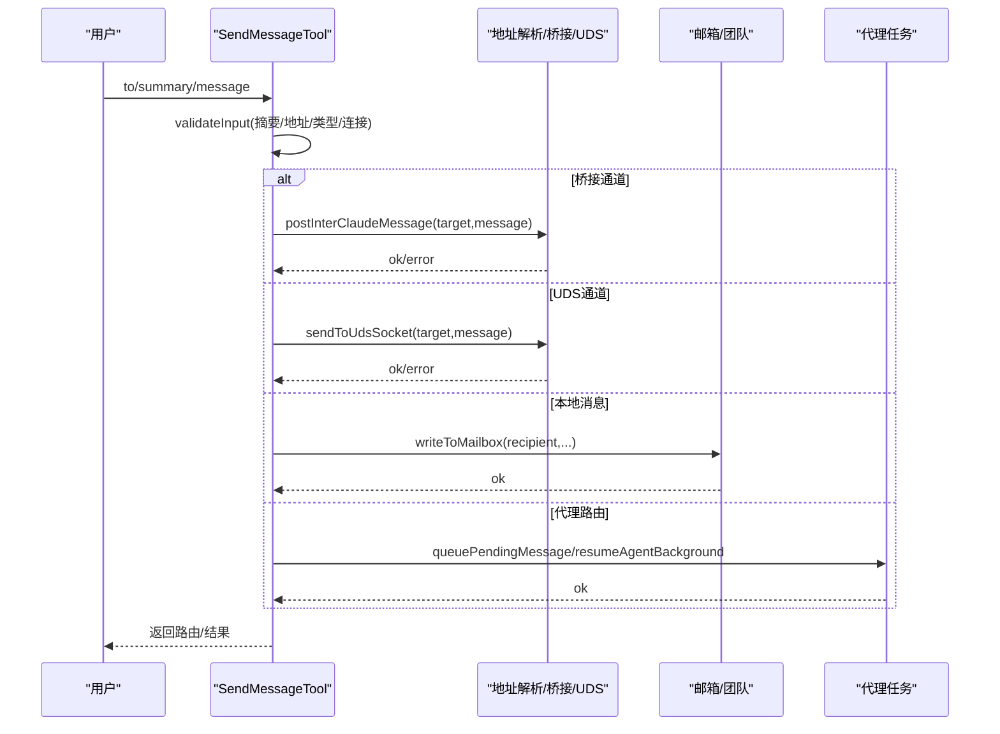
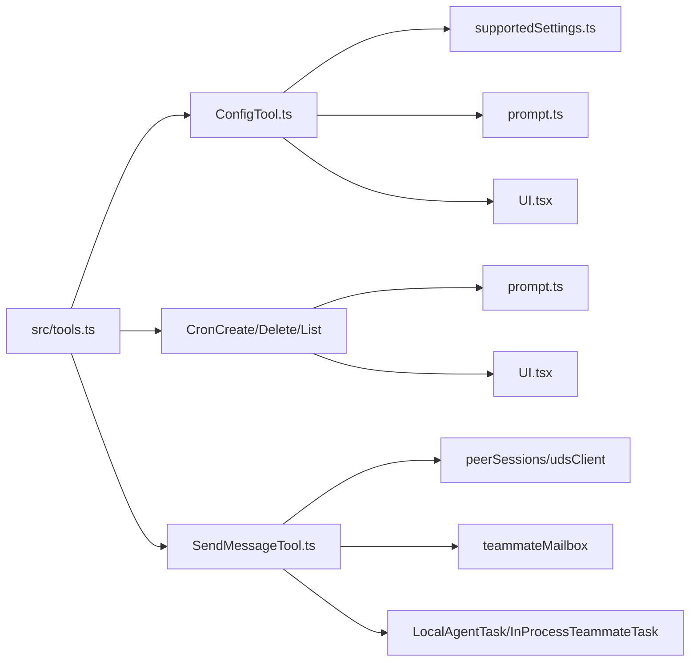

# 系统配置工具

<cite>
**本文档引用的文件**
- [src/tools.ts](file://src/tools.ts)
- [src/tools/ConfigTool/ConfigTool.ts](file://src/tools/ConfigTool/ConfigTool.ts)
- [src/tools/ConfigTool/supportedSettings.ts](file://src/tools/ConfigTool/supportedSettings.ts)
- [src/tools/ConfigTool/prompt.ts](file://src/tools/ConfigTool/prompt.ts)
- [src/tools/ConfigTool/UI.tsx](file://src/tools/ConfigTool/UI.tsx)
- [src/tools/ConfigTool/constants.ts](file://src/tools/ConfigTool/constants.ts)
- [src/tools/ScheduleCronTool/CronCreateTool.ts](file://src/tools/ScheduleCronTool/CronCreateTool.ts)
- [src/tools/ScheduleCronTool/CronDeleteTool.ts](file://src/tools/ScheduleCronTool/CronDeleteTool.ts)
- [src/tools/ScheduleCronTool/CronListTool.ts](file://src/tools/ScheduleCronTool/CronListTool.ts)
- [src/tools/ScheduleCronTool/prompt.ts](file://src/tools/ScheduleCronTool/prompt.ts)
- [src/tools/ScheduleCronTool/UI.tsx](file://src/tools/ScheduleCronTool/UI.tsx)
- [src/tools/SendMessageTool/SendMessageTool.ts](file://src/tools/SendMessageTool/SendMessageTool.ts)
</cite>

## 目录
1. [简介](#简介)
2. [项目结构](#项目结构)
3. [核心组件](#核心组件)
4. [架构总览](#架构总览)
5. [详细组件分析](#详细组件分析)
6. [依赖关系分析](#依赖关系分析)
7. [性能考量](#性能考量)
8. [故障排查指南](#故障排查指南)
9. [结论](#结论)
10. [附录](#附录)

## 简介
本文件面向Claude Code的系统配置工具，围绕以下目标展开：ConfigTool（配置读取与设置管理）、ScheduleCronTool（定时任务调度）与SendMessageTool（消息发送与团队通信）。文档将从架构、数据流、处理逻辑、权限控制、错误处理与性能优化等方面进行深入解析，并提供最佳实践与安全注意事项。

## 项目结构
- 工具注册与装配集中在工具聚合入口，按运行时特征门控动态启用/禁用特定工具。
- ConfigTool负责全局与项目级配置的读取、校验、写入与即时UI同步。
- ScheduleCronTool包含创建、删除、列出三类子工具，统一通过特征门控与运行时策略控制可用性。
- SendMessageTool负责同会话内或跨会话（桥接/UDS）的消息投递与团队协议交互。



图表来源
- [src/tools.ts:193-251](file://src/tools.ts#L193-L251)
- [src/tools/ConfigTool/ConfigTool.ts:67-434](file://src/tools/ConfigTool/ConfigTool.ts#L67-L434)
- [src/tools/ScheduleCronTool/CronCreateTool.ts:56-157](file://src/tools/ScheduleCronTool/CronCreateTool.ts#L56-L157)
- [src/tools/ScheduleCronTool/CronDeleteTool.ts:35-95](file://src/tools/ScheduleCronTool/CronDeleteTool.ts#L35-L95)
- [src/tools/ScheduleCronTool/CronListTool.ts:37-97](file://src/tools/ScheduleCronTool/CronListTool.ts#L37-L97)
- [src/tools/SendMessageTool/SendMessageTool.ts:520-917](file://src/tools/SendMessageTool/SendMessageTool.ts#L520-L917)

章节来源
- [src/tools.ts:193-251](file://src/tools.ts#L193-L251)

## 核心组件
- 工具聚合与装配：根据环境变量与特性门控生成工具清单，过滤权限拒绝规则，合并内置与MCP工具并去重。
- 配置工具（ConfigTool）：统一的配置读取/设置入口，支持类型校验、选项约束、异步验证、格式化显示与AppState同步。
- 定时任务工具集（ScheduleCronTool）：创建、删除、列出定时任务；支持会话内与持久化两种生命周期；具备输入校验与并发安全。
- 消息发送工具（SendMessageTool）：支持点对点、广播、结构化请求/响应（关机/计划审批），跨会话通过桥接或UDS通道投递。

章节来源
- [src/tools.ts:271-327](file://src/tools.ts#L271-L327)
- [src/tools.ts:345-367](file://src/tools.ts#L345-L367)

## 架构总览
工具体系采用“构建期死代码消除 + 运行时特性门控”的双层控制策略，确保在不同部署形态下仅暴露必要的能力。ConfigTool与ScheduleCronTool均通过特征门控与运行时策略决定是否启用；SendMessageTool则基于代理编队能力开关启用。



图表来源
- [src/tools.ts:271-327](file://src/tools.ts#L271-L327)
- [src/tools/ConfigTool/ConfigTool.ts:111-411](file://src/tools/ConfigTool/ConfigTool.ts#L111-L411)
- [src/tools/ScheduleCronTool/CronCreateTool.ts:117-142](file://src/tools/ScheduleCronTool/CronCreateTool.ts#L117-L142)
- [src/tools/ScheduleCronTool/CronDeleteTool.ts:82-84](file://src/tools/ScheduleCronTool/CronDeleteTool.ts#L82-L84)
- [src/tools/ScheduleCronTool/CronListTool.ts:63-78](file://src/tools/ScheduleCronTool/CronListTool.ts#L63-L78)
- [src/tools/SendMessageTool/SendMessageTool.ts:741-913](file://src/tools/SendMessageTool/SendMessageTool.ts#L741-L913)

## 详细组件分析

### ConfigTool：配置读取与设置管理
- 功能特性
  - 支持读取与设置两类操作；读取为只读，设置需权限确认。
  - 统一的设置注册表，定义键来源（全局/项目）、类型、可选值、格式化与异步校验。
  - 写入前进行类型强制转换、选项校验与异步验证（如模型有效性）。
  - 对语音模式等敏感设置进行运行时门控，避免泄露未知键。
  - 将变更同步到AppState以实现即时UI效果（如verbose、mainLoopModel、thinkingEnabled）。
- 数据流与处理逻辑
  - 输入Schema定义setting与value；输出Schema返回成功标志、操作类型、键值与错误信息。
  - 读取路径：解析setting → 获取配置元数据 → 解析存储路径 → 读取值 → 可选格式化 → 返回。
  - 设置路径：校验键是否受支持 → 处理“default”回退语义 → 类型/选项/异步校验 → 写入存储 → 同步AppState → 记录埋点。
- 权限与安全
  - 读取自动放行；设置需要用户确认，跨机器桥接消息需显式同意。
  - 语音模式开启前进行设备可用性、鉴权与麦克风授权检查。
- 错误处理
  - 未知键、无效值、写入异常均返回结构化错误信息；日志记录用于调试。



图表来源
- [src/tools/ConfigTool/ConfigTool.ts:111-411](file://src/tools/ConfigTool/ConfigTool.ts#L111-L411)
- [src/tools/ConfigTool/supportedSettings.ts:29-186](file://src/tools/ConfigTool/supportedSettings.ts#L29-L186)
- [src/tools/ConfigTool/prompt.ts:14-76](file://src/tools/ConfigTool/prompt.ts#L14-L76)

章节来源
- [src/tools/ConfigTool/ConfigTool.ts:67-434](file://src/tools/ConfigTool/ConfigTool.ts#L67-L434)
- [src/tools/ConfigTool/supportedSettings.ts:188-212](file://src/tools/ConfigTool/supportedSettings.ts#L188-L212)
- [src/tools/ConfigTool/prompt.ts:9-94](file://src/tools/ConfigTool/prompt.ts#L9-L94)
- [src/tools/ConfigTool/UI.tsx:6-37](file://src/tools/ConfigTool/UI.tsx#L6-L37)
- [src/tools/ConfigTool/constants.ts:1](file://src/tools/ConfigTool/constants.ts#L1)

### ScheduleCronTool：定时任务创建/删除/列表
- 功能特性
  - 创建：支持一次性与周期性任务，可选择会话内或持久化存储；限制最大任务数；对代理编队场景进行约束。
  - 删除：按任务ID取消，校验任务存在性与归属（代理编队场景）。
  - 列表：展示所有任务摘要，代理编队场景下仅展示自身任务。
- 数据流与处理逻辑
  - 输入校验：标准5字段cron表达式、未来一年内匹配时间、任务数量上限、编队持久化约束。
  - 执行：根据有效持久化开关创建任务，启用调度器循环以便本会话触发。
  - 输出：返回任务ID、人类可读周期描述与持久化标记。
- 权限与安全
  - 通过特性门控与运行时策略控制可用性；跨会话投递受限于桥接连接状态与消息类型。
- 错误处理
  - 表达式非法、无匹配时间、任务过多、编队持久化不支持等均返回明确错误码与提示。

```mermaid
sequenceDiagram
participant User as "用户"
participant Create as "CronCreateTool"
participant Utils as "cronTasks/cron.js"
participant State as "bootstrap/state"
User->>Create : 提交cron/prompt/recurring/durable
Create->>Create : validateInput(表达式/时间/数量/编队约束)
Create->>Utils : addCronTask(cron,prompt,recurring,durable,agentId)
Utils-->>Create : 返回任务ID
Create->>State : setScheduledTasksEnabled(true)
Create-->>User : 返回{id,humanSchedule,durable}
```

图表来源
- [src/tools/ScheduleCronTool/CronCreateTool.ts:82-142](file://src/tools/ScheduleCronTool/CronCreateTool.ts#L82-L142)
- [src/tools/ScheduleCronTool/CronDeleteTool.ts:61-84](file://src/tools/ScheduleCronTool/CronDeleteTool.ts#L61-L84)
- [src/tools/ScheduleCronTool/CronListTool.ts:63-78](file://src/tools/ScheduleCronTool/CronListTool.ts#L63-L78)
- [src/tools/ScheduleCronTool/prompt.ts:36-62](file://src/tools/ScheduleCronTool/prompt.ts#L36-L62)

章节来源
- [src/tools/ScheduleCronTool/CronCreateTool.ts:56-157](file://src/tools/ScheduleCronTool/CronCreateTool.ts#L56-L157)
- [src/tools/ScheduleCronTool/CronDeleteTool.ts:35-95](file://src/tools/ScheduleCronTool/CronDeleteTool.ts#L35-L95)
- [src/tools/ScheduleCronTool/CronListTool.ts:37-97](file://src/tools/ScheduleCronTool/CronListTool.ts#L37-L97)
- [src/tools/ScheduleCronTool/prompt.ts:68-135](file://src/tools/ScheduleCronTool/prompt.ts#L68-L135)
- [src/tools/ScheduleCronTool/UI.tsx:9-57](file://src/tools/ScheduleCronTool/UI.tsx#L9-L57)

### SendMessageTool：消息发送机制与应用场景
- 功能特性
  - 点对点消息：支持摘要预览，必要时要求摘要字段。
  - 广播消息：向团队成员广播，要求处于团队上下文。
  - 结构化消息：关机请求/响应、计划审批请求/响应，严格的角色与内容约束。
  - 跨会话投递：桥接通道（Remote Control）与UDS本地套接字，分别进行连接状态与消息类型校验。
  - 代理编队集成：按名称或ID路由至子代理任务，必要时自动恢复已停止的任务。
- 数据流与处理逻辑
  - 输入校验：收件人地址解析、摘要必填、跨会话消息类型限制、桥接连接状态检查。
  - 路由与投递：UDS桥接直发；跨机桥接通过后端通道；本地消息写入邮箱；团队广播批量投递。
  - 结果反馈：返回路由信息、接收者列表或请求ID。
- 权限与安全
  - 跨机桥接消息需用户显式同意；禁止跨会话发送结构化消息；编队场景下仅能删除自身任务。
- 错误处理
  - 地址格式、摘要缺失、连接断开、广播无成员、请求ID缺失等均返回明确错误。



图表来源
- [src/tools/SendMessageTool/SendMessageTool.ts:604-718](file://src/tools/SendMessageTool/SendMessageTool.ts#L604-L718)
- [src/tools/SendMessageTool/SendMessageTool.ts:741-913](file://src/tools/SendMessageTool/SendMessageTool.ts#L741-L913)

章节来源
- [src/tools/SendMessageTool/SendMessageTool.ts:520-917](file://src/tools/SendMessageTool/SendMessageTool.ts#L520-L917)

### 系统工具通用特性与使用模式
- 工具注册与装配
  - 通过getAllBaseTools按特性门控组装内置工具；assembleToolPool合并MCP工具并去重，内置工具优先。
  - getTools按权限上下文过滤工具，支持简单模式与REPL模式下的特殊处理。
- 延迟执行与并发安全
  - 大多数工具标记shouldDefer，避免阻塞主流程；部分工具声明isConcurrencySafe。
- UI渲染与结果映射
  - 每个工具提供renderToolUseMessage/renderToolResultMessage；部分工具将内部输出映射为标准化tool_result块。
- 权限与分类
  - checkPermissions支持自动放行/用户确认/安全检查；toAutoClassifierInput用于自动分类输入。

章节来源
- [src/tools.ts:193-251](file://src/tools.ts#L193-L251)
- [src/tools.ts:345-367](file://src/tools.ts#L345-L367)

## 依赖关系分析
- ConfigTool依赖配置注册表与存储读写接口，以及AppState同步与埋点服务。
- ScheduleCronTool依赖cron解析与任务存储工具，以及调度器状态开关。
- SendMessageTool依赖地址解析、桥接/UDS通道、邮箱写入与代理任务管理模块。
- 工具聚合层统一注入权限上下文与MCP工具池，保证一致性与可扩展性。



图表来源
- [src/tools.ts:193-251](file://src/tools.ts#L193-L251)
- [src/tools/ConfigTool/ConfigTool.ts:13-34](file://src/tools/ConfigTool/ConfigTool.ts#L13-L34)
- [src/tools/ScheduleCronTool/CronCreateTool.ts:5-23](file://src/tools/ScheduleCronTool/CronCreateTool.ts#L5-L23)
- [src/tools/SendMessageTool/SendMessageTool.ts:3,40-44:3-44](file://src/tools/SendMessageTool/SendMessageTool.ts#L3-L44)

章节来源
- [src/tools.ts:193-251](file://src/tools.ts#L193-L251)

## 性能考量
- 延迟执行：工具普遍标记延迟执行，减少对主循环的影响。
- 存储与I/O：ConfigTool写入采用最小化更新策略；Cron持久化仅在明确需求时启用，避免频繁磁盘写入。
- 并发安全：部分工具声明并发安全，适合高负载场景；其余工具通过排队与状态机避免竞态。
- UI同步：关键配置变更直接同步到AppState，降低轮询成本。

## 故障排查指南
- ConfigTool
  - 未知键：确认键是否在注册表中，注意语音模式的运行时门控。
  - 无效值：核对可选值集合或类型转换；模型设置需通过异步校验。
  - 写入失败：查看错误消息与日志，确认存储权限与磁盘空间。
- ScheduleCronTool
  - cron表达式错误：检查字段数量与时域范围；确保在未来一年内有匹配时间。
  - 任务过多：清理历史任务后再试；避免超出最大任务数限制。
  - 编队持久化：非持久化场景下不要请求持久化；否则会被忽略。
- SendMessageTool
  - 摘要缺失：字符串消息必须提供摘要；结构化消息不可广播。
  - 桥接断连：先建立/恢复桥接连接再尝试发送；跨会话结构化消息不被允许。
  - 广播无成员：确认团队上下文与成员数量；仅自己时无法广播。
  - 代理路由：确认代理名称或ID正确；若任务已停止将尝试自动恢复。

章节来源
- [src/tools/ConfigTool/ConfigTool.ts:111-411](file://src/tools/ConfigTool/ConfigTool.ts#L111-L411)
- [src/tools/ScheduleCronTool/CronCreateTool.ts:82-116](file://src/tools/ScheduleCronTool/CronCreateTool.ts#L82-L116)
- [src/tools/ScheduleCronTool/CronDeleteTool.ts:61-81](file://src/tools/ScheduleCronTool/CronDeleteTool.ts#L61-L81)
- [src/tools/ScheduleCronTool/CronListTool.ts:63-78](file://src/tools/ScheduleCronTool/CronListTool.ts#L63-L78)
- [src/tools/SendMessageTool/SendMessageTool.ts:604-718](file://src/tools/SendMessageTool/SendMessageTool.ts#L604-L718)

## 结论
本系统通过清晰的工具分层与特性门控，实现了配置、定时任务与消息通信的核心能力。ConfigTool提供统一的配置管理体验；ScheduleCronTool满足多样化的定时需求；SendMessageTool支撑团队协作与跨会话通信。配合严格的权限控制与错误处理，整体具备良好的安全性与可维护性。

## 附录
- 最佳实践
  - 配置设置：优先使用受支持键与可选值；涉及外部资源（如模型）应遵循异步校验。
  - 定时任务：尽量避开整点与半点，分散负载；会话内任务无需持久化。
  - 消息发送：跨会话消息需明确用途与风险；广播仅在团队上下文中使用。
- 安全注意事项
  - 跨机桥接消息需用户显式同意；禁止发送结构化消息。
  - 语音模式开启前完成设备与鉴权检查；麦克风授权失败需引导用户手动开启。
  - 编队场景下注意任务归属与持久化约束，避免孤儿任务。