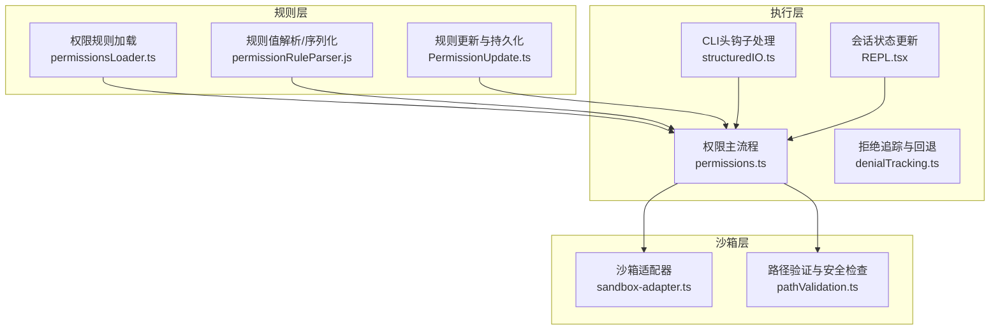
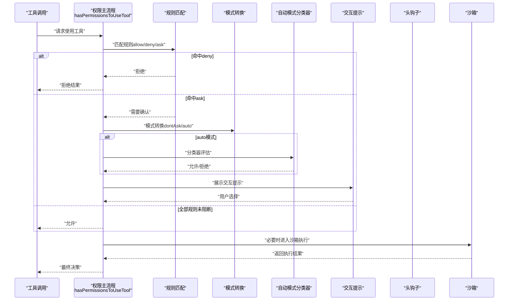
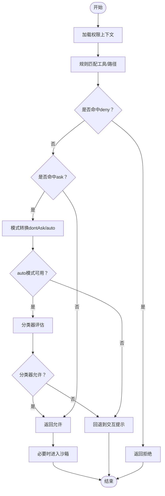
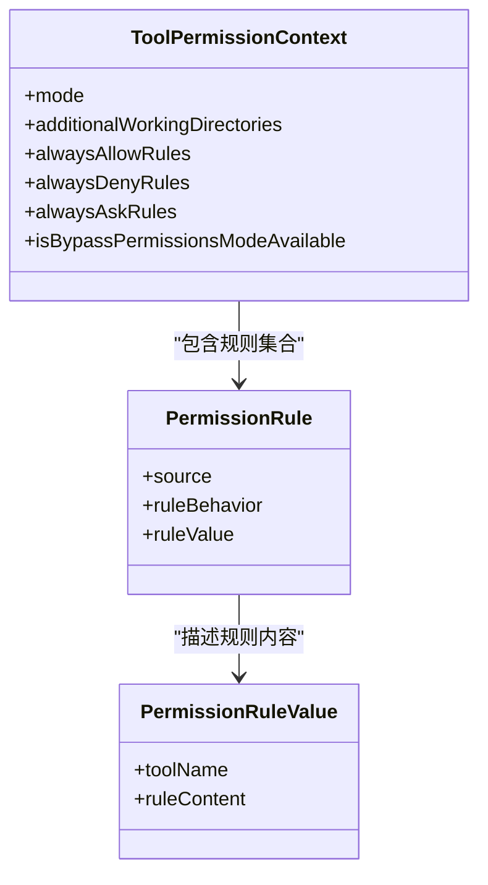
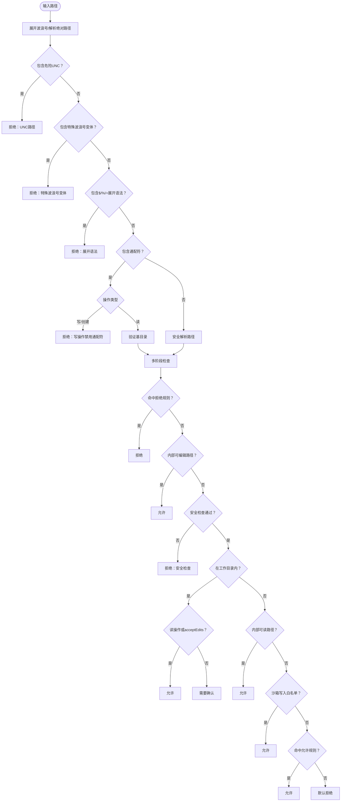
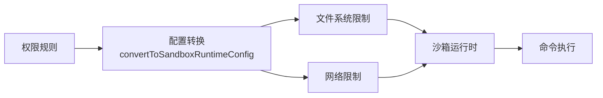
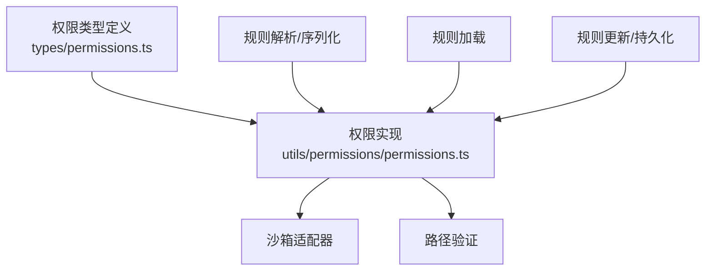

# 权限控制系统

<cite>
**本文档引用的文件**
- [permissions.ts](file://src/utils/permissions/permissions.ts)
- [permissions.ts（类型定义）](file://src/types/permissions.ts)
- [pathValidation.ts](file://src/utils/permissions/pathValidation.ts)
- [PermissionUpdate.ts](file://src/utils/permissions/PermissionUpdate.ts)
- [permissionsLoader.ts](file://src/utils/permissions/permissionsLoader.ts)
- [sandbox-adapter.ts](file://src/utils/sandbox/sandbox-adapter.ts)
- [denialTracking.ts](file://src/utils/permissions/denialTracking.ts)
- [structuredIO.ts](file://src/cli/structuredIO.ts)
- [REPL.tsx](file://src/screens/REPL.tsx)
</cite>

## 目录
1. [简介](#简介)
2. [项目结构](#项目结构)
3. [核心组件](#核心组件)
4. [架构总览](#架构总览)
5. [详细组件分析](#详细组件分析)
6. [依赖关系分析](#依赖关系分析)
7. [性能考虑](#性能考虑)
8. [故障排除指南](#故障排除指南)
9. [结论](#结论)
10. [附录](#附录)

## 简介
本文件面向Claude Code的权限控制系统，系统化阐述权限验证流程、工具使用权限控制、沙箱机制实现等核心概念。重点覆盖权限决策的三层架构：预工具使用钩子（PreToolUse Hooks）、权限规则（Permission Rules）、交互式提示（Interactive Prompt），并详解规则类型（alwaysAllowRules、alwaysDenyRules、alwaysAskRules）与沙箱安全策略（路径验证、只读模式、破坏性命令警告）。同时提供权限配置指南与调试方法，帮助开发者与管理员建立稳健的权限策略。

## 项目结构
权限系统由“规则层”“执行层”“沙箱层”三部分协同构成：
- 规则层：规则解析、加载、持久化与上下文合并
- 执行层：权限决策主流程、自动模式分类器、拒绝追踪与回退逻辑
- 沙箱层：基于外部运行时的文件系统/网络隔离与违规拦截

图表来源
- [permissions.ts:473-800](file://src/utils/permissions/permissions.ts#L473-L800)
- [permissionsLoader.ts:120-133](file://src/utils/permissions/permissionsLoader.ts#L120-L133)
- [PermissionUpdate.ts:55-206](file://src/utils/permissions/PermissionUpdate.ts#L55-L206)
- [sandbox-adapter.ts:172-381](file://src/utils/sandbox/sandbox-adapter.ts#L172-L381)
- [pathValidation.ts:141-263](file://src/utils/permissions/pathValidation.ts#L141-L263)
- [structuredIO.ts:808-859](file://src/cli/structuredIO.ts#L808-L859)
- [REPL.tsx:2345-2375](file://src/screens/REPL.tsx#L2345-L2375)

章节来源
- [permissions.ts:1-1487](file://src/utils/permissions/permissions.ts#L1-L1487)
- [permissions.ts（类型定义）:1-442](file://src/types/permissions.ts#L1-L442)
- [pathValidation.ts:1-486](file://src/utils/permissions/pathValidation.ts#L1-L486)
- [PermissionUpdate.ts:1-390](file://src/utils/permissions/PermissionUpdate.ts#L1-L390)
- [permissionsLoader.ts:1-297](file://src/utils/permissions/permissionsLoader.ts#L1-L297)
- [sandbox-adapter.ts:1-986](file://src/utils/sandbox/sandbox-adapter.ts#L1-L986)
- [denialTracking.ts:1-46](file://src/utils/permissions/denialTracking.ts#L1-L46)
- [structuredIO.ts:808-859](file://src/cli/structuredIO.ts#L808-L859)
- [REPL.tsx:2345-2375](file://src/screens/REPL.tsx#L2345-L2375)

## 核心组件
- 权限决策主流程：统一入口函数负责规则匹配、模式转换、自动模式分类器、拒绝追踪与回退提示。
- 规则系统：支持allow/deny/ask三种行为，按来源（用户/项目/本地/策略/命令行/会话）聚合，支持通配与MCP服务器级规则。
- 路径验证：结合工作目录、内部可编辑/可读路径、沙箱写入白名单、安全检查（危险路径、UNC/展开语法等）进行多阶段判定。
- 沙箱适配器：将权限规则映射为文件系统/网络限制，提供初始化、动态刷新、平台支持检测与依赖校验。
- 更新与持久化：支持添加/替换/移除规则、设置模式、追加额外工作目录，并持久化到可编辑设置源。

章节来源
- [permissions.ts:473-800](file://src/utils/permissions/permissions.ts#L473-L800)
- [permissions.ts（类型定义）:41-147](file://src/types/permissions.ts#L41-L147)
- [pathValidation.ts:141-263](file://src/utils/permissions/pathValidation.ts#L141-L263)
- [sandbox-adapter.ts:172-381](file://src/utils/sandbox/sandbox-adapter.ts#L172-L381)
- [PermissionUpdate.ts:55-206](file://src/utils/permissions/PermissionUpdate.ts#L55-L206)

## 架构总览
权限系统采用“规则优先、模式辅助、自动分类器兜底”的分层设计。核心流程如下：

图表来源
- [permissions.ts:473-800](file://src/utils/permissions/permissions.ts#L473-L800)
- [structuredIO.ts:808-859](file://src/cli/structuredIO.ts#L808-L859)
- [sandbox-adapter.ts:704-725](file://src/utils/sandbox/sandbox-adapter.ts#L704-L725)

## 详细组件分析

### 权限决策主流程（hasPermissionsToUseTool）
- 规则阶段：先检查工具级deny/ask规则，再检查文件路径规则（读/写/创建），最后检查allow规则。
- 模式阶段：根据当前模式（acceptEdits/auto/dontAsk/plan）进行转换或跳过。
- 自动模式：对非交互场景使用分类器快速判断；对安全敏感路径（如敏感文件、跨机桥接消息）强制回退到交互。
- 拒绝追踪：记录连续/累计拒绝次数，超过阈值回退到交互提示。
- 头钩子：在无UI环境（异步代理）下，允许钩子提前允许/拒绝，避免静默失败。

图表来源
- [permissions.ts:473-800](file://src/utils/permissions/permissions.ts#L473-L800)
- [denialTracking.ts:12-45](file://src/utils/permissions/denialTracking.ts#L12-L45)

章节来源
- [permissions.ts:473-800](file://src/utils/permissions/permissions.ts#L473-L800)
- [denialTracking.ts:1-46](file://src/utils/permissions/denialTracking.ts#L1-L46)

### 权限规则系统
- 规则类型
  - alwaysAllowRules：自动允许
  - alwaysDenyRules：自动拒绝
  - alwaysAskRules：总是提示
- 规则来源
  - 用户设置、项目设置、本地设置、策略设置、命令行参数、命令、会话
- 规则匹配
  - 工具名完全匹配（含MCP服务器级规则与通配）
  - 工具内容匹配（如Bash(prefix:*)）
- 规则更新
  - 支持添加、替换、移除规则，以及设置模式、追加额外工作目录
  - 可持久化到可编辑设置源

图表来源
- [permissions.ts（类型定义）:419-441](file://src/types/permissions.ts#L419-L441)
- [permissions.ts（类型定义）:67-79](file://src/types/permissions.ts#L67-L79)

章节来源
- [permissions.ts（类型定义）:41-147](file://src/types/permissions.ts#L41-L147)
- [permissions.ts:122-231](file://src/utils/permissions/permissions.ts#L122-L231)
- [PermissionUpdate.ts:55-206](file://src/utils/permissions/PermissionUpdate.ts#L55-L206)
- [permissionsLoader.ts:120-145](file://src/utils/permissions/permissionsLoader.ts#L120-L145)

### 路径验证与安全策略
- 路径验证步骤
  1) 拒绝规则优先
  2) 内部可编辑路径（计划文件、临时目录等）直接允许
  3) 安全检查（Windows模式、Claude配置文件、危险文件等）
  4) 工作目录范围（读操作或acceptEdits模式可直接允许；写操作需额外条件）
  5) 内部可读路径（项目临时输出等）允许
  6) 沙箱写入白名单（仅对外部路径有效）
  7) 允许规则
  8) 默认拒绝
- 安全特性
  - UNC路径阻断与凭证泄露防护
  - 路径展开语法（$VAR、%VAR%、=cmd）阻断
  - 写操作禁用通配符（防止绕过）
  - 危险删除路径识别（根目录、家目录、盘符根、子目录等）
  - 沙箱写入白名单与denyWithinAllow列表

图表来源
- [pathValidation.ts:141-263](file://src/utils/permissions/pathValidation.ts#L141-L263)
- [pathValidation.ts:373-485](file://src/utils/permissions/pathValidation.ts#L373-L485)

章节来源
- [pathValidation.ts:1-486](file://src/utils/permissions/pathValidation.ts#L1-L486)

### 沙箱机制与安全策略
- 配置转换
  - 将权限规则映射为文件系统读写/读取限制、网络域名白黑名单
  - 特殊路径保护：settings.json、.claude/skills、裸仓库文件等
  - Git工作树支持：主仓库路径写入白名单
- 运行时集成
  - 初始化与动态刷新配置
  - 平台支持检测与依赖校验
  - 网络请求拦截回调（受策略限制）
- 安全增强
  - 仅托管域名访问（策略）
  - 强制沙箱不可用时的明确提示
  - Linux/WSL通配符警告

图表来源
- [sandbox-adapter.ts:172-381](file://src/utils/sandbox/sandbox-adapter.ts#L172-L381)
- [sandbox-adapter.ts:704-725](file://src/utils/sandbox/sandbox-adapter.ts#L704-L725)

章节来源
- [sandbox-adapter.ts:1-986](file://src/utils/sandbox/sandbox-adapter.ts#L1-L986)

### 预工具使用钩子（PreToolUse Hooks）
- 在工具调用前执行，允许钩子直接决定允许/拒绝，或提供更新后的输入与权限更新
- CLI场景下，钩子可一次性返回决策，避免阻塞
- 异步代理场景下，钩子可替代交互提示，提升自动化体验

章节来源
- [structuredIO.ts:808-859](file://src/cli/structuredIO.ts#L808-L859)
- [permissions.ts:400-471](file://src/utils/permissions/permissions.ts#L400-L471)

### 交互式提示与会话状态
- 当决策为ask时，触发交互提示组件，支持用户选择“总是允许/拒绝/下次询问”
- 会话状态更新后，队列中的待确认项会重新检查权限，实现批量生效
- 模式切换（如acceptEdits）可影响后续决策

章节来源
- [REPL.tsx:2345-2375](file://src/screens/REPL.tsx#L2345-L2375)
- [permissions.ts:137-211](file://src/utils/permissions/permissions.ts#L137-L211)

## 依赖关系分析
- 类型与接口解耦：权限类型定义独立于实现，避免循环依赖
- 规则解析与持久化：解析器与加载器分离，便于扩展
- 沙箱适配：与外部运行时解耦，通过配置转换对接

图表来源
- [permissions.ts（类型定义）:1-442](file://src/types/permissions.ts#L1-L442)
- [permissions.ts:1-1487](file://src/utils/permissions/permissions.ts#L1-L1487)
- [PermissionUpdate.ts:1-390](file://src/utils/permissions/PermissionUpdate.ts#L1-L390)
- [permissionsLoader.ts:1-297](file://src/utils/permissions/permissionsLoader.ts#L1-L297)
- [sandbox-adapter.ts:1-986](file://src/utils/sandbox/sandbox-adapter.ts#L1-L986)
- [pathValidation.ts:1-486](file://src/utils/permissions/pathValidation.ts#L1-L486)

章节来源
- [permissions.ts（类型定义）:1-442](file://src/types/permissions.ts#L1-L442)
- [permissions.ts:1-1487](file://src/utils/permissions/permissions.ts#L1-L1487)
- [PermissionUpdate.ts:1-390](file://src/utils/permissions/PermissionUpdate.ts#L1-L390)
- [permissionsLoader.ts:1-297](file://src/utils/permissions/permissionsLoader.ts#L1-L297)
- [sandbox-adapter.ts:1-986](file://src/utils/sandbox/sandbox-adapter.ts#L1-L986)
- [pathValidation.ts:1-486](file://src/utils/permissions/pathValidation.ts#L1-L486)

## 性能考虑
- 缓存与去重
  - 规则解析与序列化采用规范化流程，避免重复匹配
  - 沙箱配置路径解析结果缓存，减少系统调用
- 分支优化
  - acceptEdits快速路径优先，避免昂贵分类器调用
  - 安全工具白名单跳过分类器
- I/O与解析
  - 路径解析与安全检查尽量在内存完成，减少磁盘访问
  - 通配符检查仅在必要时展开基目录

[本节为通用指导，无需特定文件引用]

## 故障排除指南
- 沙箱不可用
  - 现象：启用沙箱但无法运行
  - 排查：平台支持、依赖缺失、enabledPlatforms限制
  - 处理：查看沙箱不可用原因提示，安装依赖或调整平台限制
- 路径被拒绝
  - 现象：读/写/创建被拒绝
  - 排查：拒绝规则、安全检查、工作目录范围、沙箱写入白名单
  - 处理：添加允许规则或调整工作目录
- 自动模式频繁回退
  - 现象：分类器频繁拒绝导致回退交互
  - 排查：连续/累计拒绝计数、安全敏感路径
  - 处理：放宽规则或人工确认
- 钩子未生效
  - 现象：异步代理场景仍弹窗
  - 排查：钩子返回值、中断标志、错误日志
  - 处理：检查钩子实现与异常捕获

章节来源
- [sandbox-adapter.ts:562-592](file://src/utils/sandbox/sandbox-adapter.ts#L562-L592)
- [pathValidation.ts:141-263](file://src/utils/permissions/pathValidation.ts#L141-L263)
- [denialTracking.ts:12-45](file://src/utils/permissions/denialTracking.ts#L12-L45)
- [permissions.ts:400-471](file://src/utils/permissions/permissions.ts#L400-L471)

## 结论
Claude Code的权限控制系统以“规则优先、模式辅助、自动兜底”为核心思想，结合严格的路径安全检查与沙箱隔离，形成从策略到执行的完整闭环。通过清晰的规则语法、灵活的来源管理与可扩展的钩子机制，既能满足个人用户的精细控制，也能适应企业级的策略约束与合规要求。

[本节为总结，无需特定文件引用]

## 附录

### 权限规则语法与配置示例
- 规则语法
  - 工具名：如 Bash、FileRead、FileEdit、WebFetch 等
  - 工具内容：如 Bash(prefix:*)、Read(/path/**)、WebFetch(domain:example.com)
  - MCP规则：mcp__server、mcp__server__tool 或 mcp__server__*
- 规则来源
  - userSettings、projectSettings、localSettings、policySettings、cliArg、command、session
- 配置要点
  - alwaysAllowRules：自动放行
  - alwaysDenyRules：自动拒绝
  - alwaysAskRules：总是提示
  - additionalDirectories：追加工作目录（持久化）

章节来源
- [permissions.ts（类型定义）:54-63](file://src/types/permissions.ts#L54-L63)
- [permissions.ts:122-231](file://src/utils/permissions/permissions.ts#L122-L231)
- [PermissionUpdate.ts:361-390](file://src/utils/permissions/PermissionUpdate.ts#L361-L390)
- [permissionsLoader.ts:229-296](file://src/utils/permissions/permissionsLoader.ts#L229-L296)

### 权限策略制定建议
- 最小权限原则：默认deny，按需添加allow/ask
- 分层治理：策略设置用于强约束，用户/项目设置用于灵活控制
- 明确边界：危险路径与系统文件加入拒绝列表
- 自动化优先：对低风险工具配置自动放行，高风险工具配置提示
- 可审计性：保留规则来源与变更记录，便于回溯

[本节为通用指导，无需特定文件引用]