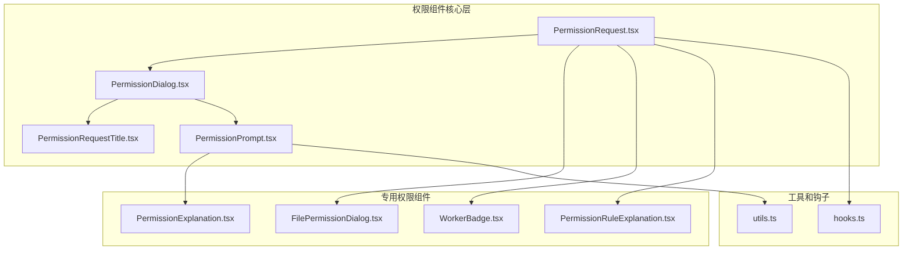
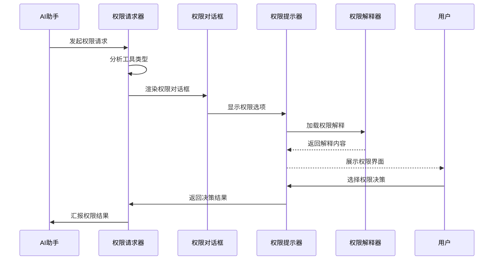
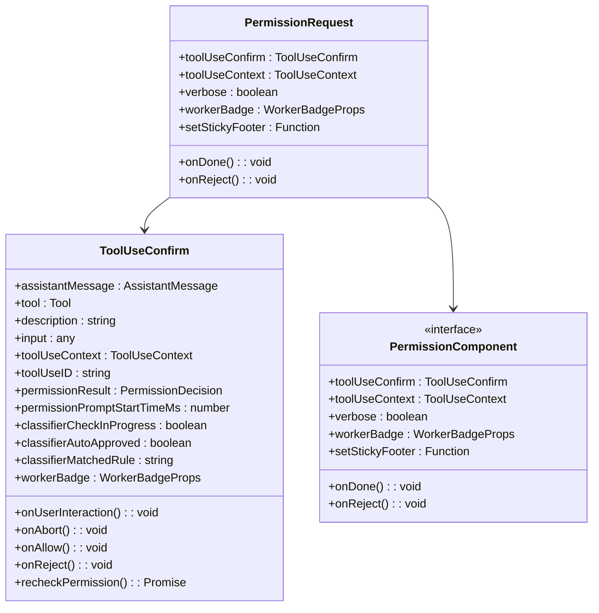
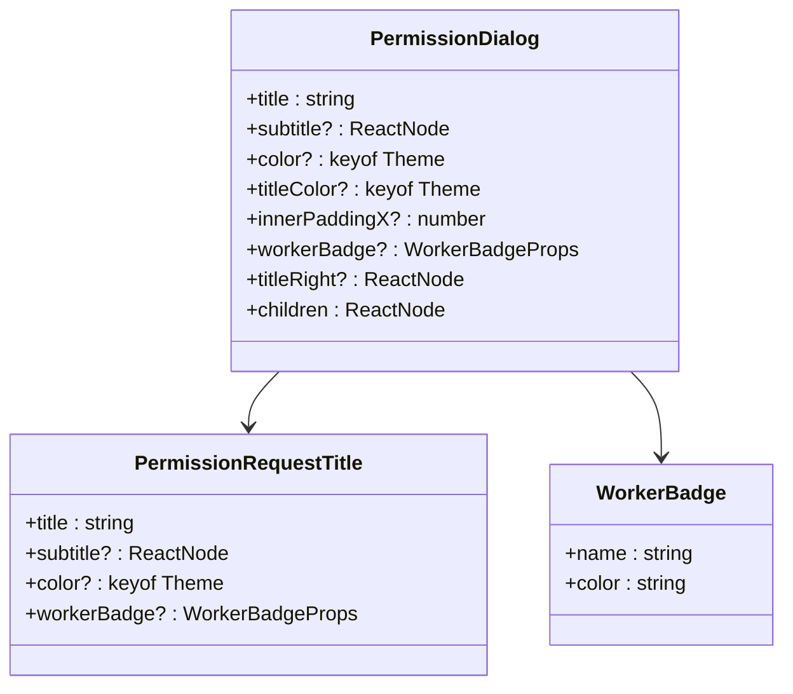
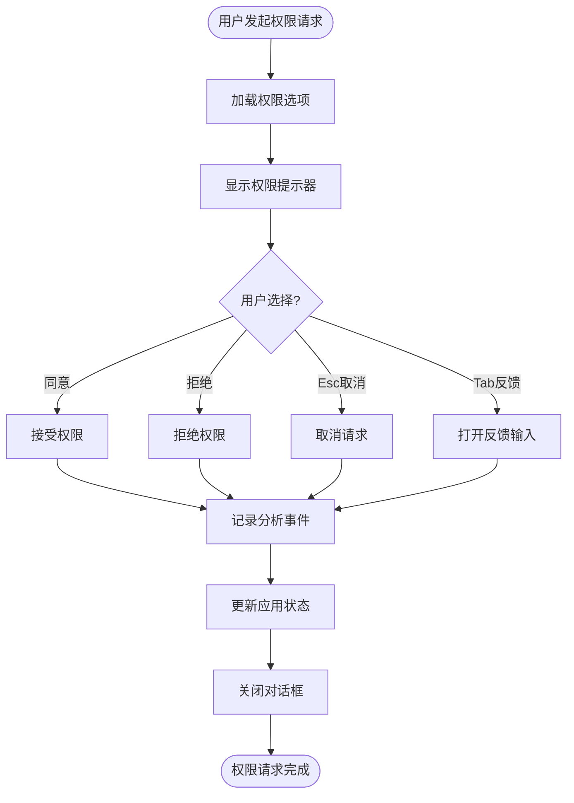
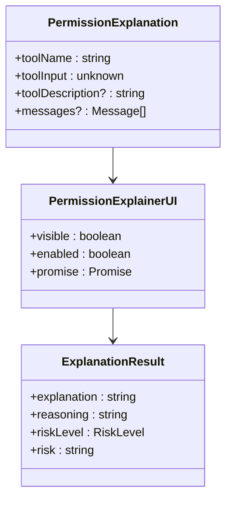
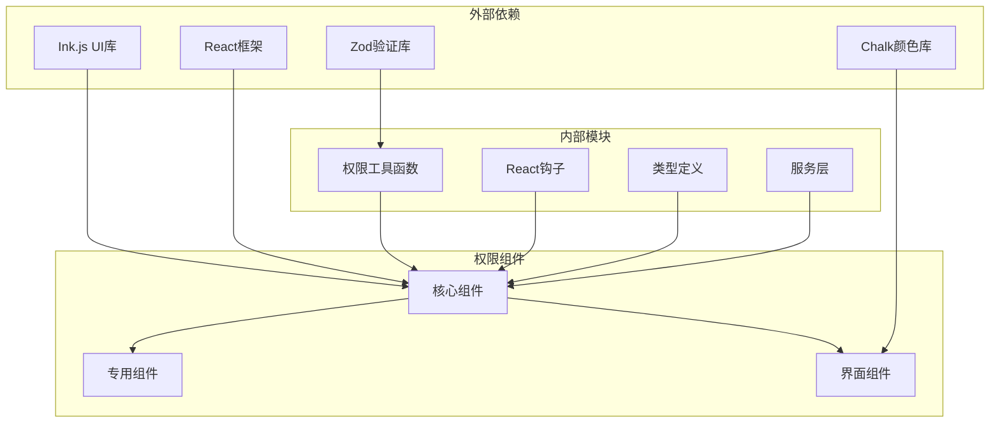

# 权限提示界面

<cite>
**本文档引用的文件**
- [PermissionDialog.tsx](file://src/components/permissions/PermissionDialog.tsx)
- [PermissionExplanation.tsx](file://src/components/permissions/PermissionExplanation.tsx)
- [PermissionPrompt.tsx](file://src/components/permissions/PermissionPrompt.tsx)
- [PermissionRequest.tsx](file://src/components/permissions/PermissionRequest.tsx)
- [FilePermissionDialog.tsx](file://src/components/permissions/FilePermissionDialog/FilePermissionDialog.tsx)
- [PermissionRequestTitle.tsx](file://src/components/permissions/PermissionRequestTitle.tsx)
- [WorkerBadge.tsx](file://src/components/permissions/WorkerBadge.tsx)
- [hooks.ts](file://src/components/permissions/hooks.ts)
- [utils.ts](file://src/components/permissions/utils.ts)
- [PermissionRuleExplanation.tsx](file://src/components/permissions/PermissionRuleExplanation.tsx)
</cite>

## 目录
1. [简介](#简介)
2. [项目结构](#项目结构)
3. [核心组件](#核心组件)
4. [架构概览](#架构概览)
5. [详细组件分析](#详细组件分析)
6. [依赖关系分析](#依赖关系分析)
7. [性能考虑](#性能考虑)
8. [故障排除指南](#故障排除指南)
9. [结论](#结论)

## 简介

Claude Code 的权限提示界面是一个完整的权限管理系统，用于在用户执行可能影响系统安全的操作前进行确认。该系统提供了多种权限类型的支持，包括文件系统权限、bash 命令权限、网络访问权限等，并通过直观的用户界面确保用户能够充分理解每个权限请求的目的和潜在风险。

该权限系统的核心目标是平衡安全性与用户体验，在保护用户系统安全的同时提供流畅的交互体验。系统通过可视化的权限解释、风险评估展示和用户教育内容，帮助用户做出明智的权限决策。

## 项目结构

权限提示界面的代码组织遵循模块化设计原则，主要组件分布在 `src/components/permissions/` 目录下：

**图表来源**
- [PermissionRequest.tsx:146-216](file://src/components/permissions/PermissionRequest.tsx#L146-L216)
- [PermissionDialog.tsx:17-71](file://src/components/permissions/PermissionDialog.tsx#L17-L71)
- [PermissionPrompt.tsx:45-326](file://src/components/permissions/PermissionPrompt.tsx#L45-L326)

**章节来源**
- [PermissionRequest.tsx:1-217](file://src/components/permissions/PermissionRequest.tsx#L1-L217)
- [PermissionDialog.tsx:1-72](file://src/components/permissions/PermissionDialog.tsx#L1-L72)

## 核心组件

### 权限对话框基础组件

PermissionDialog 是所有权限提示界面的基础容器，提供了统一的视觉风格和布局结构。

**章节来源**
- [PermissionDialog.tsx:17-71](file://src/components/permissions/PermissionDialog.tsx#L17-L71)

### 权限提示组件

PermissionPrompt 提供了通用的权限确认界面，支持反馈输入和键盘快捷键操作。

**章节来源**
- [PermissionPrompt.tsx:45-326](file://src/components/permissions/PermissionPrompt.tsx#L45-L326)

### 文件权限对话框

FilePermissionDialog 专门处理文件系统相关的权限请求，集成了 IDE 差异显示和路径解析功能。

**章节来源**
- [FilePermissionDialog.tsx:48-203](file://src/components/permissions/FilePermissionDialog/FilePermissionDialog.tsx#L48-L203)

## 架构概览

权限提示系统的整体架构采用分层设计，从底层的权限决策到顶层的用户界面展示形成了清晰的层次结构：

**图表来源**
- [PermissionRequest.tsx:146-216](file://src/components/permissions/PermissionRequest.tsx#L146-L216)
- [PermissionPrompt.tsx:137-224](file://src/components/permissions/PermissionPrompt.tsx#L137-L224)

## 详细组件分析

### 权限请求处理器

权限请求处理器负责根据不同的工具类型选择相应的权限组件，并管理整个权限流程。

**图表来源**
- [PermissionRequest.tsx:83-127](file://src/components/permissions/PermissionRequest.tsx#L83-L127)
- [PermissionRequest.tsx:146-216](file://src/components/permissions/PermissionRequest.tsx#L146-L216)

**章节来源**
- [PermissionRequest.tsx:47-82](file://src/components/permissions/PermissionRequest.tsx#L47-L82)
- [PermissionRequest.tsx:128-143](file://src/components/permissions/PermissionRequest.tsx#L128-L143)

### 权限对话框组件

权限对话框提供了统一的视觉容器，支持自定义颜色主题和工人徽章显示。

**图表来源**
- [PermissionDialog.tsx:7-16](file://src/components/permissions/PermissionDialog.tsx#L7-L16)
- [PermissionRequestTitle.tsx:6-11](file://src/components/permissions/PermissionRequestTitle.tsx#L6-L11)
- [WorkerBadge.tsx:6-9](file://src/components/permissions/WorkerBadge.tsx#L6-L9)

**章节来源**
- [PermissionDialog.tsx:29-62](file://src/components/permissions/PermissionDialog.tsx#L29-L62)
- [PermissionRequestTitle.tsx:20-64](file://src/components/permissions/PermissionRequestTitle.tsx#L20-L64)

### 权限提示器组件

权限提示器提供了完整的权限确认界面，支持反馈输入、键盘快捷键和状态跟踪。

**图表来源**
- [PermissionPrompt.tsx:137-224](file://src/components/permissions/PermissionPrompt.tsx#L137-L224)
- [PermissionPrompt.tsx:252-264](file://src/components/permissions/PermissionPrompt.tsx#L252-L264)

**章节来源**
- [PermissionPrompt.tsx:183-224](file://src/components/permissions/PermissionPrompt.tsx#L183-L224)
- [PermissionPrompt.tsx:294-305](file://src/components/permissions/PermissionPrompt.tsx#L294-L305)

### 权限解释器组件

权限解释器提供了动态的权限说明和风险评估功能，支持延迟加载以避免不必要的资源消耗。

**图表来源**
- [PermissionExplanation.tsx:61-71](file://src/components/permissions/PermissionExplanation.tsx#L61-L71)
- [PermissionExplanation.tsx:92-146](file://src/components/permissions/PermissionExplanation.tsx#L92-L146)
- [PermissionExplanation.tsx:156-240](file://src/components/permissions/PermissionExplanation.tsx#L156-L240)

**章节来源**
- [PermissionExplanation.tsx:77-85](file://src/components/permissions/PermissionExplanation.tsx#L77-L85)
- [PermissionExplanation.tsx:246-271](file://src/components/permissions/PermissionExplanation.tsx#L246-L271)

### 文件权限对话框

文件权限对话框专门处理文件系统操作的权限请求，集成了 IDE 差异显示和路径解析功能。

**章节来源**
- [FilePermissionDialog.tsx:75-89](file://src/components/permissions/FilePermissionDialog/FilePermissionDialog.tsx#L75-L89)
- [FilePermissionDialog.tsx:155-158](file://src/components/permissions/FilePermissionDialog/FilePermissionDialog.tsx#L155-L158)

## 依赖关系分析

权限提示系统的依赖关系体现了清晰的关注点分离和模块化设计：

**图表来源**
- [PermissionRequest.tsx:1-46](file://src/components/permissions/PermissionRequest.tsx#L1-L46)
- [PermissionExplanation.tsx:1-10](file://src/components/permissions/PermissionExplanation.tsx#L1-L10)

**章节来源**
- [hooks.ts:1-25](file://src/components/permissions/hooks.ts#L1-L25)
- [utils.ts:1-3](file://src/components/permissions/utils.ts#L1-L3)

## 性能考虑

权限提示系统在设计时充分考虑了性能优化，采用了多种策略来确保响应速度和资源效率：

### 延迟加载机制
- 权限解释器采用懒加载策略，只有在用户主动触发时才创建解释请求
- IDE 差异显示按需加载，避免不必要的磁盘 I/O 操作

### 内存优化
- 使用 React.memo 缓存计算结果，避免重复渲染
- useMemo 钩子保持 Promise 和配置对象的稳定性

### 事件处理优化
- 键盘快捷键绑定采用防抖机制，避免频繁的状态更新
- 权限决策日志记录使用批处理策略，减少 I/O 操作频率

## 故障排除指南

### 常见问题及解决方案

**权限请求不显示**
- 检查工具是否正确注册到权限组件映射表
- 验证工具输入数据的 Zod 模式是否正确
- 确认权限决策结果是否为有效的行为类型

**权限解释器加载失败**
- 检查权限解释器功能标志是否启用
- 验证网络连接是否正常
- 确认 AI 模型服务是否可用

**IDE 差异显示异常**
- 检查 IDE 连接状态
- 验证文件路径是否有效
- 确认 IDE 扩展是否正确安装

**章节来源**
- [hooks.ts:116-120](file://src/components/permissions/hooks.ts#L116-L120)
- [PermissionExplanation.tsx:105-114](file://src/components/permissions/PermissionExplanation.tsx#L105-L114)

## 结论

Claude Code 的权限提示界面系统展现了现代前端权限管理的最佳实践。通过模块化设计、清晰的组件层次和完善的用户体验考虑，该系统成功地在安全性与易用性之间找到了平衡点。

系统的主要优势包括：

1. **模块化架构**：清晰的组件分离使得每个权限类型都可以独立开发和测试
2. **用户体验优化**：直观的界面设计和丰富的反馈机制提升了用户满意度
3. **性能优化**：多种优化策略确保了系统的高效运行
4. **可扩展性**：灵活的设计允许轻松添加新的权限类型和功能

该权限系统为开发者提供了一个强大的基础，可以在此基础上进一步扩展和完善，以满足更复杂的权限管理需求。