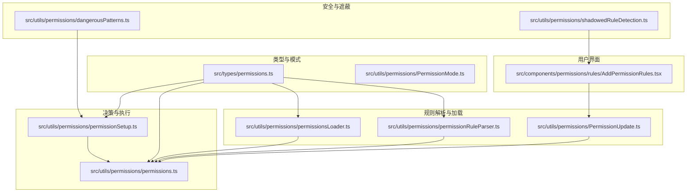
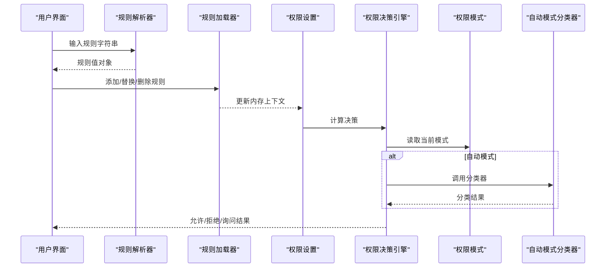
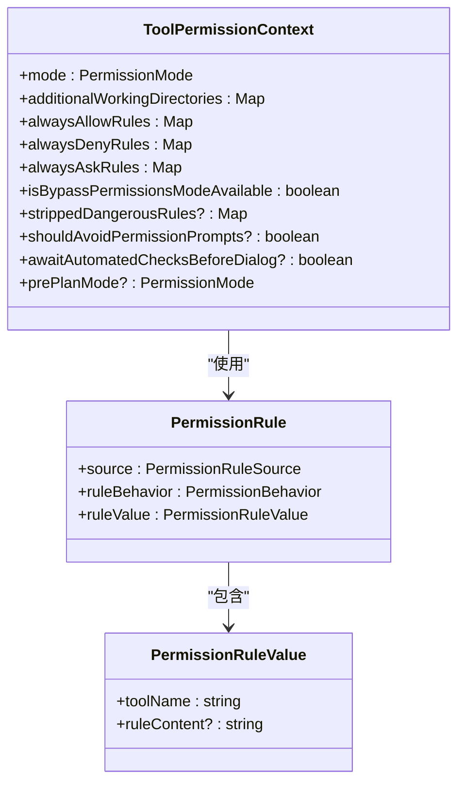
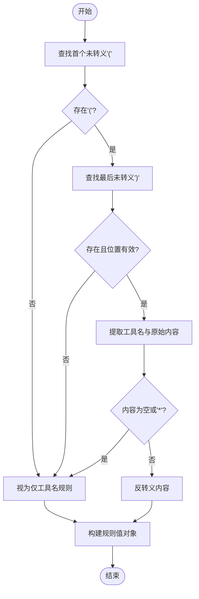
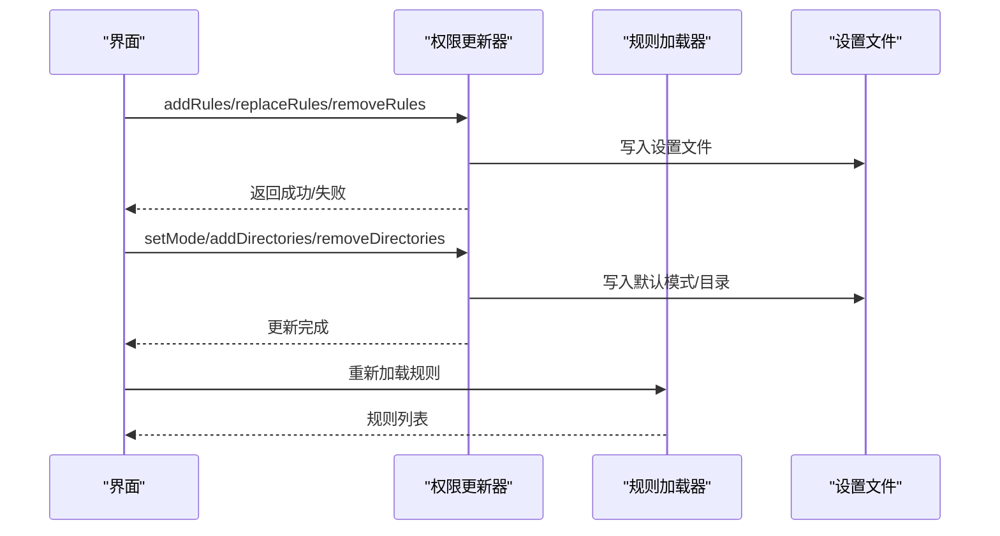
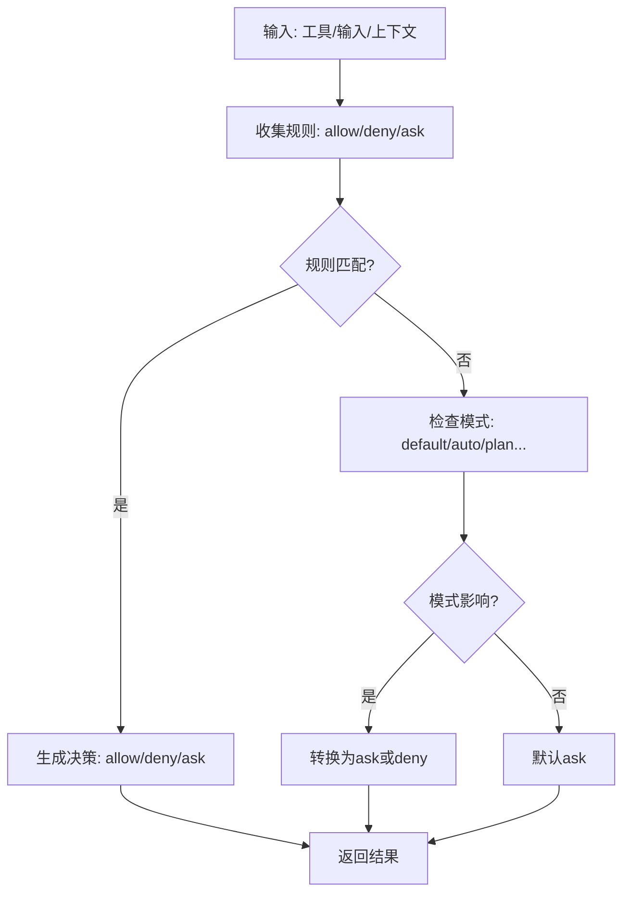
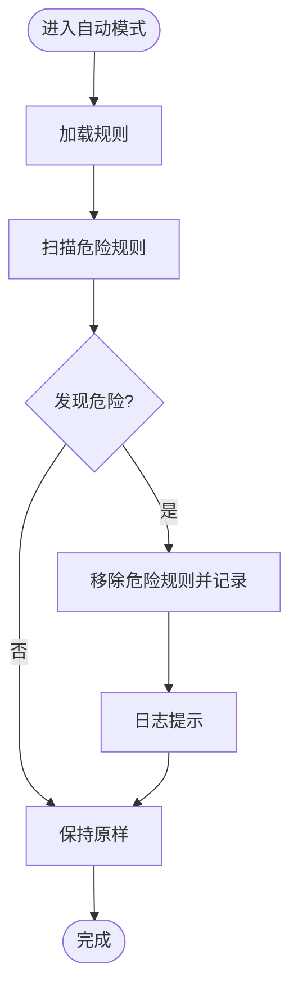
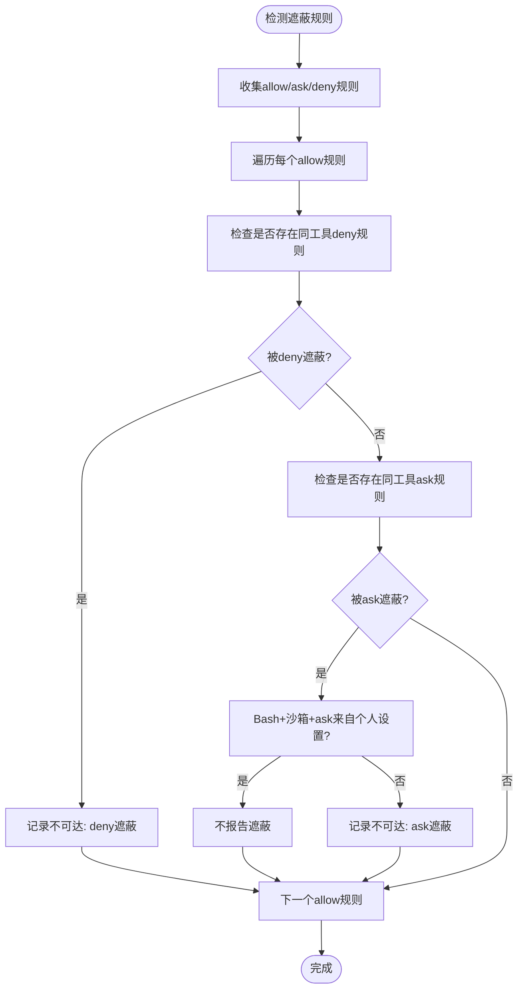
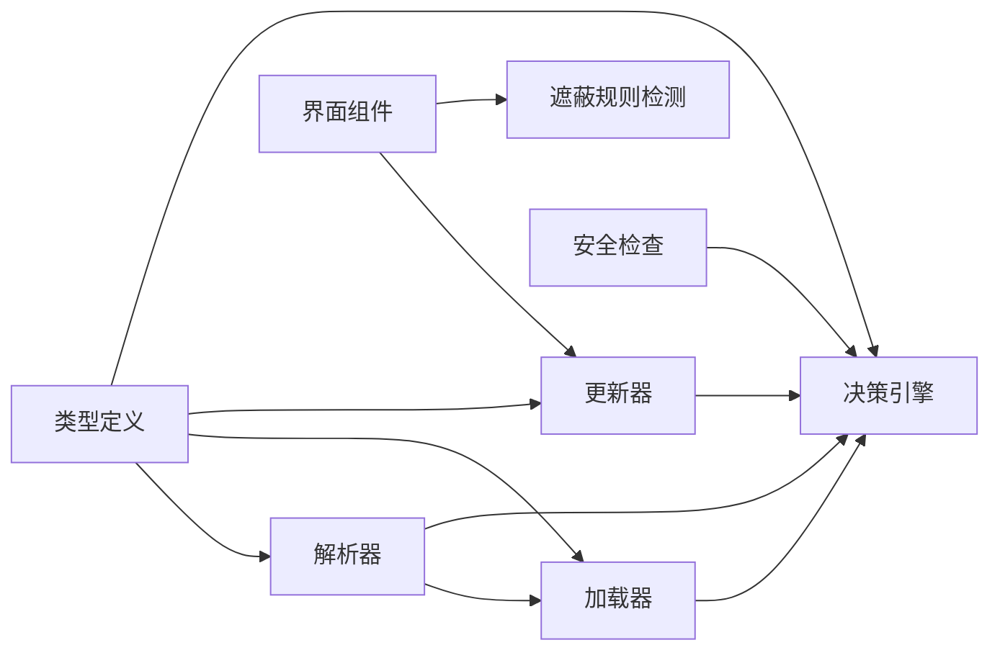

# 权限规则系统

<cite>
**本文档引用的文件**
- [src/types/permissions.ts](file://src/types/permissions.ts)
- [src/utils/permissions/permissionRuleParser.ts](file://src/utils/permissions/permissionRuleParser.ts)
- [src/utils/permissions/permissions.ts](file://src/utils/permissions/permissions.ts)
- [src/utils/permissions/permissionsLoader.ts](file://src/utils/permissions/permissionsLoader.ts)
- [src/utils/permissions/permissionSetup.ts](file://src/utils/permissions/permissionSetup.ts)
- [src/utils/permissions/PermissionUpdate.ts](file://src/utils/permissions/PermissionUpdate.ts)
- [src/utils/permissions/shadowedRuleDetection.ts](file://src/utils/permissions/shadowedRuleDetection.ts)
- [src/utils/permissions/dangerousPatterns.ts](file://src/utils/permissions/dangerousPatterns.ts)
- [src/utils/permissions/PermissionMode.ts](file://src/utils/permissions/PermissionMode.ts)
- [src/utils/permissions/permissionExplainer.ts](file://src/utils/permissions/permissionExplainer.ts)
- [src/components/permissions/rules/AddPermissionRules.tsx](file://src/components/permissions/rules/AddPermissionRules.tsx)
</cite>

## 目录
1. [简介](#简介)
2. [项目结构](#项目结构)
3. [核心组件](#核心组件)
4. [架构总览](#架构总览)
5. [详细组件分析](#详细组件分析)
6. [依赖关系分析](#依赖关系分析)
7. [性能考量](#性能考量)
8. [故障排除指南](#故障排除指南)
9. [结论](#结论)
10. [附录](#附录)

## 简介
本技术文档面向Claude Code的权限规则系统，系统性阐述权限规则的类型与配置方式，解析器工作原理，冲突检测与遮蔽规则处理机制，并提供最佳实践与常见场景解决方案。文档以代码为依据，结合可视化图表帮助读者快速理解从规则定义到执行决策的全链路流程。

## 项目结构
权限规则系统主要分布在以下模块：
- 类型与模式：定义权限行为、来源、上下文等核心类型，以及权限模式配置
- 规则解析与加载：负责规则字符串解析、规范化、持久化与加载
- 决策与执行：根据规则与模式生成最终的允许/拒绝/询问决策
- 安全与危险规则检查：在自动模式切换时清理潜在危险规则
- 遮蔽规则检测：识别不可达规则并给出修复建议
- 用户界面：提供规则添加、保存位置选择与遮蔽规则提示

**图表来源**
- [src/types/permissions.ts:1-442](file://src/types/permissions.ts#L1-L442)
- [src/utils/permissions/permissionRuleParser.ts:1-199](file://src/utils/permissions/permissionRuleParser.ts#L1-L199)
- [src/utils/permissions/permissions.ts:1-800](file://src/utils/permissions/permissions.ts#L1-L800)
- [src/utils/permissions/permissionsLoader.ts:1-297](file://src/utils/permissions/permissionsLoader.ts#L1-L297)
- [src/utils/permissions/PermissionUpdate.ts:1-390](file://src/utils/permissions/PermissionUpdate.ts#L1-L390)
- [src/utils/permissions/dangerousPatterns.ts:1-81](file://src/utils/permissions/dangerousPatterns.ts#L1-L81)
- [src/utils/permissions/shadowedRuleDetection.ts:1-235](file://src/utils/permissions/shadowedRuleDetection.ts#L1-L235)
- [src/utils/permissions/PermissionMode.ts:1-142](file://src/utils/permissions/PermissionMode.ts#L1-L142)
- [src/components/permissions/rules/AddPermissionRules.tsx:1-180](file://src/components/permissions/rules/AddPermissionRules.tsx#L1-L180)

**章节来源**
- [src/types/permissions.ts:1-442](file://src/types/permissions.ts#L1-L442)
- [src/utils/permissions/permissionRuleParser.ts:1-199](file://src/utils/permissions/permissionRuleParser.ts#L1-L199)
- [src/utils/permissions/permissions.ts:1-800](file://src/utils/permissions/permissions.ts#L1-L800)
- [src/utils/permissions/permissionsLoader.ts:1-297](file://src/utils/permissions/permissionsLoader.ts#L1-L297)
- [src/utils/permissions/PermissionUpdate.ts:1-390](file://src/utils/permissions/PermissionUpdate.ts#L1-L390)
- [src/utils/permissions/shadowedRuleDetection.ts:1-235](file://src/utils/permissions/shadowedRuleDetection.ts#L1-L235)
- [src/utils/permissions/dangerousPatterns.ts:1-81](file://src/utils/permissions/dangerousPatterns.ts#L1-L81)
- [src/utils/permissions/PermissionMode.ts:1-142](file://src/utils/permissions/PermissionMode.ts#L1-L142)
- [src/components/permissions/rules/AddPermissionRules.tsx:1-180](file://src/components/permissions/rules/AddPermissionRules.tsx#L1-L180)

## 核心组件
- 权限规则类型与上下文
  - 行为：allow（总是允许）、deny（总是拒绝）、ask（需要确认）
  - 来源：用户设置、项目设置、本地设置、策略设置、命令行参数、会话等
  - 上下文：包含当前模式、额外工作目录、三类规则集合、是否可绕过权限等
- 规则解析器
  - 支持工具名与内容的解析，转义/反转义括号，兼容历史工具名别名
- 规则加载与持久化
  - 从多来源加载规则，支持添加/替换/删除规则与目录
- 决策引擎
  - 组合规则与模式，生成允许/拒绝/询问结果，并支持自动模式分类器
- 安全检查
  - 自动模式危险规则检测与清理，避免绕过分类器
- 遮蔽规则检测
  - 检测被更高优先级规则遮蔽的不可达规则并给出修复建议
- 权限模式
  - 默认、计划模式、接受编辑、绕过权限、不询问、自动模式等

**章节来源**
- [src/types/permissions.ts:41-442](file://src/types/permissions.ts#L41-L442)
- [src/utils/permissions/permissionRuleParser.ts:1-199](file://src/utils/permissions/permissionRuleParser.ts#L1-L199)
- [src/utils/permissions/permissions.ts:1-800](file://src/utils/permissions/permissions.ts#L1-L800)
- [src/utils/permissions/permissionsLoader.ts:1-297](file://src/utils/permissions/permissionsLoader.ts#L1-L297)
- [src/utils/permissions/PermissionUpdate.ts:1-390](file://src/utils/permissions/PermissionUpdate.ts#L1-L390)
- [src/utils/permissions/PermissionMode.ts:1-142](file://src/utils/permissions/PermissionMode.ts#L1-L142)

## 架构总览
权限系统的核心流程如下：
- 规则字符串通过解析器转换为规则值
- 从各设置源加载规则，构建工具权限上下文
- 执行决策逻辑，按优先级评估规则与模式
- 在自动模式下，必要时调用分类器进行风险判定
- 对于危险规则，在进入自动模式前进行清理
- 提供遮蔽规则检测，帮助用户优化规则配置

**图表来源**
- [src/utils/permissions/permissionRuleParser.ts:83-152](file://src/utils/permissions/permissionRuleParser.ts#L83-L152)
- [src/utils/permissions/permissionsLoader.ts:120-145](file://src/utils/permissions/permissionsLoader.ts#L120-L145)
- [src/utils/permissions/permissionSetup.ts:597-646](file://src/utils/permissions/permissionSetup.ts#L597-L646)
- [src/utils/permissions/permissions.ts:473-800](file://src/utils/permissions/permissions.ts#L473-L800)
- [src/utils/permissions/PermissionMode.ts:1-142](file://src/utils/permissions/PermissionMode.ts#L1-L142)

## 详细组件分析

### 权限规则类型与配置
- 规则行为
  - allow：总是允许该工具或特定内容
  - deny：总是拒绝该工具或特定内容
  - ask：需要用户确认
- 规则来源
  - userSettings、projectSettings、localSettings、flagSettings、policySettings、cliArg、command、session
- 规则值
  - 包含工具名与可选的内容片段，用于精确匹配
- 上下文
  - mode：当前权限模式
  - additionalWorkingDirectories：额外工作目录映射
  - alwaysAllowRules/alwaysDenyRules/alwaysAskRules：按来源分组的规则集合
  - 其他运行时标志位

**图表来源**
- [src/types/permissions.ts:54-147](file://src/types/permissions.ts#L54-L147)

**章节来源**
- [src/types/permissions.ts:41-442](file://src/types/permissions.ts#L41-L442)

### 规则解析器（Permission Rule Parser）
- 功能
  - 解析字符串格式的规则，如“工具名(内容)”或仅“工具名”
  - 处理括号转义与反转义，确保内容中括号正确存储与恢复
  - 兼容历史工具名别名，统一到规范名称
- 关键点
  - 查找首个未转义左括号与最后一个未转义右括号
  - 空内容或通配符“*”视为工具级规则
  - 反转义顺序与转义顺序相反，保证一致性

**图表来源**
- [src/utils/permissions/permissionRuleParser.ts:83-152](file://src/utils/permissions/permissionRuleParser.ts#L83-L152)

**章节来源**
- [src/utils/permissions/permissionRuleParser.ts:1-199](file://src/utils/permissions/permissionRuleParser.ts#L1-L199)

### 规则加载与持久化
- 加载
  - 从启用的设置源读取权限数据，转换为规则对象数组
  - 支持仅使用策略设置中的规则（企业托管）
- 持久化
  - 添加/替换/删除规则到指定设置源
  - 去重与规范化，保留其他字段不变
- 应用
  - 将单个或多个更新应用到内存上下文
  - 支持设置模式、增删目录等

**图表来源**
- [src/utils/permissions/PermissionUpdate.ts:222-342](file://src/utils/permissions/PermissionUpdate.ts#L222-L342)
- [src/utils/permissions/permissionsLoader.ts:120-297](file://src/utils/permissions/permissionsLoader.ts#L120-L297)

**章节来源**
- [src/utils/permissions/permissionsLoader.ts:1-297](file://src/utils/permissions/permissionsLoader.ts#L1-L297)
- [src/utils/permissions/PermissionUpdate.ts:1-390](file://src/utils/permissions/PermissionUpdate.ts#L1-L390)

### 决策引擎与模式
- 决策流程
  - 从上下文中收集三类规则，按来源与行为组合
  - 工具级匹配与内容级匹配区分
  - 模式转换（如自动模式）影响后续处理
- 模式
  - default、plan、acceptEdits、bypassPermissions、dontAsk、auto（按特性启用）
  - 提供标题、短标题、符号与颜色映射

**图表来源**
- [src/utils/permissions/permissions.ts:473-800](file://src/utils/permissions/permissions.ts#L473-L800)
- [src/utils/permissions/PermissionMode.ts:42-91](file://src/utils/permissions/PermissionMode.ts#L42-L91)

**章节来源**
- [src/utils/permissions/permissions.ts:1-800](file://src/utils/permissions/permissions.ts#L1-L800)
- [src/utils/permissions/PermissionMode.ts:1-142](file://src/utils/permissions/PermissionMode.ts#L1-L142)

### 危险规则检测与自动模式安全
- 危险规则类型
  - Bash工具级允许（Bash或Bash(*)）或解释器前缀/通配符规则
  - PowerShell工具级允许或危险命令（iex、Start-Process等）
  - Agent工具级允许（子代理委托攻击防护）
- 检测与清理
  - 进入自动模式前扫描所有允许规则
  - 清理危险规则并记录到“剥离规则”映射
  - 退出自动模式时恢复这些规则

**图表来源**
- [src/utils/permissions/permissionSetup.ts:295-553](file://src/utils/permissions/permissionSetup.ts#L295-L553)
- [src/utils/permissions/dangerousPatterns.ts:1-81](file://src/utils/permissions/dangerousPatterns.ts#L1-L81)

**章节来源**
- [src/utils/permissions/permissionSetup.ts:1-800](file://src/utils/permissions/permissionSetup.ts#L1-L800)
- [src/utils/permissions/dangerousPatterns.ts:1-81](file://src/utils/permissions/dangerousPatterns.ts#L1-L81)

### 遮蔽规则检测（Shadowed Rules）
- 目标
  - 识别因更高优先级规则导致的不可达规则
- 规则
  - deny规则优先于allow规则，完全阻止特定allow规则生效
  - ask规则优先于allow规则，使特定allow规则永远无法直达允许
- 特殊处理
  - Bash工具在沙箱自动放行且ask规则来自个人设置时，不视为遮蔽
- 输出
  - 返回不可达规则列表，包含原因、遮蔽者、遮蔽类型与修复建议

**图表来源**
- [src/utils/permissions/shadowedRuleDetection.ts:193-235](file://src/utils/permissions/shadowedRuleDetection.ts#L193-L235)

**章节来源**
- [src/utils/permissions/shadowedRuleDetection.ts:1-235](file://src/utils/permissions/shadowedRuleDetection.ts#L1-L235)

### 权限解释器（可选）
- 功能
  - 基于模型生成命令解释、理由与风险等级
  - 可通过配置禁用
- 使用场景
  - 在权限请求对话框中提供更丰富的背景信息

**章节来源**
- [src/utils/permissions/permissionExplainer.ts:1-251](file://src/utils/permissions/permissionExplainer.ts#L1-L251)

### 规则配置示例与最佳实践
- 规则语法
  - 工具级：Bash 或 Bash(*)
  - 内容级：Bash(ls:*)、Bash(python -c "*")
  - 转义规则：括号需转义，空内容与“*”表示工具级
- 最佳实践
  - 优先使用内容级规则而非工具级规则，减少误放行
  - 在团队共享设置中避免工具级allow规则，改用ask规则引导确认
  - 定期使用遮蔽规则检测，清理不可达规则
  - 自动模式下谨慎使用工具级allow规则，必要时通过分类器评估
- 常见场景
  - 仅允许特定解释器命令：Bash(python -c "*")、Bash(node -e "*")
  - 仅允许特定目录读取：Read(/path/**)
  - 团队共享设置中，使用ask规则限制高危操作

**章节来源**
- [src/utils/permissions/permissionRuleParser.ts:83-152](file://src/utils/permissions/permissionRuleParser.ts#L83-L152)
- [src/utils/permissions/shadowedRuleDetection.ts:193-235](file://src/utils/permissions/shadowedRuleDetection.ts#L193-L235)
- [src/utils/permissions/permissionSetup.ts:295-553](file://src/utils/permissions/permissionSetup.ts#L295-L553)

## 依赖关系分析
- 类型层
  - 所有实现模块依赖类型定义文件，避免循环导入
- 解析与加载
  - 解析器为加载器与更新器提供字符串与对象互转能力
- 决策与安全
  - 决策引擎依赖解析结果与上下文；安全模块在模式切换时介入
- UI集成
  - 界面组件触发规则添加，调用更新器并触发遮蔽规则检测

**图表来源**
- [src/types/permissions.ts:1-442](file://src/types/permissions.ts#L1-L442)
- [src/utils/permissions/permissionRuleParser.ts:1-199](file://src/utils/permissions/permissionRuleParser.ts#L1-L199)
- [src/utils/permissions/permissionsLoader.ts:1-297](file://src/utils/permissions/permissionsLoader.ts#L1-L297)
- [src/utils/permissions/PermissionUpdate.ts:1-390](file://src/utils/permissions/PermissionUpdate.ts#L1-L390)
- [src/utils/permissions/permissions.ts:1-800](file://src/utils/permissions/permissions.ts#L1-L800)
- [src/utils/permissions/permissionSetup.ts:1-800](file://src/utils/permissions/permissionSetup.ts#L1-L800)
- [src/utils/permissions/shadowedRuleDetection.ts:1-235](file://src/utils/permissions/shadowedRuleDetection.ts#L1-L235)
- [src/components/permissions/rules/AddPermissionRules.tsx:1-180](file://src/components/permissions/rules/AddPermissionRules.tsx#L1-L180)

**章节来源**
- [src/types/permissions.ts:1-442](file://src/types/permissions.ts#L1-L442)
- [src/utils/permissions/permissions.ts:1-800](file://src/utils/permissions/permissions.ts#L1-L800)
- [src/utils/permissions/permissionSetup.ts:1-800](file://src/utils/permissions/permissionSetup.ts#L1-L800)
- [src/utils/permissions/shadowedRuleDetection.ts:1-235](file://src/utils/permissions/shadowedRuleDetection.ts#L1-L235)
- [src/components/permissions/rules/AddPermissionRules.tsx:1-180](file://src/components/permissions/rules/AddPermissionRules.tsx#L1-L180)

## 性能考量
- 规则解析
  - 字符串扫描与转义/反转义为线性复杂度，开销较小
- 规则匹配
  - 工具级匹配为常数时间；内容级匹配需遍历规则集，注意规则数量增长带来的线性开销
- 自动模式分类器
  - 异步调用，避免阻塞主线程；失败时采用降级策略
- 缓存与去重
  - 设置加载采用长度容忍解析，避免因其他字段验证失败丢失现有规则
  - 规则去重基于规范化后的字符串，减少重复写入

[本节为通用指导，无需具体文件引用]

## 故障排除指南
- 规则未生效
  - 检查规则是否被更高优先级规则遮蔽（deny/ask）
  - 使用遮蔽规则检测工具查看不可达规则
- 自动模式异常
  - 确认自动模式门禁状态与策略设置
  - 检查是否存在危险规则已被清理
- 权限解释器无输出
  - 确认功能已启用，网络与模型可用
- 规则持久化失败
  - 检查设置源权限与文件完整性，关注错误日志

**章节来源**
- [src/utils/permissions/shadowedRuleDetection.ts:193-235](file://src/utils/permissions/shadowedRuleDetection.ts#L193-L235)
- [src/utils/permissions/permissionSetup.ts:689-800](file://src/utils/permissions/permissionSetup.ts#L689-L800)
- [src/utils/permissions/permissionExplainer.ts:139-251](file://src/utils/permissions/permissionExplainer.ts#L139-L251)
- [src/utils/permissions/permissionsLoader.ts:250-297](file://src/utils/permissions/permissionsLoader.ts#L250-L297)

## 结论
Claude Code的权限规则系统通过清晰的类型定义、严谨的解析与加载、灵活的决策与模式管理，以及完善的遮蔽规则检测与安全检查，实现了可控、可观测且可维护的权限治理。遵循本文的最佳实践，可在保障安全的前提下提升开发效率与用户体验。

[本节为总结性内容，无需具体文件引用]

## 附录
- 术语
  - 规则：由工具名与可选内容组成的权限声明
  - 来源：规则的持久化位置或注入方式
  - 遮蔽：由于更高优先级规则的存在，某条规则无法生效
  - 危险规则：可能绕过自动模式分类器的安全隐患规则

[本节为补充说明，无需具体文件引用]