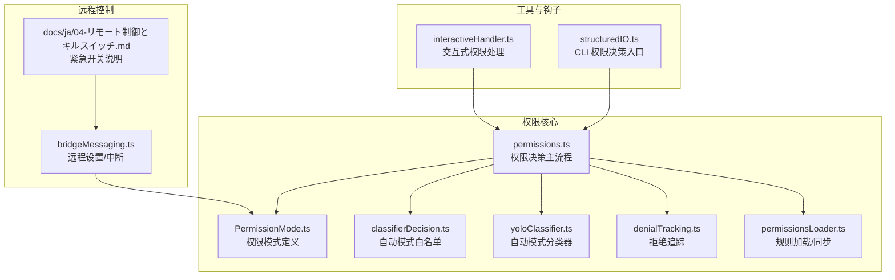
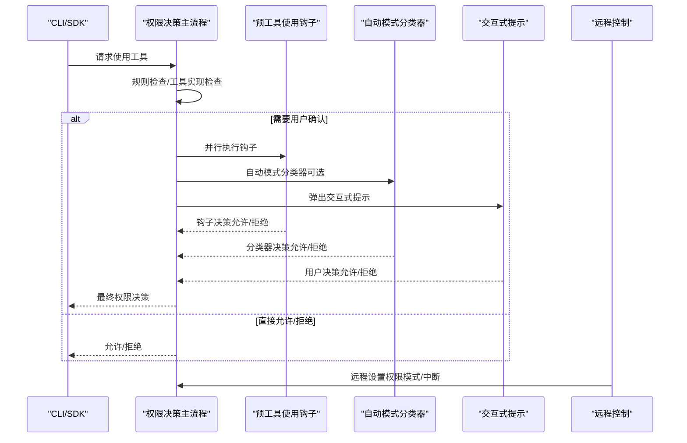
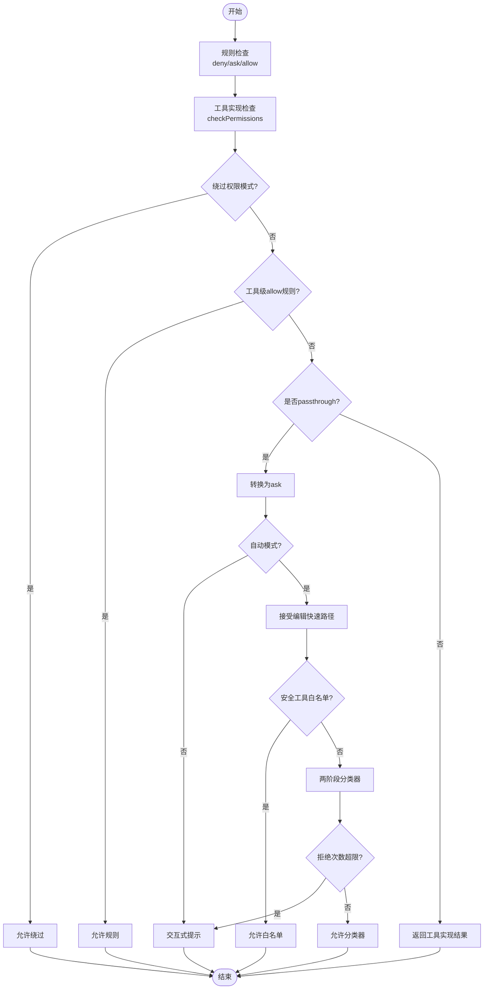
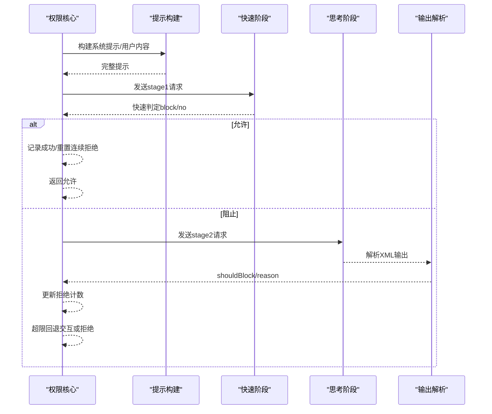
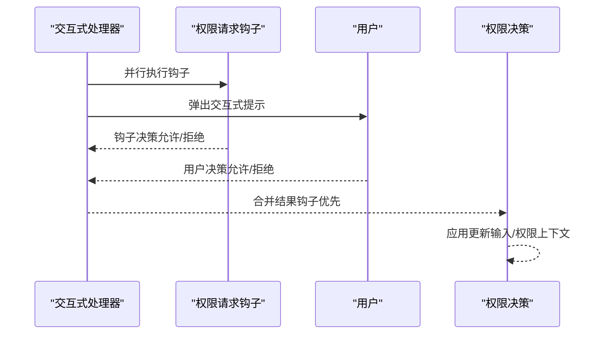
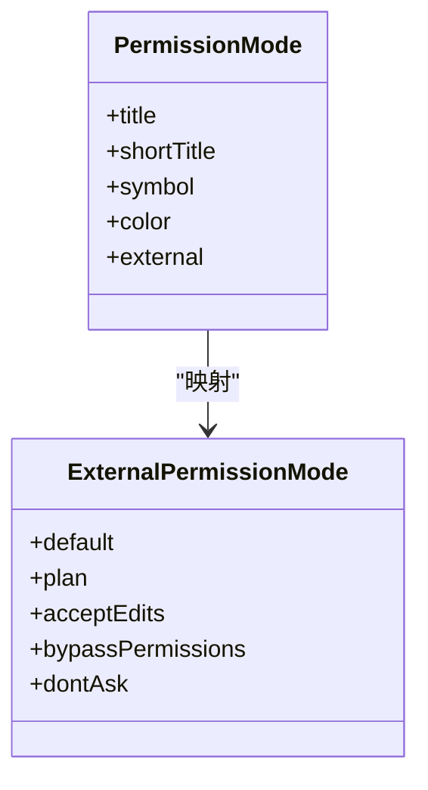
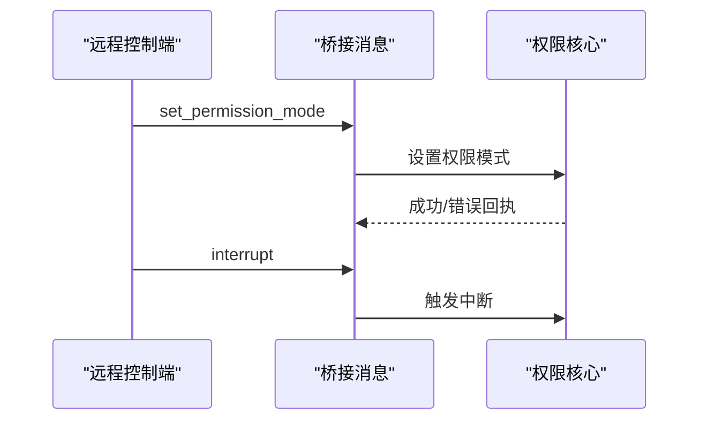
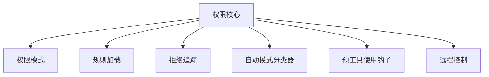

# 权限验证流程

<cite>
**本文档引用的文件**
- [src/utils/permissions/permissions.ts](file://src/utils/permissions/permissions.ts)
- [src/utils/permissions/PermissionMode.ts](file://src/utils/permissions/PermissionMode.ts)
- [src/utils/permissions/classifierDecision.ts](file://src/utils/permissions/classifierDecision.ts)
- [src/utils/permissions/yoloClassifier.ts](file://src/utils/permissions/yoloClassifier.ts)
- [src/utils/permissions/denialTracking.ts](file://src/utils/permissions/denialTracking.ts)
- [src/utils/permissions/permissionsLoader.ts](file://src/utils/permissions/permissionsLoader.ts)
- [src/hooks/toolPermission/handlers/interactiveHandler.ts](file://src/hooks/toolPermission/handlers/interactiveHandler.ts)
- [src/cli/structuredIO.ts](file://src/cli/structuredIO.ts)
- [src/bridge/bridgeMessaging.ts](file://src/bridge/bridgeMessaging.ts)
- [docs/ja/04-リモート制御とキルスイッチ.md](file://docs/ja/04-リモート制御とキルスイッチ.md)
</cite>

## 目录
1. [简介](#简介)
2. [项目结构](#项目结构)
3. [核心组件](#核心组件)
4. [架构总览](#架构总览)
5. [详细组件分析](#详细组件分析)
6. [依赖关系分析](#依赖关系分析)
7. [性能考虑](#性能考虑)
8. [故障排除指南](#故障排除指南)
9. [结论](#结论)

## 简介
本文件系统性梳理 Claude Code 的权限验证流程，围绕三大核心层次展开：预工具使用钩子（PreToolUse Hooks）、权限规则（Permission Rules）、交互式提示（Interactive Prompt），并深入解析权限决策算法在自动模式（Auto Mode）与交互模式（Interactive Mode）下的差异。文档还涵盖权限分类器（Permission Classifier）对工具调用意图的分析机制（如 bash 命令分类、文件系统操作分类、危险模式检测），以及权限绕过机制与紧急开关（Killswitch）的实现原理，并提供调试方法与性能优化建议。

## 项目结构
权限验证相关代码主要分布在以下模块：
- 权限核心逻辑：src/utils/permissions/*.ts
- 工具权限钩子处理：src/hooks/toolPermission/handlers/interactiveHandler.ts
- CLI 权限决策入口：src/cli/structuredIO.ts
- 远程控制与紧急开关：src/bridge/bridgeMessaging.ts 与 docs/ja/04-リモート制御とキルスイッチ.md

**图表来源**
- [src/utils/permissions/permissions.ts:473-1319](file://src/utils/permissions/permissions.ts#L473-L1319)
- [src/utils/permissions/PermissionMode.ts:42-91](file://src/utils/permissions/PermissionMode.ts#L42-L91)
- [src/utils/permissions/classifierDecision.ts:56-98](file://src/utils/permissions/classifierDecision.ts#L56-L98)
- [src/utils/permissions/yoloClassifier.ts:484-540](file://src/utils/permissions/yoloClassifier.ts#L484-L540)
- [src/utils/permissions/denialTracking.ts:12-45](file://src/utils/permissions/denialTracking.ts#L12-L45)
- [src/utils/permissions/permissionsLoader.ts:120-133](file://src/utils/permissions/permissionsLoader.ts#L120-L133)
- [src/hooks/toolPermission/handlers/interactiveHandler.ts:57-68](file://src/hooks/toolPermission/handlers/interactiveHandler.ts#L57-L68)
- [src/cli/structuredIO.ts:533-859](file://src/cli/structuredIO.ts#L533-L859)
- [src/bridge/bridgeMessaging.ts:328-371](file://src/bridge/bridgeMessaging.ts#L328-L371)

**章节来源**
- [src/utils/permissions/permissions.ts:473-1319](file://src/utils/permissions/permissions.ts#L473-L1319)
- [src/cli/structuredIO.ts:533-859](file://src/cli/structuredIO.ts#L533-L859)

## 核心组件
- 权限决策主流程（hasPermissionsToUseToolInner）
  - 规则级检查：工具级 deny/ask/allow 规则优先于工具实现检查
  - 工具实现检查：调用工具的 checkPermissions 返回结果
  - 绕过权限模式：bypassPermissions 模式直接允许
  - 工具级 allow 规则：直接允许
  - 转换 passthrough 为 ask
- 自动模式（Auto Mode）分类器
  - 接受编辑快速路径（acceptEdits）：在工作目录的安全编辑可跳过分类器
  - 安全工具白名单：无需分类器的只读/元数据类工具
  - 两阶段 XML 分类器：快速阶段（stage1）+ 思考阶段（stage2）
  - 拒绝追踪与上限：超过阈值时回退到交互确认
- 交互式提示（Interactive Mode）
  - 交互式权限处理：与钩子异步竞争，用户交互优先
  - 提示消息构建：根据决策原因生成可读说明
- 权限模式（Permission Mode）
  - default、plan、acceptEdits、bypassPermissions、dontAsk、auto 等模式
  - 外部模式映射与颜色标识
- 权限规则加载与同步
  - 支持多源规则（用户/项目/本地/策略/标志等）
  - 受管理规则限制（allowManagedPermissionRulesOnly）
  - 替换/追加规则的原子更新

**章节来源**
- [src/utils/permissions/permissions.ts:1158-1319](file://src/utils/permissions/permissions.ts#L1158-L1319)
- [src/utils/permissions/PermissionMode.ts:42-91](file://src/utils/permissions/PermissionMode.ts#L42-L91)
- [src/utils/permissions/classifierDecision.ts:56-98](file://src/utils/permissions/classifierDecision.ts#L56-L98)
- [src/utils/permissions/yoloClassifier.ts:711-800](file://src/utils/permissions/yoloClassifier.ts#L711-L800)
- [src/utils/permissions/denialTracking.ts:12-45](file://src/utils/permissions/denialTracking.ts#L12-L45)
- [src/utils/permissions/permissionsLoader.ts:120-133](file://src/utils/permissions/permissionsLoader.ts#L120-L133)

## 架构总览
权限验证采用“规则优先 + 工具实现 + 模式控制”的分层设计，自动模式通过分类器进行安全判定，交互模式由用户确认或钩子决定。远程控制通过桥接消息实现权限模式的动态调整与紧急中断。

**图表来源**
- [src/utils/permissions/permissions.ts:473-956](file://src/utils/permissions/permissions.ts#L473-L956)
- [src/cli/structuredIO.ts:533-859](file://src/cli/structuredIO.ts#L533-L859)
- [src/hooks/toolPermission/handlers/interactiveHandler.ts:57-68](file://src/hooks/toolPermission/handlers/interactiveHandler.ts#L57-L68)
- [src/bridge/bridgeMessaging.ts:328-371](file://src/bridge/bridgeMessaging.ts#L328-L371)

## 详细组件分析

### 权限决策算法（规则优先 + 模式控制）
- 决策步骤
  - 工具级 deny/ask/allow 规则检查
  - 工具实现的 checkPermissions 结果
  - 绕过权限模式（bypassPermissions/plan 模式可用时）
  - 工具级 allow 规则
  - 将 passthrough 转换为 ask
- 自动模式特例
  - 接受编辑快速路径：在工作目录的安全编辑直接允许
  - 安全工具白名单：跳过分类器
  - 分类器失败策略：根据铁门开关（fail closed/open）决定阻断或回退
  - 拒绝次数上限：超过阈值回退到交互确认
- 交互模式特例
  - 钩子与用户交互并行竞争，先到先得
  - 避免权限提示的场景（后台/无头代理）：优先运行钩子，否则自动拒绝

**图表来源**
- [src/utils/permissions/permissions.ts:1158-1319](file://src/utils/permissions/permissions.ts#L1158-L1319)
- [src/utils/permissions/classifierDecision.ts:56-98](file://src/utils/permissions/classifierDecision.ts#L56-L98)
- [src/utils/permissions/yoloClassifier.ts:711-800](file://src/utils/permissions/yoloClassifier.ts#L711-L800)
- [src/utils/permissions/denialTracking.ts:40-45](file://src/utils/permissions/denialTracking.ts#L40-L45)

**章节来源**
- [src/utils/permissions/permissions.ts:1158-1319](file://src/utils/permissions/permissions.ts#L1158-L1319)

### 权限分类器（Permission Classifier）
- 输入构建
  - 从消息历史提取用户文本与助手工具调用块
  - 工具输入投影（toAutoClassifierInput）用于安全表达
  - 可选 CLAUDE.md 用户配置作为系统前缀
- 系统提示定制
  - 外部模板与内部模板切换
  - 用户自定义 allow/deny/environment 规则注入
- 两阶段分类
  - 快速阶段（stage1）：短响应 + 明确终止符，快速判定
  - 思考阶段（stage2）：链式思考，降低误判
- 输出解析
  - XML 格式：<block>yes/no</block> + <reason>...
  - 思考内容剥离，避免标签干扰
- 错误处理与诊断
  - 超上下文窗口：回退到交互确认
  - 分类器不可用：根据铁门开关决定 fail closed 或 fail open
  - 错误提示转储：便于共享与分析

**图表来源**
- [src/utils/permissions/yoloClassifier.ts:484-540](file://src/utils/permissions/yoloClassifier.ts#L484-L540)
- [src/utils/permissions/yoloClassifier.ts:711-800](file://src/utils/permissions/yoloClassifier.ts#L711-L800)
- [src/utils/permissions/yoloClassifier.ts:567-604](file://src/utils/permissions/yoloClassifier.ts#L567-L604)

**章节来源**
- [src/utils/permissions/yoloClassifier.ts:484-540](file://src/utils/permissions/yoloClassifier.ts#L484-L540)
- [src/utils/permissions/yoloClassifier.ts:711-800](file://src/utils/permissions/yoloClassifier.ts#L711-L800)
- [src/utils/permissions/yoloClassifier.ts:567-604](file://src/utils/permissions/yoloClassifier.ts#L567-L604)

### 权限规则与加载（多源聚合）
- 规则来源
  - 用户设置、项目设置、本地设置、策略设置、标志设置、命令行参数、会话内存
- 加载与同步
  - 支持仅允许管理规则（策略设置）
  - 替换/追加规则的原子更新，避免丢失现有规则
  - 只读来源（策略/标志/命令行/会话）不可删除
- 规则匹配
  - 工具名精确匹配、MCP 服务器级别匹配、前缀/通配符支持
  - 内容级 ask 规则优先于绕过模式

**图表来源**
- [src/utils/permissions/permissionsLoader.ts:120-133](file://src/utils/permissions/permissionsLoader.ts#L120-L133)
- [src/utils/permissions/permissionsLoader.ts:140-145](file://src/utils/permissions/permissionsLoader.ts#L140-L145)
- [src/utils/permissions/permissionsLoader.ts:229-296](file://src/utils/permissions/permissionsLoader.ts#L229-L296)

**章节来源**
- [src/utils/permissions/permissionsLoader.ts:120-133](file://src/utils/permissions/permissionsLoader.ts#L120-L133)
- [src/utils/permissions/permissionsLoader.ts:229-296](file://src/utils/permissions/permissionsLoader.ts#L229-L296)

### 交互式提示与钩子（PreToolUse Hooks）
- 交互式处理
  - 将权限请求推送到确认队列，回调 onAbort/onAllow/onReject/recheckPermission/onUserInteraction
  - 钩子与用户交互并行竞争，先到先决
- 钩子决策
  - 允许：可更新输入与权限上下文
  - 拒绝：可中断或返回拒绝消息
  - 并行执行多个钩子，首个有效决策获胜
- CLI 场景
  - 钩子与 SDK 权限对话框竞速，避免延迟阻塞

**图表来源**
- [src/hooks/toolPermission/handlers/interactiveHandler.ts:57-68](file://src/hooks/toolPermission/handlers/interactiveHandler.ts#L57-L68)
- [src/cli/structuredIO.ts:533-859](file://src/cli/structuredIO.ts#L533-L859)

**章节来源**
- [src/hooks/toolPermission/handlers/interactiveHandler.ts:57-68](file://src/hooks/toolPermission/handlers/interactiveHandler.ts#L57-L68)
- [src/cli/structuredIO.ts:533-859](file://src/cli/structuredIO.ts#L533-L859)

### 权限模式与外部模式映射
- 模式定义
  - default、plan、acceptEdits、bypassPermissions、dontAsk、auto（按特性启用）
- 外部模式映射
  - auto 模式对外显示为 default
  - 其他模式映射到对应外部模式
- 颜色与符号
  - 不同模式具有不同颜色与符号，便于 UI 展示

**图表来源**
- [src/utils/permissions/PermissionMode.ts:42-91](file://src/utils/permissions/PermissionMode.ts#L42-L91)

**章节来源**
- [src/utils/permissions/PermissionMode.ts:42-91](file://src/utils/permissions/PermissionMode.ts#L42-L91)

### 紧急开关与远程控制
- 权限模式远程设置
  - 通过桥接消息 set_permission_mode 设置模式，带回执
- 功能旗标紧急开关
  - 权限绕过、Auto 模式、Fast 模式、分析输出、Agent Teams 等可通过 GrowthBook 旗标远程禁用
- 中断控制
  - 远程发送 interrupt 控制请求，触发本地中断

**图表来源**
- [src/bridge/bridgeMessaging.ts:328-371](file://src/bridge/bridgeMessaging.ts#L328-L371)
- [docs/ja/04-リモート制御とキルスイッチ.md:72-88](file://docs/ja/04-リモート制御とキルスイッチ.md#L72-L88)

**章节来源**
- [src/bridge/bridgeMessaging.ts:328-371](file://src/bridge/bridgeMessaging.ts#L328-L371)
- [docs/ja/04-リモート制御とキルスイッチ.md:72-88](file://docs/ja/04-リモート制御とキルスイッチ.md#L72-L88)

## 依赖关系分析
- 权限核心依赖
  - 权限模式：决定行为与 UI 表现
  - 分类器：自动模式下的安全判定
  - 规则加载：多源规则聚合与同步
  - 拒绝追踪：自动模式的阈值控制
- 工具与钩子
  - 工具实现的 checkPermissions 与 toAutoClassifierInput
  - 预工具使用钩子的并行决策
- 远程控制
  - 桥接消息与特性旗标共同影响权限行为

**图表来源**
- [src/utils/permissions/permissions.ts:473-956](file://src/utils/permissions/permissions.ts#L473-L956)
- [src/utils/permissions/PermissionMode.ts:42-91](file://src/utils/permissions/PermissionMode.ts#L42-L91)
- [src/utils/permissions/permissionsLoader.ts:120-133](file://src/utils/permissions/permissionsLoader.ts#L120-L133)
- [src/utils/permissions/denialTracking.ts:12-45](file://src/utils/permissions/denialTracking.ts#L12-L45)
- [src/utils/permissions/yoloClassifier.ts:484-540](file://src/utils/permissions/yoloClassifier.ts#L484-L540)
- [src/cli/structuredIO.ts:533-859](file://src/cli/structuredIO.ts#L533-L859)
- [src/bridge/bridgeMessaging.ts:328-371](file://src/bridge/bridgeMessaging.ts#L328-L371)

**章节来源**
- [src/utils/permissions/permissions.ts:473-956](file://src/utils/permissions/permissions.ts#L473-L956)

## 性能考虑
- 自动模式优化
  - 接受编辑快速路径：避免分类器调用
  - 安全工具白名单：跳过分类器
  - 分类器缓存：prompt caching（1小时TTL）减少重复计算
- 规则匹配优化
  - 多源规则一次性加载与聚合，避免重复解析
  - MCP 规则匹配使用工具名规范化与映射
- 交互式处理
  - 钩子与 UI 对话框并行，缩短等待时间
- 资源控制
  - 拒绝次数阈值防止过度分类器调用
  - 上下文窗口超限回退交互，避免无效尝试

[本节为通用指导，不直接分析具体文件]

## 故障排除指南
- 自动模式分类器不可用
  - 铁门开关（fail closed）：阻断并提示重试
  - 铁门开关（fail open）：回退到交互确认
- 分类器超上下文窗口
  - 无头代理：抛出中止错误
  - 有界面：回退到交互确认
- 拒绝次数过多
  - 连续/累计超过阈值：回退到交互确认，清零计数
- 钩子异常
  - 钩子失败：记录错误并继续（不崩溃）
- 远程控制
  - set_permission_mode 回执错误：检查回调注册与上下文支持
  - interrupt：确认本地中断处理逻辑

**章节来源**
- [src/utils/permissions/permissions.ts:818-956](file://src/utils/permissions/permissions.ts#L818-L956)
- [src/utils/permissions/denialTracking.ts:40-45](file://src/utils/permissions/denialTracking.ts#L40-L45)
- [src/bridge/bridgeMessaging.ts:328-371](file://src/bridge/bridgeMessaging.ts#L328-L371)

## 结论
Claude Code 的权限验证以“规则优先 + 工具实现 + 模式控制”为核心，结合自动模式分类器与交互式提示，形成多层次、可远程控制的安全体系。通过拒绝追踪与紧急开关，系统在保证安全性的同时兼顾用户体验与可控性。开发者应重点关注规则加载、分类器提示构建与钩子并行决策的实现细节，以确保权限验证流程稳定高效。