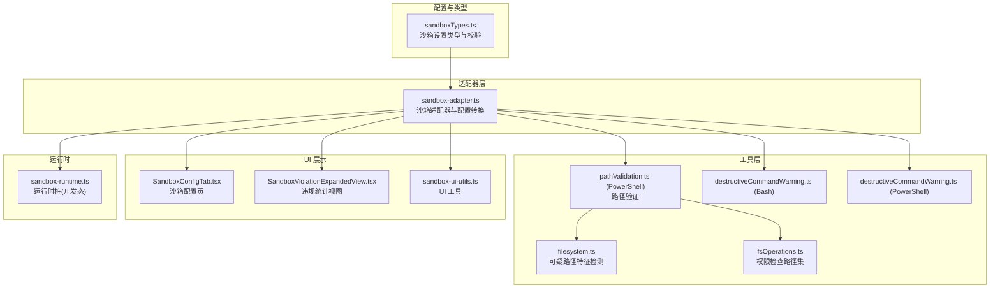
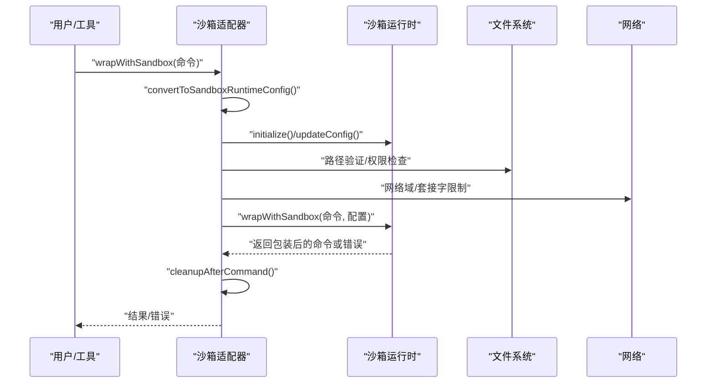
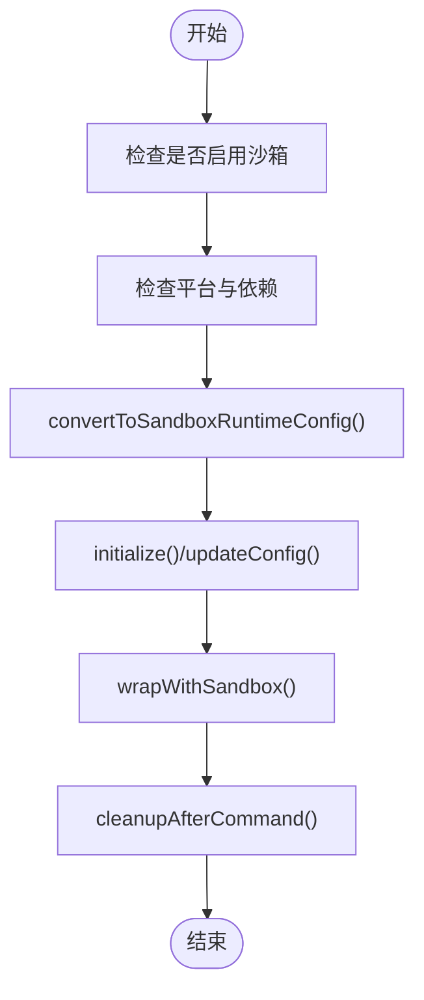
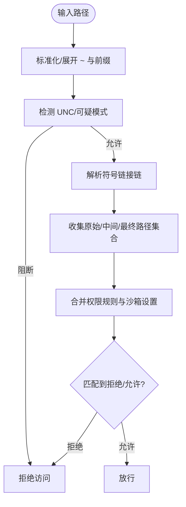
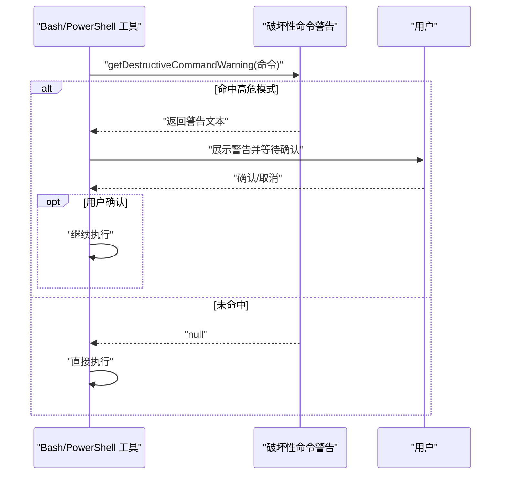
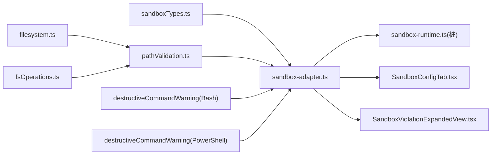

# 沙箱机制

<cite>
**本文档引用的文件**
- [sandbox-adapter.ts](file://src/utils/sandbox/sandbox-adapter.ts)
- [sandboxTypes.ts](file://src/entrypoints/sandboxTypes.ts)
- [SandboxConfigTab.tsx](file://src/components/sandbox/SandboxConfigTab.tsx)
- [SandboxViolationExpandedView.tsx](file://src/components/SandboxViolationExpandedView.tsx)
- [sandbox-ui-utils.ts](file://src/utils/sandbox/sandbox-ui-utils.ts)
- [destructiveCommandWarning.ts (Bash)](file://src/tools/BashTool/destructiveCommandWarning.ts)
- [destructiveCommandWarning.ts (PowerShell)](file://src/tools/PowerShellTool/destructiveCommandWarning.ts)
- [pathValidation.ts (PowerShell)](file://src/tools/PowerShellTool/pathValidation.ts)
- [filesystem.ts](file://src/utils/permissions/filesystem.ts)
- [fsOperations.ts](file://src/utils/fsOperations.ts)
- [REPL.tsx](file://src/screens/REPL.tsx)
- [sandbox-runtime.ts](file://stubs/sandbox-runtime.ts)
</cite>

## 目录
1. [简介](#简介)
2. [项目结构](#项目结构)
3. [核心组件](#核心组件)
4. [架构总览](#架构总览)
5. [详细组件分析](#详细组件分析)
6. [依赖关系分析](#依赖关系分析)
7. [性能考虑](#性能考虑)
8. [故障排除指南](#故障排除指南)
9. [结论](#结论)

## 简介
本文件系统化梳理 Claude Code 的沙箱机制，覆盖安全隔离原理（进程隔离、文件系统隔离、网络访问限制）、路径验证与白/黑名单策略、只读模式与目录遍历防护、破坏性命令警告与用户确认流程，并提供配置指南与故障排除建议。内容基于仓库中的实际实现进行提炼，避免臆测，确保可操作性与准确性。

## 项目结构
围绕沙箱的关键代码分布在以下模块：
- 配置与类型：入口类型定义与设置校验
- 适配器层：连接外部沙箱运行时与本地设置、权限规则
- UI 展示：沙箱状态、违规统计与配置概览
- 工具层：路径验证、破坏性命令识别
- 运行时桩：开发态下的空实现

**图表来源**
- [sandboxTypes.ts:1-157](file://src/entrypoints/sandboxTypes.ts#L1-L157)
- [sandbox-adapter.ts:1-986](file://src/utils/sandbox/sandbox-adapter.ts#L1-L986)
- [SandboxConfigTab.tsx:1-45](file://src/components/sandbox/SandboxConfigTab.tsx#L1-L45)
- [SandboxViolationExpandedView.tsx:1-99](file://src/components/SandboxViolationExpandedView.tsx#L1-L99)
- [sandbox-ui-utils.ts:1-13](file://src/utils/sandbox/sandbox-ui-utils.ts#L1-L13)
- [pathValidation.ts (PowerShell):46-1231](file://src/tools/PowerShellTool/pathValidation.ts#L46-L1231)
- [filesystem.ts:536-602](file://src/utils/permissions/filesystem.ts#L536-L602)
- [fsOperations.ts:272-342](file://src/utils/fsOperations.ts#L272-L342)
- [destructiveCommandWarning.ts (Bash):45-102](file://src/tools/BashTool/destructiveCommandWarning.ts#L45-L102)
- [destructiveCommandWarning.ts (PowerShell):42-109](file://src/tools/PowerShellTool/destructiveCommandWarning.ts#L42-L109)
- [sandbox-runtime.ts:1-38](file://stubs/sandbox-runtime.ts#L1-L38)

**章节来源**
- [sandbox-adapter.ts:1-986](file://src/utils/sandbox/sandbox-adapter.ts#L1-L986)
- [sandboxTypes.ts:1-157](file://src/entrypoints/sandboxTypes.ts#L1-L157)
- [SandboxConfigTab.tsx:1-45](file://src/components/sandbox/SandboxConfigTab.tsx#L1-L45)
- [SandboxViolationExpandedView.tsx:1-99](file://src/components/SandboxViolationExpandedView.tsx#L1-L99)
- [sandbox-ui-utils.ts:1-13](file://src/utils/sandbox/sandbox-ui-utils.ts#L1-L13)
- [pathValidation.ts (PowerShell):46-1231](file://src/tools/PowerShellTool/pathValidation.ts#L46-L1231)
- [filesystem.ts:536-602](file://src/utils/permissions/filesystem.ts#L536-L602)
- [fsOperations.ts:272-342](file://src/utils/fsOperations.ts#L272-L342)
- [destructiveCommandWarning.ts (Bash):45-102](file://src/tools/BashTool/destructiveCommandWarning.ts#L45-L102)
- [destructiveCommandWarning.ts (PowerShell):42-109](file://src/tools/PowerShellTool/destructiveCommandWarning.ts#L42-L109)
- [sandbox-runtime.ts:1-38](file://stubs/sandbox-runtime.ts#L1-L38)

## 核心组件
- 沙箱适配器（SandboxManager）：负责将本地设置与权限规则转换为运行时配置，初始化与动态更新配置，暴露文件系统/网络限制查询、违规存储、清理钩子等能力。
- 设置类型与校验：定义网络、文件系统、忽略违规、代理端口、弱化隔离等配置项的类型与约束。
- 路径验证与权限检查：在执行前对路径进行白/黑名单匹配、可疑模式检测、符号链接链解析与多级路径集合检查。
- 破坏性命令警告：针对 Bash/PowerShell 命令识别高危模式并提示，必要时要求用户确认。
- UI 展示：沙箱配置页与违规统计视图，帮助用户理解当前生效的限制与历史违规情况。

**章节来源**
- [sandbox-adapter.ts:172-381](file://src/utils/sandbox/sandbox-adapter.ts#L172-L381)
- [sandboxTypes.ts:11-144](file://src/entrypoints/sandboxTypes.ts#L11-L144)
- [pathValidation.ts (PowerShell):46-1231](file://src/tools/PowerShellTool/pathValidation.ts#L46-L1231)
- [filesystem.ts:536-602](file://src/utils/permissions/filesystem.ts#L536-L602)
- [fsOperations.ts:272-342](file://src/utils/fsOperations.ts#L272-L342)
- [destructiveCommandWarning.ts (Bash):45-102](file://src/tools/BashTool/destructiveCommandWarning.ts#L45-L102)
- [destructiveCommandWarning.ts (PowerShell):42-109](file://src/tools/PowerShellTool/destructiveCommandWarning.ts#L42-L109)
- [SandboxConfigTab.tsx:1-45](file://src/components/sandbox/SandboxConfigTab.tsx#L1-L45)
- [SandboxViolationExpandedView.tsx:1-99](file://src/components/SandboxViolationExpandedView.tsx#L1-L99)

## 架构总览
沙箱整体工作流：
- 启动阶段：根据设置判断是否启用沙箱，检查平台支持与依赖；初始化运行时并订阅设置变更以动态刷新配置。
- 执行阶段：对命令与路径进行预检（路径验证、权限检查、破坏性命令识别），在运行时内核中应用文件系统与网络限制。
- 收尾阶段：清理潜在裸仓库文件、标注标准错误中的失败信息、记录违规事件供 UI 查看。

**图表来源**
- [sandbox-adapter.ts:704-792](file://src/utils/sandbox/sandbox-adapter.ts#L704-L792)
- [sandbox-adapter.ts:172-381](file://src/utils/sandbox/sandbox-adapter.ts#L172-L381)
- [REPL.tsx:2312-2341](file://src/screens/REPL.tsx#L2312-L2341)

**章节来源**
- [sandbox-adapter.ts:704-792](file://src/utils/sandbox/sandbox-adapter.ts#L704-L792)
- [sandbox-adapter.ts:172-381](file://src/utils/sandbox/sandbox-adapter.ts#L172-L381)
- [REPL.tsx:2312-2341](file://src/screens/REPL.tsx#L2312-L2341)

## 详细组件分析

### 沙箱适配器与配置转换
- 平台与依赖检查：缓存平台支持与依赖可用性，若用户显式开启但不可用，会给出明确原因（如不支持的平台、缺失依赖）。
- 配置转换：从设置中提取网络允许/拒绝域、文件系统允许/拒绝写入/读取路径、忽略违规映射、代理端口、弱化隔离选项等，合并来自权限规则与沙箱设置的路径。
- 动态更新：监听设置变化，同步更新运行时配置；提供清理钩子以处理裸仓库文件等安全问题。
- 包装命令：在启用沙箱时，确保初始化完成后再执行命令包装。

**图表来源**
- [sandbox-adapter.ts:528-592](file://src/utils/sandbox/sandbox-adapter.ts#L528-L592)
- [sandbox-adapter.ts:172-381](file://src/utils/sandbox/sandbox-adapter.ts#L172-L381)
- [sandbox-adapter.ts:704-792](file://src/utils/sandbox/sandbox-adapter.ts#L704-L792)
- [sandbox-adapter.ts:963-966](file://src/utils/sandbox/sandbox-adapter.ts#L963-L966)

**章节来源**
- [sandbox-adapter.ts:528-592](file://src/utils/sandbox/sandbox-adapter.ts#L528-L592)
- [sandbox-adapter.ts:172-381](file://src/utils/sandbox/sandbox-adapter.ts#L172-L381)
- [sandbox-adapter.ts:704-792](file://src/utils/sandbox/sandbox-adapter.ts#L704-L792)
- [sandbox-adapter.ts:963-966](file://src/utils/sandbox/sandbox-adapter.ts#L963-L966)

### 路径验证与权限检查
- 路径白/黑名单：结合权限规则（Read/Edit）与沙箱文件系统设置，生成 allow/deny 列表；支持 CC 特有的路径前缀语义（如 // 绝对、/ 相对根目录）。
- 可疑路径特征：检测 Windows 8.3 短名、长路径前缀、尾部空白/点、设备名、连续三个点、UNC 路径等，作为阻断依据。
- 符号链接链解析：沿符号链接链收集所有中间目标与最终解析路径，防止通过链接绕过规则。
- UNC 与变量展开：在 Windows 上阻止 UNC 路径与变量展开语法，降低凭据泄露与 TOCTOU 风险。

**图表来源**
- [fsOperations.ts:272-342](file://src/utils/fsOperations.ts#L272-L342)
- [filesystem.ts:536-602](file://src/utils/permissions/filesystem.ts#L536-L602)
- [pathValidation.ts (PowerShell):46-1231](file://src/tools/PowerShellTool/pathValidation.ts#L46-L1231)

**章节来源**
- [fsOperations.ts:272-342](file://src/utils/fsOperations.ts#L272-L342)
- [filesystem.ts:536-602](file://src/utils/permissions/filesystem.ts#L536-L602)
- [pathValidation.ts (PowerShell):46-1231](file://src/tools/PowerShellTool/pathValidation.ts#L46-L1231)

### 破坏性命令警告系统
- Bash：识别 git 提交/推送/合并、rm 递归/强制、数据库 DROP/TRUNCATE/DELETE、kubectl/terraform 等高危模式，给出提示并要求确认。
- PowerShell：识别 Clear-Content、Format-Volume、Clear-Disk、git 重置/强制推送、git clean、Clear-RecycleBin 等，同样提供警告。
- 用户确认流程：当检测到高危模式时，通过回调或交互界面提示风险，用户确认后继续执行。

**图表来源**
- [destructiveCommandWarning.ts (Bash):45-102](file://src/tools/BashTool/destructiveCommandWarning.ts#L45-L102)
- [destructiveCommandWarning.ts (PowerShell):42-109](file://src/tools/PowerShellTool/destructiveCommandWarning.ts#L42-L109)

**章节来源**
- [destructiveCommandWarning.ts (Bash):45-102](file://src/tools/BashTool/destructiveCommandWarning.ts#L45-L102)
- [destructiveCommandWarning.ts (PowerShell):42-109](file://src/tools/PowerShellTool/destructiveCommandWarning.ts#L42-L109)

### 只读模式与目录遍历防护
- 只读模式：通过 denyWrite 与 allowRead 的组合实现“默认拒绝写入、仅在特定区域允许写入”的策略，同时在 denyRead 中允许特定区域读取，形成“只读为主、局部放行”的安全基线。
- 目录遍历防护：路径解析过程中包含符号链接链与祖先路径解析，确保即使通过软链接进入受限区域，也能被拒绝；UNC 与变量展开等高危路径直接阻断。
- 裸仓库防护：对可能被攻击者植入的裸仓库文件（HEAD/objects/refs 等）进行检测并在命令结束后清理，避免逃逸。

**章节来源**
- [sandbox-adapter.ts:222-288](file://src/utils/sandbox/sandbox-adapter.ts#L222-L288)
- [fsOperations.ts:310-342](file://src/utils/fsOperations.ts#L310-L342)
- [filesystem.ts:536-602](file://src/utils/permissions/filesystem.ts#L536-L602)
- [sandbox-adapter.ts:404-414](file://src/utils/sandbox/sandbox-adapter.ts#L404-L414)

### 网络访问限制与代理
- 允许/拒绝域：从权限规则与设置中提取 WebFetch 域名，分别加入 allowedDomains 与 deniedDomains。
- Unix 套接字与本地绑定：可选择允许特定 Unix Socket 或全部 Unix Socket，以及允许本地绑定。
- 代理端口：支持 httpProxyPort 与 socksProxyPort，用于受控出站网络访问。
- 弱化网络隔离：在 macOS 上可启用弱化隔离以满足某些工具的证书校验需求，但会引入额外风险。

**章节来源**
- [sandbox-adapter.ts:172-221](file://src/utils/sandbox/sandbox-adapter.ts#L172-L221)
- [sandboxTypes.ts:14-42](file://src/entrypoints/sandboxTypes.ts#L14-L42)
- [sandboxTypes.ts:125-133](file://src/entrypoints/sandboxTypes.ts#L125-L133)

### UI 展示与违规统计
- 沙箱配置页：展示启用状态、依赖警告、文件系统读写限制、网络限制、允许的 Unix Socket、Linux 下的通配符警告等。
- 违规统计视图：订阅违规存储，显示最近违规条目与总数，便于用户了解沙箱拦截行为。
- UI 工具：提供移除沙箱违规标签的工具函数，用于清洗错误消息。

**章节来源**
- [SandboxConfigTab.tsx:1-45](file://src/components/sandbox/SandboxConfigTab.tsx#L1-L45)
- [SandboxViolationExpandedView.tsx:1-99](file://src/components/SandboxViolationExpandedView.tsx#L1-L99)
- [sandbox-ui-utils.ts:1-13](file://src/utils/sandbox/sandbox-ui-utils.ts#L1-L13)

## 依赖关系分析
- 类型与设置：sandboxTypes.ts 定义配置类型，被 sandbox-adapter.ts 使用以生成运行时配置。
- 适配器与运行时：sandbox-adapter.ts 将本地设置转换为运行时配置并调用底层运行时；stubs/sandbox-runtime.ts 提供开发态空实现。
- 工具与权限：路径验证与权限检查在执行前进行，破坏性命令警告在执行前触发用户确认。
- UI 与状态：SandboxConfigTab.tsx 与 SandboxViolationExpandedView.tsx 依赖适配器提供的配置与违规存储。

**图表来源**
- [sandboxTypes.ts:1-157](file://src/entrypoints/sandboxTypes.ts#L1-L157)
- [sandbox-adapter.ts:1-986](file://src/utils/sandbox/sandbox-adapter.ts#L1-L986)
- [sandbox-runtime.ts:1-38](file://stubs/sandbox-runtime.ts#L1-L38)
- [SandboxConfigTab.tsx:1-45](file://src/components/sandbox/SandboxConfigTab.tsx#L1-L45)
- [SandboxViolationExpandedView.tsx:1-99](file://src/components/SandboxViolationExpandedView.tsx#L1-L99)
- [pathValidation.ts (PowerShell):46-1231](file://src/tools/PowerShellTool/pathValidation.ts#L46-L1231)
- [filesystem.ts:536-602](file://src/utils/permissions/filesystem.ts#L536-L602)
- [fsOperations.ts:272-342](file://src/utils/fsOperations.ts#L272-L342)
- [destructiveCommandWarning.ts (Bash):45-102](file://src/tools/BashTool/destructiveCommandWarning.ts#L45-L102)
- [destructiveCommandWarning.ts (PowerShell):42-109](file://src/tools/PowerShellTool/destructiveCommandWarning.ts#L42-L109)

**章节来源**
- [sandbox-adapter.ts:1-986](file://src/utils/sandbox/sandbox-adapter.ts#L1-L986)
- [sandboxTypes.ts:1-157](file://src/entrypoints/sandboxTypes.ts#L1-L157)
- [sandbox-runtime.ts:1-38](file://stubs/sandbox-runtime.ts#L1-L38)

## 性能考虑
- 依赖检查与平台支持：使用记忆化缓存减少重复检查开销；仅在设置变化时更新配置，避免频繁重建运行时。
- 路径解析：符号链接链解析设置最大深度，防止循环与过度计算；对不存在路径采用祖先解析以减少文件系统访问。
- 通配符限制：Linux/WSL 不支持通配符，适配器提供警告列表，避免无效规则带来的误判成本。

[本节为通用指导，无需具体文件分析]

## 故障排除指南
- 启动即报沙箱不可用：
  - 明确原因：平台不支持（如 WSL1）、平台不在 enabledPlatforms 列表、依赖缺失。
  - 处理：根据提示安装依赖或调整 enabledPlatforms；必要时设置 failIfUnavailable 以强制要求沙箱。
- 依赖缺失告警：
  - 观察 /sandbox 页面的依赖警告；按提示安装所需工具或切换到受支持平台。
- Linux 通配符无效：
  - 适配器会列出包含通配符的规则；建议改用更精确的路径或在 macOS 上使用。
- 违规过多：
  - 通过违规统计视图查看最近拦截；调整 allow/deny 规则或路径前缀语义。
- 清理残留：
  - 命令结束后自动清理裸仓库文件；若仍出现异常，检查 .git 相关文件是否被正确屏蔽。

**章节来源**
- [sandbox-adapter.ts:562-592](file://src/utils/sandbox/sandbox-adapter.ts#L562-L592)
- [REPL.tsx:2312-2341](file://src/screens/REPL.tsx#L2312-L2341)
- [SandboxConfigTab.tsx:1-45](file://src/components/sandbox/SandboxConfigTab.tsx#L1-L45)
- [SandboxViolationExpandedView.tsx:1-99](file://src/components/SandboxViolationExpandedView.tsx#L1-L99)

## 结论
Claude Code 的沙箱机制通过“设置→适配器→运行时”的分层设计，实现了对文件系统、网络与进程的多维安全隔离。路径验证与权限检查在执行前进行，破坏性命令警告在执行中进行，配合 UI 展示与违规统计，形成闭环的安全体验。建议在生产环境中启用沙箱并合理配置网络与文件系统限制，定期审查违规日志以持续加固安全基线。