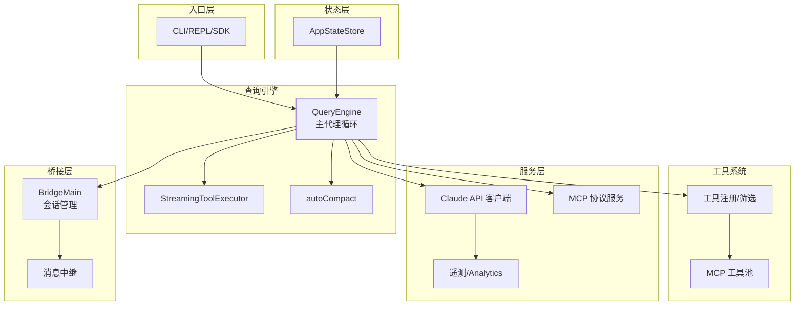
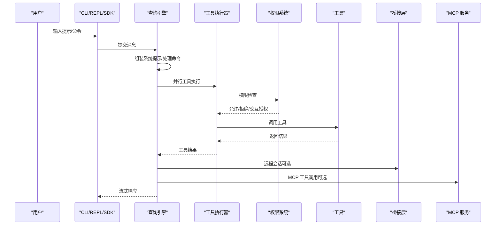
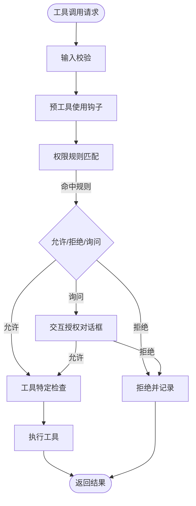
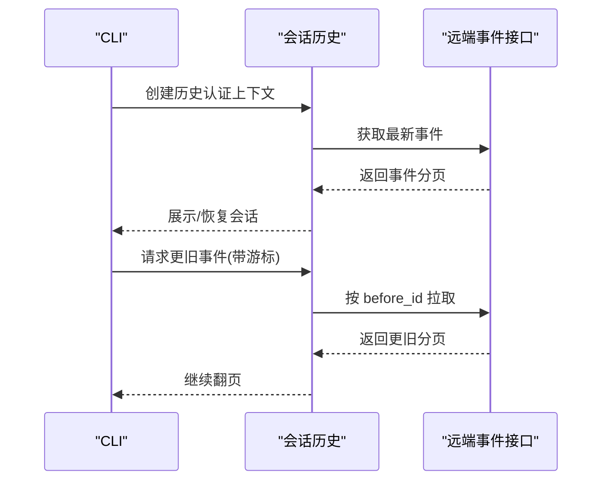
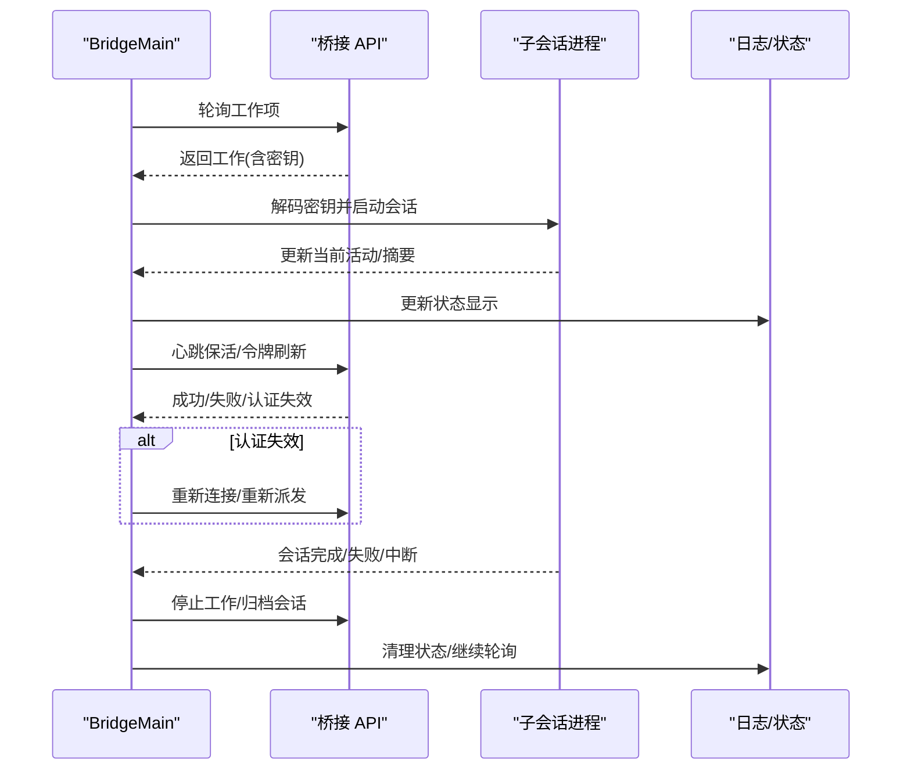
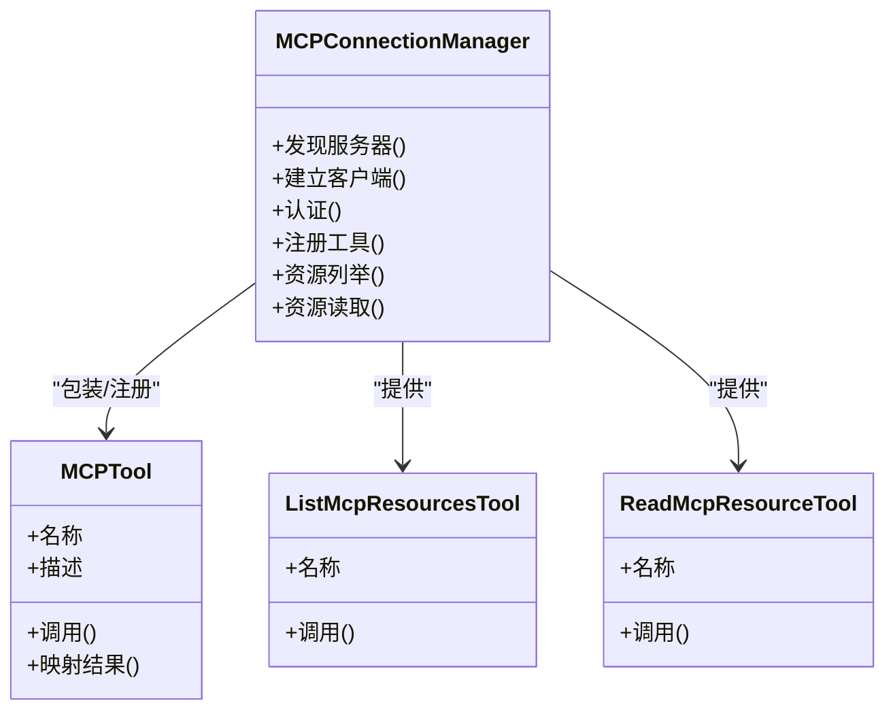
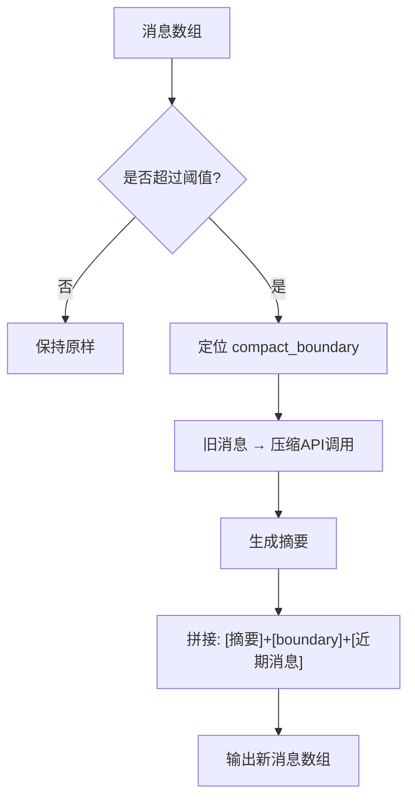
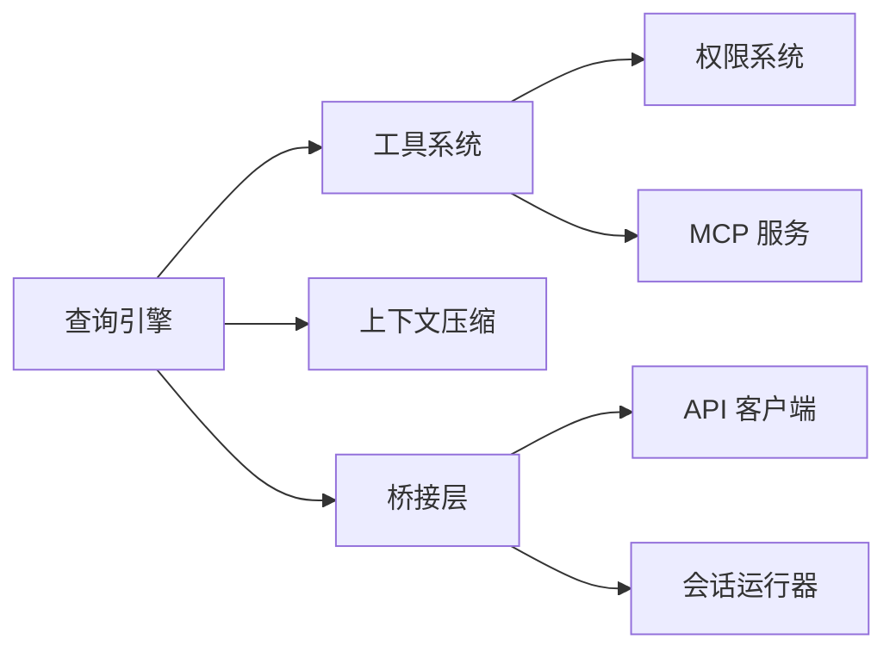

# 核心特性

<cite>
**本文档引用的文件**
- [README.md](file://README.md)
- [README_CN.md](file://README_CN.md)
- [src/tools.ts](file://src/tools.ts)
- [src/constants/tools.ts](file://src/constants/tools.ts)
- [src/bridge/bridgeMain.ts](file://src/bridge/bridgeMain.ts)
- [src/assistant/sessionHistory.ts](file://src/assistant/sessionHistory.ts)
- [src/services/mcp/index.ts](file://src/services/mcp/index.ts)
- [src/services/compact/autoCompact.ts](file://src/services/compact/autoCompact.ts)
- [src/tools/AgentTool/AgentTool.tsx](file://src/tools/AgentTool/AgentTool.tsx)
- [src/tools/BashTool/BashTool.tsx](file://src/tools/BashTool/BashTool.tsx)
- [src/utils/permissions/permissions.ts](file://src/utils/permissions/permissions.ts)
- [src/services/compact/index.js](file://src/services/compact/index.js)
- [src/services/compact/operations.js](file://src/services/compact/operations.js)
- [src/services/contextCollapse/index.js](file://src/services/contextCollapse/index.js)
- [src/services/contextCollapse/operations.js](file://src/services/contextCollapse/operations.js)
- [src/services/contextCollapse/persist.js](file://src/services/contextCollapse/persist.js)
- [src/services/skillSearch/featureCheck.js](file://src/services/skillSearch/featureCheck.js)
- [src/services/skillSearch/remoteSkillLoader.js](file://src/services/skillSearch/remoteSkillLoader.js)
- [src/services/skillSearch/remoteSkillState.js](file://src/services/skillSearch/remoteSkillState.js)
- [src/services/skillSearch/telemetry.js](file://src/services/skillSearch/telemetry.js)
- [src/bridge/peerSessions.js](file://src/bridge/peerSessions.js)
- [src/assistant/index.js](file://src/assistant/index.js)
- [src/proactive/index.js](file://src/proactive/index.js)
- [src/coordinator/workerAgent.js](file://src/coordinator/workerAgent.js)
- [src/bridge/bridgeApi.ts](file://src/bridge/bridgeApi.ts)
- [src/bridge/bridgeConfig.ts](file://src/bridge/bridgeConfig.ts)
- [src/bridge/bridgeMessaging.ts](file://src/bridge/bridgeMessaging.ts)
- [src/bridge/bridgePermissionCallbacks.ts](file://src/bridge/bridgePermissionCallbacks.ts)
- [src/bridge/bridgePointer.ts](file://src/bridge/bridgeStatusUtil.ts](file://src/bridge/bridgeStatusUtil.ts)
- [src/bridge/bridgeUI.ts](file://src/bridge/bridgeUI.ts)
- [src/bridge/capacityWake.ts](file://src/bridge/capacityWake.ts)
- [src/bridge/codeSessionApi.ts](file://src/bridge/codeSessionApi.ts)
- [src/bridge/createSession.ts](file://src/bridge/createSession.ts)
- [src/bridge/debugUtils.ts](file://src/bridge/debugUtils.ts)
- [src/bridge/envLessBridgeConfig.ts](file://src/bridge/envLessBridgeConfig.ts)
- [src/bridge/flushGate.ts](file://src/bridge/flushGate.ts)
- [src/bridge/inboundAttachments.ts](file://src/bridge/inboundAttachments.ts)
- [src/bridge/inboundMessages.ts](file://src/bridge/inboundMessages.ts)
- [src/bridge/initReplBridge.ts](file://src/bridge/initReplBridge.ts)
- [src/bridge/jwtUtils.ts](file://src/bridge/jwtUtils.ts)
- [src/bridge/pollConfig.ts](file://src/bridge/pollConfig.ts)
- [src/bridge/pollConfigDefaults.ts](file://src/bridge/pollConfigDefaults.ts)
- [src/bridge/remoteBridgeCore.ts](file://src/bridge/remoteBridgeCore.ts)
- [src/bridge/replBridge.ts](file://src/bridge/replBridge.ts)
- [src/bridge/replBridgeHandle.ts](file://src/bridge/replBridgeHandle.ts)
- [src/bridge/replBridgeTransport.ts](file://src/bridge/replBridgeTransport.ts)
- [src/bridge/sessionIdCompat.ts](file://src/bridge/sessionIdCompat.ts)
- [src/bridge/sessionRunner.ts](file://src/bridge/sessionRunner.ts)
- [src/bridge/trustedDevice.ts](file://src/bridge/trustedDevice.ts)
- [src/bridge/types.ts](file://src/bridge/types.ts)
- [src/bridge/workSecret.ts](file://src/bridge/workSecret.ts)
- [src/remote/RemoteSessionManager.ts](file://src/remote/RemoteSessionManager.ts)
- [src/remote/SessionsWebSocket.ts](file://src/remote/SessionsWebSocket.ts)
- [src/remote/sdkMessageAdapter.ts](file://src/remote/sdkMessageAdapter.ts)
- [src/remote/remotePermissionBridge.ts](file://src/remote/remotePermissionBridge.ts)
- [src/services/compact/reactiveCompact.js](file://src/services/compact/reactiveCompact.js)
- [src/services/compact/snipCompact.js](file://src/services/compact/snipCompact.js)
- [src/services/compact/snipProjection.js](file://src/services/compact/snipProjection.js)
- [src/services/compact/cachedMCConfig.js](file://src/services/compact/cachedMCConfig.js)
- [src/services/sessionTranscript/sessionTranscript.js](file://src/services/sessionTranscript/sessionTranscript.js)
- [src/services/sessionTranscript/sessionTranscript.js](file://src/services/sessionTranscript/sessionTranscript.js)
- [src/tasks/LocalWorkflowTask/LocalWorkflowTask.js](file://src/tasks/LocalWorkflowTask/LocalWorkflowTask.js)
- [src/commands/agents-platform/index.js](file://src/commands/agents-platform/index.js)
- [src/commands/assistant/index.js](file://src/commands/assistant/index.js)
- [src/commands/buddy/index.js](file://src/commands/buddy/index.js)
- [src/commands/fork/index.js](file://src/commands/fork/index.js)
- [src/commands/peers/index.js](file://src/commands/peers/index.js)
- [src/commands/proactive.js](file://src/commands/proactive.js)
- [src/commands/remoteControlServer/index.js](file://src/commands/remoteControlServer/index.js)
- [src/commands/subscribe-pr.js](file://src/commands/subscribe-pr.js)
- [src/commands/workflows/index.js](file://src/commands/workflows/index.js)
- [src/memos/memoryShapeTelemetry.js](file://src/memos/memoryShapeTelemetry.js)
- [src/services/sessionTranscript/sessionTranscript.js](file://src/services/sessionTranscript/sessionTranscript.js)
- [src/tasks/LocalWorkflowTask/LocalWorkflowTask.js](file://src/tasks/LocalWorkflowTask/LocalWorkflowTask.js)
- [src/commands/agents-platform/index.js](file://src/commands/agents-platform/index.js)
- [src/commands/assistant/index.js](file://src/commands/assistant/index.js)
- [src/commands/buddy/index.js](file://src/commands/buddy/index.js)
- [src/commands/fork/index.js](file://src/commands/fork/index.js)
- [src/commands/peers/index.js](file://src/commands/peers/index.js)
- [src/commands/proactive.js](file://src/commands/proactive.js)
- [src/commands/remoteControlServer/index.js](file://src/commands/remoteControlServer/index.js)
- [src/commands/subscribe-pr.js](file://src/commands/subscribe-pr.js)
- [src/commands/workflows/index.js](file://src/commands/workflows/index.js)
- [src/memos/memoryShapeTelemetry.js](file://src/memos/memoryShapeTelemetry.js)
</cite>

## 目录
1. [简介](#简介)
2. [项目结构](#项目结构)
3. [核心组件](#核心组件)
4. [架构总览](#架构总览)
5. [详细组件分析](#详细组件分析)
6. [依赖关系分析](#依赖关系分析)
7. [性能考量](#性能考量)
8. [故障排查指南](#故障排查指南)
9. [结论](#结论)
10. [附录](#附录)

## 简介
本文件聚焦 Claude Code 的核心特性，围绕以下主题提供系统化说明：
- 40+ 内置工具的分类与用途：文件操作、搜索发现、执行、交互、计划工作流、系统工具等
- 权限控制系统：工具使用权限验证、沙箱机制、安全策略
- 会话管理系统：会话持久化、历史记录恢复、多会话并发
- 远程协作系统：桥接层架构、远程会话管理、通信协议设计
- MCP（Model Context Protocol）集成：外部 AI 服务连接、工具包装器、资源管理
- 上下文管理系统：对话历史压缩、内存管理策略、性能优化技巧
- 使用示例与最佳实践建议

## 项目结构
该项目采用“入口层 → 查询引擎 → 工具/服务/状态”的分层架构，配合桥接层支持远程协作，以及 MCP 服务扩展外部能力。核心目录与职责概览如下：
- 入口层：CLI/REPL/SDK 入口，负责初始化与消息路由
- 查询引擎：主代理循环、工具执行编排、上下文压缩
- 工具系统：40+ 内置工具与 MCP 工具的统一注册与筛选
- 服务层：API 客户端、遥测、MCP 连接、插件加载、设置同步
- 状态层：应用状态存储与 React Provider
- 任务系统：本地/远程/团队代理任务执行
- 桥接层：Claude Desktop/远程桥接、会话生命周期管理
- 上下文压缩：自动压缩、裁剪、折叠等策略

图表来源
- [README.md](file://README.md)
- [src/bridge/bridgeMain.ts](file://src/bridge/bridgeMain.ts)
- [src/tools.ts](file://src/tools.ts)

章节来源
- [README.md](file://README.md)
- [README_CN.md](file://README_CN.md)

## 核心组件
本节概述四大核心子系统及其职责与交互方式。

- 工具系统与权限
  - 工具注册与筛选：统一装配内置工具与 MCP 工具，按权限规则与特性门控进行过滤
  - 权限控制：输入校验、预工具使用钩子、规则引擎、交互式授权、工具特定检查
  - 沙箱与安全：路径沙箱、并发安全标记、只读/破坏性操作区分、中断行为控制
- 会话与持久化
  - 会话日志：JSONL 追加日志，支持最新/更旧分页拉取
  - 恢复与并发：支持 --continue/--resume/--fork-session；多会话并发与容量唤醒
- 远程协作与桥接
  - 桥接协议：JWT 认证、工作密钥交换、会话生命周期、指数退避重试
  - 远程会话：环境实例管理、心跳保活、超时与中断处理
- MCP 集成
  - 连接管理：多种传输（stdio/SSE/HTTP/WS/SDK）、认证（OAuth/XAA/API Key）
  - 工具注册：动态模式、权限透传、资源列举

章节来源
- [src/tools.ts](file://src/tools.ts)
- [src/constants/tools.ts](file://src/constants/tools.ts)
- [src/utils/permissions/permissions.ts](file://src/utils/permissions/permissions.ts)
- [src/assistant/sessionHistory.ts](file://src/assistant/sessionHistory.ts)
- [src/bridge/bridgeMain.ts](file://src/bridge/bridgeMain.ts)
- [src/services/mcp/index.ts](file://src/services/mcp/index.ts)

## 架构总览
下图展示从用户输入到工具执行、再到远程桥接与 MCP 扩展的整体流程。

图表来源
- [README.md](file://README.md)
- [src/bridge/bridgeMain.ts](file://src/bridge/bridgeMain.ts)
- [src/services/mcp/index.ts](file://src/services/mcp/index.ts)

## 详细组件分析

### 工具系统与权限控制
- 工具分类与用途
  - 文件操作：读取、编辑、写入、笔记本编辑
  - 搜索发现：全局匹配、内容搜索、工具搜索
  - 执行：Bash/PowerShell、技能调用、LSP 工具
  - 交互：提问、简报、用户消息传递
  - 计划与工作流：进入/退出计划模式、工作树模式、待办写入
  - 系统：配置、定时任务、睡眠工具、Tungsten 工具
  - MCP：资源列举、资源读取、MCP 工具包装
- 权限控制流程
  - 输入校验 → 预工具使用钩子 → 规则引擎（允许/拒绝/询问）→ 交互授权 → 工具特定检查 → 执行
  - 支持特性门控与用户类型（USER_TYPE）差异化
- 沙箱与安全
  - 并发安全标记、只读/破坏性操作、中断行为、路径沙箱

图表来源
- [README.md](file://README.md)
- [src/utils/permissions/permissions.ts](file://src/utils/permissions/permissions.ts)

章节来源
- [src/tools.ts](file://src/tools.ts)
- [src/constants/tools.ts](file://src/constants/tools.ts)
- [src/utils/permissions/permissions.ts](file://src/utils/permissions/permissions.ts)
- [README.md](file://README.md)

### 会话管理系统
- 会话持久化
  - JSONL 追加日志，包含用户/助手/进度/系统边界标记
  - 支持阻塞写入以保证崩溃恢复
- 历史记录恢复
  - 分页拉取：最新事件与更旧事件，支持游标翻页
  - 支持 --continue/--resume/--fork-session
- 多会话并发
  - 容量唤醒、心跳保活、超时与中断处理、会话归档

图表来源
- [src/assistant/sessionHistory.ts](file://src/assistant/sessionHistory.ts)

章节来源
- [src/assistant/sessionHistory.ts](file://src/assistant/sessionHistory.ts)
- [README.md](file://README.md)

### 远程协作系统（桥接层）
- 桥接协议与会话管理
  - JWT 认证、工作密钥交换、会话生命周期、指数退避重试
  - 心跳保活、令牌刷新、超时与中断处理
- 多会话并发
  - 容量控制、心跳模式、空闲轮询、会话归档
- 通信与状态
  - 状态更新、活动轨迹、错误预算与致命错误处理

图表来源
- [src/bridge/bridgeMain.ts](file://src/bridge/bridgeMain.ts)
- [src/bridge/bridgeApi.ts](file://src/bridge/bridgeApi.ts)
- [src/bridge/sessionRunner.ts](file://src/bridge/sessionRunner.ts)
- [src/bridge/jwtUtils.ts](file://src/bridge/jwtUtils.ts)

章节来源
- [src/bridge/bridgeMain.ts](file://src/bridge/bridgeMain.ts)
- [src/bridge/bridgeApi.ts](file://src/bridge/bridgeApi.ts)
- [src/bridge/sessionRunner.ts](file://src/bridge/sessionRunner.ts)
- [src/bridge/jwtUtils.ts](file://src/bridge/jwtUtils.ts)

### MCP（Model Context Protocol）集成
- 连接管理
  - 多种传输：stdio/SSE/HTTP/WS/SDK
  - 认证：OAuth 2.0、跨应用访问（XAA/SEP-990）、API Key
- 工具注册与资源管理
  - 动态模式、权限透传、资源列举与读取
  - 与内置工具合并、去重优先级控制

图表来源
- [README.md](file://README.md)
- [src/services/mcp/index.ts](file://src/services/mcp/index.ts)

章节来源
- [README.md](file://README.md)
- [src/services/mcp/index.ts](file://src/services/mcp/index.ts)

### 上下文管理系统
- 压缩策略
  - 自动压缩：超过阈值时对旧消息进行总结
  - 历史裁剪：移除僵尸消息与陈旧标记
  - 上下文折叠：重构上下文以提升效率
- 数据流
  - 以 compact_boundary 为界，旧消息被压缩摘要替代，保留最近高保真消息

图表来源
- [README.md](file://README.md)
- [src/services/compact/autoCompact.ts](file://src/services/compact/autoCompact.ts)
- [src/services/compact/index.js](file://src/services/compact/index.js)
- [src/services/compact/operations.js](file://src/services/compact/operations.js)

章节来源
- [README.md](file://README.md)
- [src/services/compact/autoCompact.ts](file://src/services/compact/autoCompact.ts)
- [src/services/compact/index.js](file://src/services/compact/index.js)
- [src/services/compact/operations.js](file://src/services/compact/operations.js)

### 子代理与多代理架构
- 模式
  - 默认：同进程共享缓存
  - Fork：子进程，全新消息数组，共享文件缓存
  - 工作树：隔离 git 工作树 + Fork
  - 远程：桥接到 Claude Code Remote/容器
- 通信
  - 消息传递、任务看板、团队生命周期管理
- Swarm 模式（特性门控）
  - 领导代理、队友认领任务、共享消息收件箱、隔离消息/缓存/工作目录

章节来源
- [README.md](file://README.md)
- [src/tools/AgentTool/AgentTool.tsx](file://src/tools/AgentTool/AgentTool.tsx)

### 执行工具与交互工具
- 执行工具
  - Bash/PowerShell：命令执行、并发安全、中断行为
  - 技能工具：技能调用、LSP 工具
- 交互工具
  - 提问工具：用户交互
  - 简报工具：生成摘要
  - 用户消息传递：跨代理通信

章节来源
- [src/tools/BashTool/BashTool.tsx](file://src/tools/BashTool/BashTool.tsx)
- [src/tools/AgentTool/AgentTool.tsx](file://src/tools/AgentTool/AgentTool.tsx)

## 依赖关系分析
- 工具系统依赖权限规则与特性门控，确保不同用户类型与部署环境下可见工具集合一致
- 查询引擎依赖工具执行器与上下文压缩，保障长对话的稳定性与性能
- 桥接层依赖 API 客户端与会话运行器，维持远程会话的健壮性
- MCP 服务独立于内置工具，通过动态注册与权限透传融入统一工具池

图表来源
- [src/tools.ts](file://src/tools.ts)
- [src/utils/permissions/permissions.ts](file://src/utils/permissions/permissions.ts)
- [src/services/compact/autoCompact.ts](file://src/services/compact/autoCompact.ts)
- [src/bridge/bridgeMain.ts](file://src/bridge/bridgeMain.ts)

章节来源
- [src/tools.ts](file://src/tools.ts)
- [src/bridge/bridgeMain.ts](file://src/bridge/bridgeMain.ts)

## 性能考量
- 工具执行
  - 并行执行与串行安全分区，减少等待时间
  - 工具结果去重与进度内联写入，降低重复 IO
- 上下文压缩
  - 自动压缩与历史裁剪降低 token 使用，避免超出上下文窗口
  - 折叠策略在保证理解的前提下重构上下文
- 桥接层
  - 指数退避与心跳保活，避免频繁轮询与空转
  - 容量唤醒与空闲轮询策略，平衡吞吐与资源占用

## 故障排查指南
- 权限相关
  - 检查权限规则与交互授权是否正确配置
  - 确认工具特定检查（如路径沙箱）是否触发
- 远程会话
  - 关注认证失效与致命错误，必要时触发重新连接/重新派发
  - 查看心跳失败与令牌刷新调度日志
- MCP 工具
  - 检查服务器发现与工具注册状态
  - 确认权限透传与资源列举是否正常

章节来源
- [src/utils/permissions/permissions.ts](file://src/utils/permissions/permissions.ts)
- [src/bridge/bridgeMain.ts](file://src/bridge/bridgeMain.ts)
- [src/services/mcp/index.ts](file://src/services/mcp/index.ts)

## 结论
Claude Code 通过“工具系统 + 权限控制 + 会话持久化 + 远程桥接 + MCP 集成 + 上下文压缩”六大支柱，构建了可扩展、可治理、可远程协作的智能体平台。其特性门控与用户类型差异化设计，既满足内部研发需求，也为外部用户提供了灵活的安全与体验边界。

## 附录
- 特性门控与隐藏模块
  - 项目包含大量特性门控模块（如 Coordinator、Proactive、ContextCollapse、SkillSearch 等），在发布包中通过死代码消除移除，仅在内部构建中可用
- 远程协作与桥接
  - 桥接层支持多会话并发、心跳保活、容量唤醒与会话归档，适配复杂远程工作负载
- 上下文折叠与技能搜索
  - 实验性服务提供上下文折叠与技能搜索能力，增强长期对话与工具发现体验

章节来源
- [README.md](file://README.md)
- [README_CN.md](file://README_CN.md)
- [src/services/contextCollapse/index.js](file://src/services/contextCollapse/index.js)
- [src/services/contextCollapse/operations.js](file://src/services/contextCollapse/operations.js)
- [src/services/contextCollapse/persist.js](file://src/services/contextCollapse/persist.js)
- [src/services/skillSearch/featureCheck.js](file://src/services/skillSearch/featureCheck.js)
- [src/services/skillSearch/remoteSkillLoader.js](file://src/services/skillSearch/remoteSkillLoader.js)
- [src/services/skillSearch/remoteSkillState.js](file://src/services/skillSearch/remoteSkillState.js)
- [src/services/skillSearch/telemetry.js](file://src/services/skillSearch/telemetry.js)
- [src/bridge/peerSessions.js](file://src/bridge/peerSessions.js)
- [src/assistant/index.js](file://src/assistant/index.js)
- [src/proactive/index.js](file://src/proactive/index.js)
- [src/coordinator/workerAgent.js](file://src/coordinator/workerAgent.js)