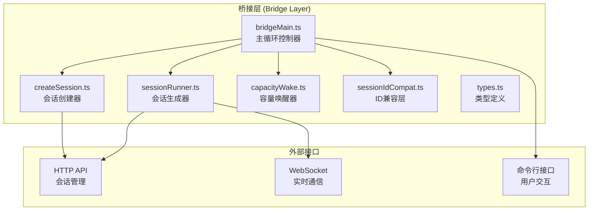
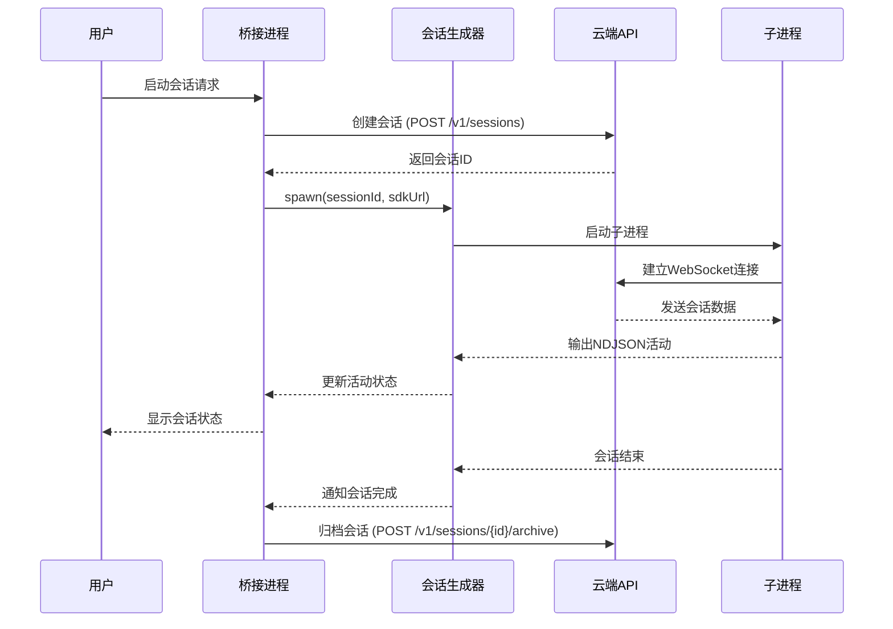
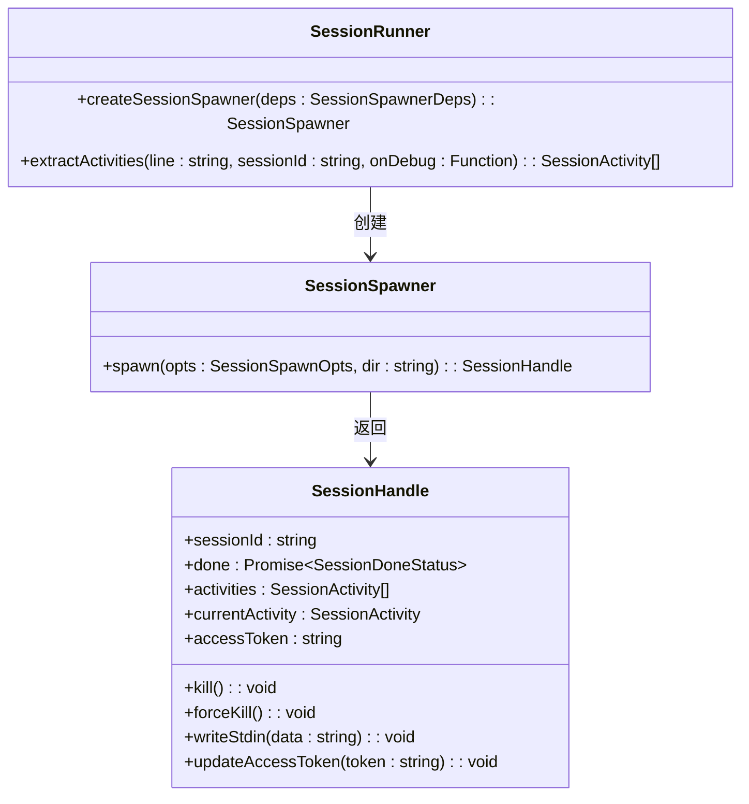
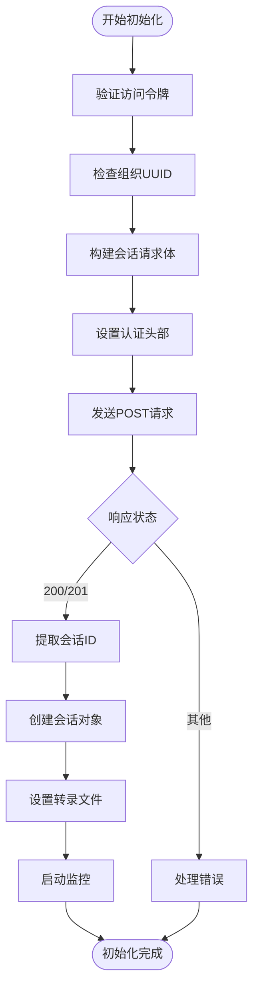
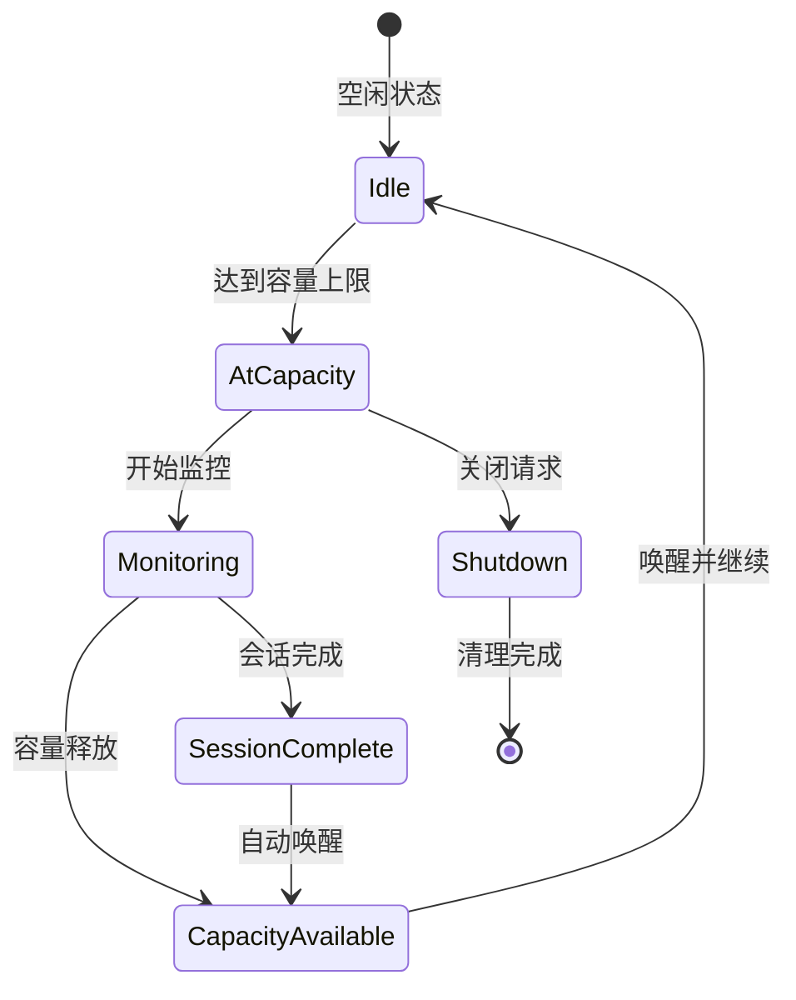
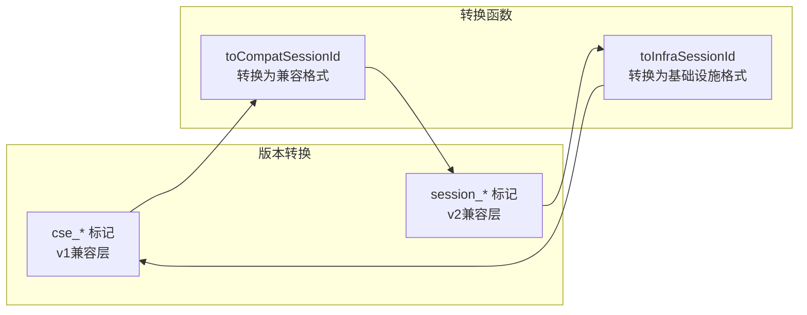
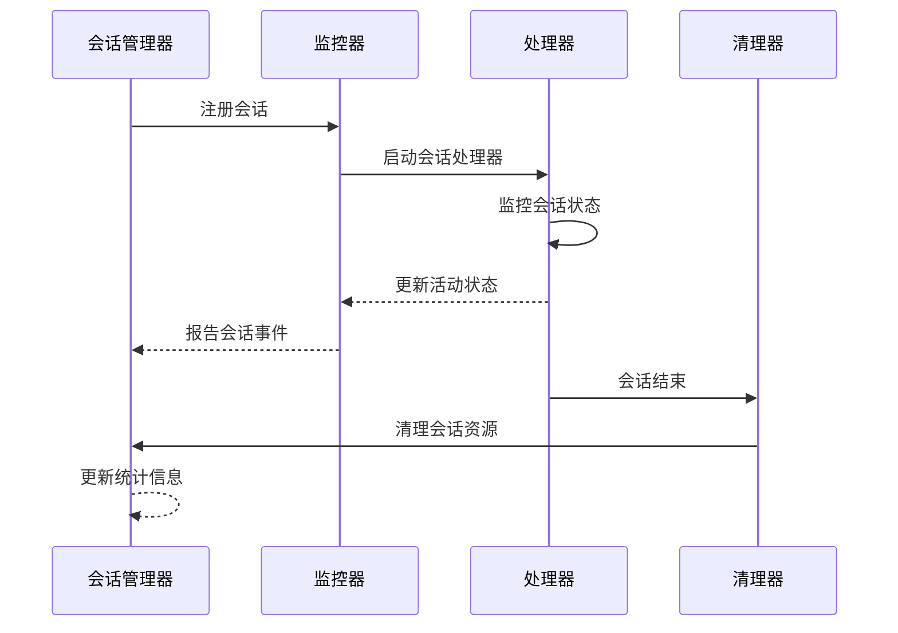
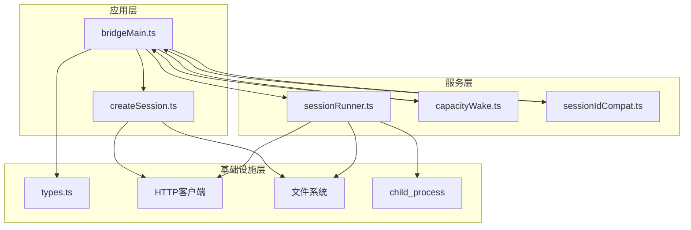

# 会话管理机制

<cite>
**本文档引用的文件**
- [sessionRunner.ts](file://src/bridge/sessionRunner.ts)
- [createSession.ts](file://src/bridge/createSession.ts)
- [capacityWake.ts](file://src/bridge/capacityWake.ts)
- [sessionIdCompat.ts](file://src/bridge/sessionIdCompat.ts)
- [types.ts](file://src/bridge/types.ts)
- [bridgeMain.ts](file://src/bridge/bridgeMain.ts)
</cite>

## 目录
1. [简介](#简介)
2. [项目结构](#项目结构)
3. [核心组件](#核心组件)
4. [架构概览](#架构概览)
5. [详细组件分析](#详细组件分析)
6. [依赖关系分析](#依赖关系分析)
7. [性能考虑](#性能考虑)
8. [故障排除指南](#故障排除指南)
9. [结论](#结论)

## 简介

Claude Code 的会话管理机制是一个复杂的分布式系统，负责在本地开发环境和 Claude AI 云端服务之间建立持久化的会话连接。该系统通过桥接进程（bridge）实现本地会话与云端环境的双向通信，支持多会话并发管理、动态容量控制、权限管理和超时处理等功能。

该机制的核心目标是在保证用户体验的同时，最大化资源利用率并确保系统的稳定性和安全性。系统通过会话生成器、容量唤醒策略、ID 兼容性处理等组件协同工作，实现了高效的会话生命周期管理。

## 项目结构

会话管理功能主要分布在 `src/bridge/` 目录下，包含以下关键文件：

**图表来源**
- [bridgeMain.ts:141-152](file://src/bridge/bridgeMain.ts#L141-L152)
- [sessionRunner.ts:248-250](file://src/bridge/sessionRunner.ts#L248-L250)
- [createSession.ts:34-54](file://src/bridge/createSession.ts#L34-L54)

**章节来源**
- [bridgeMain.ts:1-200](file://src/bridge/bridgeMain.ts#L1-L200)
- [sessionRunner.ts:1-551](file://src/bridge/sessionRunner.ts#L1-L551)
- [createSession.ts:1-385](file://src/bridge/createSession.ts#L1-L385)

## 核心组件

### 会话生成器 (SessionRunner)

会话生成器是会话管理的核心组件，负责创建和管理子进程会话。它提供了完整的会话生命周期管理功能：

- **进程管理**: 启动、监控和终止子进程
- **数据流处理**: 解析 NDJSON 输出，提取活动信息
- **错误处理**: 捕获和报告会话错误
- **调试支持**: 提供详细的调试日志和转录功能

### 会话创建器 (CreateSession)

会话创建器负责通过 HTTP API 在云端环境中创建新的会话实例。它处理会话元数据、权限设置和版本兼容性：

- **API 集成**: 与 Claude AI 云端服务通信
- **权限管理**: 处理用户权限和访问控制
- **版本兼容**: 支持不同版本的 API 协议
- **错误恢复**: 实现重试机制和故障转移

### 容量唤醒器 (CapacityWake)

容量唤醒器是一个共享的同步原语，用于协调桥接循环中的容量管理：

- **信号合并**: 将外部信号和容量信号合并
- **早起唤醒**: 在会话完成或容量释放时立即响应
- **优雅睡眠**: 在满容量状态下智能休眠

### ID 兼容层 (SessionIdCompat)

ID 兼容层处理不同版本之间的会话 ID 标记转换：

- **标记转换**: 在 `cse_*` 和 `session_*` 标记之间转换
- **兼容性处理**: 支持向后兼容的 API 调用
- **网关集成**: 与兼容性网关无缝集成

**章节来源**
- [sessionRunner.ts:248-548](file://src/bridge/sessionRunner.ts#L248-L548)
- [createSession.ts:34-180](file://src/bridge/createSession.ts#L34-L180)
- [capacityWake.ts:28-56](file://src/bridge/capacityWake.ts#L28-L56)
- [sessionIdCompat.ts:38-57](file://src/bridge/sessionIdCompat.ts#L38-L57)

## 架构概览

会话管理架构采用分层设计，确保各组件职责清晰且松耦合：

**图表来源**
- [bridgeMain.ts:852-1214](file://src/bridge/bridgeMain.ts#L852-L1214)
- [sessionRunner.ts:248-548](file://src/bridge/sessionRunner.ts#L248-L548)
- [createSession.ts:34-180](file://src/bridge/createSession.ts#L34-L180)

## 详细组件分析

### 会话生成器实现

会话生成器通过 `createSessionSpawner` 函数创建会话处理器，提供完整的会话生命周期管理：

**图表来源**
- [sessionRunner.ts:248-548](file://src/bridge/sessionRunner.ts#L248-L548)
- [types.ts:178-190](file://src/bridge/types.ts#L178-L190)

会话生成器的关键特性包括：

1. **进程隔离**: 每个会话运行在独立的子进程中
2. **活动监控**: 实时解析和跟踪会话活动
3. **错误处理**: 完善的异常捕获和恢复机制
4. **调试支持**: 详细的日志记录和转录功能

**章节来源**
- [sessionRunner.ts:248-548](file://src/bridge/sessionRunner.ts#L248-L548)
- [types.ts:178-190](file://src/bridge/types.ts#L178-L190)

### 会话初始化过程

会话初始化过程涉及多个步骤，从云端 API 调用到本地进程启动：

**图表来源**
- [createSession.ts:34-180](file://src/bridge/createSession.ts#L34-L180)

**章节来源**
- [createSession.ts:34-180](file://src/bridge/createSession.ts#L34-L180)

### 容量唤醒策略

容量唤醒器实现了智能的容量管理策略，优化资源利用率：

**图表来源**
- [capacityWake.ts:28-56](file://src/bridge/capacityWake.ts#L28-L56)
- [bridgeMain.ts:640-744](file://src/bridge/bridgeMain.ts#L640-L744)

容量唤醒策略的关键机制：

1. **早起唤醒**: 当会话完成或容量释放时立即响应
2. **信号合并**: 将外部信号和容量信号智能合并
3. **优雅休眠**: 在满容量状态下避免轮询开销

**章节来源**
- [capacityWake.ts:28-56](file://src/bridge/capacityWake.ts#L28-L56)
- [bridgeMain.ts:640-744](file://src/bridge/bridgeMain.ts#L640-L744)

### 会话ID兼容性处理

ID 兼容层确保不同版本之间的会话标识符正确转换：

**图表来源**
- [sessionIdCompat.ts:38-57](file://src/bridge/sessionIdCompat.ts#L38-L57)

兼容性处理的实现要点：

1. **条件转换**: 仅在启用兼容性网关时进行转换
2. **无操作优化**: 对于不匹配的 ID 直接返回
3. **双向转换**: 支持两种标记格式之间的相互转换

**章节来源**
- [sessionIdCompat.ts:38-57](file://src/bridge/sessionIdCompat.ts#L38-L57)

### 会话状态跟踪和生命周期管理

会话生命周期管理涵盖了从创建到销毁的完整过程：

**图表来源**
- [bridgeMain.ts:442-591](file://src/bridge/bridgeMain.ts#L442-L591)

生命周期管理的关键组件：

1. **活动跟踪**: 实时监控会话活动和状态变化
2. **超时管理**: 自动检测和处理超时会话
3. **资源清理**: 确保会话结束后的资源完全释放
4. **统计收集**: 收集会话使用统计数据

**章节来源**
- [bridgeMain.ts:442-591](file://src/bridge/bridgeMain.ts#L442-L591)

## 依赖关系分析

会话管理机制的依赖关系体现了清晰的分层架构：

**图表来源**
- [bridgeMain.ts:32-57](file://src/bridge/bridgeMain.ts#L32-L57)
- [sessionRunner.ts:1-14](file://src/bridge/sessionRunner.ts#L1-L14)
- [createSession.ts:1-6](file://src/bridge/createSession.ts#L1-L6)

**章节来源**
- [bridgeMain.ts:32-57](file://src/bridge/bridgeMain.ts#L32-L57)
- [sessionRunner.ts:1-14](file://src/bridge/sessionRunner.ts#L1-L14)
- [createSession.ts:1-6](file://src/bridge/createSession.ts#L1-L6)

## 性能考虑

会话管理机制在设计时充分考虑了性能优化：

### 资源管理优化

1. **进程池管理**: 通过容量控制避免过度创建进程
2. **内存使用优化**: 使用环形缓冲区限制活动历史大小
3. **网络效率**: 实现心跳机制减少不必要的轮询

### 并发处理

1. **异步操作**: 所有网络请求都采用异步处理
2. **非阻塞I/O**: 使用流式处理减少内存占用
3. **超时控制**: 实现合理的超时机制防止资源泄露

### 缓存策略

1. **令牌缓存**: 实现访问令牌的智能缓存和刷新
2. **配置缓存**: 缓存服务器配置减少查询开销
3. **统计缓存**: 缓存常用统计数据提高响应速度

## 故障排除指南

### 常见问题诊断

**会话无法创建**
- 检查访问令牌是否有效
- 验证组织权限配置
- 确认网络连接状态

**会话卡死或无响应**
- 查看会话活动日志
- 检查子进程状态
- 监控资源使用情况

**容量限制问题**
- 检查当前活跃会话数量
- 验证容量配置参数
- 监控系统资源使用

### 调试工具和方法

1. **详细日志**: 启用详细调试模式获取完整日志
2. **状态监控**: 使用内置状态显示功能监控会话状态
3. **性能分析**: 分析会话性能指标识别瓶颈

**章节来源**
- [bridgeMain.ts:1678-1697](file://src/bridge/bridgeMain.ts#L1678-L1697)
- [sessionRunner.ts:325-332](file://src/bridge/sessionRunner.ts#L325-L332)

## 结论

Claude Code 的会话管理机制通过精心设计的架构和实现，成功地解决了本地开发环境与云端服务之间的复杂集成问题。该系统的主要优势包括：

1. **高可靠性**: 完善的错误处理和恢复机制确保系统稳定性
2. **高效性能**: 智能的容量管理和资源优化提升整体性能
3. **灵活扩展**: 模块化设计支持功能扩展和定制化需求
4. **安全可靠**: 严格的权限管理和安全控制保护用户数据

该机制为开发者提供了无缝的远程控制体验，同时为系统管理员提供了完善的监控和管理工具。通过持续的优化和改进，该系统将继续为 Claude Code 生态系统提供强大的会话管理能力。