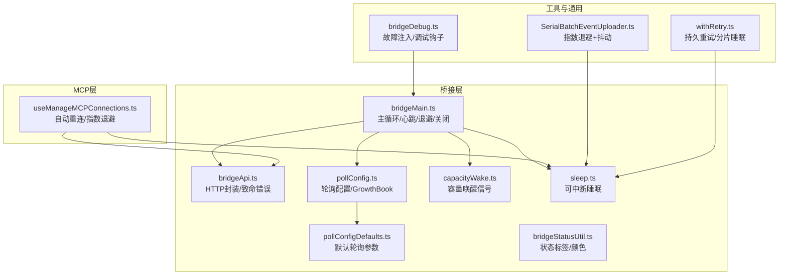
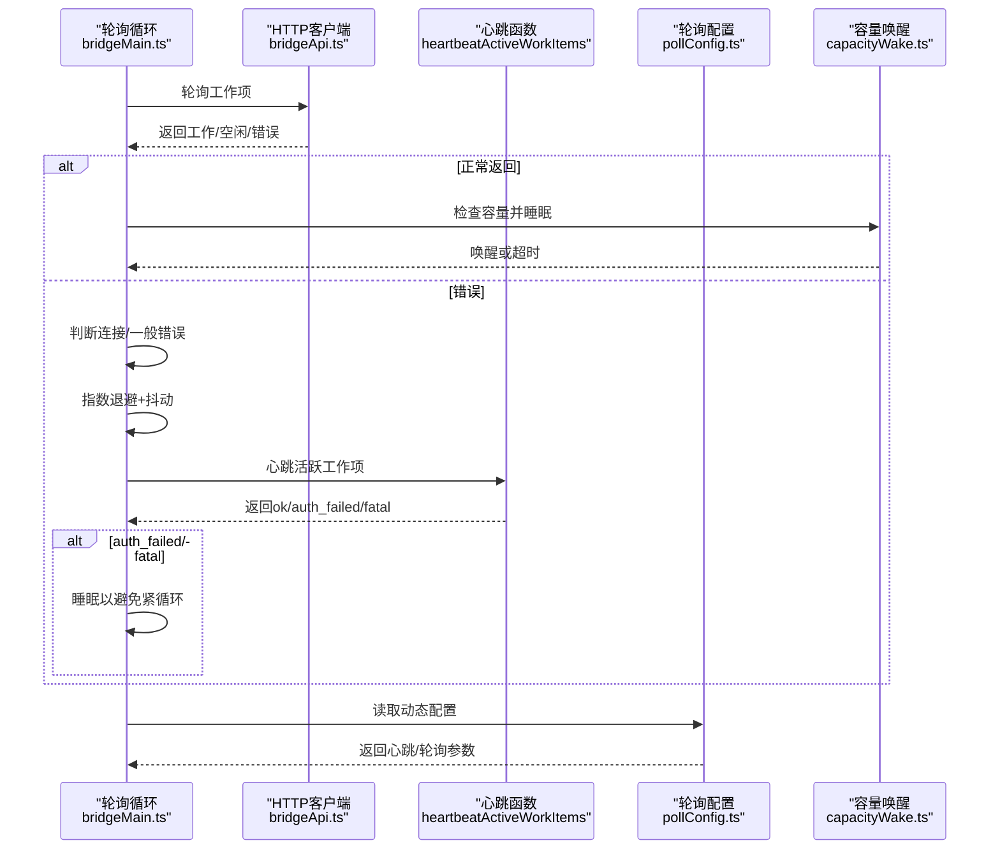
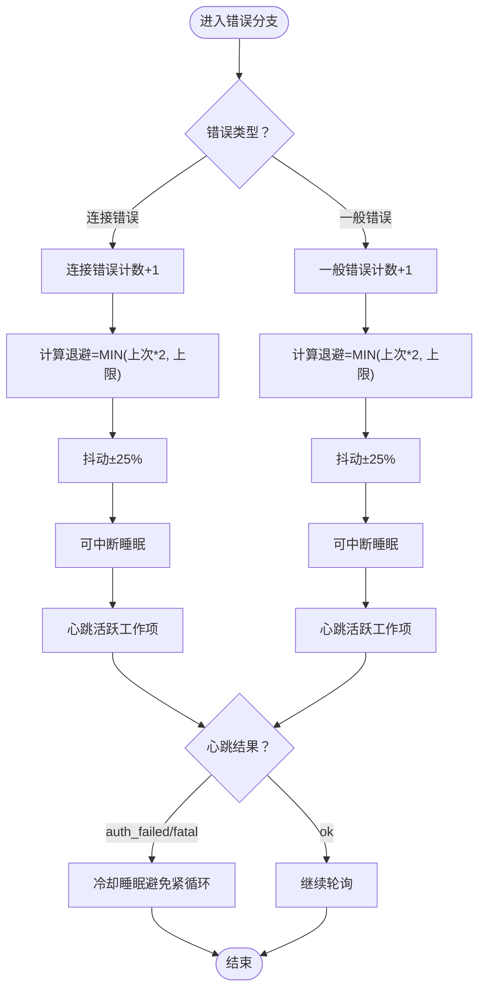
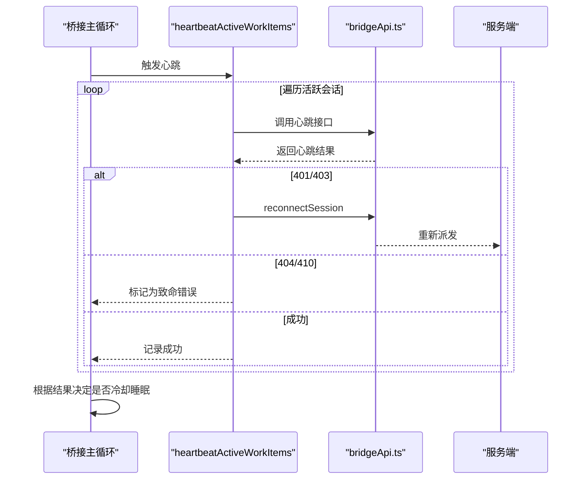
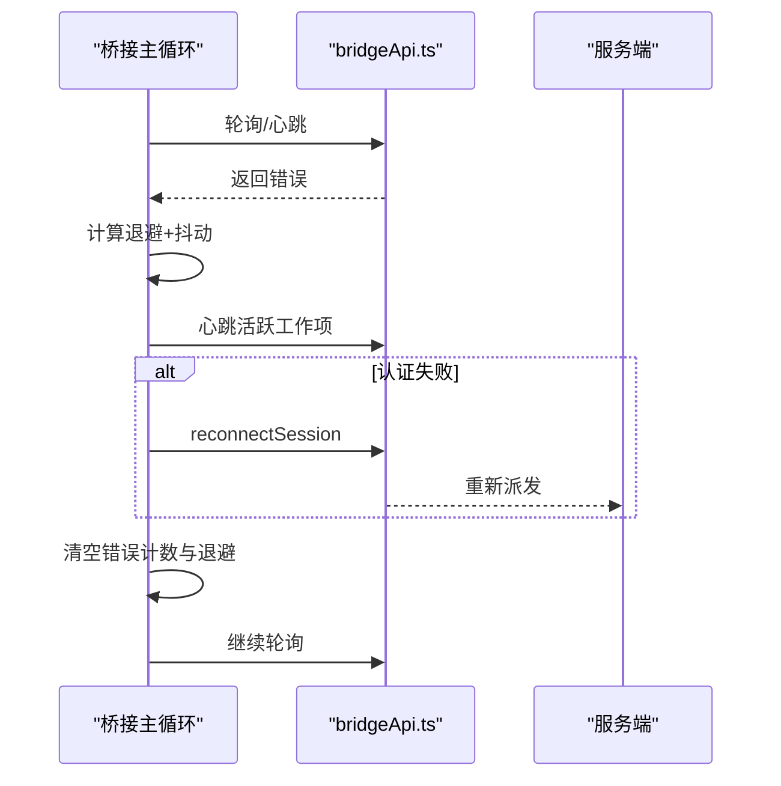
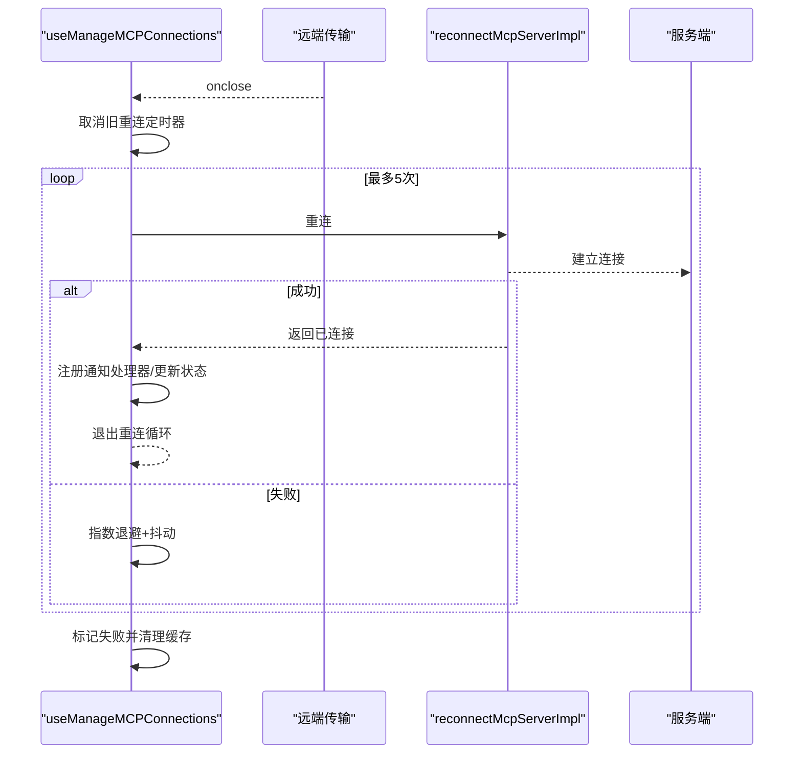
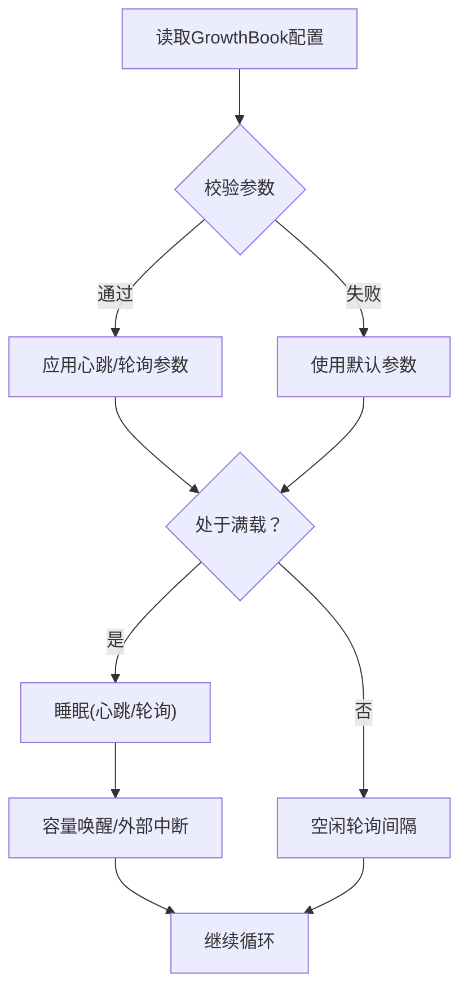
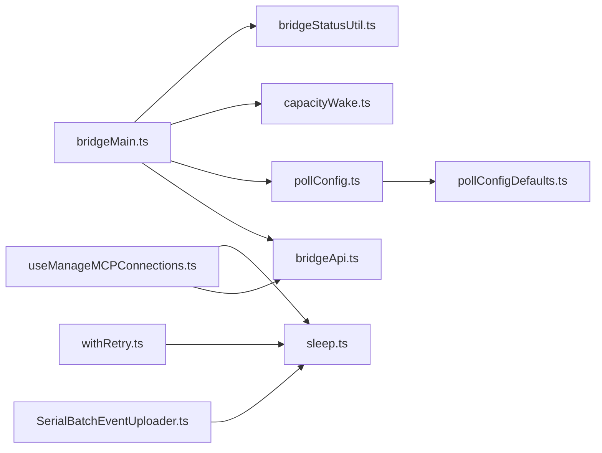

# 容错机制和重连策略

<cite>
**本文档引用的文件**
- [bridgeMain.ts](file://src/bridge/bridgeMain.ts)
- [bridgeApi.ts](file://src/bridge/bridgeApi.ts)
- [pollConfig.ts](file://src/bridge/pollConfig.ts)
- [pollConfigDefaults.ts](file://src/bridge/pollConfigDefaults.ts)
- [capacityWake.ts](file://src/bridge/capacityWake.ts)
- [bridgeStatusUtil.ts](file://src/bridge/bridgeStatusUtil.ts)
- [sleep.ts](file://src/utils/sleep.ts)
- [useManageMCPConnections.ts](file://src/services/mcp/useManageMCPConnections.ts)
- [bridgeDebug.ts](file://src/bridge/bridgeDebug.ts)
- [SerialBatchEventUploader.ts](file://src/cli/transports/SerialBatchEventUploader.ts)
- [withRetry.ts](file://src/services/api/withRetry.ts)
</cite>

## 目录
1. [简介](#简介)
2. [项目结构](#项目结构)
3. [核心组件](#核心组件)
4. [架构总览](#架构总览)
5. [详细组件分析](#详细组件分析)
6. [依赖关系分析](#依赖关系分析)
7. [性能考虑](#性能考虑)
8. [故障排查指南](#故障排查指南)
9. [结论](#结论)

## 简介
本文件系统性梳理 Claude Code 的容错机制与重连策略，覆盖以下关键主题：
- 指数退避算法：连接失败与一般错误的退避参数、抖动、睡眠中断与超时放弃逻辑
- 心跳机制：活跃工作项维护、会话健康检查、异常检测与恢复
- 断线重连：连接状态监控、自动重连触发、状态恢复与资源清理
- 配置与调优：重连间隔、超时阈值、错误预算、心跳与轮询参数
- 监控与诊断：日志、状态更新、遥测事件与调试注入

## 项目结构
围绕桥接（bridge）与 MCP（Model Context Protocol）两条主线，容错与重连相关代码主要分布在：
- 桥接主循环与 API 封装：负责轮询、心跳、断线检测、指数退避与优雅关闭
- 轮询配置与容量唤醒：统一控制心跳与轮询节奏，避免空转与紧循环
- MCP 连接管理：远端传输断开后的自动重连与指数退避
- 工具与通用能力：可中断睡眠、指数退避与抖动、持久重试

**图表来源**
- [bridgeMain.ts:141-1580](file://src/bridge/bridgeMain.ts#L141-L1580)
- [bridgeApi.ts:68-452](file://src/bridge/bridgeApi.ts#L68-L452)
- [pollConfig.ts:102-111](file://src/bridge/pollConfig.ts#L102-L111)
- [pollConfigDefaults.ts:55-83](file://src/bridge/pollConfigDefaults.ts#L55-L83)
- [capacityWake.ts:28-57](file://src/bridge/capacityWake.ts#L28-L57)
- [sleep.ts:14-38](file://src/utils/sleep.ts#L14-L38)
- [useManageMCPConnections.ts:87-468](file://src/services/mcp/useManageMCPConnections.ts#L87-L468)
- [SerialBatchEventUploader.ts:235-275](file://src/cli/transports/SerialBatchEventUploader.ts#L235-L275)
- [withRetry.ts:477-514](file://src/services/api/withRetry.ts#L477-L514)
- [bridgeDebug.ts:84-136](file://src/bridge/bridgeDebug.ts#L84-L136)

**章节来源**
- [bridgeMain.ts:141-1580](file://src/bridge/bridgeMain.ts#L141-L1580)
- [pollConfig.ts:102-111](file://src/bridge/pollConfig.ts#L102-L111)
- [pollConfigDefaults.ts:55-83](file://src/bridge/pollConfigDefaults.ts#L55-L83)

## 核心组件
- 桥接主循环与指数退避
  - 维护连接错误与一般错误两类退避计数器，分别计算指数退避延迟并加入 ±25% 抖动
  - 支持系统休眠检测：当连续错误时间跨度超过 2× 连接退避上限时，重置错误预算
  - 超过“连接给弃”或“一般错误给弃”阈值后终止循环并进入优雅关闭
- 心跳与活跃工作项
  - 周期性对所有活跃会话的心跳，识别 401/403（认证失败）与 404/410（环境/会话过期）
  - 认证失败触发服务端重新派发；环境/会话过期标记为致命错误
- 轮询配置与容量唤醒
  - 通过 GrowthBook 动态下发轮询与心跳参数，确保 at-capacity 模式下至少启用心跳或轮询之一
  - 容量唤醒在“满载”状态下合并外部中断信号，避免空转
- MCP 自动重连
  - 远端传输断开时按指数退避重连，最多尝试固定次数，支持取消与状态回传
- 通用工具
  - 可中断睡眠：支持 AbortSignal 中断，保证优雅退出不阻塞
  - 指数退避+抖动：统一的退避与抖动策略，避免风暴效应

**章节来源**
- [bridgeMain.ts:196-270](file://src/bridge/bridgeMain.ts#L196-L270)
- [bridgeMain.ts:1270-1399](file://src/bridge/bridgeMain.ts#L1270-L1399)
- [pollConfig.ts:28-92](file://src/bridge/pollConfig.ts#L28-L92)
- [capacityWake.ts:28-57](file://src/bridge/capacityWake.ts#L28-L57)
- [useManageMCPConnections.ts:87-468](file://src/services/mcp/useManageMCPConnections.ts#L87-L468)
- [sleep.ts:14-38](file://src/utils/sleep.ts#L14-L38)

## 架构总览
桥接主循环在“轮询—心跳—断线检测—指数退避—重连”的闭环中运行，配合 MCP 层的远端传输断线重连，形成多层级容错。

**图表来源**
- [bridgeMain.ts:600-746](file://src/bridge/bridgeMain.ts#L600-L746)
- [bridgeMain.ts:1270-1399](file://src/bridge/bridgeMain.ts#L1270-L1399)
- [bridgeApi.ts:199-247](file://src/bridge/bridgeApi.ts#L199-L247)
- [pollConfig.ts:102-111](file://src/bridge/pollConfig.ts#L102-L111)
- [capacityWake.ts:36-53](file://src/bridge/capacityWake.ts#L36-L53)

## 详细组件分析

### 指数退避与断线检测
- 两类退避跟踪
  - 连接错误：从初始值开始按 2 倍增长，不超过上限；达到“连接给弃”阈值后放弃
  - 一般错误：同理但使用不同初始值与上限
- 抖动与睡眠
  - 在每次退避延迟上叠加 ±25% 抖动，避免“惊群效应”
  - 使用可中断睡眠，支持 AbortSignal 中断，保证优雅退出
- 系统休眠检测
  - 若上次错误与本次错误的时间差超过 2× 连接退避上限，则判定为系统休眠，重置错误预算
- 超时放弃
  - 达到“连接给弃/一般错误给弃”阈值后，记录事件并终止循环

**图表来源**
- [bridgeMain.ts:1270-1399](file://src/bridge/bridgeMain.ts#L1270-L1399)
- [sleep.ts:14-38](file://src/utils/sleep.ts#L14-L38)

**章节来源**
- [bridgeMain.ts:1270-1399](file://src/bridge/bridgeMain.ts#L1270-L1399)
- [sleep.ts:14-38](file://src/utils/sleep.ts#L14-L38)

### 心跳机制与活跃工作项维护
- 活跃工作项维护
  - 维护活跃会话映射、会话起始时间、会话对应的工作项 ID、会话 ingress JWT
- 心跳执行
  - 对每个活跃会话调用心跳接口，统计成功/失败/认证失败/致命错误
  - 认证失败触发服务端重新派发（reconnectSession），避免工作项长期占用
  - 环境/会话过期（404/410）标记为致命错误，触发退出路径
- 会话健康检查与异常检测
  - 心跳周期内捕获容量信号，确保在心跳请求期间的传输丢失也能被后续睡眠感知
  - 在“轮询到期”退出路径中，若为 poll_due，记录调试日志便于验证

**图表来源**
- [bridgeMain.ts:196-270](file://src/bridge/bridgeMain.ts#L196-L270)
- [bridgeApi.ts:358-385](file://src/bridge/bridgeApi.ts#L358-L385)

**章节来源**
- [bridgeMain.ts:196-270](file://src/bridge/bridgeMain.ts#L196-L270)
- [bridgeApi.ts:358-385](file://src/bridge/bridgeApi.ts#L358-L385)

### 断线重连与状态恢复
- 连接状态监控
  - 主循环捕获连接错误与服务器错误，区分处理；同时记录最后一次轮询错误时间用于休眠检测
- 自动重连触发
  - 连接错误与一般错误均触发指数退避；在心跳循环退出时进行心跳，避免轮询中断导致租约失效
- 状态恢复
  - 重连成功后清空错误计数与退避状态，恢复轮询
  - 会话完成时清理定时器、令牌刷新计划、工作树等资源，必要时停止工作项

**图表来源**
- [bridgeMain.ts:1270-1399](file://src/bridge/bridgeMain.ts#L1270-L1399)
- [bridgeApi.ts:358-385](file://src/bridge/bridgeApi.ts#L358-L385)

**章节来源**
- [bridgeMain.ts:1270-1399](file://src/bridge/bridgeMain.ts#L1270-L1399)
- [bridgeApi.ts:358-385](file://src/bridge/bridgeApi.ts#L358-L385)

### MCP 远端传输断线重连
- 断线检测
  - 远端传输（如 SSE）断开时触发 onclose 回调
- 自动重连
  - 仅对非本地进程与非内部 SDK 传输启用自动重连
  - 指数退避（初始 1s，上限 30s），最多尝试 5 次
  - 支持取消已有重连定时器，避免竞态
- 状态更新
  - 重连过程中更新状态（pending/connected/failed），并在最终失败时标记失败状态

**图表来源**
- [useManageMCPConnections.ts:333-468](file://src/services/mcp/useManageMCPConnections.ts#L333-L468)

**章节来源**
- [useManageMCPConnections.ts:333-468](file://src/services/mcp/useManageMCPConnections.ts#L333-L468)

### 轮询配置与容量唤醒
- 动态配置
  - 通过 GrowthBook 获取轮询与心跳参数，包含 at-capacity 模式下的轮询间隔、心跳间隔、回收窗口等
  - 参数校验确保 at-capacity 模式下至少启用心跳或轮询之一，防止紧循环
- 容量唤醒
  - 合并外部中断信号与容量释放信号，使“满载”睡眠能被及时打断，提升吞吐响应

**图表来源**
- [pollConfig.ts:102-111](file://src/bridge/pollConfig.ts#L102-L111)
- [pollConfigDefaults.ts:55-83](file://src/bridge/pollConfigDefaults.ts#L55-L83)
- [capacityWake.ts:28-57](file://src/bridge/capacityWake.ts#L28-L57)

**章节来源**
- [pollConfig.ts:28-92](file://src/bridge/pollConfig.ts#L28-L92)
- [pollConfigDefaults.ts:55-83](file://src/bridge/pollConfigDefaults.ts#L55-L83)
- [capacityWake.ts:28-57](file://src/bridge/capacityWake.ts#L28-L57)

### 通用工具：可中断睡眠与指数退避
- 可中断睡眠
  - 支持 AbortSignal 中断，优雅处理退出与重连场景
- 指数退避与抖动
  - 统一的指数增长与 ±25% 抖动策略，避免风暴效应
- 持久重试与分片睡眠
  - 长时间等待时分片睡眠，向用户输出系统消息，保持会话活性

**章节来源**
- [sleep.ts:14-38](file://src/utils/sleep.ts#L14-L38)
- [SerialBatchEventUploader.ts:235-275](file://src/cli/transports/SerialBatchEventUploader.ts#L235-L275)
- [withRetry.ts:477-514](file://src/services/api/withRetry.ts#L477-L514)

## 依赖关系分析
- 桥接主循环依赖
  - HTTP 客户端：轮询、心跳、停止工作项、重新派发
  - 轮询配置：动态参数与默认参数
  - 容量唤醒：满载睡眠与唤醒
  - 状态工具：状态标签与颜色
- MCP 层依赖
  - 重连实现：远端传输断线后的重建
  - 状态更新：批量更新与去重
- 通用工具
  - 可中断睡眠：统一的睡眠与中断
  - 指数退避：统一的退避与抖动

**图表来源**
- [bridgeMain.ts:141-1580](file://src/bridge/bridgeMain.ts#L141-L1580)
- [bridgeApi.ts:68-452](file://src/bridge/bridgeApi.ts#L68-L452)
- [pollConfig.ts:102-111](file://src/bridge/pollConfig.ts#L102-L111)
- [pollConfigDefaults.ts:55-83](file://src/bridge/pollConfigDefaults.ts#L55-L83)
- [capacityWake.ts:28-57](file://src/bridge/capacityWake.ts#L28-L57)
- [bridgeStatusUtil.ts:113-141](file://src/bridge/bridgeStatusUtil.ts#L113-L141)
- [useManageMCPConnections.ts:87-468](file://src/services/mcp/useManageMCPConnections.ts#L87-L468)
- [sleep.ts:14-38](file://src/utils/sleep.ts#L14-L38)
- [SerialBatchEventUploader.ts:235-275](file://src/cli/transports/SerialBatchEventUploader.ts#L235-L275)
- [withRetry.ts:477-514](file://src/services/api/withRetry.ts#L477-L514)

**章节来源**
- [bridgeMain.ts:141-1580](file://src/bridge/bridgeMain.ts#L141-L1580)
- [useManageMCPConnections.ts:87-468](file://src/services/mcp/useManageMCPConnections.ts#L87-L468)

## 性能考虑
- 指数退避与抖动
  - 有效缓解网络波动与服务端压力，避免“惊群效应”
- 轮询与心跳分离
  - at-capacity 模式下心跳与轮询可独立启用，避免不必要的请求
- 容量唤醒
  - 在满载时及时唤醒，减少延迟并提升吞吐
- 可中断睡眠
  - 保证优雅退出与快速响应外部中断，避免资源泄漏

## 故障排查指南
- 常见症状与定位
  - “连接错误”：检查网络连通性、代理设置、证书与端口
  - “一般错误”：关注服务器返回状态码与错误类型，结合日志定位
  - “认证失败/过期”：确认令牌刷新与重新派发流程是否正常
  - “环境/会话过期”：此类为致命错误，需根据提示重启远程控制
- 日志与状态
  - 状态栏显示“正在重连/失败/活动”，可辅助判断当前阶段
  - 调试日志包含轮询、心跳、重连与错误详情
- 调试注入
  - 仅限内部构建，可通过注入故障模拟真实失败路径，验证恢复机制

**章节来源**
- [bridgeStatusUtil.ts:113-141](file://src/bridge/bridgeStatusUtil.ts#L113-L141)
- [bridgeDebug.ts:84-136](file://src/bridge/bridgeDebug.ts#L84-L136)
- [bridgeMain.ts:1270-1399](file://src/bridge/bridgeMain.ts#L1270-L1399)

## 结论
Claude Code 的容错与重连体系通过“指数退避+抖动+心跳+容量唤醒+动态配置”的组合，在复杂网络环境下实现了稳健的自愈能力。桥接主循环与 MCP 层分别覆盖了服务端轮询与远端传输两个层面的断线恢复，配合可中断睡眠与统一的退避策略，既保障了用户体验，也降低了系统负载与风暴风险。建议在生产环境中结合业务特性合理调优轮询与心跳参数，并充分利用日志与遥测进行持续观测与优化。