# 桥接层架构设计

<cite>
**本文档引用的文件**
- [bridgeMain.ts](file://src/bridge/bridgeMain.ts)
- [types.ts](file://src/bridge/types.ts)
- [bridgeApi.ts](file://src/bridge/bridgeApi.ts)
- [bridgeConfig.ts](file://src/bridge/bridgeConfig.ts)
- [workSecret.ts](file://src/bridge/workSecret.ts)
- [sessionIdCompat.ts](file://src/bridge/sessionIdCompat.ts)
- [sessionRunner.ts](file://src/bridge/sessionRunner.ts)
- [jwtUtils.ts](file://src/bridge/jwtUtils.ts)
- [pollConfig.ts](file://src/bridge/pollConfig.ts)
- [pollConfigDefaults.ts](file://src/bridge/pollConfigDefaults.ts)
- [bridgeUI.ts](file://src/bridge/bridgeUI.ts)
- [bridgeStatusUtil.ts](file://src/bridge/bridgeStatusUtil.ts)
- [capacityWake.ts](file://src/bridge/capacityWake.ts)
- [trustedDevice.ts](file://src/bridge/trustedDevice.ts)
- [debugUtils.ts](file://src/bridge/debugUtils.ts)
</cite>

## 目录
1. [引言](#引言)
2. [项目结构](#项目结构)
3. [核心组件](#核心组件)
4. [架构总览](#架构总览)
5. [详细组件分析](#详细组件分析)
6. [依赖关系分析](#依赖关系分析)
7. [性能考量](#性能考量)
8. [故障排查指南](#故障排查指南)
9. [结论](#结论)
10. [附录：扩展与最佳实践](#附录扩展与最佳实践)

## 引言
本文件面向Claude Code桥接层（bridge）的架构与实现，围绕bridgeMain.ts中的核心设计展开，系统阐述会话生命周期管理、HTTP客户端实现、连接配置管理、工作秘密解码、会话ID兼容性处理、令牌刷新机制等关键主题，并给出模块化设计原则、扩展指南与性能优化建议。目标读者既包括需要快速上手的工程师，也包括希望深入理解实现细节的高级用户。

## 项目结构
桥接层位于src/bridge目录下，采用“按职责分层”的模块化组织方式：
- 类型与接口：types.ts 定义桥接层协议、配置、日志器、会话句柄等核心类型
- HTTP客户端：bridgeApi.ts 封装环境与会话相关的REST调用，统一鉴权与错误处理
- 运行时主循环：bridgeMain.ts 实现轮询、心跳、会话管理、状态显示与容错
- 会话运行器：sessionRunner.ts 负责子进程启动、标准流解析、权限请求转发
- 工作秘密与SDK URL：workSecret.ts 解码工作密钥、构建SDK/CCR v2 URL
- 会话ID兼容：sessionIdCompat.ts 处理cse_/session_标签转换
- 配置与认证：bridgeConfig.ts 提供OAuth与基地址解析；trustedDevice.ts 管理可信设备令牌
- 轮询配置：pollConfig.ts/pollConfigDefaults.ts 提供可动态调整的轮询参数
- UI与状态：bridgeUI.ts/bridgeStatusUtil.ts 提供终端内可视化状态与链接生成
- 能力唤醒：capacityWake.ts 抽象“容量释放即唤醒”的睡眠合并机制
- JWT工具：jwtUtils.ts 提供令牌解码与自动刷新调度
- 调试工具：debugUtils.ts 统一脱敏、截断与错误描述

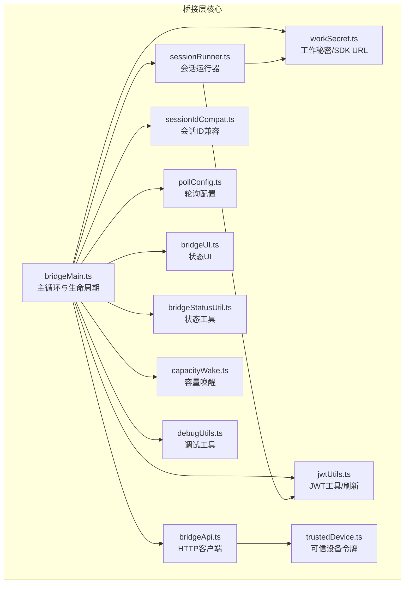

图表来源
- [bridgeMain.ts:141-900](file://src/bridge/bridgeMain.ts#L141-L900)
- [bridgeApi.ts:68-452](file://src/bridge/bridgeApi.ts#L68-L452)
- [sessionRunner.ts:248-548](file://src/bridge/sessionRunner.ts#L248-L548)
- [workSecret.ts:1-128](file://src/bridge/workSecret.ts#L1-L128)
- [sessionIdCompat.ts:1-58](file://src/bridge/sessionIdCompat.ts#L1-L58)
- [jwtUtils.ts:72-256](file://src/bridge/jwtUtils.ts#L72-L256)
- [pollConfig.ts:102-111](file://src/bridge/pollConfig.ts#L102-L111)
- [bridgeUI.ts:42-531](file://src/bridge/bridgeUI.ts#L42-L531)
- [bridgeStatusUtil.ts:1-164](file://src/bridge/bridgeStatusUtil.ts#L1-L164)
- [capacityWake.ts:28-57](file://src/bridge/capacityWake.ts#L28-L57)
- [trustedDevice.ts:54-87](file://src/bridge/trustedDevice.ts#L54-L87)
- [debugUtils.ts:1-142](file://src/bridge/debugUtils.ts#L1-L142)

章节来源
- [bridgeMain.ts:141-900](file://src/bridge/bridgeMain.ts#L141-L900)
- [types.ts:1-263](file://src/bridge/types.ts#L1-L263)

## 核心组件
- 主循环与生命周期（runBridgeLoop）
  - 维护活动会话集合、开始时间、工作ID映射、兼容ID缓存、入口令牌、定时器、已完成工作集、工作树映射、超时标记会话、已命名会话集合、容量唤醒器
  - 心跳保活：对所有活跃工作项发送心跳，区分“认证失败”“致命错误”“失败”，分别触发重连或终止
  - 令牌刷新：基于OAuth令牌的主动刷新调度，v2通过reconnectSession触发服务端重新派发，v1直接更新子进程访问令牌
  - 轮询与节流：根据配置在空闲、部分满载、满载三种场景采用不同轮询间隔与心跳策略
  - 会话结束回调：清理定时器、取消刷新、移除显示、停止状态更新、归档会话、清理工作树、必要时停止工作项
- HTTP客户端（createBridgeApiClient）
  - 注册环境、轮询工作、确认工作、停止工作、注销环境、归档会话、重连会话、心跳、发送权限响应事件
  - 统一鉴权头、可信设备令牌头、OAuth 401自动刷新、错误类型提取与致命错误分类
- 会话运行器（createSessionSpawner）
  - 子进程启动、标准流解析（NDJSON）、活动记录、首次用户消息提取、权限请求转发、安全文件名、转录文件写入
  - 支持v1/v2两种传输模式：HybridTransport（WS读+POST写）与CCR v2 SSE+Worker注册
- 工作秘密与SDK URL（decodeWorkSecret/buildSdkUrl/buildCCRv2SdkUrl/registerWorker）
  - 解码base64url工作密钥，校验版本与必需字段
  - 构建WebSocket SDK URL（本地v2/生产v1），构建CCR v2 HTTP URL，注册Worker并返回epoch
- 会话ID兼容（toCompatSessionId/toInfraSessionId）
  - 在cse_/session_标签之间转换，适配v1/v2兼容层
- 轮询配置（getPollIntervalConfig）
  - 从GrowthBook动态拉取配置，Zod校验，确保至少启用一种容量下的存活机制
- UI与状态（createBridgeLogger）
  - 连接中/就绪/连接中断/失败状态机，QR码展示，会话计数与列表，工具活动轨迹，超链接生成
- 能力唤醒（createCapacityWake）
  - 合并外层信号与容量释放信号，支持提前唤醒以提升吞吐
- 认证与可信设备（getBridgeAccessToken/getBridgeBaseUrl/getTrustedDeviceToken）
  - 开发覆盖、OAuth存储、可信设备令牌持久化与缓存

章节来源
- [bridgeMain.ts:141-900](file://src/bridge/bridgeMain.ts#L141-L900)
- [bridgeApi.ts:68-452](file://src/bridge/bridgeApi.ts#L68-L452)
- [sessionRunner.ts:248-548](file://src/bridge/sessionRunner.ts#L248-L548)
- [workSecret.ts:1-128](file://src/bridge/workSecret.ts#L1-L128)
- [sessionIdCompat.ts:1-58](file://src/bridge/sessionIdCompat.ts#L1-L58)
- [pollConfig.ts:102-111](file://src/bridge/pollConfig.ts#L102-L111)
- [bridgeUI.ts:42-531](file://src/bridge/bridgeUI.ts#L42-L531)
- [capacityWake.ts:28-57](file://src/bridge/capacityWake.ts#L28-L57)
- [bridgeConfig.ts:1-49](file://src/bridge/bridgeConfig.ts#L1-L49)
- [trustedDevice.ts:54-87](file://src/bridge/trustedDevice.ts#L54-L87)

## 架构总览
桥接层通过“主循环-HTTP客户端-会话运行器”三层协作实现与远程服务器的稳定通信。主循环负责资源编排与容错，HTTP客户端封装网络与鉴权，会话运行器承载具体任务执行与交互。

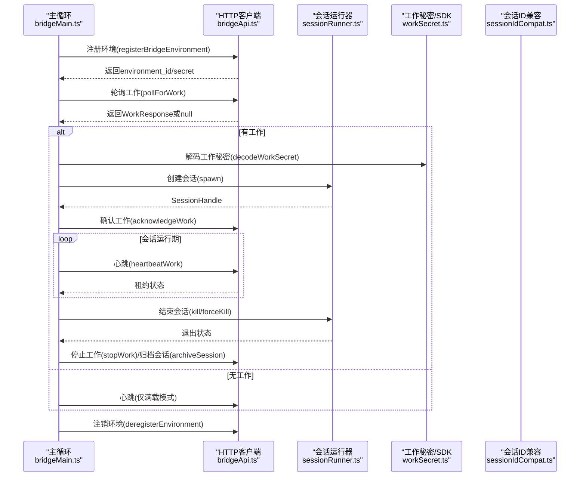

图表来源
- [bridgeMain.ts:600-900](file://src/bridge/bridgeMain.ts#L600-L900)
- [bridgeApi.ts:141-451](file://src/bridge/bridgeApi.ts#L141-L451)
- [sessionRunner.ts:248-548](file://src/bridge/sessionRunner.ts#L248-L548)
- [workSecret.ts:6-32](file://src/bridge/workSecret.ts#L6-L32)
- [sessionIdCompat.ts:38-57](file://src/bridge/sessionIdCompat.ts#L38-L57)

## 详细组件分析

### 会话生命周期管理
- 活动会话跟踪：使用Map维护sessionId到SessionHandle的映射，同时维护开始时间、工作ID、兼容ID、入口令牌、定时器、工作树信息、超时标记集合、已命名集合
- 会话结束回调：在onSessionDone中清理定时器、取消刷新、移除显示、停止状态更新、停止工作项、归档会话、清理工作树；根据状态决定是否退出主循环
- 超时与中断：超时看门狗标记会话为timedOut，onSessionDone将其视为failed但不重复打印失败日志；中断由服务器或关闭触发，避免重复停止工作

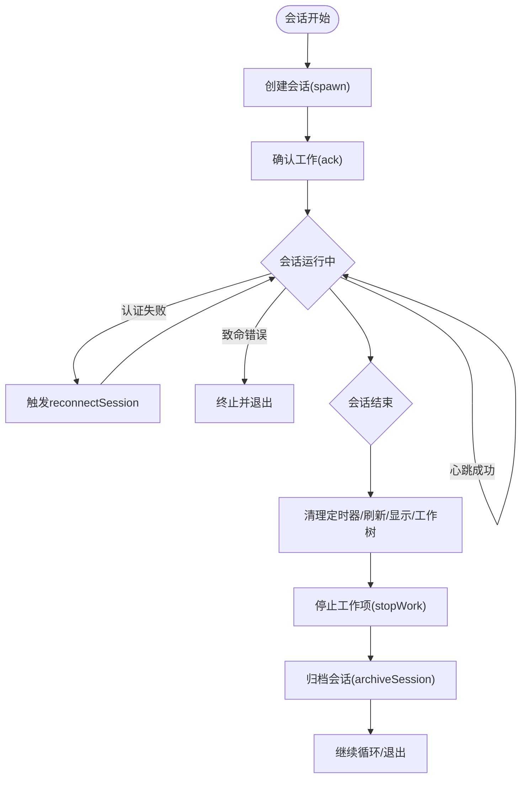

图表来源
- [bridgeMain.ts:196-591](file://src/bridge/bridgeMain.ts#L196-L591)
- [bridgeApi.ts:249-451](file://src/bridge/bridgeApi.ts#L249-L451)

章节来源
- [bridgeMain.ts:163-591](file://src/bridge/bridgeMain.ts#L163-L591)

### HTTP客户端实现
- 统一鉴权：Authorization头携带Bearer Token，附加anthropic-version、anthropic-beta、runner版本等头部
- 可信设备令牌：当启用门控时在请求头注入X-Trusted-Device-Token
- OAuth 401自动刷新：onAuth401回调尝试刷新后重试一次；失败则抛出BridgeFatalError
- 错误处理：按状态码分类，401/403/404/410等映射为可诊断的致命错误；429限流；其他非2xx抛出通用错误
- 接口方法：注册环境、轮询工作、确认工作、停止工作、注销环境、归档会话、重连会话、心跳、发送权限响应事件

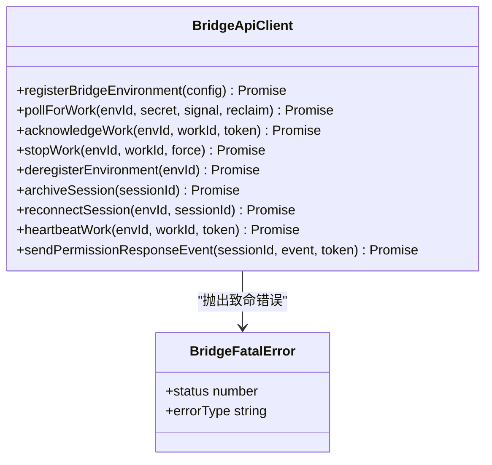

图表来源
- [bridgeApi.ts:68-451](file://src/bridge/bridgeApi.ts#L68-L451)

章节来源
- [bridgeApi.ts:68-540](file://src/bridge/bridgeApi.ts#L68-L540)

### 连接配置管理
- 动态配置：getPollIntervalConfig从GrowthBook拉取配置，Zod严格校验，拒绝异常值；要求至少启用一种容量存活机制（心跳或轮询）
- 默认配置：未命中时回退至默认值，保证行为一致性
- 多会话友好：提供多会话专用轮询间隔，避免在满载时过度轮询

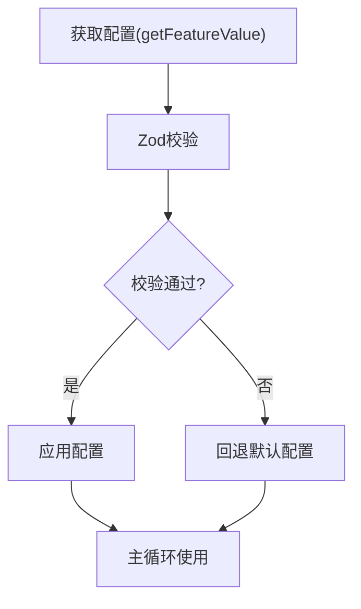

图表来源
- [pollConfig.ts:102-111](file://src/bridge/pollConfig.ts#L102-L111)
- [pollConfigDefaults.ts:55-83](file://src/bridge/pollConfigDefaults.ts#L55-L83)

章节来源
- [pollConfig.ts:1-111](file://src/bridge/pollConfig.ts#L1-L111)
- [pollConfigDefaults.ts:1-83](file://src/bridge/pollConfigDefaults.ts#L1-L83)

### 工作秘密解码与SDK URL构建
- 工作秘密解码：base64url解码后校验版本与必需字段（如session_ingress_token、api_base_url），确保后续流程可用
- SDK URL构建：根据API基地址判断本地/生产，选择v2/v1路径；CCR v2使用HTTP URL指向/v1/code/sessions/{id}
- Worker注册：向会话URL发起注册，返回worker_epoch用于后续心跳/状态/事件请求

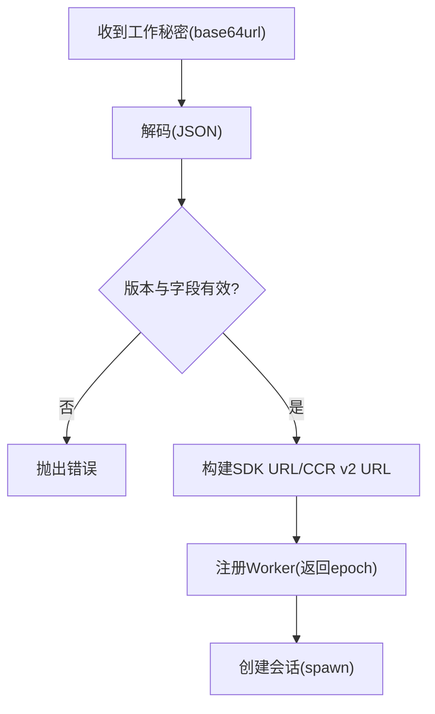

图表来源
- [workSecret.ts:6-32](file://src/bridge/workSecret.ts#L6-L32)
- [workSecret.ts:41-87](file://src/bridge/workSecret.ts#L41-L87)
- [workSecret.ts:97-127](file://src/bridge/workSecret.ts#L97-L127)

章节来源
- [workSecret.ts:1-128](file://src/bridge/workSecret.ts#L1-L128)

### 会话ID兼容性处理
- 标签转换：在cse_*与session_*之间转换，适配v1/v2兼容层；支持门控开关，默认激活
- 同一性判定：sameSessionId比较两个ID的UUID主体，忽略前缀差异

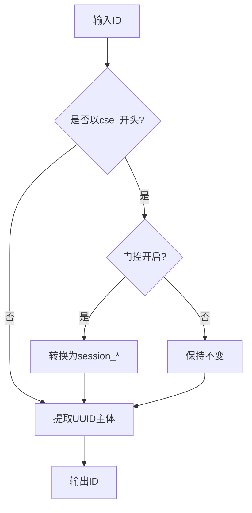

图表来源
- [sessionIdCompat.ts:38-57](file://src/bridge/sessionIdCompat.ts#L38-L57)
- [workSecret.ts:62-73](file://src/bridge/workSecret.ts#L62-L73)

章节来源
- [sessionIdCompat.ts:1-58](file://src/bridge/sessionIdCompat.ts#L1-L58)
- [workSecret.ts:50-73](file://src/bridge/workSecret.ts#L50-L73)

### 令牌刷新机制
- 刷新调度：基于JWT的exp字段计算到期前刷新；若无法解码JWT，则使用固定回退间隔
- 连续失败保护：最多允许连续失败次数，失败后延迟重试
- 跟随刷新：首次刷新后设置后续固定周期的跟随刷新，保障长会话持续可用
- v1/v2差异：v2通过reconnectSession触发服务端重新派发，v1直接更新子进程访问令牌

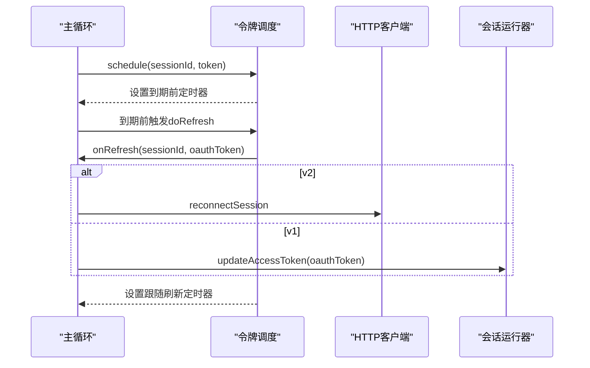

图表来源
- [jwtUtils.ts:72-256](file://src/bridge/jwtUtils.ts#L72-L256)
- [bridgeMain.ts:284-313](file://src/bridge/bridgeMain.ts#L284-L313)
- [sessionRunner.ts:527-542](file://src/bridge/sessionRunner.ts#L527-L542)

章节来源
- [jwtUtils.ts:1-257](file://src/bridge/jwtUtils.ts#L1-L257)
- [bridgeMain.ts:272-313](file://src/bridge/bridgeMain.ts#L272-L313)
- [sessionRunner.ts:527-542](file://src/bridge/sessionRunner.ts#L527-L542)

### 会话运行器与子进程交互
- 子进程启动：拼接CLI参数与环境变量，剥离桥接层OAuth，注入会话访问令牌与传输模式
- 标准流解析：stdout按NDJSON解析，提取活动、结果、错误、权限请求；stderr缓冲最后若干行用于诊断
- 权限请求：将control_request转发给服务器，等待权限响应事件
- 转录与调试：可选写入转录文件与调试日志，便于问题复盘

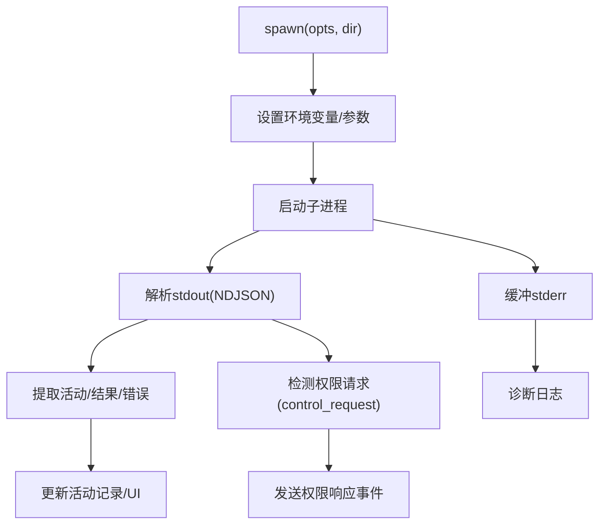

图表来源
- [sessionRunner.ts:248-548](file://src/bridge/sessionRunner.ts#L248-L548)

章节来源
- [sessionRunner.ts:1-551](file://src/bridge/sessionRunner.ts#L1-L551)

### UI与状态显示
- 状态机：idle/attached/titled/reconnecting/failed，支持闪烁动画与工具活动轨迹
- QR码：根据当前URL生成二维码，支持切换显示
- 会话列表：多会话模式下显示每个会话标题与活动摘要
- 链接生成：根据环境ID与会话ID生成可点击链接，支持cse_/session_转换

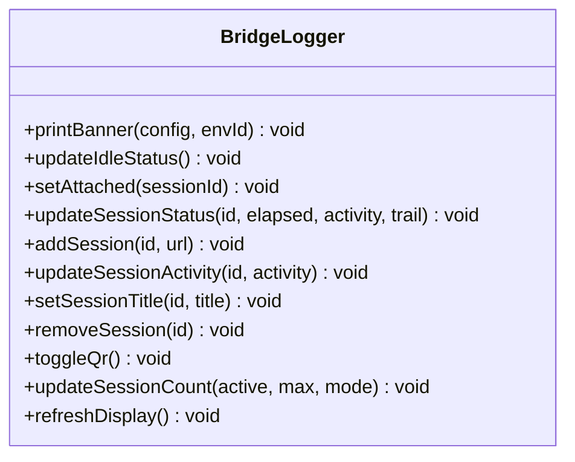

图表来源
- [bridgeUI.ts:294-531](file://src/bridge/bridgeUI.ts#L294-L531)
- [bridgeStatusUtil.ts:38-58](file://src/bridge/bridgeStatusUtil.ts#L38-L58)

章节来源
- [bridgeUI.ts:1-531](file://src/bridge/bridgeUI.ts#L1-L531)
- [bridgeStatusUtil.ts:1-164](file://src/bridge/bridgeStatusUtil.ts#L1-L164)

## 依赖关系分析
- 主循环对HTTP客户端、会话运行器、工作秘密、会话ID兼容、轮询配置、UI、能力唤醒、调试工具存在直接依赖
- HTTP客户端对可信设备令牌、错误提取、调试工具存在依赖
- 会话运行器对工作秘密、令牌刷新、调试工具存在依赖
- 轮询配置对GrowthBook与默认配置存在依赖
- UI对状态工具与产品常量存在依赖

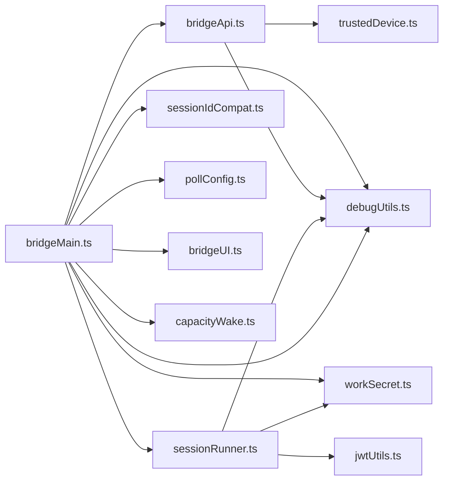

图表来源
- [bridgeMain.ts:1-120](file://src/bridge/bridgeMain.ts#L1-L120)
- [bridgeApi.ts:1-50](file://src/bridge/bridgeApi.ts#L1-L50)
- [sessionRunner.ts:1-20](file://src/bridge/sessionRunner.ts#L1-L20)
- [workSecret.ts:1-5](file://src/bridge/workSecret.ts#L1-L5)
- [sessionIdCompat.ts:1-10](file://src/bridge/sessionIdCompat.ts#L1-L10)
- [pollConfig.ts:1-10](file://src/bridge/pollConfig.ts#L1-L10)
- [bridgeUI.ts:1-20](file://src/bridge/bridgeUI.ts#L1-L20)
- [capacityWake.ts:1-10](file://src/bridge/capacityWake.ts#L1-L10)
- [trustedDevice.ts:1-10](file://src/bridge/trustedDevice.ts#L1-L10)
- [debugUtils.ts:1-10](file://src/bridge/debugUtils.ts#L1-L10)

章节来源
- [bridgeMain.ts:1-120](file://src/bridge/bridgeMain.ts#L1-L120)
- [bridgeApi.ts:1-50](file://src/bridge/bridgeApi.ts#L1-L50)
- [sessionRunner.ts:1-20](file://src/bridge/sessionRunner.ts#L1-L20)

## 性能考量
- 轮询与心跳策略：在满载场景下优先心跳保活，避免频繁轮询；通过容量唤醒减少睡眠等待
- 令牌刷新：提前5分钟刷新，结合跟随刷新保障长会话稳定性；失败重试限制避免风暴
- 日志与调试：调试日志脱敏与截断，避免敏感信息泄露与日志膨胀
- 资源清理：会话结束立即清理定时器、刷新计划、UI显示与工作树，防止资源泄漏
- 网络健壮性：OAuth 401自动刷新、错误分类与致命错误隔离，降低单点故障影响

## 故障排查指南
- 常见错误类型
  - 401/403：认证失败或权限不足，检查登录状态与组织权限
  - 404/410：环境过期或不存在，需重启桥接或恢复会话
  - 429：轮询过于频繁，调整轮询配置
- 诊断要点
  - 查看调试日志与转录文件，定位子进程输出与权限请求
  - 使用桥接UI提供的QR码与链接快速定位会话状态
  - 关注“重新连接”提示与断开时长，评估网络稳定性
- 常见问题
  - 会话卡死：检查超时看门狗与强制终止逻辑
  - 令牌过期：确认OAuth刷新链路与v2重连机制
  - 满载无新工作：检查轮询配置与心跳间隔

章节来源
- [bridgeApi.ts:454-540](file://src/bridge/bridgeApi.ts#L454-L540)
- [debugUtils.ts:55-142](file://src/bridge/debugUtils.ts#L55-L142)
- [bridgeUI.ts:360-448](file://src/bridge/bridgeUI.ts#L360-L448)

## 结论
桥接层通过清晰的模块划分与稳健的容错设计，实现了与远程服务器的高效、可靠通信。主循环负责全局协调，HTTP客户端统一处理鉴权与错误，会话运行器承载具体任务，配合工作秘密解码、ID兼容、令牌刷新与UI可视化，形成完整的端到端解决方案。动态轮询配置与能力唤醒进一步提升了在高负载场景下的吞吐与响应速度。

## 附录：扩展与最佳实践
- 自定义桥接器开发
  - 通过实现BridgeApiClient接口对接新后端；遵循错误分类与致命错误隔离
  - 通过实现SessionSpawner接口替换子进程策略；注意NDJSON解析与权限请求转发
- 配置选项定制
  - 使用GrowthBook动态调整轮询间隔与心跳策略；确保至少启用一种容量存活机制
  - 通过getBridgeAccessToken/getBridgeBaseUrl覆盖认证与基地址，满足测试与灰度需求
- 错误处理策略
  - 对401/403进行分级处理，区分可恢复与不可恢复错误
  - 对429限流进行退避与重试，避免雪崩效应
- 性能优化建议
  - 合理设置轮询与心跳间隔，避免空转与抖动
  - 使用容量唤醒减少睡眠等待，提升吞吐
  - 控制调试日志级别与大小，避免I/O瓶颈
  - 优化令牌刷新窗口，平衡安全性与可用性