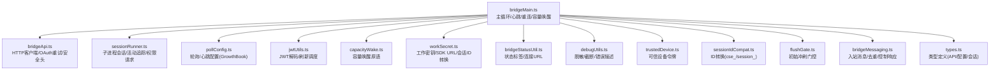
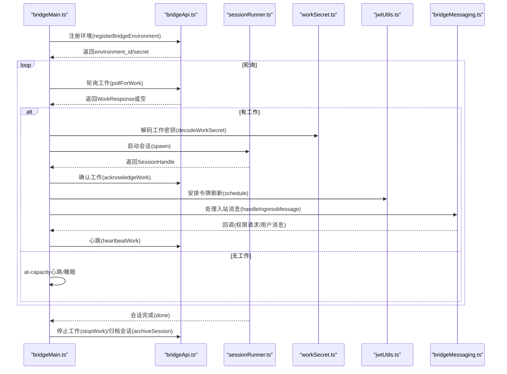
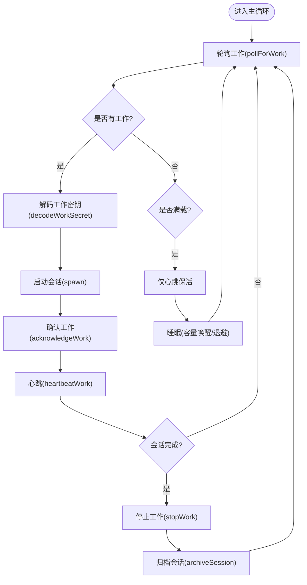
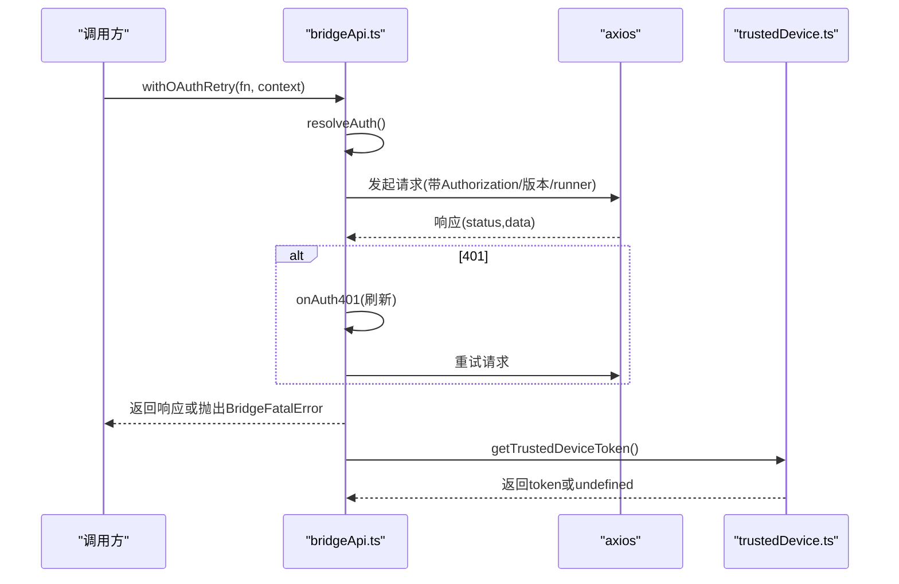
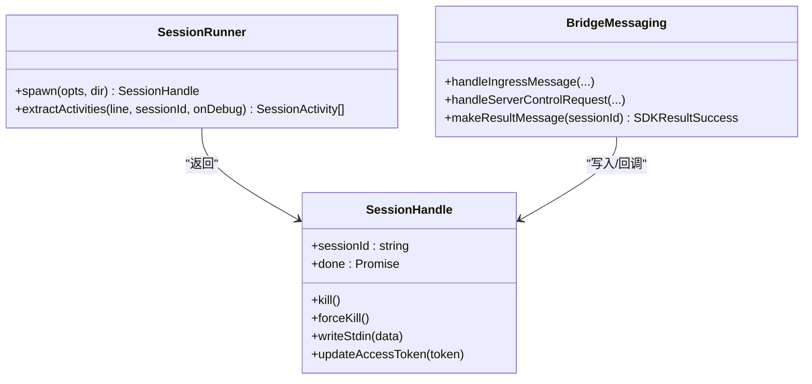
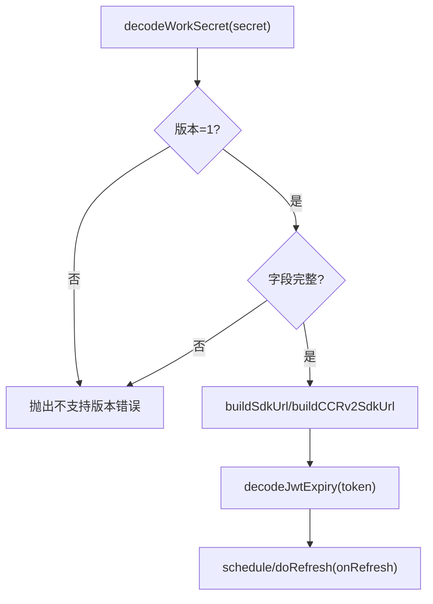
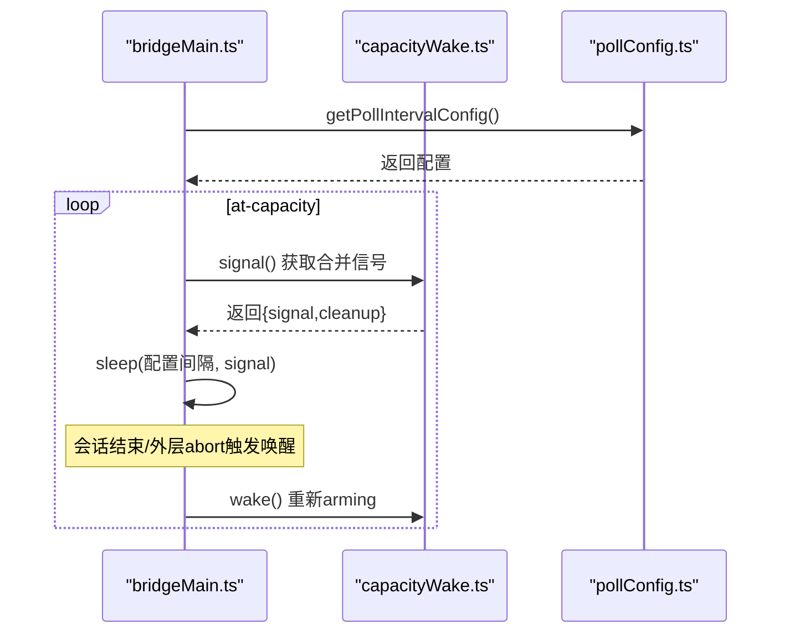
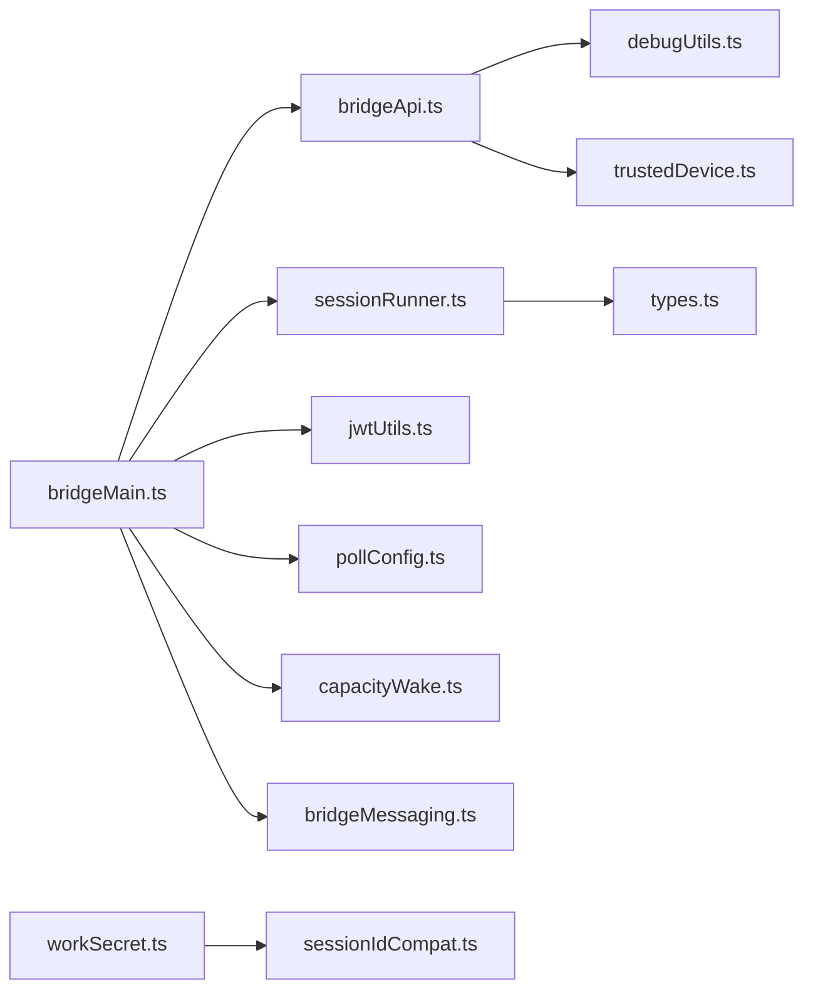

# 远程协作系统

<cite>
**本文引用的文件**
- [src/bridge/bridgeMain.ts](file://src/bridge/bridgeMain.ts)
- [src/bridge/bridgeApi.ts](file://src/bridge/bridgeApi.ts)
- [src/bridge/bridgeConfig.ts](file://src/bridge/bridgeConfig.ts)
- [src/bridge/bridgeMessaging.ts](file://src/bridge/bridgeMessaging.ts)
- [src/bridge/sessionRunner.ts](file://src/bridge/sessionRunner.ts)
- [src/bridge/types.ts](file://src/bridge/types.ts)
- [src/bridge/jwtUtils.ts](file://src/bridge/jwtUtils.ts)
- [src/bridge/capacityWake.ts](file://src/bridge/capacityWake.ts)
- [src/bridge/pollConfig.ts](file://src/bridge/pollConfig.ts)
- [src/bridge/workSecret.ts](file://src/bridge/workSecret.ts)
- [src/bridge/bridgeStatusUtil.ts](file://src/bridge/bridgeStatusUtil.ts)
- [src/bridge/debugUtils.ts](file://src/bridge/debugUtils.ts)
- [src/bridge/trustedDevice.ts](file://src/bridge/trustedDevice.ts)
- [src/bridge/sessionIdCompat.ts](file://src/bridge/sessionIdCompat.ts)
- [src/bridge/flushGate.ts](file://src/bridge/flushGate.ts)
</cite>

## 目录
1. [简介](#简介)
2. [项目结构](#项目结构)
3. [核心组件](#核心组件)
4. [架构总览](#架构总览)
5. [详细组件分析](#详细组件分析)
6. [依赖关系分析](#依赖关系分析)
7. [性能考量](#性能考量)
8. [故障排查指南](#故障排查指南)
9. [结论](#结论)
10. [附录：配置与使用指南](#附录配置与使用指南)

## 简介
本文件面向Claude Code的远程协作系统，聚焦“桥接层”（bridge）的设计与实现，围绕bridgeMain.ts中的会话生命周期管理、HTTP客户端、连接配置、消息中继等核心能力进行深入解析；同时阐述远程会话管理机制（创建、轮询、转发、容量唤醒）、通信协议（JWT认证、工作密钥交换、会话生命周期）、容错与重连策略（连接失败处理、指数退避、生成器延迟），并提供可操作的配置与排障建议。

## 项目结构
桥接层位于src/bridge目录，采用按职责分层的模块化组织：
- bridgeMain.ts：桥接主循环、会话生命周期、心跳与重连、容量唤醒、日志与状态展示
- bridgeApi.ts：HTTP客户端封装、错误分类与致命错误处理、OAuth重试、请求头与安全头
- bridgeConfig.ts：桥接认证与基础URL解析（优先开发覆盖）
- bridgeMessaging.ts：消息入站路由、去重、控制请求响应、结果消息构造
- sessionRunner.ts：子进程会话启动、活动追踪、权限请求转发、令牌更新
- types.ts：桥接类型定义（工作项、会话句柄、API接口、配置等）
- jwtUtils.ts：JWT解码、过期时间提取、令牌刷新调度器
- capacityWake.ts：跨循环共享的容量唤醒原语（合并AbortSignal）
- pollConfig.ts：增长实验驱动的轮询/心跳配置（含校验与默认值）
- workSecret.ts：工作密钥解码、SDK URL构建、会话ID兼容转换、CCR v2注册
- bridgeStatusUtil.ts：状态标签、连接URL、闪烁动画辅助
- debugUtils.ts：敏感信息脱敏、请求体截断、错误描述与状态提取
- trustedDevice.ts：可信设备令牌获取与持久化、登录后自动注册
- sessionIdCompat.ts：会话ID在cse_/session_之间的兼容转换
- flushGate.ts：初始历史消息冲刷期间的消息写入门控

图表来源
- [src/bridge/bridgeMain.ts:141-900](file://src/bridge/bridgeMain.ts#L141-L900)
- [src/bridge/bridgeApi.ts:68-452](file://src/bridge/bridgeApi.ts#L68-L452)
- [src/bridge/sessionRunner.ts:248-548](file://src/bridge/sessionRunner.ts#L248-L548)
- [src/bridge/pollConfig.ts:102-111](file://src/bridge/pollConfig.ts#L102-L111)
- [src/bridge/jwtUtils.ts:72-256](file://src/bridge/jwtUtils.ts#L72-L256)
- [src/bridge/capacityWake.ts:28-56](file://src/bridge/capacityWake.ts#L28-L56)
- [src/bridge/workSecret.ts:6-128](file://src/bridge/workSecret.ts#L6-L128)
- [src/bridge/bridgeStatusUtil.ts:38-164](file://src/bridge/bridgeStatusUtil.ts#L38-L164)
- [src/bridge/debugUtils.ts:26-142](file://src/bridge/debugUtils.ts#L26-L142)
- [src/bridge/trustedDevice.ts:54-211](file://src/bridge/trustedDevice.ts#L54-L211)
- [src/bridge/sessionIdCompat.ts:38-57](file://src/bridge/sessionIdCompat.ts#L38-L57)
- [src/bridge/flushGate.ts:16-72](file://src/bridge/flushGate.ts#L16-L72)
- [src/bridge/bridgeMessaging.ts:132-208](file://src/bridge/bridgeMessaging.ts#L132-L208)
- [src/bridge/types.ts:133-263](file://src/bridge/types.ts#L133-L263)

章节来源
- [src/bridge/bridgeMain.ts:141-900](file://src/bridge/bridgeMain.ts#L141-L900)
- [src/bridge/bridgeApi.ts:68-452](file://src/bridge/bridgeApi.ts#L68-L452)
- [src/bridge/sessionRunner.ts:248-548](file://src/bridge/sessionRunner.ts#L248-L548)

## 核心组件
- 会话生命周期管理（bridgeMain.ts）
  - 主循环：轮询工作、心跳保活、容量唤醒、状态展示、会话结束清理
  - 心跳与重连：对活跃工作项发送心跳，JWT过期触发服务端重新派发
  - 容量唤醒：在满载时睡眠，有会话结束或信号到达时提前唤醒
  - 日志与状态：实时状态栏、会话计数、活动轨迹、标题设置
- HTTP客户端（bridgeApi.ts）
  - 统一封装：注册环境、轮询工作、确认工作、停止工作、注销环境、归档会话、重连会话、心跳、发送权限事件
  - 认证与重试：OAuth令牌获取与401重试；致命错误（401/403/404/410）抛出BridgeFatalError
  - 安全头：Authorization、anthropic-version、anthropic-beta、runner版本、可信设备令牌
- 会话运行器（sessionRunner.ts）
  - 子进程启动：参数拼装、环境变量注入、标准流处理、活动解析
  - 权限请求：检测工具调用权限请求并转发至服务器
  - 令牌更新：通过stdin发送新令牌，使子进程即时生效
- 消息中继（bridgeMessaging.ts）
  - 入站消息处理：解析、去重（回声/重复）、路由到回调
  - 控制请求响应：initialize/set_model/set_max_thinking_tokens/set_permission_mode/interrupt
  - 结果消息：用于归档的最小成功结果事件
- 配置与认证（bridgeConfig.ts、trustedDevice.ts、workSecret.ts）
  - 开发覆盖：优先使用环境变量覆盖的OAuth令牌与基础URL
  - 可信设备：登录后自动注册并持久化，桥接请求携带X-Trusted-Device-Token
  - 工作密钥：解码工作密钥，构建SDK URL（v1/v2），会话ID转换
- 协议与类型（types.ts、jwtUtils.ts、sessionIdCompat.ts）
  - 类型定义：工作响应、会话句柄、API接口、配置、权限事件
  - JWT工具：解码payload/expiry、刷新缓冲、刷新调度器
  - ID兼容：cse_*与session_*互转，兼容v2兼容层

章节来源
- [src/bridge/bridgeMain.ts:141-900](file://src/bridge/bridgeMain.ts#L141-L900)
- [src/bridge/bridgeApi.ts:68-452](file://src/bridge/bridgeApi.ts#L68-L452)
- [src/bridge/sessionRunner.ts:248-548](file://src/bridge/sessionRunner.ts#L248-L548)
- [src/bridge/bridgeMessaging.ts:132-208](file://src/bridge/bridgeMessaging.ts#L132-L208)
- [src/bridge/types.ts:133-263](file://src/bridge/types.ts#L133-L263)
- [src/bridge/jwtUtils.ts:72-256](file://src/bridge/jwtUtils.ts#L72-L256)
- [src/bridge/workSecret.ts:6-128](file://src/bridge/workSecret.ts#L6-L128)
- [src/bridge/trustedDevice.ts:54-211](file://src/bridge/trustedDevice.ts#L54-L211)
- [src/bridge/sessionIdCompat.ts:38-57](file://src/bridge/sessionIdCompat.ts#L38-L57)

## 架构总览
桥接层由“主循环-HTTP客户端-会话运行器-消息中继”构成，配合“配置/认证/协议/状态/门控”模块协同工作，形成稳定的远程协作通道。

图表来源
- [src/bridge/bridgeMain.ts:600-900](file://src/bridge/bridgeMain.ts#L600-L900)
- [src/bridge/bridgeApi.ts:141-451](file://src/bridge/bridgeApi.ts#L141-L451)
- [src/bridge/sessionRunner.ts:248-548](file://src/bridge/sessionRunner.ts#L248-L548)
- [src/bridge/workSecret.ts:6-128](file://src/bridge/workSecret.ts#L6-L128)
- [src/bridge/jwtUtils.ts:72-256](file://src/bridge/jwtUtils.ts#L72-L256)
- [src/bridge/bridgeMessaging.ts:132-208](file://src/bridge/bridgeMessaging.ts#L132-L208)

## 详细组件分析

### 组件A：主循环与会话生命周期（bridgeMain.ts）
- 关键职责
  - 运行主循环：轮询工作、心跳保活、错误预算与退避、容量唤醒、状态展示
  - 会话管理：创建、结束、清理、超时处理、归档、标题设置
  - 令牌刷新：基于JWT过期时间的主动刷新，v2通过reconnectSession触发服务端重派发
- 重要数据结构
  - activeSessions、sessionStartTimes、sessionWorkIds、sessionIngressTokens、sessionTimers、sessionWorktrees、timedOutSessions、titledSessions、completedWorkIds
- 错误处理
  - BridgeFatalError：401/403/404/410等致命错误，区分环境过期/权限不足等场景
  - 重连逻辑：心跳发现JWT过期时调用reconnectSession，服务端重新派发工作
- 容量与睡眠
  - at-capacity模式下，心跳与可选轮询组合，结合capacityWake在会话结束时立即唤醒

图表来源
- [src/bridge/bridgeMain.ts:600-900](file://src/bridge/bridgeMain.ts#L600-L900)
- [src/bridge/bridgeApi.ts:199-417](file://src/bridge/bridgeApi.ts#L199-L417)
- [src/bridge/sessionRunner.ts:248-548](file://src/bridge/sessionRunner.ts#L248-L548)

章节来源
- [src/bridge/bridgeMain.ts:141-900](file://src/bridge/bridgeMain.ts#L141-L900)
- [src/bridge/bridgeApi.ts:454-524](file://src/bridge/bridgeApi.ts#L454-L524)

### 组件B：HTTP客户端与认证（bridgeApi.ts、bridgeConfig.ts、trustedDevice.ts）
- HTTP客户端
  - 统一请求头：Authorization、Content-Type、anthropic-version、anthropic-beta、runner版本
  - 可选安全头：X-Trusted-Device-Token（启用时）
  - 错误分类：200/204视为成功；401/403/404/410抛出BridgeFatalError；429速率限制；其他异常
  - OAuth重试：401时尝试刷新令牌并重试一次
- 认证来源
  - 开发覆盖：CLAUDE_BRIDGE_OAUTH_TOKEN、CLAUDE_BRIDGE_BASE_URL
  - 正式路径：OAuth存储中的访问令牌
- 可信设备
  - 登录后自动注册并持久化，桥接请求携带X-Trusted-Device-Token

图表来源
- [src/bridge/bridgeApi.ts:106-139](file://src/bridge/bridgeApi.ts#L106-L139)
- [src/bridge/bridgeApi.ts:76-89](file://src/bridge/bridgeApi.ts#L76-L89)
- [src/bridge/trustedDevice.ts:54-59](file://src/bridge/trustedDevice.ts#L54-L59)

章节来源
- [src/bridge/bridgeApi.ts:68-452](file://src/bridge/bridgeApi.ts#L68-L452)
- [src/bridge/bridgeConfig.ts:17-48](file://src/bridge/bridgeConfig.ts#L17-L48)
- [src/bridge/trustedDevice.ts:54-211](file://src/bridge/trustedDevice.ts#L54-L211)

### 组件C：会话运行器与消息中继（sessionRunner.ts、bridgeMessaging.ts）
- 会话运行器
  - 子进程启动：注入SDK URL、会话ID、访问令牌、v1/v2环境变量
  - 活动追踪：从stdout解析NDJSON，提取tool_start/text/result/error
  - 权限请求：检测can_use_tool并通过onPermissionRequest回调转发
  - 令牌更新：通过stdin发送update_environment_variables触发子进程刷新
- 消息中继
  - 入站消息：解析、去重（回声/重复）、过滤非用户/助手/本地命令
  - 控制请求：initialize/set_model/set_max_thinking_tokens/set_permission_mode/interrupt，及时响应避免超时
  - 结果消息：构造最小SDKResultSuccess用于归档

图表来源
- [src/bridge/sessionRunner.ts:248-548](file://src/bridge/sessionRunner.ts#L248-L548)
- [src/bridge/bridgeMessaging.ts:132-391](file://src/bridge/bridgeMessaging.ts#L132-L391)

章节来源
- [src/bridge/sessionRunner.ts:248-548](file://src/bridge/sessionRunner.ts#L248-L548)
- [src/bridge/bridgeMessaging.ts:132-391](file://src/bridge/bridgeMessaging.ts#L132-L391)

### 组件D：协议与密钥交换（types.ts、workSecret.ts、jwtUtils.ts、sessionIdCompat.ts）
- 工作密钥（WorkSecret）
  - 版本校验、session_ingress_token、api_base_url、sources/auth、可选参数
  - 解码失败或字段缺失即报错
- SDK URL构建
  - v1：生产走Envoy重写，本地直连session-ingress
  - v2：HTTP(S) URL指向/v1/code/sessions/{id}
- JWT与刷新
  - 解码payload/expiry，基于exp提前refreshBufferMs刷新
  - v2通过reconnectSession触发服务端重派发
- 会话ID兼容
  - cse_*与session_*互转，兼容v2兼容层

图表来源
- [src/bridge/workSecret.ts:6-128](file://src/bridge/workSecret.ts#L6-L128)
- [src/bridge/jwtUtils.ts:21-140](file://src/bridge/jwtUtils.ts#L21-L140)
- [src/bridge/sessionIdCompat.ts:38-57](file://src/bridge/sessionIdCompat.ts#L38-L57)

章节来源
- [src/bridge/types.ts:33-51](file://src/bridge/types.ts#L33-L51)
- [src/bridge/workSecret.ts:6-128](file://src/bridge/workSecret.ts#L6-L128)
- [src/bridge/jwtUtils.ts:21-140](file://src/bridge/jwtUtils.ts#L21-L140)
- [src/bridge/sessionIdCompat.ts:38-57](file://src/bridge/sessionIdCompat.ts#L38-L57)

### 组件E：容量唤醒与轮询配置（capacityWake.ts、pollConfig.ts）
- 容量唤醒
  - 将外层循环AbortSignal与内部wake控制器合并，睡眠时可被提前唤醒
- 轮询配置
  - 通过GrowthBook动态下发，包含多会话模式下的不同轮询间隔、心跳间隔、回收窗口、keepalive间隔
  - 强校验：至少启用心跳或任一at-capacity轮询，防止紧循环

图表来源
- [src/bridge/capacityWake.ts:28-56](file://src/bridge/capacityWake.ts#L28-L56)
- [src/bridge/pollConfig.ts:102-111](file://src/bridge/pollConfig.ts#L102-L111)

章节来源
- [src/bridge/capacityWake.ts:11-56](file://src/bridge/capacityWake.ts#L11-L56)
- [src/bridge/pollConfig.ts:28-92](file://src/bridge/pollConfig.ts#L28-L92)

## 依赖关系分析
- 模块耦合
  - bridgeMain.ts高度依赖bridgeApi.ts、sessionRunner.ts、jwtUtils.ts、pollConfig.ts、capacityWake.ts、bridgeMessaging.ts
  - bridgeApi.ts依赖debugUtils.ts（错误描述）、trustedDevice.ts（可信设备头）
  - sessionRunner.ts依赖types.ts（类型）、debugUtils.ts（调试输出）
  - workSecret.ts与sessionIdCompat.ts相互配合，确保v1/v2兼容
- 外部依赖
  - axios：HTTP请求
  - crypto/path/os/fs/readline：子进程与文件系统
  - lodash-es.memoize：可信设备令牌缓存

图表来源
- [src/bridge/bridgeMain.ts:141-900](file://src/bridge/bridgeMain.ts#L141-L900)
- [src/bridge/bridgeApi.ts:68-452](file://src/bridge/bridgeApi.ts#L68-L452)
- [src/bridge/sessionRunner.ts:248-548](file://src/bridge/sessionRunner.ts#L248-L548)
- [src/bridge/bridgeMessaging.ts:132-208](file://src/bridge/bridgeMessaging.ts#L132-L208)
- [src/bridge/workSecret.ts:6-128](file://src/bridge/workSecret.ts#L6-L128)
- [src/bridge/sessionIdCompat.ts:38-57](file://src/bridge/sessionIdCompat.ts#L38-L57)
- [src/bridge/debugUtils.ts:26-142](file://src/bridge/debugUtils.ts#L26-L142)
- [src/bridge/trustedDevice.ts:54-211](file://src/bridge/trustedDevice.ts#L54-L211)
- [src/bridge/types.ts:133-263](file://src/bridge/types.ts#L133-L263)

章节来源
- [src/bridge/bridgeMain.ts:141-900](file://src/bridge/bridgeMain.ts#L141-L900)
- [src/bridge/bridgeApi.ts:68-452](file://src/bridge/bridgeApi.ts#L68-L452)

## 性能考量
- 轮询与心跳
  - 使用GrowthBook动态配置，避免硬编码导致的过度轮询或过长延迟
  - at-capacity模式下，心跳与可选轮询组合，减少空闲CPU占用
- 令牌刷新
  - 基于JWT exp提前刷新，避免过期导致的重连风暴
  - fallback定时器保证长时间会话的持续认证
- 日志与调试
  - debugUtils对敏感字段脱敏与截断，避免大体积日志影响性能
  - 空闲轮询统计与节流，降低服务器压力

## 故障排查指南
- 常见错误与定位
  - 401/403：检查登录状态与可信设备令牌；必要时重新登录并触发可信设备注册
  - 404/410：环境过期或不存在，需重新注册环境或重启远程控制
  - 429：轮询过于频繁，调整轮询配置或等待
- 诊断技巧
  - 查看桥接日志与会话日志（--debug-file或临时目录）
  - 使用debugUtils.redactSecrets与debugBody定位问题请求体
  - 观察心跳与重连事件，判断是否因JWT过期导致的工作重派发
- 重连与退避
  - 主循环内置连接与一般退避，结合capacityWake在满载时快速恢复
  - 若出现持续重连，检查网络稳定性与服务器可达性

章节来源
- [src/bridge/bridgeApi.ts:454-524](file://src/bridge/bridgeApi.ts#L454-L524)
- [src/bridge/debugUtils.ts:26-142](file://src/bridge/debugUtils.ts#L26-L142)
- [src/bridge/trustedDevice.ts:98-211](file://src/bridge/trustedDevice.ts#L98-L211)
- [src/bridge/bridgeMain.ts:600-900](file://src/bridge/bridgeMain.ts#L600-L900)

## 结论
桥接层通过“主循环-HTTP客户端-会话运行器-消息中继”的清晰分工，结合可信设备认证、JWT刷新、容量唤醒与动态轮询配置，实现了稳定可靠的远程协作通道。其模块化设计便于扩展与维护，同时提供了完善的诊断与容错能力，适合在复杂网络环境下长期运行。

## 附录：配置与使用指南
- 桥接配置
  - 环境注册：bridgeMain.ts通过bridgeApi.registerBridgeEnvironment完成
  - 最大会话数：config.maxSessions决定容量与at-capacity行为
  - 轮询配置：通过GrowthBook下发，支持多会话模式下的差异化间隔
- 认证设置
  - 开发覆盖：CLAUDE_BRIDGE_OAUTH_TOKEN、CLAUDE_BRIDGE_BASE_URL
  - 可信设备：登录后自动注册并持久化，桥接请求携带X-Trusted-Device-Token
- 网络与环境要求
  - 生产环境使用wss，本地开发使用ws；SDK URL根据apiBaseUrl自动选择
  - 服务器需支持Anthropic版本头与beta标志位
- 远程会话监控与调试
  - 使用bridgeStatusUtil构建连接/会话URL，便于在Web端查看状态
  - 通过bridgeMessaging的入站消息与控制请求响应，观察交互链路
  - 利用flushGate在初始历史消息冲刷期间阻塞后续消息，避免乱序

章节来源
- [src/bridge/bridgeConfig.ts:17-48](file://src/bridge/bridgeConfig.ts#L17-L48)
- [src/bridge/trustedDevice.ts:54-211](file://src/bridge/trustedDevice.ts#L54-L211)
- [src/bridge/workSecret.ts:41-87](file://src/bridge/workSecret.ts#L41-L87)
- [src/bridge/bridgeStatusUtil.ts:38-58](file://src/bridge/bridgeStatusUtil.ts#L38-L58)
- [src/bridge/bridgeMessaging.ts:132-208](file://src/bridge/bridgeMessaging.ts#L132-L208)
- [src/bridge/flushGate.ts:16-72](file://src/bridge/flushGate.ts#L16-L72)