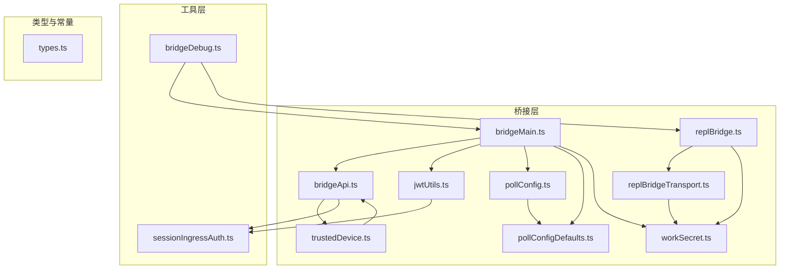
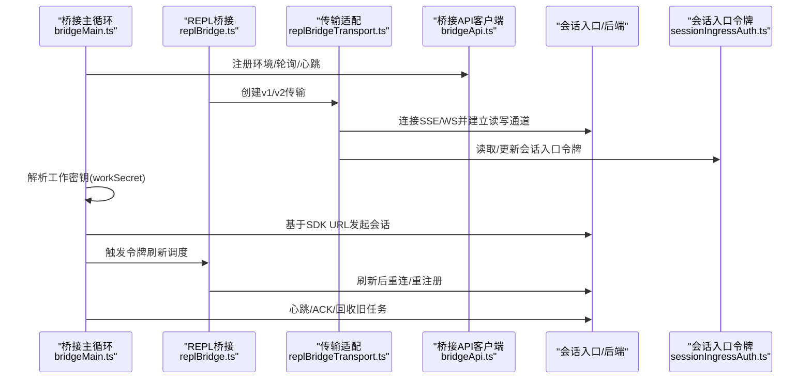
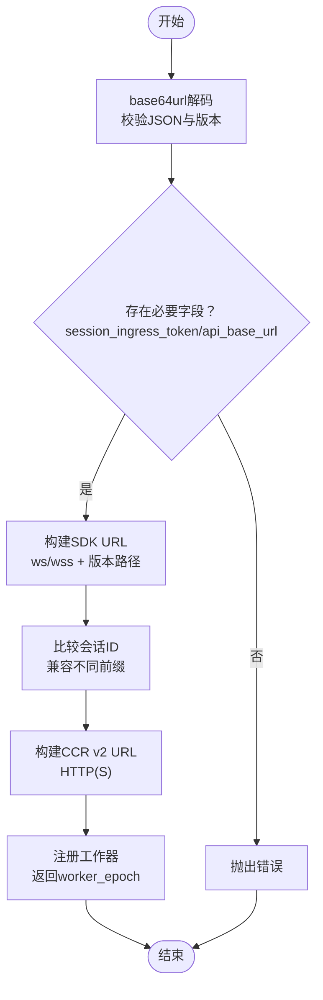
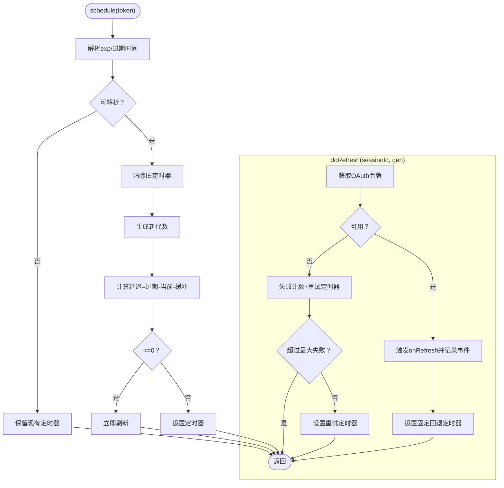
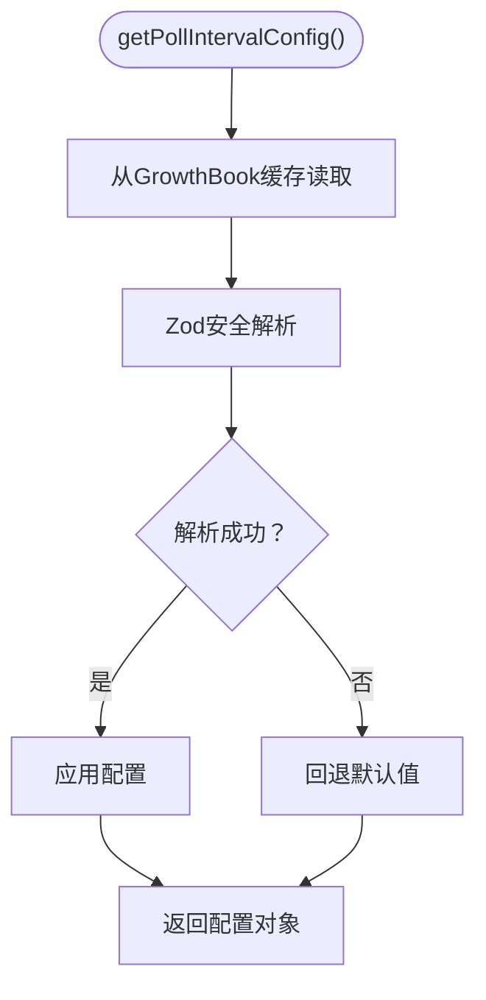
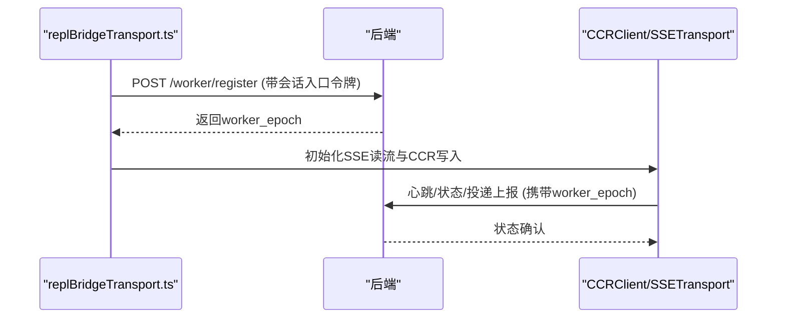
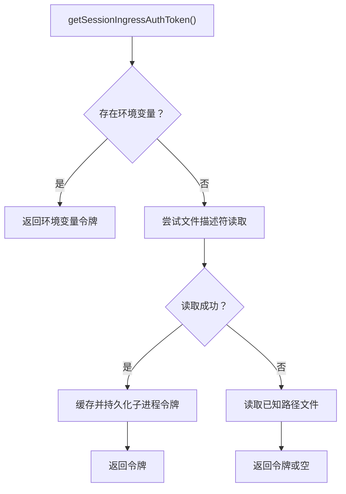
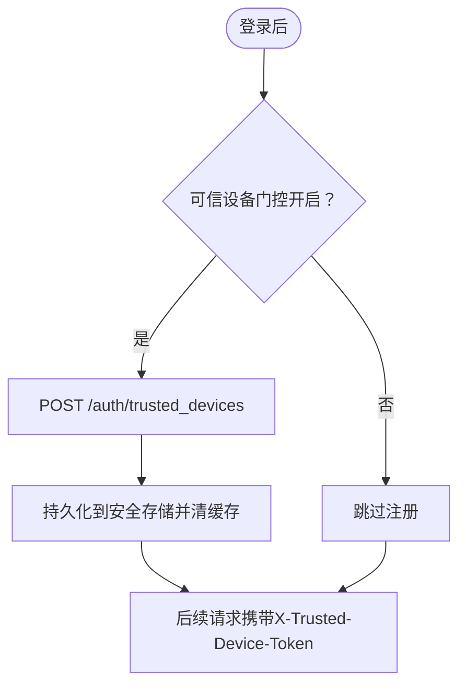
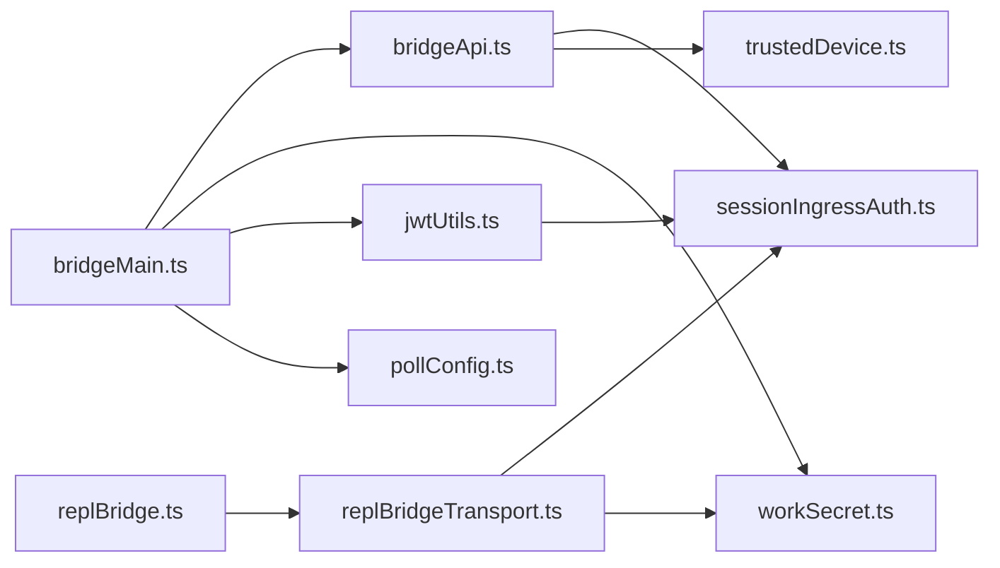

# 通信协议设计

<cite>
**本文引用的文件**
- [src/bridge/workSecret.ts](file://src/bridge/workSecret.ts)
- [src/bridge/pollConfig.ts](file://src/bridge/pollConfig.ts)
- [src/bridge/pollConfigDefaults.ts](file://src/bridge/pollConfigDefaults.ts)
- [src/bridge/jwtUtils.ts](file://src/bridge/jwtUtils.ts)
- [src/bridge/types.ts](file://src/bridge/types.ts)
- [src/bridge/bridgeMain.ts](file://src/bridge/bridgeMain.ts)
- [src/bridge/replBridge.ts](file://src/bridge/replBridge.ts)
- [src/bridge/replBridgeTransport.ts](file://src/bridge/replBridgeTransport.ts)
- [src/bridge/bridgeApi.ts](file://src/bridge/bridgeApi.ts)
- [src/utils/sessionIngressAuth.ts](file://src/utils/sessionIngressAuth.ts)
- [src/bridge/trustedDevice.ts](file://src/bridge/trustedDevice.ts)
- [src/bridge/bridgeDebug.ts](file://src/bridge/bridgeDebug.ts)
</cite>

## 目录
1. [引言](#引言)
2. [项目结构](#项目结构)
3. [核心组件](#核心组件)
4. [架构总览](#架构总览)
5. [详细组件分析](#详细组件分析)
6. [依赖关系分析](#依赖关系分析)
7. [性能考量](#性能考量)
8. [故障排除指南](#故障排除指南)
9. [结论](#结论)
10. [附录](#附录)

## 引言
本文件面向Claude Code的通信协议设计，系统化阐述以下主题：
- JWT认证机制：会话令牌解码、过期时间解析、主动刷新调度、OAuth令牌与会话令牌的协同。
- 工作密钥（workSecret）解码与使用：base64url解码、版本校验、会话入口令牌提取、API基础URL解析、SDK URL构建、会话ID兼容性比较、CCR v2工作器注册与worker_epoch管理。
- 轮询配置协议：轮询间隔、容量阈值、心跳策略、多会话轮询、回收旧任务、会话保活等参数的动态配置与校验。
- 安全考虑与最佳实践：令牌安全存储、网络传输加密、可信设备令牌、防重放与防抖动策略。
- 协议调试与故障排除：日志与诊断、注入式故障测试、回退与重连策略。

## 项目结构
围绕“桥接层”与“工具层”的分层组织：
- 桥接层（bridge）：负责与后端环境API交互、轮询、会话生命周期管理、令牌刷新调度、工作密钥处理、传输适配（v1/v2）。
- 工具层（utils）：提供会话入口令牌读取与认证头生成、安全存储、调试与诊断等通用能力。
- 类型与常量（types）：统一协议数据结构与接口契约。

图表来源
- [src/bridge/bridgeMain.ts:141-400](file://src/bridge/bridgeMain.ts#L141-L400)
- [src/bridge/replBridge.ts:1-200](file://src/bridge/replBridge.ts#L1-L200)
- [src/bridge/replBridgeTransport.ts:1-200](file://src/bridge/replBridgeTransport.ts#L1-L200)
- [src/bridge/workSecret.ts:1-128](file://src/bridge/workSecret.ts#L1-L128)
- [src/bridge/jwtUtils.ts:1-257](file://src/bridge/jwtUtils.ts#L1-L257)
- [src/bridge/pollConfig.ts:1-111](file://src/bridge/pollConfig.ts#L1-L111)
- [src/bridge/pollConfigDefaults.ts:1-83](file://src/bridge/pollConfigDefaults.ts#L1-L83)
- [src/bridge/bridgeApi.ts:1-200](file://src/bridge/bridgeApi.ts#L1-L200)
- [src/utils/sessionIngressAuth.ts:1-141](file://src/utils/sessionIngressAuth.ts#L1-L141)
- [src/bridge/trustedDevice.ts:1-211](file://src/bridge/trustedDevice.ts#L1-L211)
- [src/bridge/bridgeDebug.ts:1-136](file://src/bridge/bridgeDebug.ts#L1-L136)

章节来源
- [src/bridge/bridgeMain.ts:141-400](file://src/bridge/bridgeMain.ts#L141-L400)
- [src/bridge/replBridge.ts:1-200](file://src/bridge/replBridge.ts#L1-L200)
- [src/bridge/replBridgeTransport.ts:1-200](file://src/bridge/replBridgeTransport.ts#L1-L200)
- [src/bridge/workSecret.ts:1-128](file://src/bridge/workSecret.ts#L1-L128)
- [src/bridge/jwtUtils.ts:1-257](file://src/bridge/jwtUtils.ts#L1-L257)
- [src/bridge/pollConfig.ts:1-111](file://src/bridge/pollConfig.ts#L1-L111)
- [src/bridge/pollConfigDefaults.ts:1-83](file://src/bridge/pollConfigDefaults.ts#L1-L83)
- [src/bridge/bridgeApi.ts:1-200](file://src/bridge/bridgeApi.ts#L1-L200)
- [src/utils/sessionIngressAuth.ts:1-141](file://src/utils/sessionIngressAuth.ts#L1-L141)
- [src/bridge/trustedDevice.ts:1-211](file://src/bridge/trustedDevice.ts#L1-L211)
- [src/bridge/bridgeDebug.ts:1-136](file://src/bridge/bridgeDebug.ts#L1-L136)

## 核心组件
- 工作密钥解码与SDK URL构建：从base64url编码的JSON中提取会话入口令牌与API基础URL，并据此构造WebSocket或HTTP(S) URL；支持CCR v2 URL与兼容层会话ID比较。
- JWT认证与刷新调度：解码JWT载荷以获取过期时间，基于缓冲窗口提前触发刷新；对OAuth令牌不可用的情况进行重试与失败计数；支持按expires_in直接调度刷新。
- 轮询配置：通过GrowthBook动态下发轮询间隔、心跳、多会话阈值、回收窗口与会话保活；对异常配置进行严格校验，避免“无活性漂移”。
- 传输适配：v1（HybridTransport）与v2（SSETransport + CCRClient）双栈，v2要求JWT而非OAuth，且需要worker注册与epoch管理。
- 会话入口令牌管理：优先从环境变量读取，其次从文件描述符读取，最后回退到已知路径文件；支持在进程内更新令牌而不重启子进程。
- 可信设备令牌：在Elevated安全级别下，通过X-Trusted-Device-Token头参与鉴权，令牌持久化于安全存储并在登录后自动注册。

章节来源
- [src/bridge/workSecret.ts:1-128](file://src/bridge/workSecret.ts#L1-L128)
- [src/bridge/jwtUtils.ts:1-257](file://src/bridge/jwtUtils.ts#L1-L257)
- [src/bridge/pollConfig.ts:1-111](file://src/bridge/pollConfig.ts#L1-L111)
- [src/bridge/pollConfigDefaults.ts:1-83](file://src/bridge/pollConfigDefaults.ts#L1-L83)
- [src/bridge/replBridgeTransport.ts:1-200](file://src/bridge/replBridgeTransport.ts#L1-L200)
- [src/utils/sessionIngressAuth.ts:1-141](file://src/utils/sessionIngressAuth.ts#L1-L141)
- [src/bridge/trustedDevice.ts:1-211](file://src/bridge/trustedDevice.ts#L1-L211)

## 架构总览
下图展示桥接主循环与REPL桥接在不同传输模式下的交互，以及令牌刷新与工作密钥解码的关键节点。

图表来源
- [src/bridge/bridgeMain.ts:141-400](file://src/bridge/bridgeMain.ts#L141-L400)
- [src/bridge/replBridge.ts:1-200](file://src/bridge/replBridge.ts#L1-L200)
- [src/bridge/replBridgeTransport.ts:1-200](file://src/bridge/replBridgeTransport.ts#L1-L200)
- [src/bridge/bridgeApi.ts:1-200](file://src/bridge/bridgeApi.ts#L1-L200)
- [src/utils/sessionIngressAuth.ts:1-141](file://src/utils/sessionIngressAuth.ts#L1-L141)

## 详细组件分析

### 组件A：工作密钥解码与会话令牌管理
- 功能要点
  - base64url解码与JSON校验，确保版本字段为1。
  - 提取会话入口令牌与API基础URL，用于后续SDK URL构建。
  - 构建WebSocket或HTTP(S) URL，区分本地与生产环境的协议与版本路径。
  - 兼容不同前缀的会话ID（如session_*与cse_*），仅比较UUID主体部分。
  - CCR v2工作器注册，返回worker_epoch供心跳/状态上报使用。
- 关键流程（解码与URL构建）

图表来源
- [src/bridge/workSecret.ts:5-32](file://src/bridge/workSecret.ts#L5-L32)
- [src/bridge/workSecret.ts:41-48](file://src/bridge/workSecret.ts#L41-L48)
- [src/bridge/workSecret.ts:62-73](file://src/bridge/workSecret.ts#L62-L73)
- [src/bridge/workSecret.ts:81-87](file://src/bridge/workSecret.ts#L81-L87)
- [src/bridge/workSecret.ts:97-127](file://src/bridge/workSecret.ts#L97-L127)

章节来源
- [src/bridge/workSecret.ts:1-128](file://src/bridge/workSecret.ts#L1-L128)

### 组件B：JWT认证与令牌刷新调度
- 功能要点
  - 解码JWT载荷（剥离前缀），提取exp（Unix秒）作为过期时间。
  - 主动刷新：在到期前固定缓冲窗口触发刷新；若无法解码JWT则保留现有定时器以防链路中断。
  - 失败重试：当OAuth令牌不可用时，记录失败次数并在上限内周期重试。
  - 固定回退：完成一次刷新后，按固定间隔再次调度，保障长会话持续有效。
  - 会话级生成器：防止并发刷新被旧定时器覆盖，确保“最新一代”生效。
- 关键流程（刷新调度）

图表来源
- [src/bridge/jwtUtils.ts:72-163](file://src/bridge/jwtUtils.ts#L72-L163)
- [src/bridge/jwtUtils.ts:165-230](file://src/bridge/jwtUtils.ts#L165-L230)

章节来源
- [src/bridge/jwtUtils.ts:1-257](file://src/bridge/jwtUtils.ts#L1-L257)

### 组件C：轮询配置协议与通信参数
- 功能要点
  - 通过GrowthBook下发轮询配置，包含非容量与容量阈值、非独占心跳、多会话阈值、回收窗口、会话保活等。
  - 使用Zod Schema进行强校验：拒绝小于100ms的细小值，禁止心跳与容量轮询同时为0，确保至少一种“活性信号”启用。
  - 默认值来自独立模块，便于不依赖GrowthBook的调用方（如Agent SDK）直接使用。
- 关键流程（配置获取与校验）

图表来源
- [src/bridge/pollConfig.ts:102-110](file://src/bridge/pollConfig.ts#L102-L110)
- [src/bridge/pollConfig.ts:28-92](file://src/bridge/pollConfig.ts#L28-L92)
- [src/bridge/pollConfigDefaults.ts:55-83](file://src/bridge/pollConfigDefaults.ts#L55-L83)

章节来源
- [src/bridge/pollConfig.ts:1-111](file://src/bridge/pollConfig.ts#L1-L111)
- [src/bridge/pollConfigDefaults.ts:1-83](file://src/bridge/pollConfigDefaults.ts#L1-L83)

### 组件D：传输适配（v1/v2）与工作器注册
- 功能要点
  - v1：HybridTransport（WS读+HTTP写），适用于传统桥接。
  - v2：SSETransport（读）+ CCRClient（写/心跳/状态/投递跟踪），要求JWT而非OAuth。
  - v2工作器注册：POST /worker/register返回worker_epoch，用于心跳/状态上报；失败需上抛以便桥接层重试。
  - 令牌注入：v2通过回调或环境变量注入会话入口令牌，避免多会话冲突。
- 关键流程（v2传输握手）

图表来源
- [src/bridge/replBridgeTransport.ts:119-200](file://src/bridge/replBridgeTransport.ts#L119-L200)
- [src/bridge/workSecret.ts:97-127](file://src/bridge/workSecret.ts#L97-L127)

章节来源
- [src/bridge/replBridgeTransport.ts:1-200](file://src/bridge/replBridgeTransport.ts#L1-L200)
- [src/bridge/workSecret.ts:1-128](file://src/bridge/workSecret.ts#L1-L128)

### 组件E：会话入口令牌读取与认证头生成
- 功能要点
  - 优先读取环境变量（进程内可更新），其次尝试文件描述符（一次性读取并缓存），最后回退到已知路径文件。
  - 支持Cookie认证（sk-ant-sid）与Bearer认证（JWT/OAuth）两种模式。
  - 提供更新入口令牌的便捷函数，用于刷新后无需重启子进程。
- 关键流程（令牌读取与认证头）

图表来源
- [src/utils/sessionIngressAuth.ts:101-110](file://src/utils/sessionIngressAuth.ts#L101-L110)
- [src/utils/sessionIngressAuth.ts:117-131](file://src/utils/sessionIngressAuth.ts#L117-L131)
- [src/utils/sessionIngressAuth.ts:138-140](file://src/utils/sessionIngressAuth.ts#L138-L140)

章节来源
- [src/utils/sessionIngressAuth.ts:1-141](file://src/utils/sessionIngressAuth.ts#L1-L141)

### 组件F：可信设备令牌与安全增强
- 功能要点
  - 在Elevated安全级别下，通过X-Trusted-Device-Token头参与鉴权。
  - 设备令牌持久化于安全存储，登录后自动注册并缓存；登出或切换账户时清理。
  - 令牌读取带缓存，减少系统调用开销；支持测试环境变量覆盖。
- 关键流程（令牌注册与读取）

图表来源
- [src/bridge/trustedDevice.ts:98-211](file://src/bridge/trustedDevice.ts#L98-L211)
- [src/bridge/trustedDevice.ts:45-59](file://src/bridge/trustedDevice.ts#L45-L59)

章节来源
- [src/bridge/trustedDevice.ts:1-211](file://src/bridge/trustedDevice.ts#L1-L211)

## 依赖关系分析
- 模块耦合
  - bridgeMain与replBridge共享轮询配置、JWT刷新、工作密钥解码与API客户端。
  - v2传输依赖工作器注册与会话入口令牌；v1传输依赖HybridTransport。
  - 会话入口令牌读取与认证头生成被多处调用，形成横切关注点。
- 外部依赖
  - axios用于HTTP请求；Zod用于配置Schema校验；memoize用于可信设备令牌缓存。
- 循环依赖
  - 未见直接循环；工具层与桥接层通过接口契约松耦合。

图表来源
- [src/bridge/bridgeMain.ts:1-200](file://src/bridge/bridgeMain.ts#L1-L200)
- [src/bridge/replBridge.ts:1-200](file://src/bridge/replBridge.ts#L1-L200)
- [src/bridge/replBridgeTransport.ts:1-200](file://src/bridge/replBridgeTransport.ts#L1-L200)
- [src/bridge/bridgeApi.ts:1-200](file://src/bridge/bridgeApi.ts#L1-L200)
- [src/utils/sessionIngressAuth.ts:1-141](file://src/utils/sessionIngressAuth.ts#L1-L141)
- [src/bridge/trustedDevice.ts:1-211](file://src/bridge/trustedDevice.ts#L1-L211)

章节来源
- [src/bridge/bridgeMain.ts:1-200](file://src/bridge/bridgeMain.ts#L1-L200)
- [src/bridge/replBridge.ts:1-200](file://src/bridge/replBridge.ts#L1-L200)
- [src/bridge/replBridgeTransport.ts:1-200](file://src/bridge/replBridgeTransport.ts#L1-L200)
- [src/bridge/bridgeApi.ts:1-200](file://src/bridge/bridgeApi.ts#L1-L200)
- [src/utils/sessionIngressAuth.ts:1-141](file://src/utils/sessionIngressAuth.ts#L1-L141)
- [src/bridge/trustedDevice.ts:1-211](file://src/bridge/trustedDevice.ts#L1-L211)

## 性能考量
- 轮询与心跳
  - 非容量轮询采用较短间隔以降低首次工作拾取延迟；容量轮询采用较长间隔以减少服务器压力。
  - 非独占心跳与容量轮询可并行运行，提升活跃度检测的鲁棒性。
- 刷新策略
  - 缓冲窗口避免临界过期导致的抖动；固定回退刷新保证长会话稳定性。
  - 失败重试上限与退避策略防止风暴效应。
- 传输选择
  - v2传输在写入路径上具备更精细的状态与投递跟踪，适合高吞吐场景；v1传输简单稳定，适合兼容需求。

## 故障排除指南
- 常见问题定位
  - 令牌相关：检查会话入口令牌来源顺序（环境变量→文件描述符→文件）；确认是否为JWT或Cookie令牌。
  - 轮询异常：核对GrowthBook配置是否满足“至少启用一种活性信号”；检查回收窗口与会话保活设置。
  - v2传输：确认worker_epoch正确获取；检查JWT是否过期；核对写入路径是否绕过SSETransport。
- 调试手段
  - 启用调试日志与诊断日志，观察令牌刷新、轮询、心跳与重连序列。
  - 使用注入式故障（ANT专用）模拟404/1002/瞬时失败等场景，验证恢复路径。
  - 在桥接层与REPL桥接中设置断点，跟踪会话ID兼容性与工作密钥解码结果。
- 最佳实践
  - 将会话入口令牌存储在安全位置，避免明文泄露；在多会话场景使用回调注入令牌。
  - 对轮询配置进行灰度发布，先在小范围验证再扩大。
  - 在Elevated安全级别下启用可信设备令牌，减少鉴权失败风险。

章节来源
- [src/bridge/bridgeDebug.ts:1-136](file://src/bridge/bridgeDebug.ts#L1-L136)
- [src/bridge/bridgeApi.ts:1-200](file://src/bridge/bridgeApi.ts#L1-L200)
- [src/utils/sessionIngressAuth.ts:1-141](file://src/utils/sessionIngressAuth.ts#L1-L141)
- [src/bridge/replBridgeTransport.ts:1-200](file://src/bridge/replBridgeTransport.ts#L1-L200)

## 结论
该通信协议通过“工作密钥解码—JWT认证—轮询配置—传输适配—令牌管理—可信设备增强”的完整闭环，实现了高可靠、可运维、可扩展的远端控制能力。其关键优势在于：
- 明确的令牌生命周期管理与主动刷新机制；
- 动态可调的轮询与心跳策略；
- v1/v2双栈兼容与CCR v2工作器注册；
- 完善的调试与故障注入能力；
- 安全存储与可信设备令牌的纵深防御。