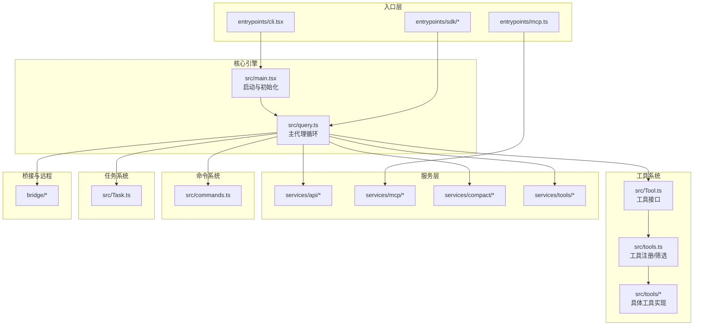
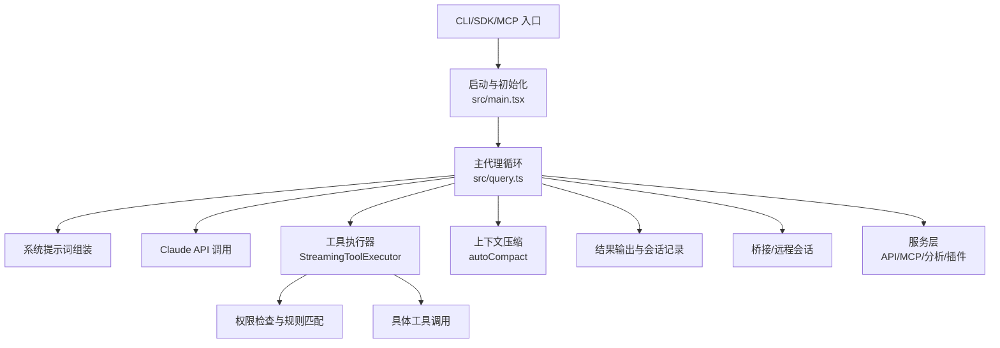
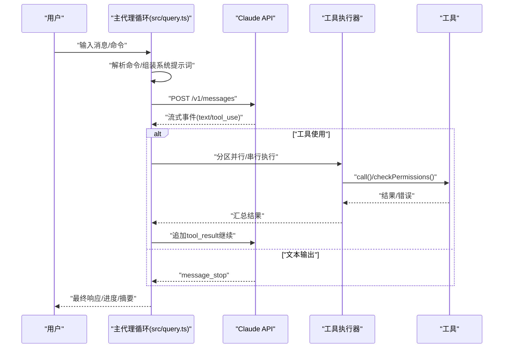
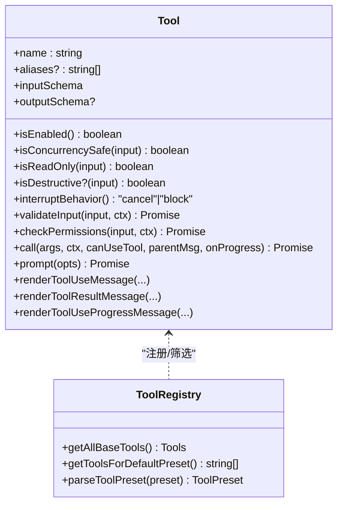
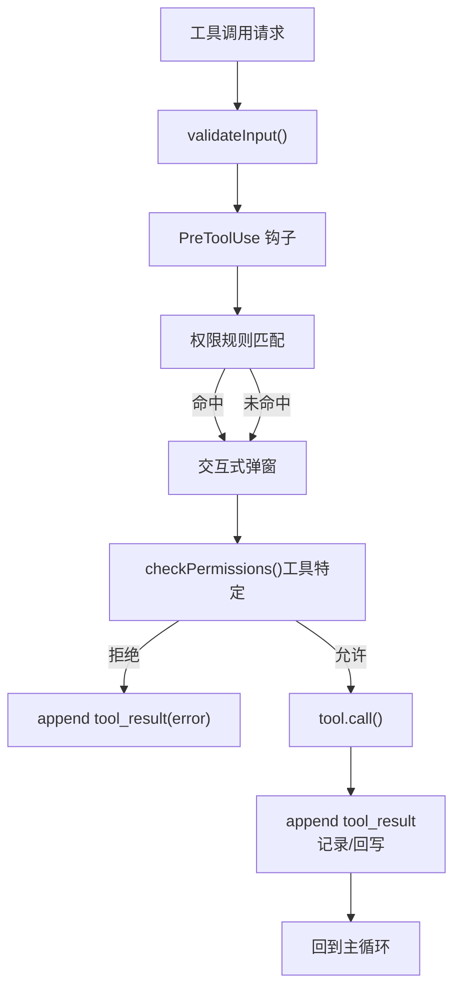
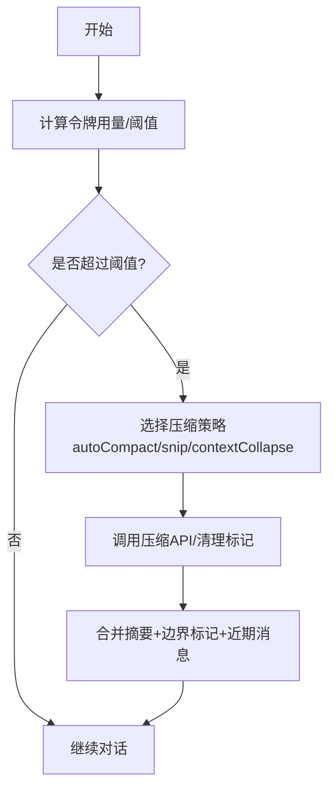
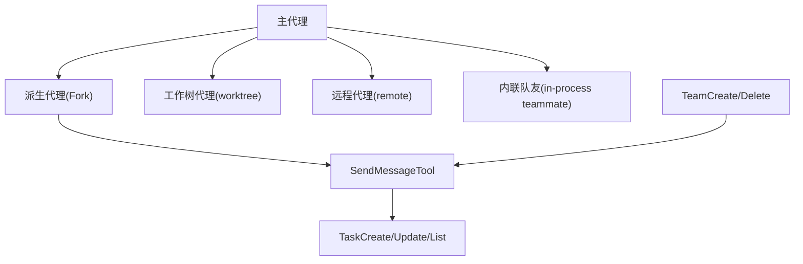
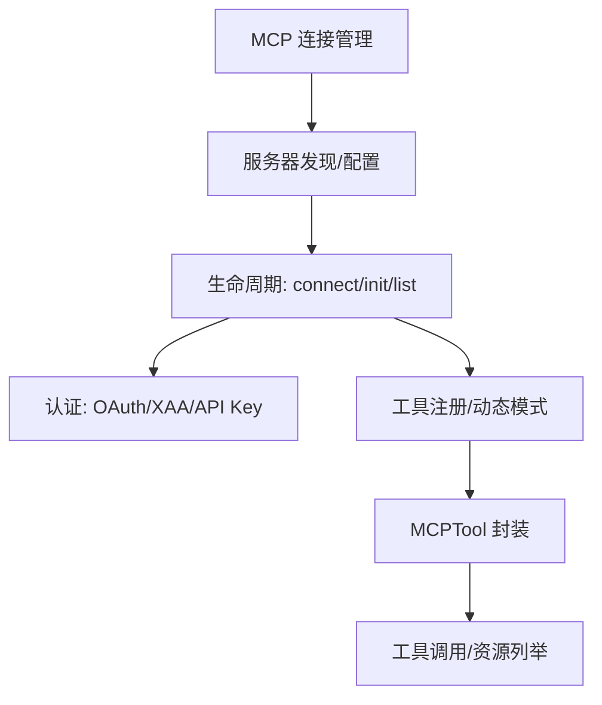
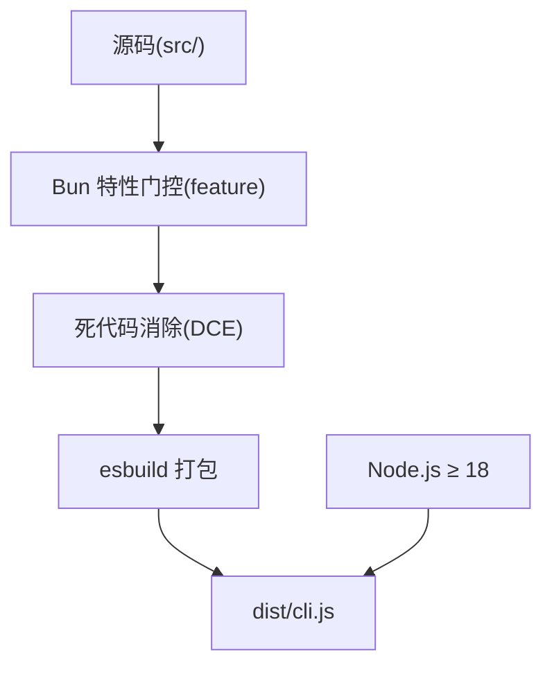

# 项目介绍

<cite>
**本文档引用的文件**
- [README.md](file://README.md)
- [README_CN.md](file://README_CN.md)
- [package.json](file://package.json)
- [QUICKSTART.md](file://QUICKSTART.md)
- [src/main.tsx](file://src/main.tsx)
- [src/query.ts](file://src/query.ts)
- [src/Tool.ts](file://src/Tool.ts)
- [src/Task.ts](file://src/Task.ts)
- [src/tools.ts](file://src/tools.ts)
- [src/commands.ts](file://src/commands.ts)
- [src/services/compact/autoCompact.ts](file://src/services/compact/autoCompact.ts)
- [coordinator/workerAgent.js](file://coordinator/workerAgent.js)
</cite>

## 目录
1. [引言](#引言)
2. [项目结构](#项目结构)
3. [核心组件](#核心组件)
4. [架构总览](#架构总览)
5. [详细组件分析](#详细组件分析)
6. [依赖关系分析](#依赖关系分析)
7. [性能考量](#性能考量)
8. [故障排查指南](#故障排查指南)
9. [结论](#结论)
10. [附录](#附录)

## 引言
Claude Code 是由 Anthropic 推出的 AI 代码助手，旨在将大型语言模型与丰富的工具链、权限控制、上下文压缩、多代理协作等工程化能力结合，为现代软件开发工作流提供“智能代码补全、代码审查、问题诊断、多工具集成”等核心能力。该项目以“代理模式”为核心，围绕主循环（用户输入 → 系统提示词 → LLM 推理 → 工具调用 → 结果回写 → 循环）构建生产级的可扩展框架，并通过 MCP（Model Context Protocol）协议实现与外部工具和 IDE 的无缝集成。

Claude Code 的设计目标是在保证安全与可控的前提下，最大化提升开发者编写、审查、诊断与协作的效率。它支持多种运行形态（CLI、桌面端、远程会话），并通过权限系统、会话持久化、遥测与远程控制机制，形成一套完整的工程化闭环。

## 项目结构
仓库采用按“职责分层 + 功能域划分”的组织方式，主要目录与职责如下：
- entrypoints：应用入口（CLI、SDK、MCP 服务端）
- src：核心源码（主循环、工具系统、服务层、状态层、任务系统、组件/UI）
- services：业务服务（API 客户端、分析与遥测、MCP 管理、工具执行引擎、插件与设置同步等）
- tools：内置工具集合（文件读写、搜索、终端执行、网络抓取、MCP 封装、子代理、计划与任务等）
- commands：命令系统（/review、/compact、/config、/mcp 等）
- coordinator：多代理协调器（特性门控）
- proactive：主动通知系统（特性门控）
- bridge：桌面/远程桥接层
- scripts：构建与准备脚本
- docs：深度分析报告（遥测、隐藏功能、远程控制、未来路线图）

图表来源
- [src/main.tsx:1-200](file://src/main.tsx#L1-L200)
- [src/query.ts:1-200](file://src/query.ts#L1-L200)
- [src/Tool.ts:1-200](file://src/Tool.ts#L1-L200)
- [src/tools.ts:1-200](file://src/tools.ts#L1-L200)
- [src/commands.ts:1-200](file://src/commands.ts#L1-L200)
- [src/services/compact/autoCompact.ts:1-200](file://src/services/compact/autoCompact.ts#L1-L200)

章节来源
- [README.md:250-380](file://README.md#L250-L380)
- [README_CN.md:225-266](file://README_CN.md#L225-L266)

## 核心组件
- 主代理循环（Query Engine）：负责消息规范化、系统提示词组装、工具调用执行、上下文压缩与结果回传，贯穿整个交互生命周期。
- 工具系统（Tool System）：统一的工具接口与工厂，支持权限校验、并发安全、只读/破坏性标记、进度渲染、结果格式化等。
- 服务层（Services）：封装 Claude API、MCP 协议、分析与遥测、工具执行引擎、插件与设置同步等。
- 命令系统（Commands）：以“/”开头的命令，覆盖配置、审查、上下文管理、MCP 管理、会话恢复等。
- 任务系统（Tasks）：抽象任务类型与生命周期，支持本地/远程/内联/工作树等不同执行后端。
- 权限系统（Permissions）：基于规则与交互式弹窗的授权机制，支持“总是允许/总是拒绝/每次询问”，并可结合沙箱路径策略。
- 上下文压缩（Context Compression）：自动压缩与手动压缩并存，避免超出模型上下文窗口。
- 多代理与桥接（Multi-Agent & Bridge）：支持子代理、远程会话、桌面桥接，实现跨设备与跨进程协作。

章节来源
- [README.md:383-566](file://README.md#L383-L566)
- [src/query.ts:1-200](file://src/query.ts#L1-L200)
- [src/Tool.ts:362-793](file://src/Tool.ts#L362-L793)
- [src/Task.ts:1-126](file://src/Task.ts#L1-L126)

## 架构总览
下图展示了从入口到查询引擎、工具系统、服务层与状态层的整体交互关系，以及工具执行与权限控制的关键节点。

图表来源
- [src/main.tsx:1-200](file://src/main.tsx#L1-L200)
- [src/query.ts:1-200](file://src/query.ts#L1-L200)
- [src/services/compact/autoCompact.ts:1-200](file://src/services/compact/autoCompact.ts#L1-L200)

章节来源
- [README.md:383-446](file://README.md#L383-L446)

## 详细组件分析

### 主代理循环（Query Engine）
- 职责：接收用户输入，解析命令，组装系统提示词，驱动主循环，执行工具，处理权限与错误，输出结果。
- 关键流程：消息规范化 → 系统提示词拼装 → API 调用 → 工具使用块识别 → 并行/串行工具执行 → 结果回写 → 继续循环直至停止原因非工具使用。
- 特性：支持自动上下文压缩、令牌预算与阻断阈值、会话持久化、遥测与诊断追踪。

图表来源
- [src/query.ts:1-200](file://src/query.ts#L1-L200)

章节来源
- [README.md:449-496](file://README.md#L449-L496)
- [src/query.ts:1-200](file://src/query.ts#L1-L200)

### 工具系统（Tool Interface & Registry）
- 工具接口：统一的生命周期（validateInput → checkPermissions → call）、能力标记（并发安全/只读/破坏性/中断行为）、渲染与描述、MCP/LSP 标识等。
- 工具注册：集中注册与筛选，支持特性门控与条件导入，确保外部构建中死代码消除。
- 渲染与进度：支持工具使用消息、结果消息、进度消息、分组渲染等 UI 展示。

图表来源
- [src/Tool.ts:362-793](file://src/Tool.ts#L362-L793)
- [src/tools.ts:193-390](file://src/tools.ts#L193-L390)

章节来源
- [README.md:500-566](file://README.md#L500-L566)
- [src/Tool.ts:1-200](file://src/Tool.ts#L1-L200)
- [src/tools.ts:1-200](file://src/tools.ts#L1-L200)

### 权限系统与交互
- 权限决策链：输入校验 → 预工具钩子（用户自定义命令）→ 规则匹配（总是允许/拒绝/询问）→ 交互式弹窗 → 工具特定逻辑 → 执行工具。
- 支持路径沙箱、额外工作目录、自动模式与分类器输入、透明包装器等高级能力。

图表来源
- [README.md:567-606](file://README.md#L567-L606)

章节来源
- [README.md:567-606](file://README.md#L567-L606)

### 上下文压缩（Context Compression）
- 自动压缩：当令牌用量接近阈值时触发，调用压缩 API 对旧消息进行摘要，保留最近高保真消息。
- 手动压缩与折叠：支持历史裁剪、上下文折叠等策略，配合特性门控与参数覆盖，满足不同场景需求。

图表来源
- [README.md:650-690](file://README.md#L650-L690)
- [src/services/compact/autoCompact.ts:1-200](file://src/services/compact/autoCompact.ts#L1-L200)

章节来源
- [README.md:650-690](file://README.md#L650-L690)
- [src/services/compact/autoCompact.ts:1-200](file://src/services/compact/autoCompact.ts#L1-L200)

### 多代理与子代理（Sub-Agent & Multi-Agent）
- 支持默认/派生/工作树/远程四种派生模式；通过消息传递、任务板与团队生命周期管理实现跨代理协作。
- 协调器模式（特性门控）：在多代理场景下提供协调与资源分配。

图表来源
- [README.md:609-646](file://README.md#L609-L646)
- [coordinator/workerAgent.js:1-4](file://coordinator/workerAgent.js#L1-L4)

章节来源
- [README.md:609-646](file://README.md#L609-L646)
- [coordinator/workerAgent.js:1-4](file://coordinator/workerAgent.js#L1-L4)

### MCP 协议集成
- 支持 stdio、sse、http、ws、sdk 等多种连接方式；提供认证（OAuth、跨应用访问、API Key）、工具注册、资源列举与动态模式。
- 通过 MCPTool 封装工具调用，实现与外部 IDE/LSP/工具生态的深度融合。

图表来源
- [README.md:693-724](file://README.md#L693-L724)

章节来源
- [README.md:693-724](file://README.md#L693-L724)

### 命令系统（Commands）
- 提供丰富命令集，覆盖配置、审查、上下文可视化、MCP 管理、会话恢复、权限与设置等。
- 命令按特性门控与用户类型条件加载，确保外部构建的稳定性与安全性。

章节来源
- [src/commands.ts:1-200](file://src/commands.ts#L1-L200)
- [README.md:279-290](file://README.md#L279-L290)

### 任务系统（Tasks）
- 抽象任务类型与生命周期，支持本地/远程/内联/工作流等执行后端；提供任务 ID 生成、状态管理与输出落盘。

章节来源
- [src/Task.ts:1-126](file://src/Task.ts#L1-L126)

## 依赖关系分析
- 构建与运行：使用 Bun 编译时内建函数（feature、MACRO）进行特性门控与宏替换；发布包为单体 CLI（约 12MB），源码经死代码消除后打包。
- 依赖管理：包含约 192 个 npm 依赖，核心运行时要求 Node.js ≥ 18。
- 特性门控：大量模块通过 feature('FLAG') 条件导入，外部构建中会被消除，导致部分模块在源码中缺失。

图表来源
- [QUICKSTART.md:1-122](file://QUICKSTART.md#L1-L122)
- [package.json:1-21](file://package.json#L1-L21)

章节来源
- [QUICKSTART.md:1-122](file://QUICKSTART.md#L1-L122)
- [package.json:1-21](file://package.json#L1-L21)
- [README.md:780-800](file://README.md#L780-L800)

## 性能考量
- 上下文压缩：通过自动压缩与手动压缩策略降低令牌占用，避免超出模型上下文窗口。
- 工具执行：并行工具执行器与串行批编排，减少等待时间；并发安全工具可并行执行，提高吞吐。
- 令牌预算与阻断：根据模型上下文窗口与输出预留，动态计算阈值与阻断限制，防止超限错误。
- 启动优化：并行预取与懒加载策略，缩短首次启动与关键路径耗时。

章节来源
- [src/services/compact/autoCompact.ts:1-200](file://src/services/compact/autoCompact.ts#L1-L200)
- [README.md:650-690](file://README.md#L650-L690)

## 故障排查指南
- 构建失败（缺少模块）：由于特性门控导致的死代码消除，外部构建需要手动补齐缺失模块或使用 Bun 完整重建。
- 权限拒绝：检查权限规则、交互式弹窗与工具特定权限逻辑；必要时调整 alwaysAllow/alwaysDeny/alwaysAsk 规则。
- 上下文超限：启用自动压缩或手动压缩；检查历史消息长度与压缩策略；适当降低输出预算。
- MCP 连接异常：核对服务器发现、认证配置与工具注册；确认资源列举与动态模式正确。
- 远程控制与设置：若出现设置变更或紧急开关，需遵循提示并谨慎处理；必要时退出应用以恢复默认状态。

章节来源
- [QUICKSTART.md:58-87](file://QUICKSTART.md#L58-L87)
- [README.md:693-724](file://README.md#L693-L724)

## 结论
Claude Code 以“代理模式”为核心，融合工具系统、权限控制、上下文压缩、MCP 协议与多代理协作，构建了面向现代软件开发的工程化 AI 代码助手。其特性门控与死代码消除机制确保了发布包的稳定与安全，同时保留了内部更强大能力的扩展空间。对于个人开发者、团队协作与远程开发场景，Claude Code 提供了从智能补全到代码审查、问题诊断与多工具集成的一体化解决方案。

## 附录
- 使用限制与开源性质：本仓库仅供学术研究与教育交流使用，严禁商业用途；发布包为单体 CLI，源码经死代码消除后打包。
- 快速开始：推荐直接运行已编译的 CLI；如需从源码构建，需使用 Bun 或最佳努力 esbuild 方案，并补齐缺失模块。

章节来源
- [README.md:1-21](file://README.md#L1-L21)
- [README_CN.md:1-311](file://README_CN.md#L1-L311)
- [QUICKSTART.md:1-122](file://QUICKSTART.md#L1-L122)