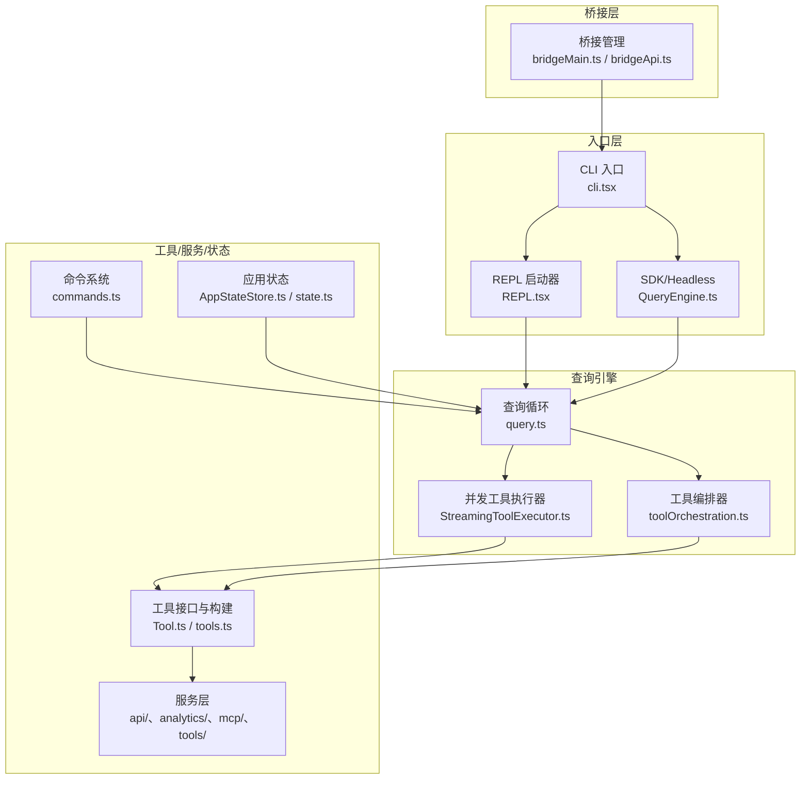
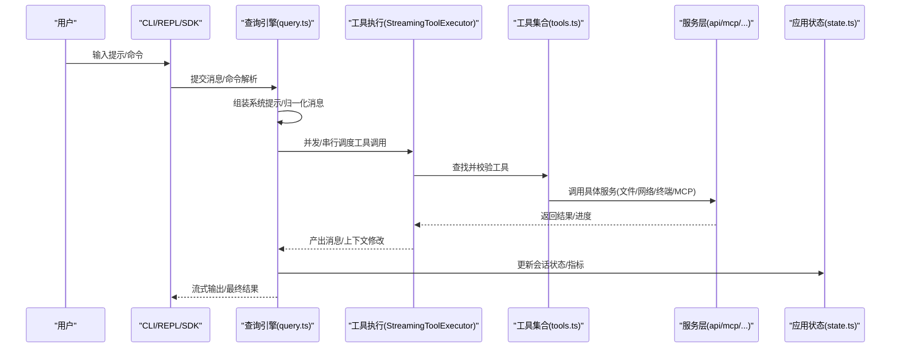
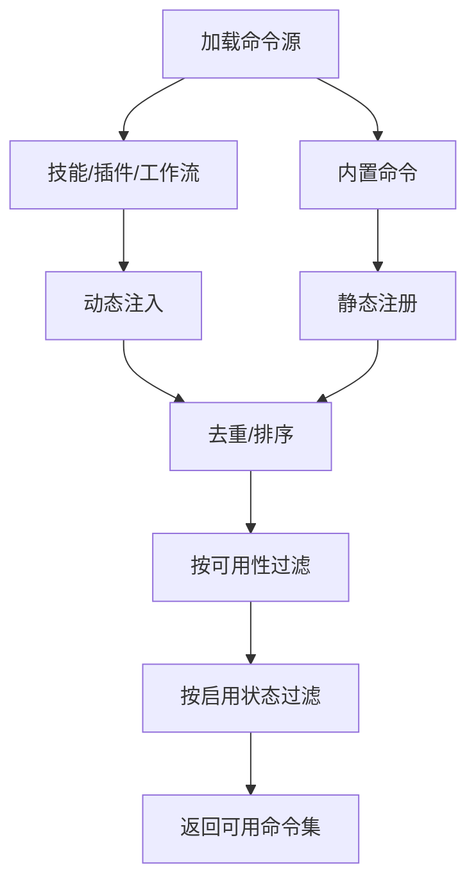
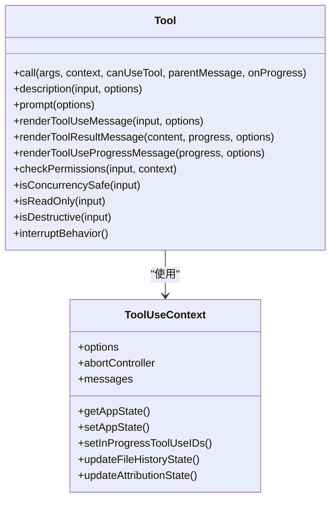
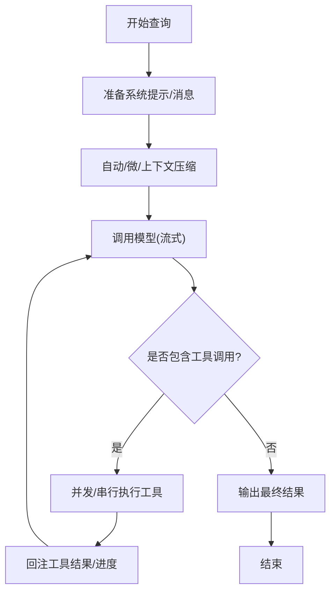
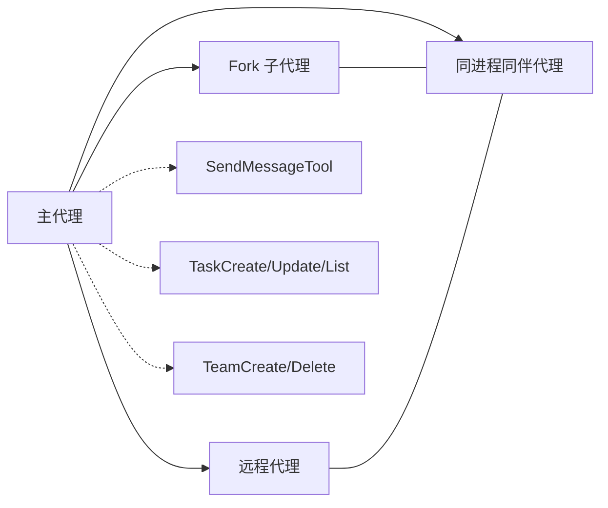
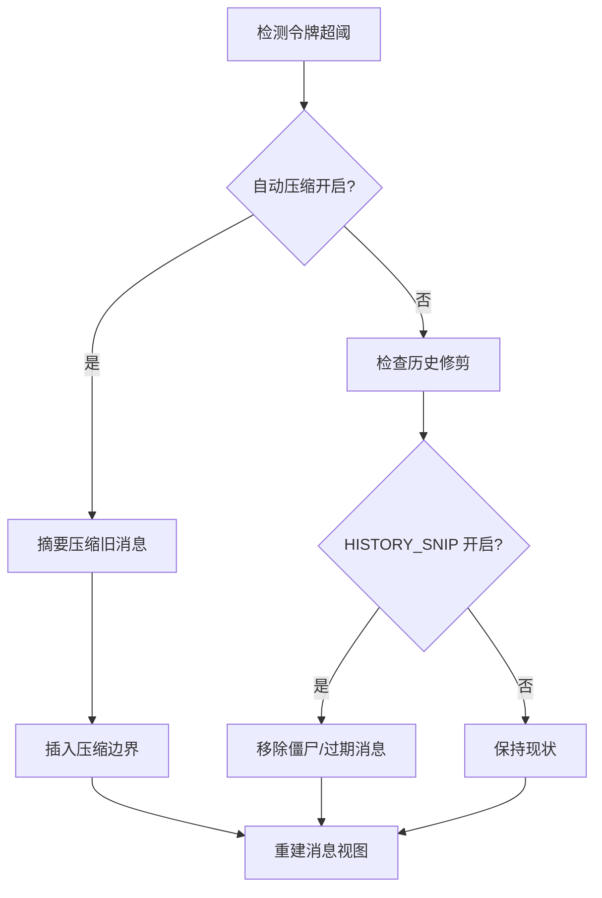
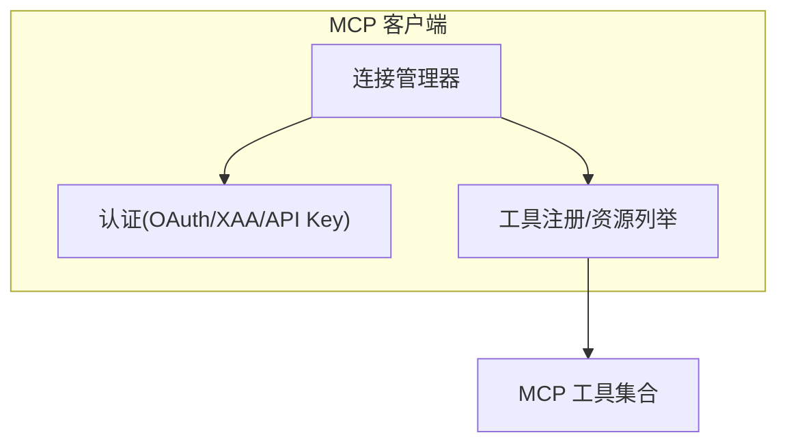
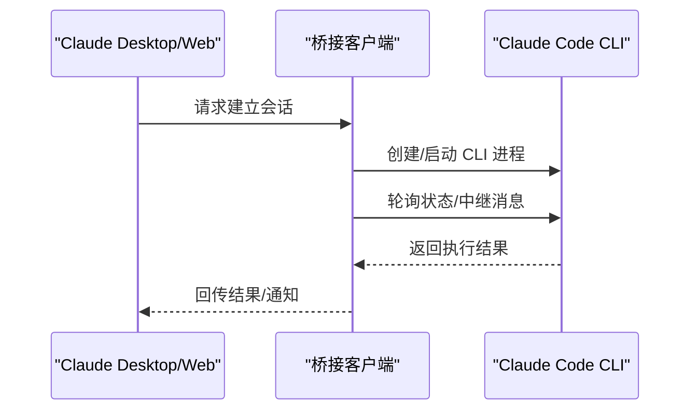
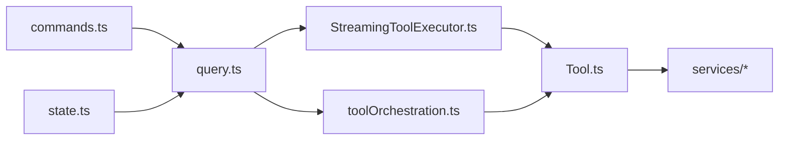

# 项目概述

<cite>
**本文档引用的文件**
- [README.md](file://README.md)
- [package.json](file://package.json)
- [main.tsx](file://src/main.tsx)
- [state.ts](file://src/bootstrap/state.ts)
- [query.ts](file://src/query.ts)
- [Tool.ts](file://src/Tool.ts)
- [commands.ts](file://src/commands.ts)
- [tools.ts](file://src/tools.ts)
- [StreamingToolExecutor.ts](file://src/services/tools/StreamingToolExecutor.ts)
- [toolOrchestration.ts](file://src/services/tools/toolOrchestration.ts)
</cite>

## 目录
1. [引言](#引言)
2. [项目结构](#项目结构)
3. [核心组件](#核心组件)
4. [架构总览](#架构总览)
5. [详细组件分析](#详细组件分析)
6. [依赖关系分析](#依赖关系分析)
7. [性能考量](#性能考量)
8. [故障排查指南](#故障排查指南)
9. [结论](#结论)
10. [附录](#附录)

## 引言
Claude Code 是一个面向开发者的 AI 代码助手，旨在通过“智能代理”范式无缝融入日常开发工作流。它以“命令系统 + 工具系统 + 权限控制 + 会话管理”的分层架构为核心，结合上下文压缩、MCP 协议集成、子代理与多代理协调等创新特性，为本地开发、远程协作与多用户环境提供统一的交互与执行平台。

项目定位与价值主张：
- 在开发工作流中扮演“智能伙伴”：从代码搜索、文件编辑、终端执行到网络检索、任务编排，提供端到端自动化能力。
- 安全可控：严格的权限系统与沙箱策略，支持细粒度授权与审计；可配置的自动模式与交互模式满足不同场景需求。
- 可扩展与可组合：内置 40+ 工具与技能生态，支持 MCP（Model Context Protocol）协议扩展，实现跨服务、跨应用的能力聚合。
- 体验优先：基于 Ink 的终端 UI、流畅的流式响应、上下文压缩与历史修剪，确保长对话与复杂任务的稳定性与可读性。

## 项目结构
项目采用“入口层 → 查询引擎 → 工具/服务/状态层 → 桥接层”的分层组织方式，配合任务系统与组件体系，形成完整的端到端闭环。

图表来源
- [main.tsx](file://src/main.tsx)
- [query.ts](file://src/query.ts)
- [StreamingToolExecutor.ts](file://src/services/tools/StreamingToolExecutor.ts)
- [toolOrchestration.ts](file://src/services/tools/toolOrchestration.ts)
- [Tool.ts](file://src/Tool.ts)
- [tools.ts](file://src/tools.ts)
- [commands.ts](file://src/commands.ts)
- [state.ts](file://src/bootstrap/state.ts)

章节来源
- [README.md](file://README.md)
- [main.tsx](file://src/main.tsx)

## 核心组件
- 命令系统：提供 80+ 内置命令，涵盖上下文管理、配置、会话、审查、计划模式、任务与工作流等，支持动态加载技能与插件命令。
- 工具系统：定义统一的 Tool 接口，内置 40+ 工具（文件读写、搜索、终端、Web 检索、MCP 工具、技能调用等），支持并发安全、只读标记、破坏性操作标识与中断行为。
- 权限控制系统：基于规则的权限门禁，支持“总是允许/禁止/询问”三类规则，结合预工具使用钩子与交互式确认，实现细粒度授权。
- 会话管理系统：持久化会话日志（JSONL）、支持恢复/分叉/工作树模式、跨设备设置同步与远程桥接。
- 查询引擎：围绕 Claude API 的主循环，负责系统提示组装、消息归一化、自动上下文压缩、工具执行与结果回注。
- 服务层：封装 API 客户端、分析与遥测、MCP 连接管理、工具执行引擎与插件加载等。
- 桥接层：连接 Claude Desktop/Web 与 CLI，提供会话生命周期管理、HTTP 客户端、JWT 刷新与容量唤醒机制。

章节来源
- [commands.ts](file://src/commands.ts)
- [Tool.ts](file://src/Tool.ts)
- [tools.ts](file://src/tools.ts)
- [state.ts](file://src/bootstrap/state.ts)
- [query.ts](file://src/query.ts)
- [StreamingToolExecutor.ts](file://src/services/tools/StreamingToolExecutor.ts)
- [toolOrchestration.ts](file://src/services/tools/toolOrchestration.ts)

## 架构总览
下图展示了从入口到查询引擎再到工具系统的整体架构，以及关键交互路径：

图表来源
- [query.ts](file://src/query.ts)
- [StreamingToolExecutor.ts](file://src/services/tools/StreamingToolExecutor.ts)
- [tools.ts](file://src/tools.ts)
- [state.ts](file://src/bootstrap/state.ts)

## 详细组件分析

### 命令系统
- 功能特性
  - 内置命令：上下文查看、配置管理、会话控制、代码审查、计划模式、任务与工作流、远程桥接、MCP 管理等。
  - 动态扩展：技能目录、插件命令与工作流脚本可动态注入，支持按可用性与启用状态过滤。
  - 远程安全：对远程/桥接输入进行白名单过滤，仅允许安全命令执行。
- 关键流程
  - 命令发现与合并：从技能、插件、工作流与内置命令源加载，去重后生成可用命令集。
  - 可用性与权限：根据订阅状态、第三方服务使用情况与提供商要求筛选命令。
  - 远程模式：在 --remote 模式下预过滤，避免本地命令短暂暴露。

图表来源
- [commands.ts](file://src/commands.ts)

章节来源
- [commands.ts](file://src/commands.ts)

### 工具系统与权限控制
- 工具接口与生命周期
  - 统一的 Tool 接口：validateInput/checkPermissions/call/prompt/render 等方法，支持并发安全、只读/破坏性标记、中断行为与输入回填。
  - 工具构建：buildTool 提供默认实现，确保一致性与安全性。
- 权限控制
  - 规则驱动：alwaysAllow/alwaysDeny/alwaysAsk 三类规则，支持通配与 MCP 服务器前缀匹配。
  - 钩子与交互：PreToolUse 钩子可修改/拒绝输入；交互式确认用于敏感操作。
  - 上下文隔离：子代理与工作树模式下的权限与上下文独立管理。

图表来源
- [Tool.ts](file://src/Tool.ts)

章节来源
- [Tool.ts](file://src/Tool.ts)
- [tools.ts](file://src/tools.ts)

### 查询引擎与工具执行
- 查询循环
  - 自动上下文压缩：在达到阈值时触发摘要压缩，并支持微压缩与上下文重构。
  - 工具执行：通过 StreamingToolExecutor 实现并发安全工具的并行执行与非并发工具的串行执行。
  - 结果回注：工具结果写回消息列表并持久化，支持进度消息即时显示。
- 工具编排
  - 分区策略：将连续只读工具批量并发执行，非只读工具串行执行，保证一致性与安全性。
  - 并发上限：受环境变量控制的最大并发数，避免资源争用。

图表来源
- [query.ts](file://src/query.ts)
- [StreamingToolExecutor.ts](file://src/services/tools/StreamingToolExecutor.ts)
- [toolOrchestration.ts](file://src/services/tools/toolOrchestration.ts)

章节来源
- [query.ts](file://src/query.ts)
- [StreamingToolExecutor.ts](file://src/services/tools/StreamingToolExecutor.ts)
- [toolOrchestration.ts](file://src/services/tools/toolOrchestration.ts)

### 子代理与多代理架构
- 模式类型
  - 默认：同进程共享缓存与消息上下文。
  - Fork：子进程启动，共享文件缓存但拥有全新消息上下文。
  - 工作树：隔离的 git 工作树 + fork。
  - 远程：通过桥接连接到远程/容器环境。
- 通信机制
  - 代理间消息传递、任务板共享、团队生命周期管理。
  - 多代理协调（feature-gated）：主代理协调多个同伴代理，共享消息收件箱与任务板。

图表来源
- [README.md](file://README.md)

章节来源
- [README.md](file://README.md)

### 上下文压缩与历史修剪
- 压缩策略
  - 自动压缩：当令牌计数超过阈值时，对旧消息进行摘要压缩。
  - 历史修剪：移除僵尸消息与过期标记，减少冗余。
  - 上下文重构：重新组织上下文以提升效率（feature-gated）。
- 数据流
  - 压缩边界消息插入、摘要消息生成与最近消息保留，确保新旧信息平衡。

图表来源
- [query.ts](file://src/query.ts)

章节来源
- [query.ts](file://src/query.ts)

### MCP 协议集成
- 连接管理
  - 支持 stdio、sse、http、ws、sdk 等多种传输方式。
  - 认证：OAuth 2.0、跨应用访问（XAA/SEP-990）、API Key。
  - 工具注册：命名规范、动态模式、权限透传与资源列举。
- 使用场景
  - 第三方工具与服务的无缝接入，扩展 Claude 的能力边界。

图表来源
- [README.md](file://README.md)

章节来源
- [README.md](file://README.md)

### 桥接层（Claude Desktop/远程）
- 协议与能力
  - JWT 认证、工作密钥交换、会话生命周期管理、HTTP 通道、容量唤醒。
  - 支持会话创建/运行/停止与消息中继。
- 错误处理与退避
  - 连接与生成退避策略，保障稳定性。

图表来源
- [README.md](file://README.md)

章节来源
- [README.md](file://README.md)

## 依赖关系分析
- 组件耦合
  - 查询引擎与工具执行器松耦合：通过 ToolUseContext 与工具接口解耦。
  - 工具与服务层：工具通过服务层访问文件系统、网络与外部 API。
  - 命令系统与工具系统：命令可直接调用工具或通过技能/插件间接调用。
- 外部依赖
  - Node.js 运行时（≥18），TypeScript 编译，Bun 编译时特性（feature gating）。
  - React + Ink 用于终端 UI，@anthropic-ai/sdk 用于 Claude API 调用。

图表来源
- [query.ts](file://src/query.ts)
- [StreamingToolExecutor.ts](file://src/services/tools/StreamingToolExecutor.ts)
- [toolOrchestration.ts](file://src/services/tools/toolOrchestration.ts)
- [Tool.ts](file://src/Tool.ts)
- [commands.ts](file://src/commands.ts)
- [state.ts](file://src/bootstrap/state.ts)

章节来源
- [package.json](file://package.json)
- [query.ts](file://src/query.ts)

## 性能考量
- 并发与吞吐
  - 工具并发执行：只读工具批量并发，非只读串行，最大并发数受环境变量限制。
  - 流式执行：工具进度与结果即时产出，降低等待时间。
- 上下文优化
  - 自动压缩与历史修剪显著降低令牌占用，避免阻塞限制。
  - 微压缩与上下文重构在不牺牲细节的前提下提升效率。
- 启动与预取
  - 非交互模式跳过信任前置，交互模式在信任建立后才进行系统上下文预取，减少冷启动开销。
- 资源隔离
  - 子代理与工作树模式隔离资源，避免相互影响。

## 故障排查指南
- 常见问题
  - 提示过长被阻断：检查自动压缩是否开启，必要时手动执行压缩或调整模型参数。
  - 工具执行失败：查看权限规则与交互确认记录，检查工具输入校验与沙箱限制。
  - 流式回退：观察孤儿消息墓碑与工具结果丢弃，确认回退后的重新执行路径。
- 诊断建议
  - 启用调试模式与详细日志，关注工具使用摘要与进度消息。
  - 检查会话日志（JSONL）与转储提示（dumpPrompts），定位问题请求。
  - 对于远程/桥接问题，核对 JWT 与会话状态轮询。

章节来源
- [query.ts](file://src/query.ts)
- [StreamingToolExecutor.ts](file://src/services/tools/StreamingToolExecutor.ts)

## 结论
Claude Code 通过“入口层 → 查询引擎 → 工具/服务/状态层 → 桥接层”的清晰分层，结合命令系统、工具系统、权限控制与会话管理，形成了一个安全、可扩展且高效的 AI 代码助手平台。其子代理架构、上下文压缩与 MCP 协议集成等创新特性，使其既能满足个人开发者在本地的高效开发需求，也能胜任远程协作与多用户环境下的复杂任务编排。

## 附录
- 技术栈选择说明
  - TypeScript：强类型保障与良好的工具链生态，便于大型项目的维护与演进。
  - React + Ink：在终端中提供丰富的 UI 与交互体验，兼顾可读性与可扩展性。
  - Bun：编译时特性（feature gating）与快速打包能力，支持内部特性按需裁剪。
- 适用场景
  - 本地开发：文件读写、代码搜索、终端执行、Web 检索、技能与插件扩展。
  - 远程协作：通过桥接与远程模式实现跨设备协同与远程任务执行。
  - 多用户环境：权限系统与会话隔离确保多用户场景下的安全与稳定。